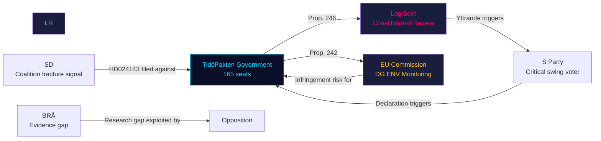

# Stakeholder Perspectives — Opposition Motions 2026-05-07

**Framework**: 6-lens stakeholder matrix with influence network
**Date**: 2026-05-07 | **Author**: James Pether Sörling

## Stakeholder Matrix

### Cluster A: Prop. 2025/26:242 (Forestry / Skogsvårdslagen)

| Stakeholder | Interest | Position | Influence | Key Concerns |
|-------------|----------|----------|-----------|--------------|
| **Skogsindustrierna** | Commercial forestry profitability | Strong support | HIGH — lobbied for regulatory relief | Shorter replanting window reduces liability period |
| **Naturvårdsverket** | Biodiversity regulation | Opposed (Habitats compliance) | MEDIUM — advisory only; PIR EU-HABITATS-SE pending opinion | Raised notification thresholds may allow non-assessment of habitat impacts |
| **Skogsägareförbunden (LRF)** | Small-scale forest owner rights | Support | HIGH in rural constituencies | Regulatory complexity for individual owners |
| **Swedish Sámi Parliament (Sametinget)** | Reindeer grazing / traditional land rights | Opposed | MEDIUM — legal standing but minority influence | Avverkning changes affect pasture corridors |
| **EU Commission (DG ENV)** | Habitats Directive compliance | Potential monitor | HIGH — infringement risk | Art. 6(3) assessment threshold changes |
| **Miljörörelsen (Naturskyddsföreningen etc.)** | Biodiversity / climate | Strong opposition | MEDIUM in public opinion, HIGH in media | EU NRL 2024/1991 compliance; biodiversity indicators |
| **SD rural voters** | Forest economy + regulation | Mixed (want reform, not deregulation) | HIGH — SD electoral base | SD amendments signal grassroots discontent with prop. 242 as drafted |

### Cluster B: Prop. 2025/26:246 (Criminal Age / Straffbarhetsålder)

| Stakeholder | Interest | Position | Influence | Key Concerns |
|-------------|----------|----------|-----------|--------------|
| **BRÅ (Brottsförebyggande rådet)** | Crime evidence base | Neutral (methodological concerns) | MEDIUM — evidence body, not policy actor | V demands BRÅ research mandate; absence of commissioned BRÅ study noted |
| **Lagrådet** | Constitutional review | Reviewing (pending yttrande) | CRITICAL — institutional gate-keeper | CRC Art. 40(3)(a) compatibility with 13-year floor |
| **UNICEF Sverige** | CRC compliance | Opposed | MEDIUM — civil society | Art. 40(3)(a) minimum age international standard |
| **Crime-affected suburban communities** | Public safety | Strong support | HIGH — electoral battleground voters | Gang crime recruitment of under-15s |
| **Defense lawyers / Sveriges advokatsamfund** | Due process | Mixed concern | MEDIUM | Youth court capacity, fair trial guarantees for 13-year-olds |
| **Social services (IFO, SoL)** | Welfare intervention | Cautious opposition | MEDIUM | Youth welfare alternative to criminal sanctions; IVO oversight |
| **S voters** | Crime + welfare balance | Split | HIGH — 30%+ of electorate | Tougher on crime (popular) vs CRC compliance (principled) |

## Influence Network

## Named Actors

- **Romina Pourmokhtari** (L, Klimat- och miljöminister): accountable for prop. 242 EU compatibility defence
- **Gunnar Strömmer** (M, Justitieminister): accountable for prop. 246 Lagrådet response
- **Ardalan Shekarabi** (S, shadow justice): S's silence on prop. 246 is partly attributable to Shekarabi's strategic framing
- **Tobias Andersson** (SD, MJU spokesperson): HD024143 author; key actor in SD-government forestry tension
- **Nooshi Dadgostar** (V, party leader): CRC challenge strategist across both clusters

## Critical Swing Stakeholders

1. **S Party** (94 seats): Silence on prop. 246 is most valuable optionality. S declaration = single most important electoral intelligence question.
2. **Lagrådet**: Institutional gate on prop. 246. Yttrande timing (~4-6 weeks) determines whether CRC challenge has legal backing.
3. **SD rural voters**: Pressure on Tobias Andersson to maintain HD024143 position until concessions from government.
