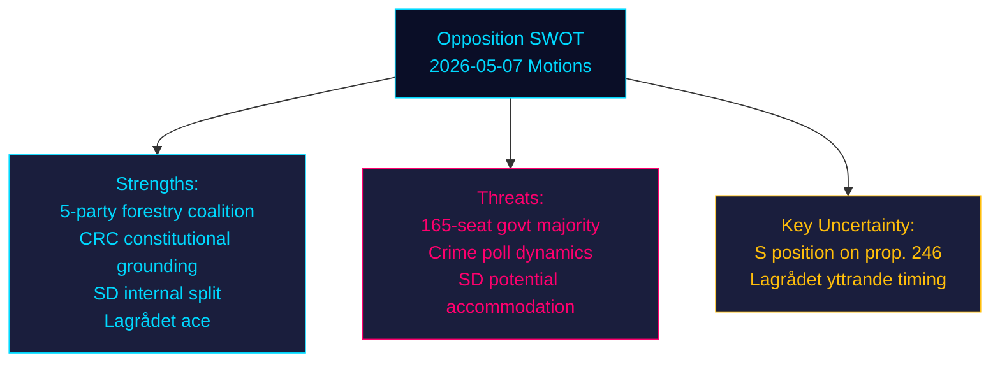

# SWOT Analysis — Opposition Motions 2026-05-07

**Framework**: Political SWOT with TOWS matrix
**Date**: 2026-05-07 | **Author**: James Pether Sörling

## SWOT Matrix

### Strengths (Opposition)

| # | Strength | Evidence |
|---|----------|---------|
| S1 | **Five-party coalition on forestry** | V+SD+S+C+MP all challenge prop. 242 — unprecedented breadth; even coalition partner SD files amendments (HD024143) |
| S2 | **Constitutional grounding on criminal age** | C (HD024146) provides systematic BrB provision-by-provision rejection; V (HD024142) and MP (HD024148) explicitly cite CRC Art. 40(3)(a) — harder for government to dismiss as partisan |
| S3 | **SD internal split** | SD's MJU amendments signal rural constituency dissatisfaction with government's forestry approach — fragmentation within TidöPakten visible in record |
| S4 | **Lagrådet ace card** | If yttrande flags CRC incompatibility, opposition gains institutional legitimacy that transcends party politics |
| S5 | **Evidence-base challenge** | V's demand for BRÅ research mandate (HD024142) frames government as acting without evidence — effective in media framing |

### Weaknesses (Opposition)

| # | Weakness | Evidence |
|---|----------|---------|
| W1 | **S silence on criminal age** | S has not filed JuU motion — government can claim S tacitly accepts prop. 246 |
| W2 | **Divergent MJU positions** | V + MP demand total rejection; S + C demand reforms; SD demands amendments — no unified opposition front on prop. 242 |
| W3 | **SD ambiguity** | SD's forestry amendments could be accommodated by MJU committee, defusing intra-coalition narrative |
| W4 | **No cross-cluster coordination** | No evidence of formal V+S+C+MP coordination across both propositions — tactical fragmentation |
| W5 | **Election-year perception risk** | Criminal age cut is popular with 60%+ of Swedish voters per polling; opposition's CRC framing may alienate crime-concerned voters |

### Opportunities (Opposition)

| # | Opportunity | Evidence |
|---|----------|---------|
| O1 | **Lagrådet yttrande** | CRC incompatibility finding would legitimise opposition demands and potentially force government retreat |
| O2 | **S declaration** | S joining V+C+MP on prop. 246 creates minority-threatening alignment (163 vs 165) |
| O3 | **EU compliance pressure** | EC monitoring of prop. 242 Habitats Directive compliance (PIR EU-HABITATS-SE) |
| O4 | **Election framing** | Both issues (child rights + biodiversity) test government on ECHR/EU treaty compliance — EU audiences |
| O5 | **SD rural voter pressure** | If government ignores SD amendments, SD faces constituency backlash, weakening TidöPakten cohesion |

### Threats (Opposition)

| # | Threat | Evidence |
|---|----------|---------|
| T1 | **Government majority (165 seats)** | TidöPakten controls Riksdag; both props likely pass without SD defection |
| T2 | **Crime polls** | Public support for criminal age cut ~60%; C + MP + V risk being framed as soft on crime |
| T3 | **SD accommodation** | If M/KD accepts SD's forestry amendments, SD rejoins coalition, coalition united |
| T4 | **Electoral calendar pressure** | With 125 days to election, government may calculate it can absorb criticism and move on |
| T5 | **Committee report framing** | Government-majority committee report will frame opposition motions as "avslås"; media coverage may be limited |

## TOWS Matrix

| | Opportunities (O) | Threats (T) |
|---|---|---|
| **Strengths (S)** | **SO: Offensive plays** — S2+O1: Use constitutional grounding to amplify Lagrådet yttrande impact. S1+O5: Keep SD-government tension visible to attract media coverage. S4+O2: Combine Lagrådet ace with S declaration to create majority shift. | **ST: Defensive plays** — S2+T2: Reframe CRC challenge as not "soft on crime" but "legally compliant". S3+T3: Monitor SD accommodation signals; maintain SD-internal tension narrative even after committee. |
| **Weaknesses (W)** | **WO: Convert weakness** — W1+O2: Pressure S publicly to declare position before committee deadline. W2+O3: Use EU Habitats threat to unify MJU opposition even without common strategy. | **WT: Damage control** — W5+T2: Opposition parties must develop anti-crime-soft narrative ahead of election. W4+T4: Risk that fragmented opposition allows government to present both bills as passed with manageable opposition. |

## Cross-SWOT Assessment

**Net assessment**: Opposition has constitutional legitimacy (strength) but lacks numerical majority (threat). The critical variable is S's silence — if S declares on prop. 246, the political equation changes. If Lagrådet flags CRC incompatibility, strength S4 becomes overwhelming. The most likely outcome absent these triggers: government prevails on both bills with minor modifications for SD's MJU yrkanden.

