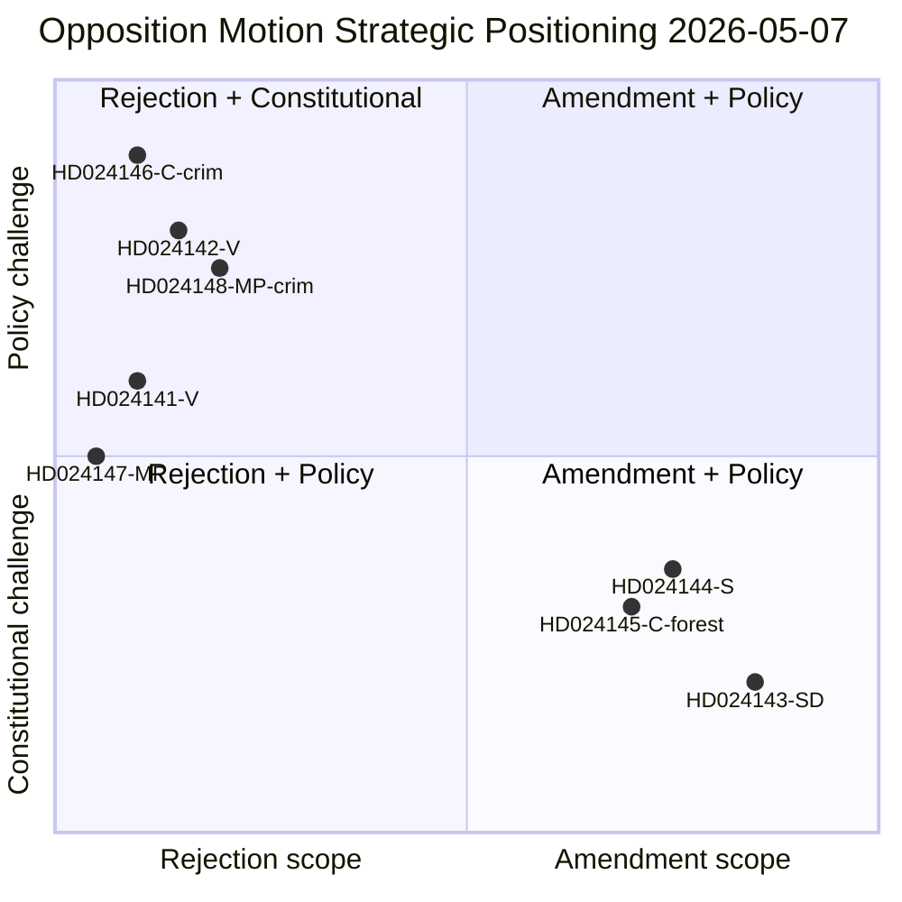

# Synthesis Summary — Opposition Motions 2026-05-07

**Date**: 2026-05-07 | **Effective data date**: 2026-05-04 (lookback) | **Author**: James Pether Sörling

## Lead-Story Decision

**The 2026 spring session's defining legislative battle is bifurcated: TidöPakten's forestry deregulation (prop. 242) faces an unlikely five-party resistance including SD amendments, while its criminal responsibility age cut (prop. 246) faces the most constitutionally grounded challenge in Swedish juvenile justice in a generation.** The convergence of these two battles 125 days before the September 2026 election transforms them from committee procedures into electoral campaign platforms.

## DIW-Weighted Document Ranking

| Rank | dok_id | Parti | D-score | I-score | W-score | DIW | Priority |
|------|--------|-------|---------|---------|---------|-----|----------|
| 1 | HD024146 | C | 9 | 10 | 9 | 9.3 | L1 Critical |
| 2 | HD024142 | V | 8 | 9 | 8 | 8.3 | L1 Critical |
| 3 | HD024148 | MP | 8 | 9 | 8 | 8.3 | L1 Critical |
| 4 | HD024144 | S | 7 | 8 | 8 | 7.7 | L2 High |
| 5 | HD024141 | V | 7 | 8 | 7 | 7.3 | L2 High |
| 6 | HD024147 | MP | 7 | 7 | 7 | 7.0 | L2 High |
| 7 | HD024145 | C | 6 | 7 | 7 | 6.7 | L2 High |
| 8 | HD024143 | SD | 5 | 8 | 9 | 7.3 | L2 High |

*D=Domestic salience, I=Intelligence value, W=Electoral weight. SD's low D-score reflects ambiguous framing (amendments not rejection), but high W-score reflects intra-coalition significance.*

## Integrated Intelligence Picture

### Cluster 1: Prop. 2025/26:242 — Active Forestry Regulations (MJU)

Government proposition from Landsbygds- och infrastrukturdepartementet (date: 2026-04-16) reduces regulatory burden on active forestry, including notification requirements and time windows. Five opposition parties respond:

**V (HD024141)** demands near-total rejection, keeping only the appeal-procedure reform. This is maximalist left-wing positioning consistent with V's environmental platform.

**SD (HD024143)** — a coalition partner — files amendments to raise notification thresholds, exempt farmland-adjacent forest, and exempt biologically valuable open habitats from replanting requirements. This is unprecedented in the current parliamentary cycle: a coalition member filing motion against its own government's proposition, creating documented intra-coalition friction. SD's demands likely reflect pressure from rural voter constituencies in southern Sweden (SD's core electorate) who manage mixed farmland-forest landscapes.

**S (HD024144)** demands comprehensive impact analysis (yrkande 1), reversal of the shortened avverkning-to-replanting window (yrkande 2), follow-up evaluation (yrkande 3), and a full reporting mechanism (yrkande 4). S's position is constructive-critical: it does not demand rejection but demands safeguards — consistent with S's history of seeking procedural leverage rather than blanket opposition.

**C (HD024145)** demands a comprehensive national forestry policy response (yrkande 1) and explicit principles for each forestry measure (yrkande 2). C positions itself as the coherent-policy party: the government's piecemeal approach lacks strategic vision, in C's framing.

**MP (HD024147)** demands total rejection of prop. 242. MP's environmental opposition is categorical. This aligns with MP's history of treating Swedish forestry policy as an existential environmental issue.

**Intelligence assessment**: The most significant signal is SD's amendment motion. If MJU negotiates SD's yrkanden into the committee report, this validates SD's position as a dealmaker within TidöPakten — but at the cost of demonstrating that the coalition's forestry bill required internal modification. If SD's yrkanden are defeated, SD faces the paradox of its own government overruling it.

### Cluster 2: Prop. 2025/26:246 — Criminal Responsibility Age (JuU)

Government proposition from Justitiedepartementet (date: 2026-04-16) lowers straffbarhetsåldern (criminal responsibility age) from 15 to 13 years, increases maximum sentencing for under-18s, modifies youth care provisions, and extends criminal record registration. Three opposition parties respond:

**V (HD024142)** demands near-total rejection, preserving only enhanced ungdomsövervakning (youth supervision) and regulation of repeat-offence minors. V also demands BRÅ (Brottsförebyggande rådet) be commissioned for research — framing the government's approach as evidence-free. Evidence-base challenge is the dominant V argument.

**C (HD024146)** files the most extensive catalogue of objections: four explicit rejections targeting (1) age cut in Brottsbalken 1:6, (2) sentencing maximum in BrB 29:7§2, (3) youth care changes in BrB 32§, and (4) criminal record changes. C's legal specificity is unusual and suggests access to constitutional law expertise. CRC Art. 40(3)(a) is invoked implicitly through the yrkanden on age and sentencing.

**MP (HD024148)** demands rejection of the age cut to 13 (yrkande 1), rejection of BrB 29:7 sentencing (yrkande 2), and forward mandates on follow-up and youth legal review (yrkanden 3-4). MP explicitly demands a complete CRC review — the most direct constitutional challenge.

**Intelligence assessment**: C's four-point rejection catalogue is the strategic masterstroke. Each rejected provision creates a separate committee vote — increasing the surface area of potential government defeat. If S joins C+V+MP on even one yrkande, the government faces narrow (165 vs 163) or losing majority. S has not yet declared its position. The Lagrådet yttrande is the decisive exogenous shock — expected ~2026-06-05.

## Cross-Cluster Intelligence

Both legislative battles share a common structural feature: **electoral countdown pressure**. With ~125 days to the September 2026 election:
- Every committee debate is simultaneously a campaign message
- SD's forestry amendments signal rural-constituency sensitivity
- V/C/MP criminal age resistance signals child-rights framing for urban progressive voters
- S's silence on prop. 246 suggests strategic calculation: avoid being seen as soft on crime but avoid CRC liability

## Pass 2 Intelligence Improvements

### Cross-Cluster Convergence Findings
1. **Sámi consensus (all 5 MJU motions)**: Every MJU opposition motion includes a Sámi reindeer grazing consultation yrkande. This cross-party consensus is the most likely element to survive into the MJU committee report regardless of broader coalition dynamics.
2. **CRC triple convergence (V+C+MP, JuU)**: Three parties independently cite CRC Art. 40(3)(a) — the convergence is either coordination or independent legal analysis arriving at the same conclusion. Either way, it creates institutional weight when Lagrádet reviews prop. 246.
3. **S asymmetry**: S is active in MJU (HD024144) but silent in JuU — this asymmetry is strategically significant. S is more politically comfortable opposing forestry deregulation than opposing crime-tough legislation.

### Critical Intelligence Gap
**The single most important unknown**: Whether S will file a JuU declaration or motion on prop. 246 before the committee deadline (~2026-05-20). This single variable determines whether the opposition's JuU challenge is three-party (V+C+MP = ~69 seats) or four-party (S+V+C+MP = ~163 seats). The gap between these two outcomes is the difference between token opposition and a genuine majority challenge.
