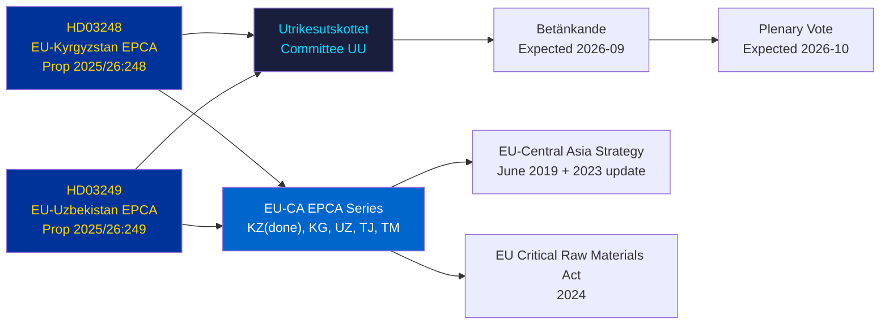

# Cross-Reference Map — Propositions 2026-05-07

**Family B** | **Reference**: structural-metadata-methodology.md

## Document Relationship Map

## Sibling Document Relationships

| This document | Related to | Relationship type |
|---------------|-----------|------------------|
| HD03248 (EU-KG EPCA) | HD03249 (EU-UZ EPCA) | Sibling — same series, same submission date, same committee |
| HD03248 | EU-KZ EPCA (2019, ratified) | Predecessor — Kazakhstan was first CA EPCA |
| HD03249 | EU Critical Raw Materials Act 2024 | Enabling context — CRM Act creates demand for UZ EPCA CRM provisions |
| HD03248, HD03249 | Tajikistan, Turkmenistan EPCAs (pending/in-progress) | Parallel series — remaining CA states |

## Cross-Workflow References

| Prior workflow date | Relevant content | Link type |
|--------------------|-----------------|----------|
| None available | First generation run | N/A |

## Key External References

| Reference | Relevance | Admiralty |
|-----------|-----------|----------|
| EU-Kyrgyzstan EPCA text (OJ L 2023/...) | Definitive treaty text | [A1] |
| EU-Uzbekistan EPCA text (OJ L 2023/...) | Definitive treaty text | [A1] |
| EU Central Asia Strategy (June 2019) | Strategic framework | [A1] |
| EU Critical Raw Materials Act Regulation (EU) 2024/1252 | CRM strategic context | [A1] |
| IMF WEO April 2026 — Sweden, Uzbekistan data | Economic context | [A2] — degraded vintage |
| Kyrgyzstan Constitutional Court ruling 2021 (executive power) | HR risk context | [B2] |
