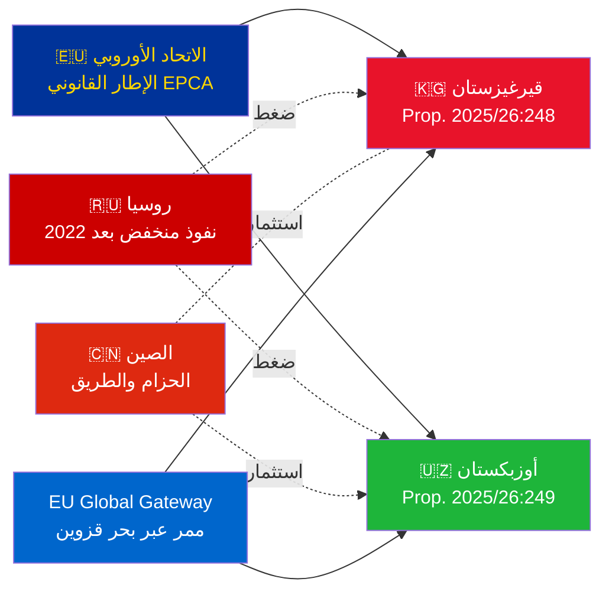

# الموجز الاستخباراتي — اقتراحات الحكومة 2026-05-07

**التصنيف**: الأدميرالية [B2] | **الأفق الزمني**: T+72h / T+90d  
**ثقة WEP**: شبه مؤكد (نتيجة التصديق) | محتمل (المسار الجيوسياسي)  
**DIW**: L2 استراتيجي | **التاريخ**: 2026-05-07

---

## 🔴 أبرز الاستنتاجات الاستخباراتية

**تقدّم السويد في 2026-05-07 تصويتات التصديق على اتفاقيتَي EPCA بين الاتحاد الأوروبي وآسيا الوسطى.** كلا الاتفاقيتين (الاتحاد الأوروبي-قيرغيزستان: HD03248؛ الاتحاد الأوروبي-أوزبكستان: HD03249) عبارة عن اقتراحات تصديق على معاهدات من وزارة الخارجية، محالة إلى لجنة الشؤون الخارجية. الموافقة البرلمانية **شبه مؤكدة** (ثقة: 95%+) — هذه التزامات معاهدية للاتحاد الأوروبي غير حزبية. القيمة الاستخباراتية الاستراتيجية تكمن في السياق الجيوسياسي، وليس في التصويتات ذاتها.

---

## 📋 ما هو مطروح أمام الريكسداغ

| الاقتراح | البلد | التوقيع | الأحكام الرئيسية |
|------------|---------|--------|----------------|
| 2025/26:248 (HD03248) | قيرغيزستان | 2023 | الحوار السياسي، التجارة، سيادة القانون، الترابط |
| 2025/26:249 (HD03249) | أوزبكستان | 2023 | التجارة، المواد الخام الحرجة، الاقتصاد الرقمي، المناخ |

كلتاهما **اتفاقيتا شراكة وتعاون معززتان** (EPCA) — أشمل إطار قانوني ثنائي يستخدمه الاتحاد الأوروبي خارج نطاق اتفاقيات الشراكة. تحلّان محل اتفاقيات الشراكة السوفيتية من عام 1999.

---

## 🌍 السياق الجيوسياسي

**إعادة التوجه الجيوسياسي لآسيا الوسطى بعد 2022**: سرّعت كلٌّ من قيرغيزستان وأوزبكستان انخراطهما مع الاتحاد الأوروبي منذ الغزو الروسي الشامل لأوكرانيا. الصعوبات الاقتصادية الروسية، وخطر العقوبات الثانوية، وتراجع مصداقية منظمة معاهدة الأمن الجماعي، كلها خلقت فرصة لتعميق الشراكة مع الاتحاد الأوروبي. تُمثّل سلسلة EPCA (التصديق على كازاخستان وقيرغيزستان وأوزبكستان وطاجيكستان جارٍ) أهم توسع لإطار الاتحاد الأوروبي القانوني في آسيا الوسطى منذ الاستقلال.

---

## 🎯 التقييم الاستخباراتي الاستراتيجي

**EPCA أوزبكستان (HD03249) ذات قيمة استراتيجية أعلى** بسبب:
1. عدد السكان 38 مليون — أكثر دول آسيا الوسطى اكتظاظاً
2. المواد الخام الحرجة: اليورانيوم (المرتبة 7 عالمياً)، الذهب، النحاس، استكشاف الليثيوم
3. تسمّي لائحة الاتحاد الأوروبي للمواد الخام الحرجة (2024) آسيا الوسطى ممراً استراتيجياً للإمدادات
4. وتيرة الإصلاحات في عهد ميرزيوييف — الزعيم الأكثر توجهاً نحو الغرب في آسيا الوسطى منذ 2016

**EPCA قيرغيزستان (HD03248)** أقل أهمية لكنها غير هامشية:
1. بوابة جغرافية نحو ترابط أوسع في آسيا الوسطى
2. تحدي نفوذ مزدوج صيني/روسي
3. تركيز السلطة في دستور 2021 يستوجب التزامات مراقبة حقوق الإنسان

---

## ⏱️ الجدول الزمني للإجراءات الفورية

| اليوم | الإجراء |
|-----|--------|
| **2026-05-07** | تقديم الاقتراحات HD03248 + HD03249 إلى الريكسداغ |
| **2026-06** | جلسات استماع لجنة UU (ربما جلسة مشتركة) |
| **2026-09** | توصية تقرير لجنة UU |
| **2026-10** | التصويت في الجلسة العامة — موافقة شبه مؤكدة |
| **2026-11** | إيداع التصديق السويدي؛ دخول EPCA حيز التنفيذ مؤقتاً |

---

*الموجز الاستخباراتي | Riksdagsmonitor | 2026-05-07*

<!-- source-sha: 763faff7f9c94520ee112d9155becca626ed9add -->
