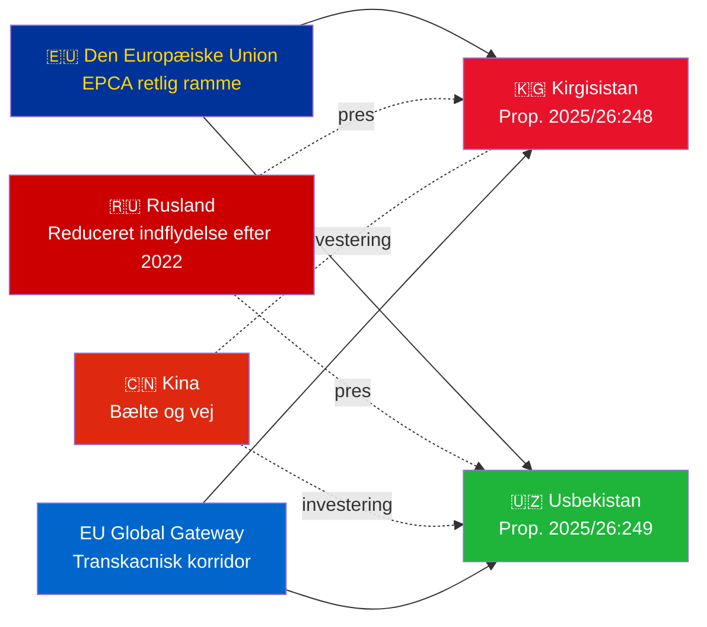

# Efterretningsoversigt — Regeringsforslag 2026-05-07

**Klassificering**: Admiralitet [B2] | **Horisont**: T+72h / T+90d  
**WEP Konfidens**: Næsten sikkert (ratificeringsresultat) | Sandsynligt (geopolitisk bane)  
**DIW**: L2 Strategisk | **Dato**: 2026-05-07

---

## 🔴 Nøgleeftretningsfund

**Sverige fremlægger ratificeringsafstemninger for to EU-Centralasien-EPCA'er den 2026-05-07.** Begge aftaler (EU-Kirgisistan: HD03248; EU-Usbekistan: HD03249) er traktatratificeringsforslag fra Udenrigsministeriet, henvist til Udenrigsudvalget. Parlamentarisk godkendelse er **næsten sikkert** (konfidens: 95%+) — disse er ikke-partipolitiske EU-traktatforpligtelser. Den strategiske efterretningsværdi ligger i den geopolitiske kontekst, ikke i selve afstemningerne.

---

## 📋 Hvad der ligger foran Riksdagen

| Proposition | Land | Underskrevet | Vigtige bestemmelser |
|------------|---------|--------|----------------|
| 2025/26:248 (HD03248) | Kirgisistan | 2023 | Politisk dialog, handel, retsstatsprincippet, konnektivitet |
| 2025/26:249 (HD03249) | Usbekistan | 2023 | Handel, kritiske råmaterialer, digital økonomi, klima |

Begge er **Forstærkede partnerskabs- og samarbejdsaftaler** (EPCA) — den mest omfattende bilaterale retlige ramme EU anvender ud over associeringsaftaler. De erstatter Sovjet-ærens partnerskabsaftaler fra 1999.

---

## 🌍 Geopolitisk kontekst

**Geopolitisk omstilling i Centralasien efter 2022**: Både Kirgisistan og Usbekistan har accelereret EU-samarbejdet siden Ruslands fuldskala invasion af Ukraine. Ruslands økonomiske vanskeligheder, risikoen for sekundære sanktioner og reduceret CSTO-troværdighed skabte et vindue for dybere EU-partnerskab. EPCA-serien (ratificeringer af Kasakhstan, Kirgisistan, Usbekistan, Tadsjikistan er i gang) repræsenterer den mest betydelige EU-retslige rammeudvidelse i Centralasien siden uafhængigheden.

---

## 🎯 Strategisk efterretningsvurdering

**Usbekistans EPCA (HD03249) har højere strategisk værdi** på grund af:
1. Befolkning 38 mio. — Centralasiens mest folkerige stat
2. Kritiske råmaterialer: uran (verden #7), guld, kobber, lithiumefterforskninger
3. EU's lov om kritiske råmaterialer (2024) nævner Centralasien som strategisk forsyningskorridor
4. Reformtempo under Mirziyoyev — mest vestvendte CA-leder siden 2016

**Kirgisistans EPCA (HD03248)** er lavere men ikke ubetydelig:
1. Geografisk gateway til bredere CA-konnektivitet
2. Kinas/Ruslands dobbelte indflydelsesudfordring
3. Magtkoncentration i grundloven 2021 skaber forpligtelser til menneskerettighedsovervågning

---

## ⏱️ Umiddelbar handlingsbar tidslinje

| Dag | Handling |
|-----|--------|
| **2026-05-07** | Forslag HD03248 + HD03249 indgivet til Riksdagen |
| **2026-06** | UU-udvalgsforhøringer (sandsynligvis fælles session) |
| **2026-09** | UU-betænkning med anbefaling |
| **2026-10** | Plenumafstemning — næsten sikkert godkendelse |
| **2026-11** | Svensk ratificering deponeret; EPCA'er træder i kraft provisorisk |

---

*Efterretningsoversigt | Riksdagsmonitor | 2026-05-07*

<!-- source-sha: 763faff7f9c94520ee112d9155becca626ed9add -->
