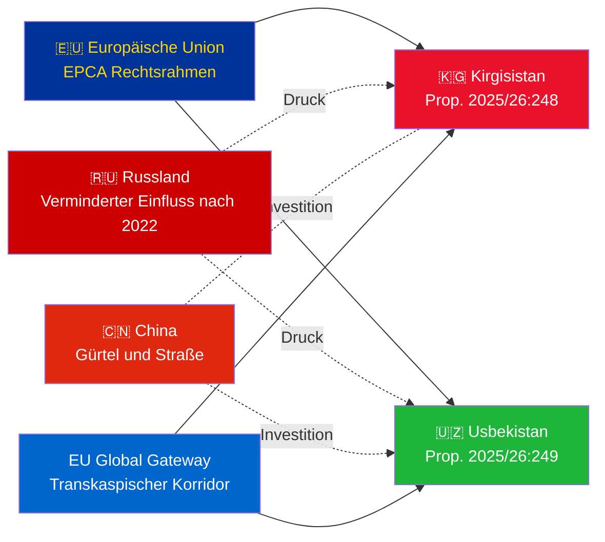

# Geheimdienstbriefing — Regierungsvorlagen 2026-05-07

**Klassifizierung**: Admiralität [B2] | **Horizont**: T+72h / T+90d  
**WEP Konfidenz**: Fast sicher (Ratifizierungsergebnis) | Wahrscheinlich (geopolitische Entwicklung)  
**DIW**: L2 Strategisch | **Datum**: 2026-05-07

---

## 🔴 Wichtigste Geheimdiensterkenntnisse

**Schweden legt am 2026-05-07 Ratifizierungsabstimmungen für zwei EU-Zentralasien-EPCAs vor.** Beide Abkommen (EU-Kirgisistan: HD03248; EU-Usbekistan: HD03249) sind Vertragsratifizierungsvorlagen des Außenministeriums, an den Auswärtigen Ausschuss verwiesen. Parlamentarische Genehmigung ist **fast sicher** (Konfidenz: 95%+) — dies sind überparteiliche EU-Vertragsobligation. Der strategische Geheimdienstwert liegt im geopolitischen Kontext, nicht in den Abstimmungen selbst.

---

## 📋 Was vor dem Reichstag liegt

| Vorlage | Land | Unterzeichnet | Wichtige Bestimmungen |
|------------|---------|--------|----------------|
| 2025/26:248 (HD03248) | Kirgisistan | 2023 | Politischer Dialog, Handel, Rechtsstaat, Konnektivität |
| 2025/26:249 (HD03249) | Usbekistan | 2023 | Handel, kritische Rohstoffe, digitale Wirtschaft, Klima |

Beide sind **Verstärkte Partnerschafts- und Kooperationsabkommen** (EPCA) — der umfassendste bilaterale Rechtsrahmen, den die EU neben Assoziierungsabkommen verwendet. Sie ersetzen die Partnerschaftsabkommen aus der Sowjetära von 1999.

---

## 🌍 Geopolitischer Kontext

**Geopolitische Neuausrichtung Zentralasiens nach 2022**: Sowohl Kirgisistan als auch Usbekistan haben die EU-Zusammenarbeit seit Russlands vollständiger Invasion in der Ukraine beschleunigt. Russlands wirtschaftliche Schwierigkeiten, das Risiko sekundärer Sanktionen und verminderte CSTO-Glaubwürdigkeit schufen ein Fenster für eine vertiefte EU-Partnerschaft. Die EPCA-Serie (Ratifizierungen Kasachstans, Kirgisistans, Usbekistans, Tadschikistans laufend) stellt die bedeutendste EU-Rechtsrahmen-Expansion in Zentralasien seit der Unabhängigkeit dar.

---

## 🎯 Strategische Geheimdienstbewertung

**Usbekistans EPCA (HD03249) hat höheren strategischen Wert** aufgrund:
1. Bevölkerung 38 Mio. — bevölkerungsreichster Staat Zentralasiens
2. Kritische Rohstoffe: Uran (Welt #7), Gold, Kupfer, Lithiumerkundung
3. EU-Verordnung über kritische Rohstoffe (2024) nennt Zentralasien als strategischen Versorgungskorridor
4. Reformtempo unter Mirziyoyev — westlichster CA-Führer seit 2016

**Kirgisistans EPCA (HD03248)** ist geringer, aber nicht unbedeutend:
1. Geografisches Gateway zur breiteren CA-Konnektivität
2. Chinas/Russlands doppelte Einflussherausforderung
3. Machtkonzentration in der Verfassung von 2021 schafft Menschenrechtsüberwachungspflichten

---

## ⏱️ Unmittelbare Aktionszeitleiste

| Tag | Aktion |
|-----|--------|
| **2026-05-07** | Vorlagen HD03248 + HD03249 beim Reichstag eingereicht |
| **2026-06** | UU-Ausschussanhörungen (wahrscheinlich gemeinsame Sitzung) |
| **2026-09** | UU-Ausschussgutachten |
| **2026-10** | Plenarabs­timmung — fast sicher Genehmigung |
| **2026-11** | Schwedische Ratifizierung hinterlegt; EPCAs treten vorläufig in Kraft |

---

*Geheimdienstbriefing | Riksdagsmonitor | 2026-05-07*

<!-- source-sha: 763faff7f9c94520ee112d9155becca626ed9add -->
