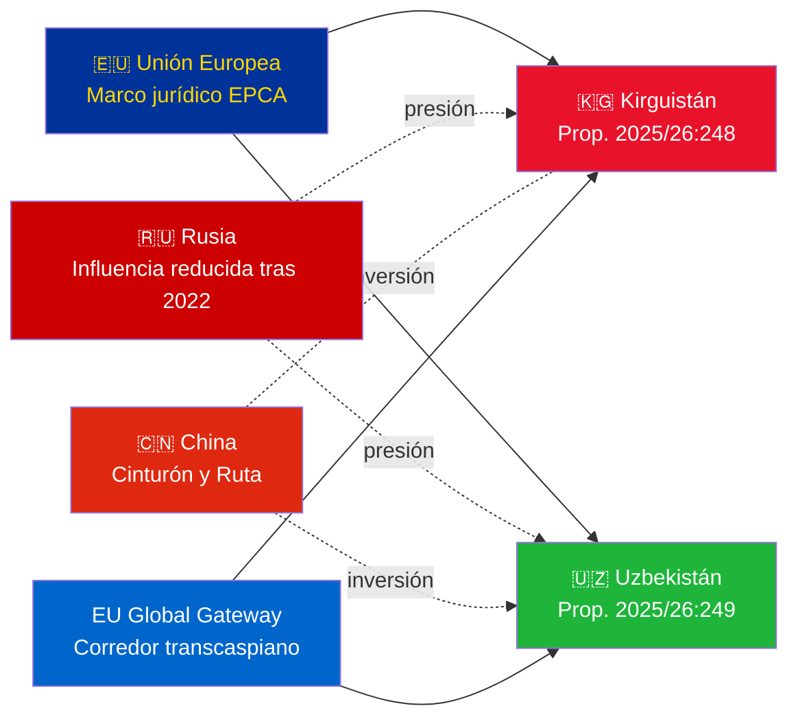

# Informe de inteligencia — Proposiciones gubernamentales 2026-05-07

**Clasificación**: Almirantazgo [B2] | **Horizonte**: T+72h / T+90d  
**Confianza WEP**: Casi seguro (resultado de ratificación) | Probable (trayectoria geopolítica)  
**DIW**: L2 Estratégico | **Fecha**: 2026-05-07

---

## 🔴 Hallazgo clave de inteligencia

**Suecia presenta votaciones de ratificación para dos EPCA UE-Asia Central el 2026-05-07.** Ambos acuerdos (UE-Kirguistán: HD03248; UE-Uzbekistán: HD03249) son proposiciones de ratificación de tratados del Ministerio de Asuntos Exteriores, remitidas al Comité de Asuntos Exteriores. La aprobación parlamentaria es **casi segura** (confianza: 95%+) — estas son obligaciones de tratados de la UE no partidistas. El valor estratégico de inteligencia está en el contexto geopolítico, no en las votaciones en sí.

---

## 📋 Lo que está ante el Riksdag

| Proposición | País | Firmado | Disposiciones clave |
|------------|---------|--------|----------------|
| 2025/26:248 (HD03248) | Kirguistán | 2023 | Diálogo político, comercio, estado de derecho, conectividad |
| 2025/26:249 (HD03249) | Uzbekistán | 2023 | Comercio, materias primas críticas, economía digital, clima |

Ambos son **Acuerdos de Asociación y Cooperación Reforzados** (EPCA) — el marco jurídico bilateral más completo que utiliza la UE aparte de los acuerdos de asociación. Reemplazan los acuerdos de colaboración de la era soviética de 1999.

---

## 🌍 Contexto geopolítico

**Reorientación geopolítica en Asia Central tras 2022**: Tanto Kirguistán como Uzbekistán han acelerado su compromiso con la UE desde la invasión a gran escala de Ucrania por Rusia. Las dificultades económicas de Rusia, el riesgo de sanciones secundarias y la reducida credibilidad de la OTSC crearon una ventana para la profundización de la asociación con la UE. La serie EPCA (ratificaciones de Kazajistán, Kirguistán, Uzbekistán, Tayikistán en curso) representa la expansión más significativa del marco jurídico de la UE en Asia Central desde la independencia.

---

## 🎯 Evaluación estratégica de inteligencia

**El EPCA de Uzbekistán (HD03249) tiene mayor valor estratégico** debido a:
1. Población 38 millones — el estado más poblado de Asia Central
2. Materias primas críticas: uranio (mundial n.º 7), oro, cobre, exploración de litio
3. El Reglamento de la UE sobre materias primas críticas (2024) designa a Asia Central como corredor estratégico de suministro
4. Ritmo de reformas bajo Mirziyoyev — el líder de AC más pro-occidental desde 2016

**El EPCA de Kirguistán (HD03248)** es menor pero no irrelevante:
1. Puerta de entrada geográfica a la conectividad más amplia de AC
2. Doble desafío de influencia de China/Rusia
3. La concentración de poder en la constitución de 2021 crea obligaciones de seguimiento de derechos humanos

---

## ⏱️ Calendario de acción inmediata

| Día | Acción |
|-----|--------|
| **2026-05-07** | Proposiciones HD03248 + HD03249 presentadas al Riksdag |
| **2026-06** | Audiencias del comité UU (probablemente sesión conjunta) |
| **2026-09** | Recomendación de la comisión UU |
| **2026-10** | Votación plenaria — aprobación casi segura |
| **2026-11** | Ratificación sueca depositada; EPCAs entran en vigor provisionalmente |

---

*Informe de inteligencia | Riksdagsmonitor | 2026-05-07*

<!-- source-sha: 763faff7f9c94520ee112d9155becca626ed9add -->
