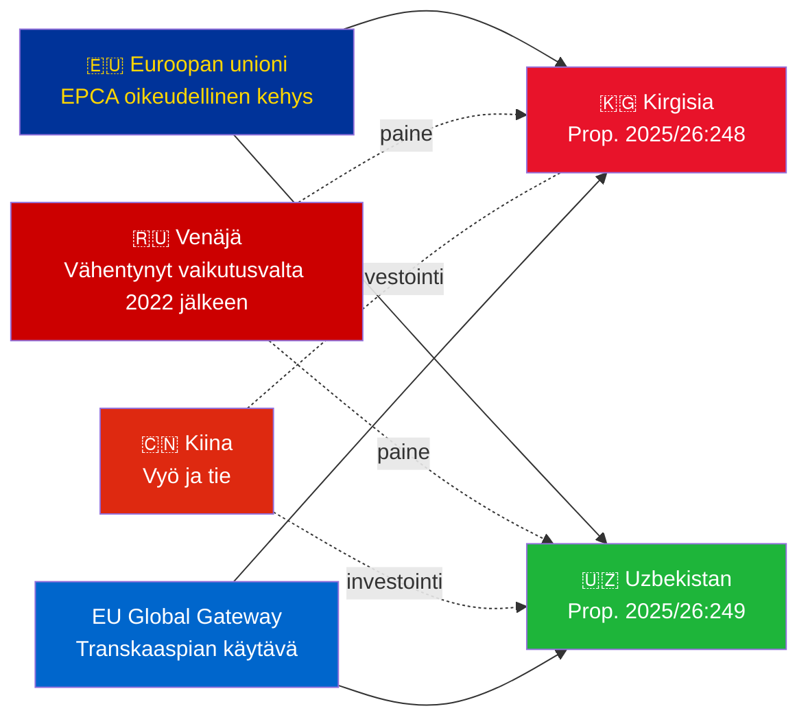

# Tiedusteluyhteenveto — Hallituksen esitykset 2026-05-07

**Luokittelu**: Admiraliteetti [B2] | **Horisontti**: T+72h / T+90d  
**WEP Luottamus**: Lähes varma (ratifiointitulos) | Todennäköinen (geopoliittinen kehityssuunta)  
**DIW**: L2 Strateginen | **Päivämäärä**: 2026-05-07

---

## 🔴 Tärkeimmät tiedusteluhavainnot

**Ruotsi esittää kahden EU-Keski-Aasia-EPCA:n ratifiointiäänestykset 2026-05-07.** Molemmat sopimukset (EU-Kirgisia: HD03248; EU-Uzbekistan: HD03249) ovat Ulkoasiainministeriön sopimusratifiointiesityksiä, jotka on lähetetty Ulkoasiainvaliokunnalle. Parlamentaarinen hyväksyminen on **lähes varmaa** (luottamus: 95%+) — nämä ovat epäpuoluepoliittisia EU-sopimusvelvoitteita. Strateginen tiedusteluarvo on geopoliittisessa kontekstissa, ei itse äänestyksissä.

---

## 📋 Mitä on Riksdagenin edessä

| Esitys | Maa | Allekirjoitettu | Tärkeimmät määräykset |
|------------|---------|--------|----------------|
| 2025/26:248 (HD03248) | Kirgisia | 2023 | Poliittinen vuoropuhelu, kauppa, oikeusvaltioperiaate, yhteydet |
| 2025/26:249 (HD03249) | Uzbekistan | 2023 | Kauppa, kriittiset raaka-aineet, digitaalinen talous, ilmasto |

Molemmat ovat **Tehostettuja kumppanuus- ja yhteistyösopimuksia** (EPCA) — kattavin kahdenvälinen oikeudellinen kehys, jota EU käyttää assosiaatiosopimusten ohella. Ne korvaavat Neuvostoliiton aikakauden 1999 kumppanuussopimukset.

---

## 🌍 Geopoliittinen konteksti

**Keski-Aasian geopoliittinen muutos 2022 jälkeen**: Sekä Kirgisia että Uzbekistan ovat kiihdyttäneet EU-yhteistyötä Venäjän täysimittaisen Ukrainan hyökkäyksen jälkeen. Venäjän taloudelliset vaikeudet, sekundaariset pakoteriskit ja heikentynyt CSTO-uskottavuus loivat ikkunan syventyneelle EU-kumppanuudelle. EPCA-sarja (Kazakstanin, Kirgisian, Uzbekistanin, Tadžikistanin ratifioinnit käynnissä) edustaa merkittävintä EU-oikeudellisen kehyksen laajentumista Keski-Aasiassa itsenäistymisen jälkeen.

---

## 🎯 Strateginen tiedusteluarvio

**Uzbekistanin EPCA (HD03249) on strategisesti arvokkaampaa** johtuen:
1. Väestö 38 milj. — Keski-Aasian väkirikkain valtio
2. Kriittiset raaka-aineet: uraani (maailman 7.), kulta, kupari, litiumprospektointi
3. EU:n kriittisten raaka-aineiden laki (2024) nimeää Keski-Aasian strategiseksi toimitusketjukäytäväksi
4. Uudistustahti Mirziyojevin johdolla — länsimyönteisin KA-johtaja vuodesta 2016

**Kirgisian EPCA (HD03248)** on alhaisempi mutta merkittävä:
1. Maantieteellinen yhdyskäytävä laajemmalle KA-yhteyksille
2. Kiinan/Venäjän kaksoisvaikutuksen haaste
3. Vallan keskittyminen perustuslakiin 2021 luo ihmisoikeusseurantavelvoitteita

---

## ⏱️ Välitön toimintakalenteri

| Päivä | Toiminta |
|-----|--------|
| **2026-05-07** | Esitykset HD03248 + HD03249 toimitettu Riksdagenille |
| **2026-06** | UU-valiokunnan kuulemiset (todennäköisesti yhteisistunto) |
| **2026-09** | UU:n mietintösuositus |
| **2026-10** | Täysistuntoäänestys — lähes varma hyväksyminen |
| **2026-11** | Ruotsin ratifiointi talletettu; EPCA:t tulevat väliaikaisesti voimaan |

---

*Tiedusteluyhteenveto | Riksdagsmonitor | 2026-05-07*

<!-- source-sha: 763faff7f9c94520ee112d9155becca626ed9add -->
