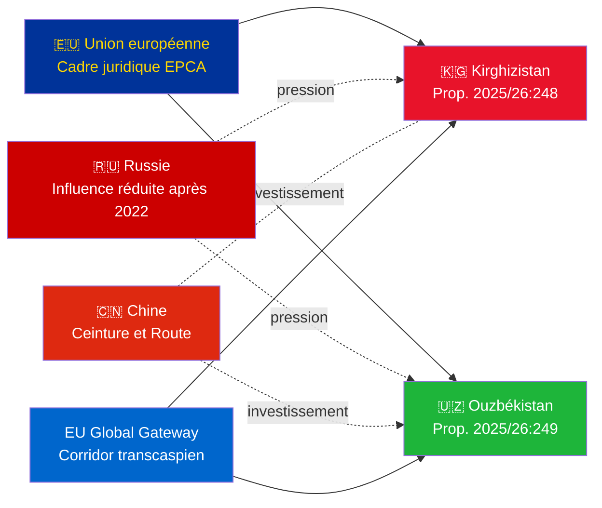

# Note de renseignement — Propositions gouvernementales 2026-05-07

**Classification**: Amirauté [B2] | **Horizon**: T+72h / T+90d  
**Confiance WEP**: Presque certain (résultat de ratification) | Probable (trajectoire géopolitique)  
**DIW**: L2 Stratégique | **Date**: 2026-05-07

---

## 🔴 Constat de renseignement clé

**La Suède soumet des votes de ratification pour deux EPCA UE-Asie centrale le 2026-05-07.** Les deux accords (UE-Kirghizistan : HD03248 ; UE-Ouzbékistan : HD03249) sont des propositions de ratification de traités du Ministère des affaires étrangères, renvoyées à la Commission des affaires étrangères. L'approbation parlementaire est **presque certaine** (confiance : 95%+) — ce sont des obligations de traités UE non partisanes. La valeur stratégique du renseignement réside dans le contexte géopolitique, pas dans les votes eux-mêmes.

---

## 📋 Ce qui est devant le Riksdag

| Proposition | Pays | Signé | Dispositions clés |
|------------|---------|--------|----------------|
| 2025/26:248 (HD03248) | Kirghizistan | 2023 | Dialogue politique, commerce, état de droit, connectivité |
| 2025/26:249 (HD03249) | Ouzbékistan | 2023 | Commerce, matières premières critiques, économie numérique, climat |

Les deux sont des **Accords de partenariat et de coopération renforcés** (EPCA) — le cadre juridique bilatéral le plus complet que l'UE utilise en dehors des accords d'association. Ils remplacent les accords de partenariat de l'ère soviétique de 1999.

---

## 🌍 Contexte géopolitique

**Réalignement géopolitique en Asie centrale après 2022** : Le Kirghizistan et l'Ouzbékistan ont tous deux accéléré leur engagement avec l'UE depuis l'invasion à grande échelle de l'Ukraine par la Russie. Les difficultés économiques de la Russie, le risque de sanctions secondaires et la crédibilité réduite de l'OTSC ont créé une fenêtre pour un approfondissement du partenariat UE. La série EPCA (ratifications du Kazakhstan, Kirghizistan, Ouzbékistan, Tadjikistan en cours) représente l'expansion du cadre juridique UE la plus significative en Asie centrale depuis l'indépendance.

---

## 🎯 Évaluation stratégique du renseignement

**L'EPCA de l'Ouzbékistan (HD03249) a une valeur stratégique plus élevée** en raison de :
1. Population 38 millions — État le plus peuplé d'Asie centrale
2. Matières premières critiques : uranium (mondial n°7), or, cuivre, exploration lithium
3. Le Règlement UE sur les matières premières critiques (2024) désigne l'Asie centrale comme corridor d'approvisionnement stratégique
4. Rythme des réformes sous Mirziyoyev — dirigeant CA le plus pro-occidental depuis 2016

**L'EPCA du Kirghizistan (HD03248)** est moindre mais non négligeable :
1. Porte d'entrée géographique vers la connectivité CA plus large
2. Défi d'influence double Chine/Russie
3. Concentration des pouvoirs dans la constitution de 2021 crée des obligations de surveillance des droits humains

---

## ⏱️ Calendrier d'action immédiat

| Jour | Action |
|-----|--------|
| **2026-05-07** | Propositions HD03248 + HD03249 soumises au Riksdag |
| **2026-06** | Auditions de la commission UU (probablement session commune) |
| **2026-09** | Rapport de recommandation de la commission UU |
| **2026-10** | Vote en séance plénière — approbation presque certaine |
| **2026-11** | Ratification suédoise déposée ; EPCAs entrent en vigueur à titre provisoire |

---

*Note de renseignement | Riksdagsmonitor | 2026-05-07*

<!-- source-sha: 763faff7f9c94520ee112d9155becca626ed9add -->
