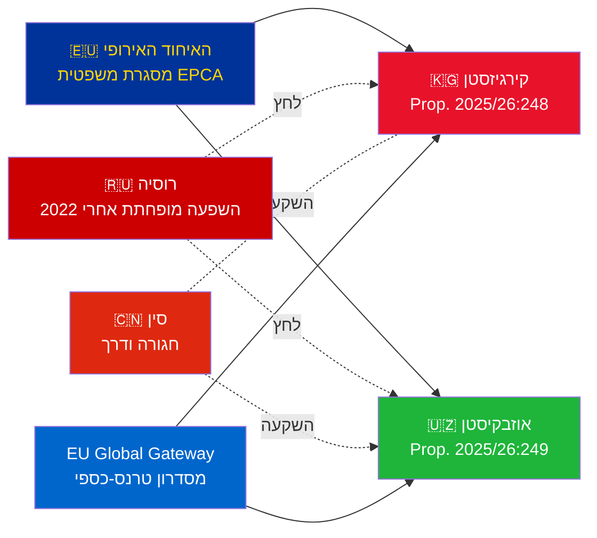

# תדריך מודיעיני — הצעות ממשלתיות 2026-05-07

**סיווג**: אדמירליות [B2] | **אופק**: T+72h / T+90d  
**אמינות WEP**: כמעט ודאי (תוצאת האשרור) | סביר (מסלול גיאופוליטי)  
**DIW**: L2 אסטרטגי | **תאריך**: 2026-05-07

---

## 🔴 ממצא מודיעיני מרכזי

**שוודיה מגישה ב-2026-05-07 הצבעות אשרור על שני הסכמי EPCA של האיחוד האירופי עם מרכז אסיה.** שני ההסכמים (האיחוד האירופי–קירגיזסטן: HD03248; האיחוד האירופי–אוזבקיסטן: HD03249) הם הצעות אשרור אמנות ממשרד החוץ, שהופנו לוועדת החוץ. אישור פרלמנטרי **כמעט ודאי** (אמינות: 95%+) — אלו התחייבויות אמנה לא-מפלגתיות של האיחוד האירופי. הערך המודיעיני האסטרטגי נמצא בהקשר הגיאופוליטי, לא בהצבעות עצמן.

---

## 📋 מה מוגש לריקסדאגן

| הצעה | מדינה | חתימה | הוראות מרכזיות |
|------------|---------|--------|----------------|
| 2025/26:248 (HD03248) | קירגיזסטן | 2023 | דיאלוג פוליטי, סחר, שלטון חוק, קישוריות |
| 2025/26:249 (HD03249) | אוזבקיסטן | 2023 | סחר, חומרי גלם קריטיים, כלכלה דיגיטלית, אקלים |

שניהם **הסכמי שותפות ושיתוף פעולה מוגברים** (EPCA) — המסגרת המשפטית הדו-צדדית המקיפה ביותר שהאיחוד האירופי משתמש בה מחוץ להסכמי שיתוף פעולה. הם מחליפים את הסכמי השותפות הסובייטיים משנת 1999.

---

## 🌍 הקשר גיאופוליטי

**שינוי כיוון גיאופוליטי של מרכז אסיה אחרי 2022**: קירגיזסטן ואוזבקיסטן האיצו את שיתוף הפעולה עם האיחוד האירופי מאז הפלישה הרוסית המלאה לאוקראינה. הקשיים הכלכליים של רוסיה, הסיכון לסנקציות משניות, ואמינות מופחתת של ה-CSTO יצרו חלון להעמקת שיתוף הפעולה עם האיחוד האירופי. סדרת EPCA (אשרור של קזחסטן, קירגיזסטן, אוזבקיסטן, טג'יקיסטן בתהליך) מייצגת את ההרחבה המשמעותית ביותר של המסגרת המשפטית של האיחוד האירופי במרכז אסיה מאז עצמאות אלו.

---

## 🎯 הערכה מודיעינית אסטרטגית

**EPCA של אוזבקיסטן (HD03249) בעלת ערך אסטרטגי גבוה יותר** בשל:
1. אוכלוסייה 38 מיליון — המדינה המאוכלסת ביותר במרכז אסיה
2. חומרי גלם קריטיים: אורניום (מקום 7 בעולם), זהב, נחושת, חיפושי ליתיום
3. תקנת חומרי הגלם הקריטיים של האיחוד האירופי (2024) מציינת את מרכז אסיה כמסדרון אסטרטגי לאספקה
4. קצב הרפורמות תחת מירזייייב — המנהיג הפרו-מערבי ביותר במרכז אסיה מאז 2016

**EPCA של קירגיזסטן (HD03248)** פחות חשובה אך לא זניחה:
1. שער גיאוגרפי לקישוריות רחבה יותר במרכז אסיה
2. אתגר השפעה כפול של סין/רוסיה
3. ריכוז סמכויות בחוקת 2021 מייצר התחייבויות ניטור זכויות אדם

---

## ⏱️ לוח זמנים לפעולה מיידית

| יום | פעולה |
|-----|--------|
| **2026-05-07** | הגשת הצעות HD03248 + HD03249 לריקסדאגן |
| **2026-06** | דיוני ועדת UU (ייתכן ישיבה משותפת) |
| **2026-09** | המלצת דוח ועדת UU |
| **2026-10** | הצבעה במליאה — אישור כמעט ודאי |
| **2026-11** | הפקדת האשרור השוודי; EPCA נכנס לתוקף באופן זמני |

---

*תדריך מודיעיני | Riksdagsmonitor | 2026-05-07*

<!-- source-sha: 763faff7f9c94520ee112d9155becca626ed9add -->
