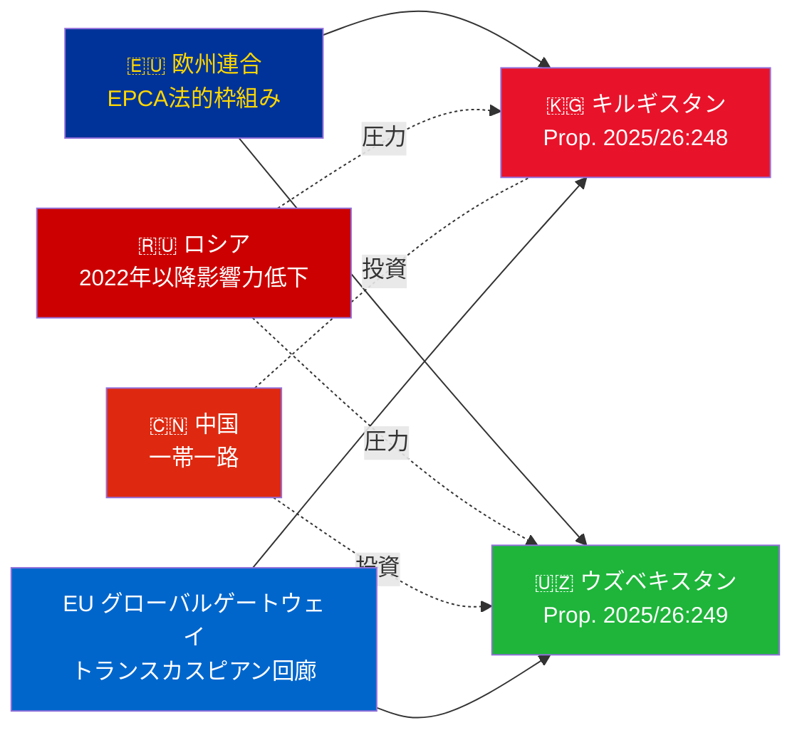

# 情報ブリーフィング — 政府提案 2026-05-07

**分類**: 提督評価 [B2] | **時間軸**: T+72h / T+90d  
**WEP信頼度**: ほぼ確実（批准結果）| おそらく（地政学的展開）  
**DIW**: L2 戦略的 | **日付**: 2026-05-07

---

## 🔴 主要情報調査結果

**スウェーデンは2026-05-07に、EU・中央アジア間の2件のEPCA批准投票を提出する。** 両合意（EU・キルギスタン：HD03248；EU・ウズベキスタン：HD03249）は外務省による条約批准提案であり、外交委員会に付託されている。議会承認は**ほぼ確実**（信頼度：95%以上）— これらは超党派のEU条約義務である。戦略的な情報価値は投票そのものではなく地政学的文脈にある。

---

## 📋 リクスダーゲンに提出される事項

| 提案 | 対象国 | 署名 | 主要条項 |
|------------|---------|--------|----------------|
| 2025/26:248 (HD03248) | キルギスタン | 2023 | 政治対話、貿易、法の支配、接続性 |
| 2025/26:249 (HD03249) | ウズベキスタン | 2023 | 貿易、重要原材料、デジタル経済、気候 |

両協定とも**強化パートナーシップ・協力協定**（EPCA）— EUが連合協定以外で使用する最も包括的な二国間法的枠組みである。1999年のソビエト時代のパートナーシップ協定に取って代わる。

---

## 🌍 地政学的背景

**2022年以降の中央アジアの地政学的方向転換**：キルギスタンとウズベキスタンはいずれも、ロシアによるウクライナへの全面侵攻以来、EU協力を加速させた。ロシアの経済的困難、二次制裁リスク、CSTO信頼性の低下により、EU協力の深化に向けた機会の窓が開かれた。EPCAシリーズ（カザフスタン、キルギスタン、ウズベキスタン、タジキスタンの批准進行中）は、独立以来、中央アジアにおけるEU法的枠組みの最も重要な拡大を表している。

---

## 🎯 戦略的情報評価

**ウズベキスタンのEPCA（HD03249）の戦略的価値がより高い**理由：
1. 人口3,800万 — 中央アジア最多人口の国
2. 重要原材料：ウラン（世界第7位）、金、銅、リチウム探査
3. EU重要原材料規則（2024年）が中央アジアを戦略的供給回廊と明記
4. ミルジョエフ政権下の改革ペース — 2016年以降、中央アジアで最も親西洋的な指導者

**キルギスタンのEPCA（HD03248）**は優先度は低いが無視できない：
1. 広範な中央アジア接続性への地理的関門
2. 中国・ロシアによる二重影響力への挑戦
3. 2021年憲法での権力集中が人権監視義務を生じさせる

---

## ⏱️ 即時行動タイムライン

| 日付 | 行動 |
|-----|--------|
| **2026-05-07** | 提案HD03248 + HD03249をリクスダーゲンに提出 |
| **2026-06** | UU委員会公聴会（おそらく合同会議） |
| **2026-09** | UU委員会報告書の勧告 |
| **2026-10** | 本会議採決 — 承認はほぼ確実 |
| **2026-11** | スウェーデン批准書の寄託；EPCA暫定発効 |

---

*情報ブリーフィング | Riksdagsmonitor | 2026-05-07*

<!-- source-sha: 763faff7f9c94520ee112d9155becca626ed9add -->
