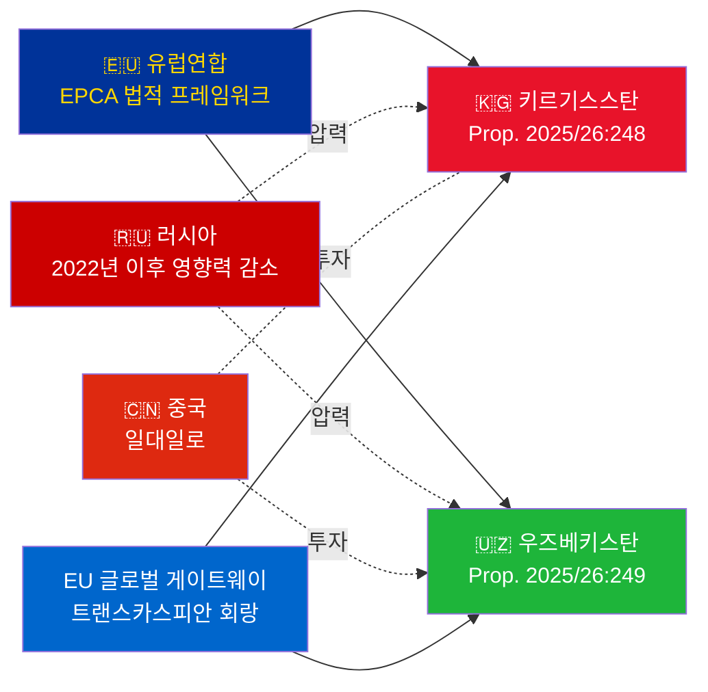

# 정보 브리핑 — 정부 제안 2026-05-07

**분류**: 어드미럴티 [B2] | **지평선**: T+72h / T+90d  
**WEP 신뢰도**: 거의 확실(비준 결과) | 가능성 높음(지정학적 전개)  
**DIW**: L2 전략적 | **날짜**: 2026-05-07

---

## 🔴 주요 정보 조사 결과

**스웨덴은 2026-05-07에 두 건의 EU-중앙아시아 EPCA 비준 투표를 제출한다.** 두 협정(EU-키르기스스탄: HD03248; EU-우즈베키스탄: HD03249) 모두 외교부의 조약 비준 제안으로 외교위원회에 회부되었다. 의회 승인은 **거의 확실**하다(신뢰도: 95% 이상) — 초당파적 EU 조약 의무이다. 전략적 정보 가치는 투표 자체가 아니라 지정학적 맥락에 있다.

---

## 📋 릭스다겐에 제출되는 사항

| 제안 | 국가 | 서명 | 주요 조항 |
|------------|---------|--------|----------------|
| 2025/26:248 (HD03248) | 키르기스스탄 | 2023 | 정치 대화, 무역, 법치, 연결성 |
| 2025/26:249 (HD03249) | 우즈베키스탄 | 2023 | 무역, 핵심 원자재, 디지털 경제, 기후 |

두 협정 모두 **강화 파트너십 및 협력 협정**(EPCA) — EU가 연합 협정 이외에 사용하는 가장 포괄적인 양자 법적 프레임워크이다. 1999년 소비에트 시대 파트너십 협정을 대체한다.

---

## 🌍 지정학적 맥락

**2022년 이후 중앙아시아의 지정학적 방향 전환**: 키르기스스탄과 우즈베키스탄 모두 러시아의 우크라이나 전면 침공 이후 EU 협력을 가속화했다. 러시아의 경제적 어려움, 2차 제재 리스크, CSTO 신뢰성 저하로 EU 협력 심화를 위한 기회의 창이 열렸다. EPCA 시리즈(카자흐스탄, 키르기스스탄, 우즈베키스탄, 타지키스탄 비준 진행 중)는 독립 이래 중앙아시아에서 EU 법적 프레임워크의 가장 중요한 확대를 대표한다.

---

## 🎯 전략적 정보 평가

**우즈베키스탄 EPCA(HD03249)의 전략적 가치가 더 높다** 이유:
1. 인구 3,800만 — 중앙아시아에서 가장 인구가 많은 국가
2. 핵심 원자재: 우라늄(세계 7위), 금, 구리, 리튬 탐사
3. EU 핵심 원자재 규정(2024)이 중앙아시아를 전략적 공급 회랑으로 명시
4. 미르지요예프 체제하의 개혁 속도 — 2016년 이후 중앙아시아에서 가장 친서방적 지도자

**키르기스스탄 EPCA(HD03248)**는 우선순위가 낮지만 무시할 수 없다:
1. 광범위한 중앙아시아 연결성으로의 지리적 관문
2. 중국·러시아의 이중 영향력 도전
3. 2021년 헌법의 권력 집중이 인권 모니터링 의무를 발생시킴

---

## ⏱️ 즉각적인 행동 타임라인

| 날짜 | 행동 |
|-----|--------|
| **2026-05-07** | 릭스다겐에 제안 HD03248 + HD03249 제출 |
| **2026-06** | UU 위원회 청문회(아마도 합동 회의) |
| **2026-09** | UU 위원회 보고서 권고 |
| **2026-10** | 본회의 표결 — 승인 거의 확실 |
| **2026-11** | 스웨덴 비준서 기탁; EPCA 잠정 발효 |

---

*정보 브리핑 | Riksdagsmonitor | 2026-05-07*

<!-- source-sha: 763faff7f9c94520ee112d9155becca626ed9add -->
