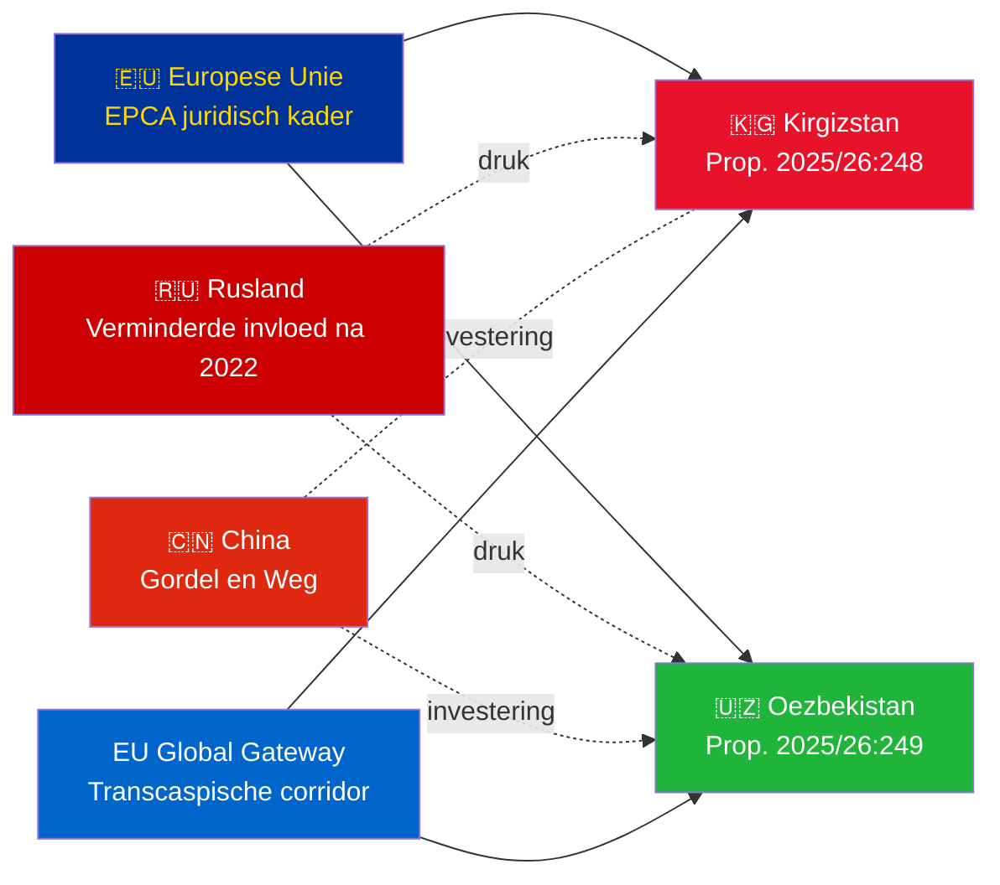

# Inlichtingenbriefing — Regeringsvoorstellen 2026-05-07

**Classificatie**: Admiraliteit [B2] | **Horizon**: T+72h / T+90d  
**WEP Betrouwbaarheid**: Bijna zeker (ratificatieresultaat) | Waarschijnlijk (geopolitieke ontwikkeling)  
**DIW**: L2 Strategisch | **Datum**: 2026-05-07

---

## 🔴 Belangrijkste inlichtingenbevinding

**Zweden legt op 2026-05-07 ratificatiestemmen voor voor twee EU-Centraal-Azië-EPCA's.** Beide overeenkomsten (EU-Kirgizstan: HD03248; EU-Oezbekistan: HD03249) zijn verdragsratificatievoorstellen van het Ministerie van Buitenlandse Zaken, verwezen naar de Vaste Commissie voor Buitenlandse Zaken. Parlementaire goedkeuring is **bijna zeker** (betrouwbaarheid: 95%+) — dit zijn niet-partijpolitieke EU-verdragsverplichtingen. De strategische inlichtingenwaarde ligt in de geopolitieke context, niet in de stemmingen zelf.

---

## 📋 Wat er voor de Riksdag ligt

| Voorstel | Land | Ondertekend | Wichtigste bepalingen |
|------------|---------|--------|----------------|
| 2025/26:248 (HD03248) | Kirgizstan | 2023 | Politieke dialoog, handel, rechtsstaat, connectiviteit |
| 2025/26:249 (HD03249) | Oezbekistan | 2023 | Handel, kritieke grondstoffen, digitale economie, klimaat |

Beide zijn **Versterkte Partnerschaps- en Samenwerkingsovereenkomsten** (EPCA) — het meest uitgebreide bilaterale juridische kader dat de EU gebruikt naast associatieovereenkomsten. Ze vervangen de Sovjet-era partnerschapsovereenkomsten van 1999.

---

## 🌍 Geopolitieke context

**Geopolitieke heroriëntatie van Centraal-Azië na 2022**: Zowel Kirgizstan als Oezbekistan hebben de EU-samenwerking versneld na Ruslands volledige invasie van Oekraïne. Ruslands economische moeilijkheden, het risico op secundaire sancties en verminderde CSTO-geloofwaardigheid creëerden een venster voor verdiepte EU-samenwerking. De EPCA-serie (ratificaties van Kazachstan, Kirgizstan, Oezbekistan, Tadzjikistan lopend) vertegenwoordigt de meest significante EU-rechtskaderuitbreiding in Centraal-Azië sinds de onafhankelijkheid.

---

## 🎯 Strategische inlichtingenbeoordeling

**Oezbekistans EPCA (HD03249) heeft hogere strategische waarde** vanwege:
1. Bevolking 38 mln. — meest bevolkte staat in Centraal-Azië
2. Kritieke grondstoffen: uranium (wereld #7), goud, koper, lithiumverkenning
3. EU-verordening inzake kritieke grondstoffen (2024) noemt Centraal-Azië als strategische aanvoerkorridor
4. Hervormingstempo onder Mirziyoyev — meest pro-westerse CA-leider sinds 2016

**Kirgizstans EPCA (HD03248)** is lager maar niet onbeduidend:
1. Geografische gateway naar bredere CA-connectiviteit
2. China/Russische dubbele invloedsuitdaging
3. Machtsconcentratie in de grondwet van 2021 schept mensenrechtstoezichtsverplichtingen

---

## ⏱️ Onmiddellijke actietijdlijn

| Dag | Actie |
|-----|--------|
| **2026-05-07** | Voorstellen HD03248 + HD03249 ingediend bij de Riksdag |
| **2026-06** | UU-commissiehooringen (waarschijnlijk gezamenlijke zitting) |
| **2026-09** | UU-commissieadvies |
| **2026-10** | Plenaire stemming — goedkeuring bijna zeker |
| **2026-11** | Zweedse ratificatie gedeponeerd; EPCA's treden voorlopig in werking |

---

*Inlichtingenbriefing | Riksdagsmonitor | 2026-05-07*

<!-- source-sha: 763faff7f9c94520ee112d9155becca626ed9add -->
