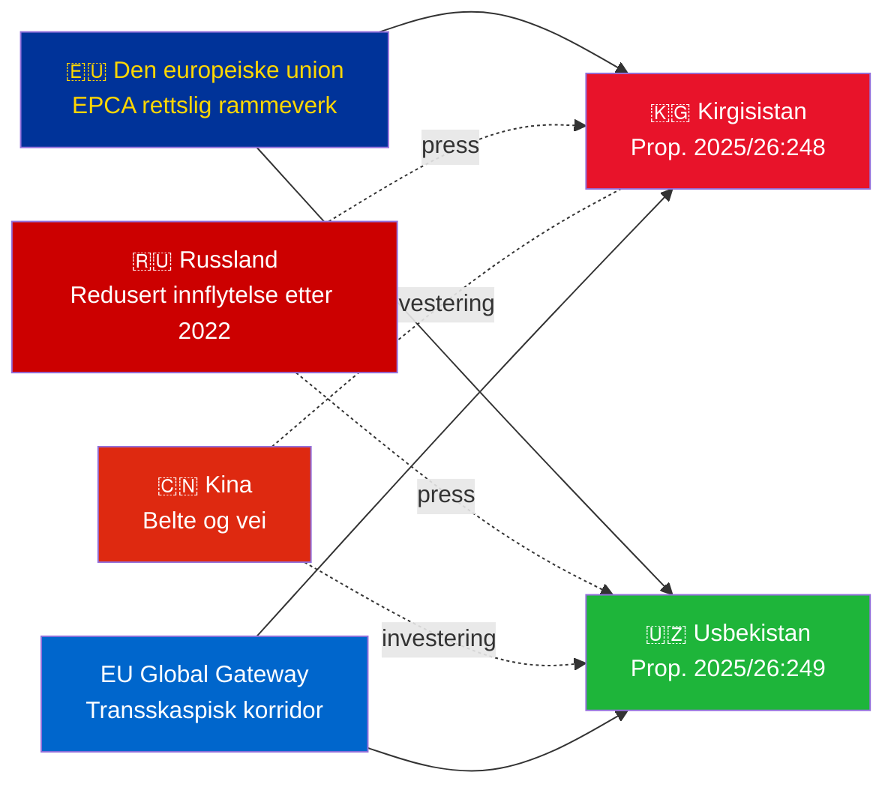

# Etterretningsoversikt — Regjeringsproposisjoner 2026-05-07

**Klassifisering**: Admiralitetet [B2] | **Horisont**: T+72h / T+90d  
**WEP Konfidens**: Nesten sikkert (ratifiseringsutfall) | Sannsynlig (geopolitisk bane)  
**DIW**: L2 Strategisk | **Dato**: 2026-05-07

---

## 🔴 Nøkkeletterretningsfunn

**Sverige legger frem ratifiseringsavstemninger for to EU-Sentral-Asia-EPCA-er den 2026-05-07.** Begge avtalene (EU-Kirgisistan: HD03248; EU-Usbekistan: HD03249) er traktatratifiseringsproposisjoner fra Utenriksdepartementet, henvist til Utenrikskomiteen. Parlamentarisk godkjenning er **nesten sikkert** (konfidens: 95%+) — disse er ikke-partipolitiske EU-traktatforpliktelser. Den strategiske etterretningsverdien ligger i den geopolitiske konteksten, ikke i selve avstemningene.

---

## 📋 Hva som ligger foran Riksdagen

| Proposisjon | Land | Undertegnet | Viktige bestemmelser |
|------------|---------|--------|----------------|
| 2025/26:248 (HD03248) | Kirgisistan | 2023 | Politisk dialog, handel, rettsstaten, konnektivitet |
| 2025/26:249 (HD03249) | Usbekistan | 2023 | Handel, kritiske råmaterialer, digital økonomi, klima |

Begge er **Forsterkede partnerskaps- og samarbeidsavtaler** (EPCA) — det mest omfattende bilaterale rettslige rammeverket EU bruker ved siden av assosieringsavtaler. De erstatter Sovjet-tidens partnerskapsavtaler fra 1999.

---

## 🌍 Geopolitisk kontekst

**Geopolitisk omstilling i Sentral-Asia etter 2022**: Både Kirgisistan og Usbekistan har akselerert EU-samarbeidet siden Russlands fullskala invasjon av Ukraina. Russlands økonomiske vanskeligheter, risikoen for sekundære sanksjoner og redusert CSTO-troverdighet skapte et vindu for dypere EU-partnerskap. EPCA-serien (ratifiseringer av Kasakhstan, Kirgisistan, Usbekistan, Tadsjikistan pågår) representerer den mest betydelige EU-rettslige rammeekspansjonen i Sentral-Asia siden uavhengigheten.

---

## 🎯 Strategisk etterretningsvurdering

**Usbekistans EPCA (HD03249) har høyere strategisk verdi** på grunn av:
1. Befolkning 38 millioner — Sentral-Asias mest folkerike stat
2. Kritiske råmaterialer: uran (verdens #7), gull, kobber, lithiumprospektering
3. EUs lov om kritiske råmaterialer (2024) nevner Sentral-Asia som strategisk forsyningskorridor
4. Reformtempo under Mirziyoyev — mest vestvendte CA-leder siden 2016

**Kirgisistans EPCA (HD03248)** er lavere men ikke ubetydelig:
1. Geografisk inngangsport til bredere CA-konnektivitet
2. Kinas/Russlands doble innflytelsesutfordring
3. Maktkonsentrasjon i grunnloven 2021 skaper forpliktelser til menneskerettighetsovervåking

---

## ⏱️ Umiddelbar handlingsbar tidslinje

| Dag | Handling |
|-----|--------|
| **2026-05-07** | Proposisjoner HD03248 + HD03249 innlevert til Riksdagen |
| **2026-06** | UU-komitéhøringer (sannsynligvis felles sesjon) |
| **2026-09** | UU-betenkningsanbefaling |
| **2026-10** | Plenumsavstemning — nesten sikkert godkjenning |
| **2026-11** | Svensk ratifisering deponert; EPCA-er trer i kraft provisorisk |

---

*Etterretningsoversikt | Riksdagsmonitor | 2026-05-07*

<!-- source-sha: 763faff7f9c94520ee112d9155becca626ed9add -->
