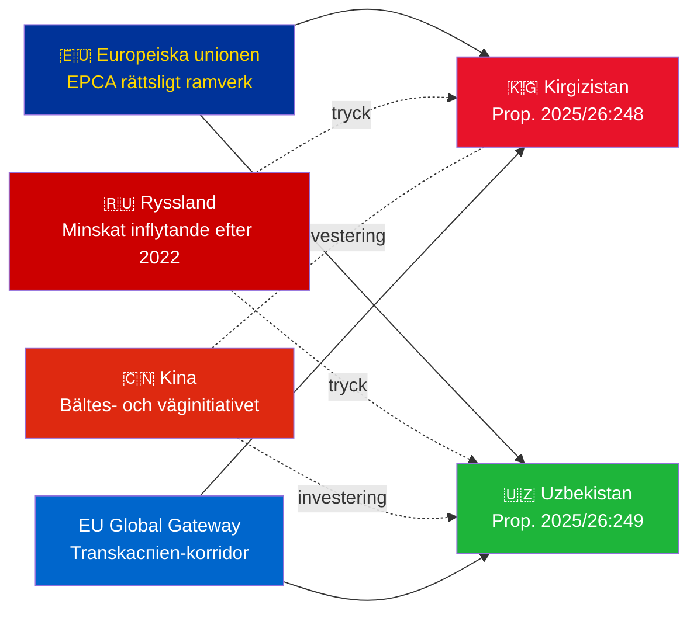

# Underrättelsesammanfattning — Regeringspropositioner 2026-05-07

**Klassificering**: Admiralitet [B2] | **Horisont**: T+72h / T+90d  
**WEP Konfidens**: Nästan säkert (ratificeringsutfall) | Troligt (geopolitisk bana)  
**DIW**: L2 Strategisk | **Datum**: 2026-05-07

---

## 🔴 Nyckelunderrättelsefynd

**Sverige lägger fram ratificeringsomröstningar för två EU-Centralasien-EPCA:er den 2026-05-07.** Båda avtalen (EU-Kirgizistan: HD03248; EU-Uzbekistan: HD03249) är fördragsratificeringspropositioner från Utrikesdepartementet, remitterade till Utrikesutskottet. Parlamentariskt godkännande är **nästan säkert** (konfidens: 95%+) — dessa är icke-partipolitiska EU-fördragsförpliktelser. Det strategiska underrättelsevärdet ligger i det geopolitiska sammanhanget, inte i omröstningarna som sådana.

---

## 📋 Vad som ligger inför Riksdagen

| Proposition | Land | Undertecknad | Viktiga bestämmelser |
|------------|---------|--------|----------------|
| 2025/26:248 (HD03248) | Kirgizistan | 2023 | Politisk dialog, handel, rättsstatsprincipen, konnektivitet |
| 2025/26:249 (HD03249) | Uzbekistan | 2023 | Handel, kritiska råmaterial, digital ekonomi, klimat |

Båda är **Förstärkta partnerskaps- och samarbetsavtal** (EPCA) — det mest heltäckande bilaterala rättsliga ramverket EU använder vid sidan av associeringsavtal. De ersätter Soviettidens partnerskapsavtal från 1999.

---

## 🌍 Geopolitiskt sammanhang

**Geopolitisk omställning i Centralasien efter 2022**: Både Kirgizistan och Uzbekistan har accelererat EU-samarbetet sedan Rysslands fullskaliga invasion av Ukraina. Rysslands ekonomiska svårigheter, risken för sekundära sanktioner och minskad CSTO-trovärdighet skapade ett fönster för fördjupat EU-partnerskap. EPCA-serien (ratificeringar av Kazakstan, Kirgizistan, Uzbekistan, Tadzjikistan pågår) representerar den mest betydande EU-rättsliga ramverksexpansionen i Centralasien sedan självständigheten.

---

## 🎯 Strategisk underrättelsebedömning

**Uzbekistans EPCA (HD03249) har högre strategiskt värde** på grund av:
1. Befolkning 38 miljoner — Centralasiens folkrikaste stat
2. Kritiska råmaterial: uran (världens 7:e), guld, koppar, litiumprospektering
3. EU:s lag om kritiska råmaterial (2024) namnger Centralasien som strategisk försörjningskorridor
4. Reformtakt under Mirziyoyev — mest västvänlige CA-ledaren sedan 2016

**Kirgizistans EPCA (HD03248)** är lägre men inte obetydlig:
1. Geografisk ingång till bredare CA-konnektivitet
2. Kinas/Rysslands dubbla inflytandeutmaning
3. Maktkoncentration i grundlagen 2021 skapar förpliktelser för mänskliga rättigheter

---

## ⏱️ Omedelbar handlingsbar tidslinje

| Dag | Åtgärd |
|-----|--------|
| **2026-05-07** | Propositioner HD03248 + HD03249 inlämnade till Riksdagen |
| **2026-06** | UU-utskottsutfrågningar (troligen gemensam session) |
| **2026-09** | UU-betänkande med rekommendation |
| **2026-10** | Pleniomröstning — nästan säkert godkännande |
| **2026-11** | Svensk ratificering deponerad; EPCA:er träder i kraft provisoriskt |

---

*Underrättelsesammanfattning | Riksdagsmonitor | 2026-05-07*

<!-- source-sha: 763faff7f9c94520ee112d9155becca626ed9add -->
