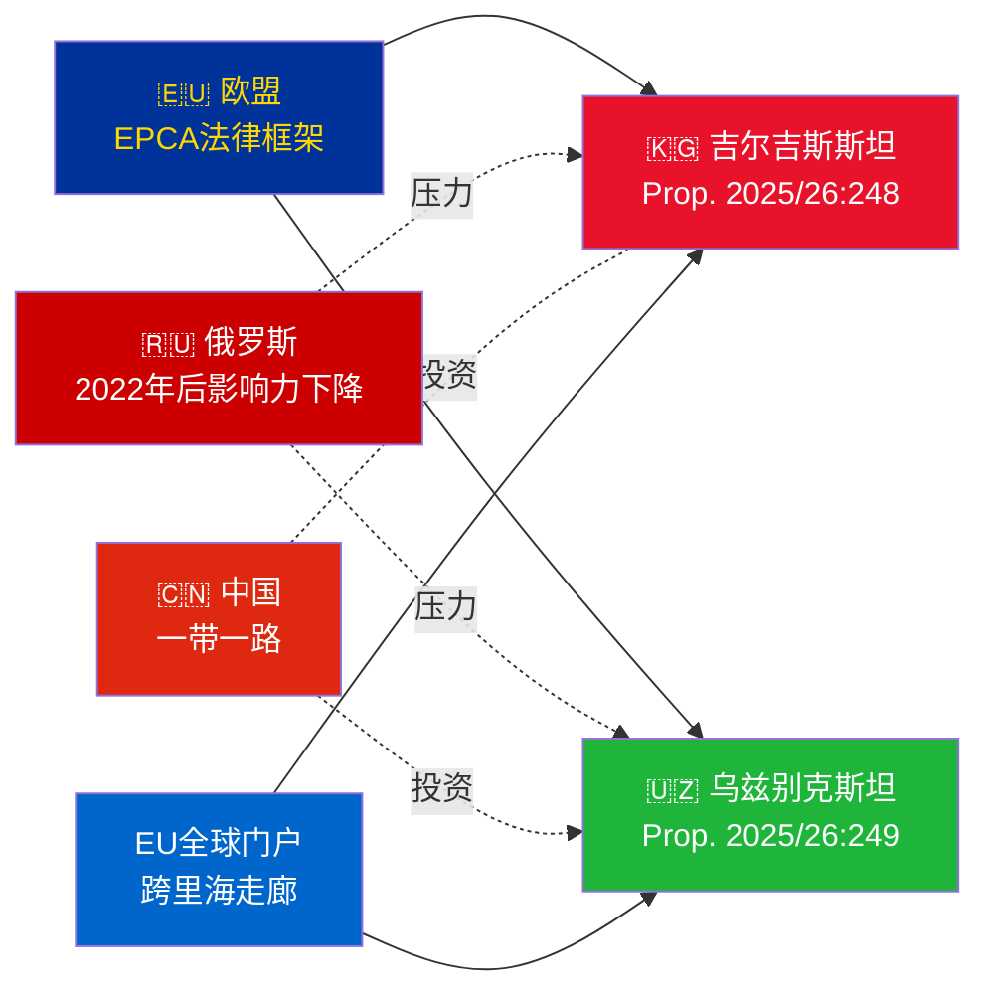

# 情报简报 — 政府提案 2026-05-07

**分类**: 海军部评级 [B2] | **时间视野**: T+72h / T+90d  
**WEP可信度**: 几乎确定（批准结果）| 可能（地缘政治进程）  
**DIW**: L2 战略级 | **日期**: 2026-05-07

---

## 🔴 核心情报发现

**瑞典于2026-05-07提交两项欧盟-中亚EPCA批准投票。** 两项协议（欧盟-吉尔吉斯斯坦：HD03248；欧盟-乌兹别克斯坦：HD03249）均为外交部提交的条约批准提案，已转交外交事务委员会审查。议会批准**几乎确定**（可信度：95%以上）——这些是超党派的欧盟条约义务。战略情报价值在于地缘政治背景，而非投票本身。

---

## 📋 提交里克斯达根的事项

| 提案 | 国家 | 签署 | 主要条款 |
|------------|---------|--------|----------------|
| 2025/26:248 (HD03248) | 吉尔吉斯斯坦 | 2023 | 政治对话、贸易、法治、互联互通 |
| 2025/26:249 (HD03249) | 乌兹别克斯坦 | 2023 | 贸易、关键原材料、数字经济、气候 |

两项均为**强化伙伴关系与合作协议**（EPCA）——这是欧盟在联系协议之外使用的最全面的双边法律框架。取代1999年苏联时代的伙伴关系协议。

---

## 🌍 地缘政治背景

**2022年后中亚地缘政治重新定向**：自俄罗斯全面入侵乌克兰以来，吉尔吉斯斯坦和乌兹别克斯坦均加快了与欧盟的合作。俄罗斯的经济困难、次级制裁风险以及集安组织可信度下降，为深化欧盟合作提供了机会窗口。EPCA系列（哈萨克斯坦、吉尔吉斯斯坦、乌兹别克斯坦、塔吉克斯坦批准进行中）代表了自独立以来欧盟法律框架在中亚最重要的扩展。

---

## 🎯 战略情报评估

**乌兹别克斯坦EPCA（HD03249）具有更高战略价值**，原因如下：
1. 人口3800万——中亚人口最多的国家
2. 关键原材料：铀（全球第7位）、黄金、铜、锂勘探
3. 欧盟《关键原材料法》（2024）明确将中亚列为战略供应走廊
4. 米尔济约耶夫执政下的改革步伐——2016年以来中亚最亲西方的领导人

**吉尔吉斯斯坦EPCA（HD03248）**优先级较低但不可忽视：
1. 通向更广泛中亚互联互通的地理门户
2. 中国/俄罗斯双重影响力挑战
3. 2021年宪法的权力集中产生人权监督义务

---

## ⏱️ 即时行动时间表

| 日期 | 行动 |
|-----|--------|
| **2026-05-07** | 向里克斯达根提交提案HD03248 + HD03249 |
| **2026-06** | UU委员会听证会（可能为联合会议） |
| **2026-09** | UU委员会报告建议 |
| **2026-10** | 全体会议表决——批准几乎确定 |
| **2026-11** | 瑞典批准书交存；EPCA暂时生效 |

---

*情报简报 | Riksdagsmonitor | 2026-05-07*

<!-- source-sha: 763faff7f9c94520ee112d9155becca626ed9add -->
