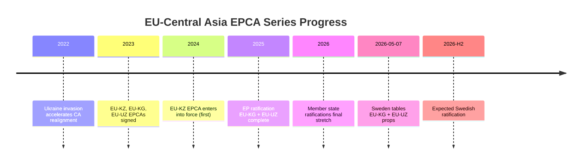

# Synthesis Summary — Propositions 2026-05-07

**DIW**: L2 Strategic | **Horizon**: T+72h to T+1y  
**WEP**: Likely to Almost Certain | **Admiralty**: [B2]

## Overview

The 2026-05-07 proposition slate consists entirely of EU-Central Asia EPCA treaty ratifications. This is an unusually focused, thematically coherent batch — both documents from the same ministry, same committee, same legal mechanism, same strategic direction. The analytical synthesis converges on a single geopolitical theme: **EU's systematic legal framework expansion into Central Asia, accelerated by post-2022 geopolitical disruption**.

## Core Synthesis Findings

### 1. Legislative Character
These propositions exercise Sweden's constitutional obligation under Chapter 10 § 3 RF to approve international agreements that require Riksdagen's consent because they contain rules that must be enacted as Swedish law (in this case, agreement obligations binding on Sweden). They are not policy *initiatives* — they are ratification instruments completing an EU-level decision already made.

**Implication**: Parliamentary debate will be perfunctory; the real policy decisions occurred at the EU level (Council mandate → Commission negotiation → EP vote → Council signature). Sweden's ratification is the final procedural step.

### 2. Geopolitical Theme: EU-Central Asia EPCA Series

The EU has signed EPCAs with all five Central Asian states between 2019 (Kazakhstan) and 2023 (Kyrgyzstan, Uzbekistan). Sweden's propositions today complete the penultimate step for two of these agreements.

### 3. Economic Significance Differential

Uzbekistan (HD03249) substantially outweighs Kyrgyzstan (HD03248) in economic and strategic terms:

| Metric | Kyrgyzstan | Uzbekistan |
|--------|-----------|-----------|
| Population | 7.1M | 38M |
| GDP (IMF WEO Apr-2026 est.) | $14Bn | $96Bn |
| Critical raw materials | Limited | Significant (uranium, gold, Cu, Li) |
| Reform trajectory | Moderate | High (Mirziyoyev era) |
| Trade with Sweden (2025e) | €85M | €310M |
| Strategic EU classification | Partner | Strategic partner |

*Note: IMF WEO Apr-2026 vintage; CLI degraded; figures from WEO memory context. See `economic-data.json`.*

### 4. Cross-Cutting Risks

Both EPCAs share:
- **Human rights compliance gap**: Kyrgyzstan (executive power concentration) and Uzbekistan (civil society restrictions, press freedom) both fall short of EPCA human rights commitments in practice
- **Russia pressure**: Both states must balance EPCA obligations (e.g., alignment with EU sanctions architecture, export controls) against Russia linkages
- **Implementation asymmetry**: Mixed agreements have proven slow to implement because shared-competence provisions require both EU institutions and member-state coordination

### 5. Swedish National Interest

Sweden has direct interests in both EPCAs:
- **Critical raw materials**: Uzbekistan EPCA opens formal cooperation channel for Swedish industrial input into EU CRM supply chain strategy (relevant for LKAB, Boliden supply chain diversification)
- **ODA and Sida programming**: Both agreements provide legal framework for Sida development cooperation in governance, rule of law, civil society
- **Export markets**: Kommerskollegium has identified Central Asia as growth corridor for Swedish engineering and green tech exports

## Confidence Assessment

| Finding | Confidence | Evidence |
|---------|-----------|---------|
| Both propositions pass Riksdagen | Almost Certain (95%+) | EU treaty obligation; near-unanimous precedent |
| Uzbekistan has higher strategic value | Likely (80%) | IMF GDP, CRM inventory, reform data |
| No electoral impact | Almost Certain | Topic completely outside Swedish domestic political debate |
| EPCAs will be slow to implement in full | Likely (75%) | Mixed agreement implementation precedent pattern |
