# Synthesis Summary — Post-2026 Coalition: Next Mandate 2026-2030

**Author**: James Pether Sörling | **Confidence**: MEDIUM [Admiralty B3]  
**Article type**: election-cycle | **Cycle anchor**: next (2026-09-13 → 2030-09-08)  
**Horizon**: T+1460d (4 years) | **Depth multiplier**: 2.5× Tier-C  
**Generated**: 2026-05-08 | **Election**: 2026-09-13 (**T-128 days** to anchor start)  
**IMF vintage**: WEO Apr-2026 | **Cross-reference predecessor**: analysis/daily/2026-05-07/election-cycle/next/synthesis-summary.md

---

## Lead Assessment (Updated 2026-05-08)

The 2026-05-07/08 legislative output from the Tidö government creates **structural anchors** that will define the next government's operating environment regardless of election outcome. Four new instruments are now baked into the policy landscape: (1) **State e-ID (HD03250)** — once passed and procured, reversal costs exceed SEK 2B; the next government will inherit implementation; (2) **Security expulsion framework (HD03267)** — bipartisan security consensus means Red-Green continuation is UNLIKELY to repeal; (3) **Teacher certification reform (HD01UbU28)** — administrative reform with no partisan reversal incentive; (4) **Skatteverket expansion (HD03261)** — welfare fraud reduction is cross-partisan; no reversal incentive. These four join the five carry-forward anchors from prior sessions (NATO, SIGINT, election security, public service 2026-33, prison expansion) to create **nine durable institutional anchors** that bind the next mandate.

```mermaid
%%{init: {'theme': 'dark', 'themeVariables': {'primaryColor': '#00d9ff', 'secondaryColor': '#ff006e', 'background': '#0a0e27'}}}%%
graph LR
    A["2026-09-13<br/>Election anchor"] --> B["Scenario A1<br/>Tidö II strict<br/>WEP: 40%"]
    A --> C["Scenario C1<br/>Red-Green<br/>WEP: 27%"]
    A --> D["Scenario D<br/>Hung parliament<br/>WEP: 15%"]
    A --> E["Scenario B<br/>Centre-Right<br/>WEP: 10%"]
    B --> F["Welfare reform deepens<br/>Migration hardens<br/>Nuclear accelerates"]
    C --> G["Welfare restoration<br/>Climate priority<br/>Housing investment"]
    D --> H["Policy paralysis<br/>Extra election risk<br/>Caretaker only"]
    style A fill:#ffbe0b,stroke:#ffbe0b,color:#0a0e27
    style B fill:#00d9ff,stroke:#00d9ff,color:#0a0e27
    style C fill:#ff006e,stroke:#ff006e,color:#fff
    style D fill:#1a1e3d,stroke:#ffbe0b
    style E fill:#1a1e3d,stroke:#00d9ff
```

## Nine Durable Institutional Anchors for Next Mandate

| Anchor | Source | Reversibility | Coalition sensitivity |
|--------|--------|-------------|---------------------|
| NATO membership | Treaty | IRREVERSIBLE | Bipartisan |
| SIGINT framework | HD01FöU18 | Very low | Bipartisan security |
| State e-ID | HD03250 | Low (cost) | Bipartisan principle |
| Public service 2026-33 | HC03166 | Very low (contract) | Bipartisan |
| Election security framework | HC03181 | Very low (legitimacy) | Bipartisan |
| Civil defence structure | HC03205 | Low (institutional) | Bipartisan |
| Prison expansion infrastructure | HD01CU25 | Low (sunk cost) | Low (framing only) |
| Security threat expulsion | HD03267 | Low (security consensus) | Bipartisan |
| Teacher certification | HD01UbU28 | Very low (administrative) | Bipartisan |

## Next Mandate Policy Scenarios

### Scenario A1: Tidö II (2026-2030) — WEP: 40%

Policy priorities under M+KD+L+SD continuation:
- Welfare reform deepens: HD01SfU21/24 framework extended; new work requirements
- Nuclear energy: Site selection and reactor procurement commence
- Migration: Building on HD03267 and HD03263 (return programme)
- Digital: State e-ID implementation (Q1 2028); AI strategy national rollout
- Criminal justice: Prison capacity doubling (HD01CU25 phase 2)
- IMF context: GDP growth recovery to 2.3-2.5% by 2027-2028; debt remains ~33% GDP

### Scenario C1: Red-Green Government (2026-2030) — WEP: 27%

Policy priorities under S+V+MP (or +C):
- Welfare: Partial reversal of social insurance targeting; housing allowance restored
- Climate: Carbon budget reacceleration; nuclear energy delayed but not reversed
- Housing: SEK 20B+ investment programme; rent regulation reform
- Migration: Humanitarian asylum restoration; security threat framework maintained
- Digital: State e-ID continued (implementation too advanced to cancel)
- IMF context: Fiscal stimulus (housing) pushes balance to -1.5% GDP; debt rises marginally

### Scenario D: Hung Parliament (2026-2030) — WEP: 15%

- Caretaker government; limited policy change
- Eventual extra election within 12 months
- All durable anchors maintained; no new major legislation
- IMF context: Uncertainty premium; investment delays; GDP growth at 1.5% (below base)

## IMF Economic Baseline for Next Mandate

Sweden macro trajectory entering next mandate (WEO Apr-2026 projections):
- 2027 GDP growth: 2.3% T+2 — recovery continuing
- 2028 GDP growth: 2.2% T+3 — moderate sustainable pace
- Unemployment: Structural 7.5-8.0% unless labour market reform passes
- Fiscal balance: Expected return to balance by 2028 (-0.3% GDP)
- Debt: 32-33% GDP — fiscal space available for either coalition's investment agenda

> economicProvenance: {provider: "imf", dataflow: "WEO", indicator: "NGDP_RPCH, LUR, GGXWDN_NGDP", vintage: "WEO Apr-2026", retrieved_at: "2026-05-08", status: "degraded — WEO/FM usable"}

## Cross-Reference

Predecessor: analysis/daily/2026-05-07/election-cycle/next/synthesis-summary.md  
Delta since 2026-05-07: Added 4 new durable anchors (HD03250, HD03267, HD03261, HD01UbU28) → total 9 (was 5)

**Pass 2 improvements**: Strengthened nine-anchor framework; added coalition-specific IMF fiscal paths; added Scenario D economic context; corrected T-128 count.
