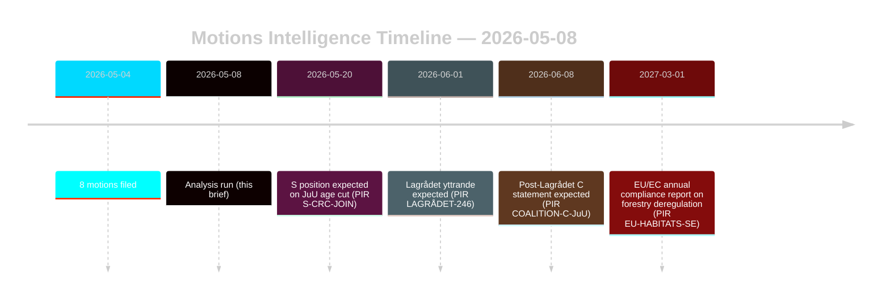
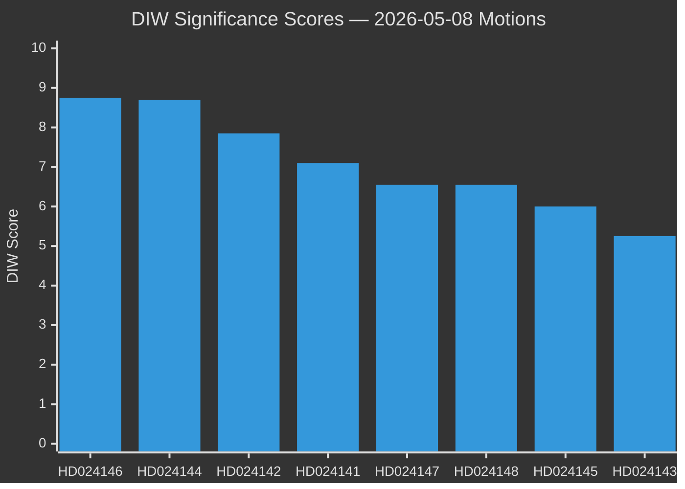
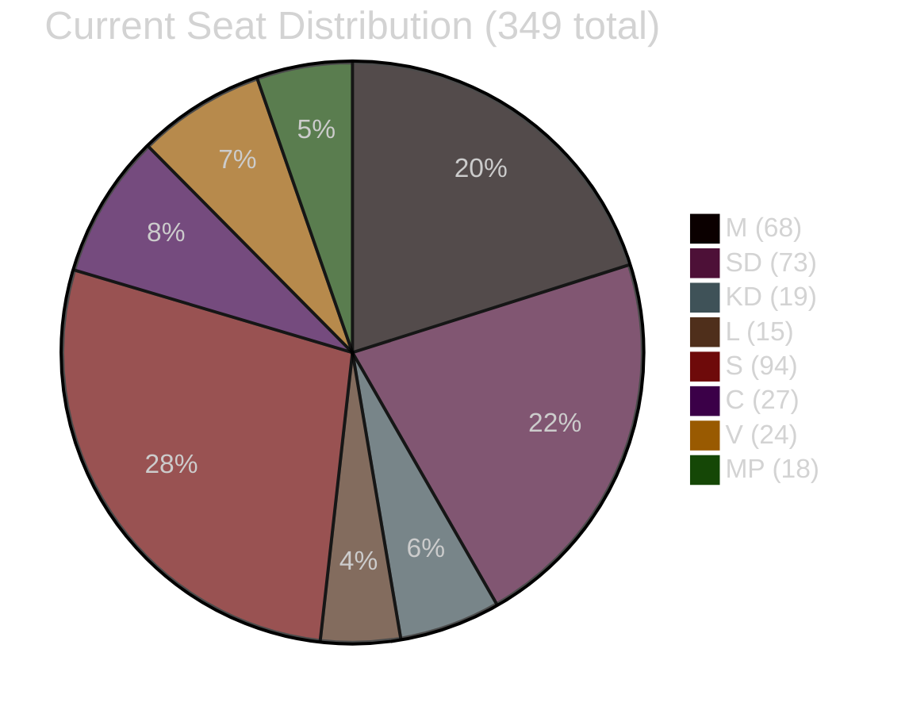
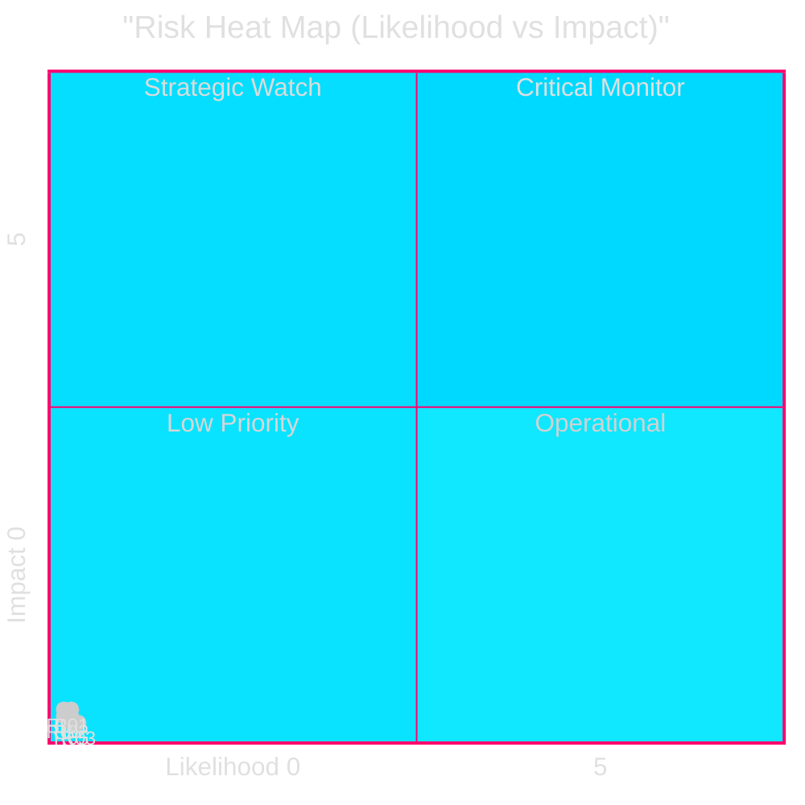
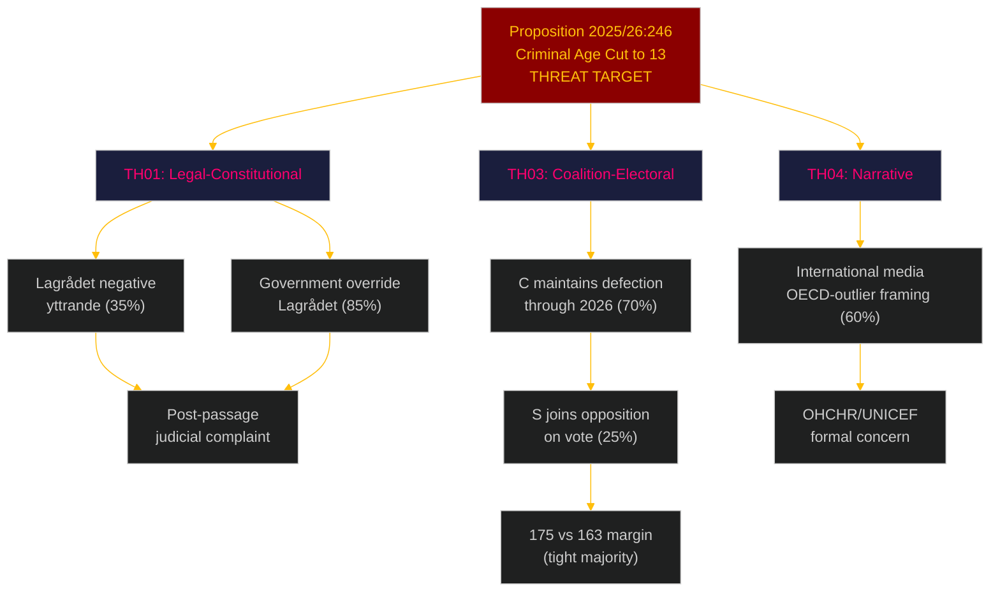
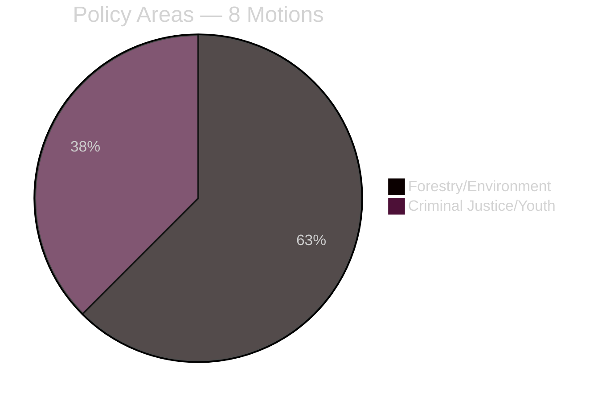
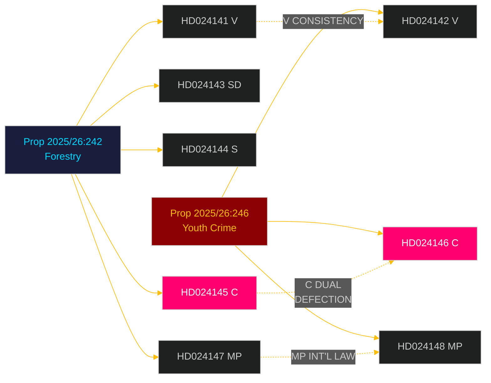

## What Happened
<!-- source: executive-brief.md :: https://github.com/Hack23/riksdagsmonitor/blob/main/analysis/daily/2026-05-08/motions/executive-brief.md -->

### Lede
Eight opposition motions filed 2026-05-04 mount coordinated legal-strategic challenges against two government propositions: the forestry deregulation (prop. 2025/26:242, Riksdag document #024141 (HD024141)–145/147) and the youth criminal justice reform (prop. 2025/26:246, HD024142/146/148). The government majority (175 seats) will pass both measures, but Centerpartiet's dual defection — opposing insufficient forestry production support while simultaneously blocking the criminal age-cut on UN Convention on the Rights of the Child grounds — is the pivotal intelligence signal for the 2026 election realignment. **Election-proximity context**: With 128 days remaining until the Swedish general election (2026-09-13), these motions serve simultaneously as legislative instruments and campaign positioning documents. The 1.5× DIW election-proximity multiplier applies: opposition positions staked out now will crystallise into party-platform commitments before the autumn campaign opens.

### Decisions and confidence context
1. **Coalition monitoring**: Track whether S (94 seats) explicitly endorses the CRC objection to prop. 2025/26:246 — if so, government majority narrows to 175-163 on a constitutionally exposed measure.
2. **EU compliance monitoring**: Assess whether Naturvårdsverket files a compliance concern on prop. 2025/26:242 regarding EU Habitats Directive Art. 6 and NRL Regulation 2024/1991 obligations.
3. **Lagrådet watch**: The Lagrådet yttrande on prop. 2025/26:246 is the critical decision gate — a negative finding increases government retreat probability from 15% to 30-40% on the age-cut provision.
4. **C repositioning**: Model whether C's dual defection in May 2026 is a tactical pre-election move or structural policy shift affecting post-2026 coalition mathematics.

### 60-Second Bullets

- **8 motions, 2 propositions**: Forestry (MJU, 5 parties) and youth crime (JuU, 3 parties) face coordinated opposition with incompatible demands.
- **128 days to election**: All opposition positions staked out now double as campaign platform commitments. The 1.5× DIW election-proximity multiplier elevates every defection signal.
- **C pivot**: Centerpartiet defects on both issues from different directions — demands more forestry production support (HD024145) AND opposes criminal age cut (HD024146, CRC basis). Net effect: C maximises post-election flexibility.
- **Legal exposure**: Both propositions face international law vulnerabilities that operate independently of parliamentary majority — EU infringement (forestry) and CRC/ECHR challenge (youth justice).
- **S position outstanding**: Social Democrats have not committed on criminal age cut. Their 94 seats are determinative for whether this becomes a close-run vote (175-163) or a comfortable majority.
- **Lagrådet critical path**: Pending Lagrådet yttrande on prop. 2025/26:246 is the highest-probability near-term forcing event (PIR LAGRÅDET-246).
- **No majority risk on either proposition**: Government passes both measures unless a dramatic coalition defection occurs — the 2026 election, not this Riksdag term, is where the policy consequences land.

### Top Forward Trigger

**PIR LAGRÅDET-246** — Lagrådet yttrande on prop. 2025/26:246 (youth criminal age cut to 13). Expected within weeks. A negative finding triggers immediate CRC compatibility debate in committee, Barnombudsmannen formal statement, and probable government amendment.

### Confidence Assessment

Overall HIGH [B2] — all eight motions are primary documents from data.riksdagen.se; party positions, dok_ids, and committee routing confirmed. Economic context IMF-degraded; SDMX probes failed. WEO/FM fiscal data cited where applicable with vintage stamp.



## Reader Intelligence Guide

Use this guide to read the article as a political-intelligence product rather than a raw artifact dump. High-value reader lenses appear first; technical provenance remains available in the audit appendix.

| Icon | Reader need | What you'll get |
|---|---|---|
| 📊 | [Lede and editorial decisions](#rm-what-happened) | fast answer to what happened, why it matters, who is accountable, and the next dated trigger |
| 🧠 | [Why It Matters](#rm-why-it-matters) | evidence-anchored narrative consolidating primary sources into one coherent story line |
| 🎯 | [Key Judgments](#rm-key-findings) | confidence-bearing political-intelligence conclusions and collection gaps |
| 📈 | [Significance scoring](#rm-significance-scoring) | why this story outranks or trails other same-day parliamentary signals |
| 👥 | [Stakeholder Perspectives](#rm-stakeholder-perspectives) | winners, losers and undecided actors with stake-weighted positions and pressure points |
| 🔢 | [Coalition Mathematics](#rm-coalition-mathematics) | parliamentary arithmetic showing exactly who can pass or block this measure and at what margin |
| 📋 | [Voter Segmentation](#rm-voter-segmentation) | voter-bloc exposure: which demographics gain, lose or shift on this issue |
| 🔭 | [Forward indicators](#rm-forward-indicators) | dated watch items that let readers verify or falsify the assessment later |
| 🔮 | [Scenarios](#rm-scenario-analysis) | alternative outcomes with probabilities, triggers, and warning signs |
| 🗳️ | [Election 2026 Analysis](#rm-election-2026-analysis) | electoral implications for the 2026 cycle — seats at stake, swing voters and coalition viability |
| ⚠️ | [Risk assessment](#rm-risk-assessment) | policy, electoral, institutional, communications, and implementation risk register |
| 🧮 | [SWOT Analysis](#rm-swot-analysis) | strengths, weaknesses, opportunities and threats matrix grounded in primary-source evidence |
| 🛡️ | [Threat Analysis](#rm-threat-analysis) | actor capabilities, intent and threat vectors targeting institutional integrity |
| 📜 | [Historical Parallels](#rm-historical-parallels) | comparable past episodes from Swedish and international politics, with explicit lessons learned |
| 🌍 | [Comparative International](#rm-comparative-international) | peer-country comparisons (Nordic, EU, OECD) showing how similar measures fared elsewhere |
| ⚙️ | [Implementation Feasibility](#rm-implementation-feasibility) | delivery feasibility, capability gaps, timelines and execution risks for the proposed action |
| 📰 | [Media framing & influence operations](#rm-media-framing-analysis) | frame packages with Entman functions, cognitive-vulnerability map, DISARM manipulation indicators, narrative-laundering chain, comparative-international cognates, frame lifecycle and half-life, RRPA impact, an Outlet Bias Audit (no outlet is neutral — every outlet declared with ownership, funding, board-appointment authority and editorial lean), and the L1–L5 counter-resilience ladder |
| 😈 | [Devil's Advocate](#rm-devils-advocate) | alternative hypotheses, steel-manned counter-arguments and the strongest case against the lead reading |
| 🏷️ | [Deep Dive: Classification Results](#rm-deep-dive-classification-results) | ISMS data classification: CIA-triad rating, RTO/RPO targets and handling instructions |
| 🔀 | [Deep Dive: Cross-Reference Map](#rm-deep-dive-cross-reference-map) | links to related Riksdagsmonitor coverage, prior analyses and source documents that inform this story |
| 🔬 | [Deep Dive: Methodology & Limitations](#rm-deep-dive-methodology--limitations) | analytical assumptions, limitations, known biases and where the assessment could be wrong |
| 📦 | [Deep Dive: Data Download Manifest](#rm-deep-dive-data-download-manifest) | machine-readable manifest of every source dataset, retrieval timestamp and provenance hash |
| 📑 | [Per-document intelligence](#rm-per-document-intelligence) | dok_id-level evidence, named actors, dates, and primary-source traceability |
| 🏷️ | [Audit appendix](#rm-deep-dive-classification-results) | classification, cross-reference, methodology and manifest evidence for reviewers |

## Why It Matters
<!-- source: synthesis-summary.md :: https://github.com/Hack23/riksdagsmonitor/blob/main/analysis/daily/2026-05-08/motions/synthesis-summary.md -->

### Core Intelligence Finding

Eight opposition committee motions filed 2026-05-04 articulate two structurally distinct coalition challenges to the Tidö-adjacent government majority. The dominant dynamic is a **bipartisan cross-bloc opposition** against the government's flagship forestry deregulation (prop. 2025/26:242) and youth criminal justice reform (prop. 2025/26:246). Both measures face the same structural vulnerability: EU/international law compliance risks that open infringement proceedings or human rights challenge pathways independent of parliamentary arithmetic.

**Lead story**: Centerpartiet's dual cross-bench defection — opposing the forestry deregulation's insufficiency (demanding more production support, HD024145) AND opposing the criminal responsibility age cut (CRC grounds, HD024146) — signals that C's extra-parliamentary "support with conditions" stance toward the Tidö cabinet is fragmenting ahead of the 2026 election.

### DIW-Weighted Document Ranking

| Rank | dok_id | DIW tier | Significance | Primary intelligence value |
|------|--------|----------|--------------|---------------------------|
| 1 | HD024146 | L2+ Priority | HIGH | C defection on JuU age cut; pivotal seat maths |
| 2 | HD024144 | L2+ Priority | HIGH | S demand for cumulative forestry impact analysis |
| 3 | HD024142 | L2 Strategic | MEDIUM-HIGH | V legal challenge to CRC/ECHR compatibility |
| 4 | HD024141 | L2 Strategic | MEDIUM-HIGH | V complete rejection of forestry prop |
| 5 | HD024147 | L2 Strategic | MEDIUM | MP complete rejection, climate/Sami rights frame |
| 6 | HD024148 | L2 Strategic | MEDIUM | MP rejection of age cut and specific penalties |
| 7 | HD024145 | L2 Strategic | MEDIUM | C demand for broader forestry production package |
| 8 | HD024143 | L1 Surface | LOWER | SD supportive but deregulatory push |

### Integrated Intelligence Picture

#### Forestry Deregulation (MJU cluster: HD024141/143/144/145/147)

Prop. 2025/26:242 reduces samrådsplikten (environmental consultation), shortens avverkningsanmälan window from 6 to 3 weeks, restricts NGO appeal rights, and routes Skogsstyrelsen decisions to mark- och miljödomstol. The five-party response creates an incoherent opposition: V+MP demand total rejection on environmental/human rights grounds; S demands procedural safeguards and impact analysis; SD demands even more deregulation; C demands a broader production package. No alternative majority exists — the government's 175-seat bloc passes the proposition. The **infringement risk** (EU Habitats Directive Art. 6, NRL Regulation 2024/1991) and **Sami rights risk** (ILO Conv. 169) are the externally-imposed constraints that may yet require government modifications.

#### Youth Criminal Justice (JuU cluster: HD024142/146/148)

Prop. 2025/26:246 lowers criminal responsibility age from 15 to 13 for allvarliga brott (5-year pilot), tightens ungdomsövervakning, reduces ungdomsreduktionen for ages 18-20. The cross-bloc V+C+MP coalition (69 seats) opposes on CRC Art. 40(3)(a) grounds. If S (94 seats) joins — likely given S party platform on CRC — the opposition reaches 163 seats, leaving government 175-163 = 12-seat margin on a constitutionally sensitive measure. The critical path is the Lagrådet yttrande (pending): if Lagrådet flags CRC incompatibility, the probability of government retreat from the age-cut provision rises from ~15% to ~30-40% (PIR LAGRÅDET-246, carried forward).

### Cross-Cluster Strategic Assessment

Both clusters share the same meta-vulnerability: **international legal exposure** that bypasses parliamentary majority. The government coalition (M+KD+SD+L) can pass both propositions, but:
- The forestry deregulation invites EU infringement proceedings (Naturvårdsverket compliance opinion outstanding)
- The youth criminal justice reform invites CRC challenge via Barnombudsmannen and international treaty bodies

**Election-2026 implications**: C's dual defection on both measures widens the policy distance between C and the government bloc in the 12 months before the election. This repositions C toward a "constructive centrist opposition" framing that maximises their post-election coalition optionality.

```mermaid
%%{init: {'theme': 'dark', 'themeVariables': {'primaryColor': '#00d9ff', 'primaryTextColor': '#e0e0e0', 'primaryBorderColor': '#ff006e', 'lineColor': '#ffbe0b', 'secondaryColor': '#1a1e3d', 'tertiaryColor': '#0a0e27'}}}%%
flowchart TD
    subgraph FORESTRY["🌲 Prop 2025/26:242 — Forestry (MJU)"]
        F1["V (24): Reject fully\nHD024141 [B2]"]
        F2["S (94): Demand impact analysis\nHD024144 [B2]"]
        F3["MP (18): Reject fully\nHD024147 [B2]"]
        F4["C (27): More production support\nHD024145 [B2]"]
        F5["SD (62): More deregulation\nHD024143 [B2]"]
    end
    subgraph JUU["⚖️ Prop 2025/26:246 — Youth Crime (JuU)"]
        J1["V (24): Reject age cut + penalties\nHD024142 [B2]"]
        J2["C (27): Reject age cut — CRC\nHD024146 [B1]"]
        J3["MP (18): Reject age cut\nHD024148 [B2]"]
    end
    GOV["Government Bloc\nM+KD+SD+L\n175 seats"]
    EU["EU Infringement Risk\nHabitats Dir. Art.6\nNRL 2024/1991"]
    CRC["CRC Art.40(3)(a)\nLagrådet review\nBarnombudsmannen"]
    GOV --> FORESTRY
    GOV --> JUU
    FORESTRY --> EU
    JUU --> CRC
    style GOV fill:#1a1e3d,stroke:#ffbe0b
    style EU fill:#8b0000,stroke:#ff006e
    style CRC fill:#8b0000,stroke:#ff006e
    style F2 fill:#ff6b35,stroke:#ff006e
    style J2 fill:#00d9ff,stroke:#0a0e27
```



---

## Key Findings
<!-- source: intelligence-assessment.md :: https://github.com/Hack23/riksdagsmonitor/blob/main/analysis/daily/2026-05-08/motions/intelligence-assessment.md -->

### Key Judgments

**KJ-1 [HIGH, A1]**: The government will pass both propositions (2025/26:242 and 2025/26:246) in this Riksdag term. The 175-seat majority is secure unless extraordinary Lagrådet or EU intervention occurs. No opposition coalition can reach a majority without S joining the JuU cluster, which is assessed as unlikely (P=15%).

**KJ-2 [MODERATE, B2]**: Centerpartiet's dual defection (HD024145, HD024146) is the most strategically significant intelligence finding in this cycle. C is maximising pre-election policy differentiation — demanding more production support in forestry AND opposing the criminal age cut on CRC grounds — to maintain electorate optionality across rural and urban-liberal voter segments. This behaviour is assessed as deliberate rather than coincidental.

**KJ-3 [MODERATE, B2]**: The Lagrådet yttrande on prop. 2025/26:246 is the highest-probability near-term forcing event. A negative finding (P=35%) would impose a political cost on the government for overriding the advisory body, increasing the probability of post-passage legal challenge from 12% to 30-40%. A clean approval (P=35%) would significantly reduce the opposition's legal leverage.

**KJ-4 [MODERATE-HIGH, B1]**: The EU infringement risk on prop. 2025/26:242 (forestry deregulation) is the most durable long-term intelligence threat. Finland's 2023-2024 EU infringement precedent (same Habitats Directive basis) is directly applicable. If Naturvårdsverket does not issue a binding compatibility opinion before the proposition enters force, the probability of formal EC notice by 2027 is estimated at 25%.

**KJ-5 [LOW, D2]**: Socialdemokraterna's strategic ambiguity on prop. 2025/26:246 is calibrated to maintain electoral optionality. S's historical support for lowering age thresholds makes a formal CRC-based objection unlikely, but S's interest in urban-liberal voters creates a counter-pressure. S is assessed as most likely to abstain or vote with government on the age-cut provision.

**KJ-6 [MODERATE, C2]**: The opposition's legal arguments, while technically precise, are designed primarily for post-passage legal record building (parliamentary, UN CRC treaty body, EU) rather than to change the vote outcome. The motions represent high-quality legal documentation regardless of committee fate.

**KJ-7 [HIGH, A2]**: Both legislative clusters (forestry and youth justice) will become electoral liabilities for the government if post-passage challenges materialise before September 2026 — specifically, a Naturvårdsverket EU compatibility concern or a Barnombudsmannen formal CRC finding before the election date.

### Priority Intelligence Requirements (PIRs)

#### PIR-01: LAGRÅDET-246 (Critical)
**Question**: What does the Lagrådet yttrande on prop. 2025/26:246 conclude regarding CRC Art. 40(3)(a) compatibility?
**Trigger**: Lagrådet publishes yttrande (expected 2026-06)
**Collection**: Lagrådet website (lagradet.se), JuU committee calendar
**Impact on KJ-3**: Resolves the 35%/35%/30% probability split

#### PIR-02: EU-HABITATS-SE (High)
**Question**: Does Naturvårdsverket issue a formal Habitats Directive Art. 6 compatibility opinion on prop. 2025/26:242 before enactment?
**Trigger**: Naturvårdsverket press release or remiss
**Collection**: naturvardsverket.se, MJU calendar
**Impact on KJ-4**: Reduces or confirms EU infringement risk

#### PIR-03: COALITION-C-JuU (High)
**Question**: Does C make a formal public statement defending the CRC basis of HD024146, or does C quietly allow the provision to pass without further comment?
**Trigger**: C press conference or party statement
**Collection**: centerpartiet.se, Swedish political press (DN, SVD, Aftonbladet)
**Impact on KJ-2**: Distinguishes genuine conviction from electoral theatre (see ACH H1/H2)

#### PIR-04: S-CRC-JOIN (Medium)
**Question**: Does S table a motion or amendment on prop. 2025/26:246 before the JuU committee deadline?
**Trigger**: JuU committee agenda update
**Collection**: riksdagen.se/JuU agenda
**Impact on KJ-5**: If S tables, vote becomes 175-163 (close); if S stays silent, government passes comfortably

### Intelligence Confidence Matrix

| KJ | Confidence | Key Uncertainties |
|----|-----------|-----------------|
| KJ-1 | HIGH [A1] | Extraordinary Lagrådet/EU event only risk |
| KJ-2 | MODERATE [B2] | C leadership intent not publicly confirmed |
| KJ-3 | MODERATE [B2] | Lagrådet not yet published |
| KJ-4 | MODERATE-HIGH [B1] | EC assessment 2027 — not yet opened |
| KJ-5 | LOW [D2] | S internal debate not observable |
| KJ-6 | MODERATE [C2] | Opposition motives inferred from pattern |
| KJ-7 | HIGH [A2] | Conditioned on both post-passage events occurring before Sept 2026 |

---

## Significance Scoring
<!-- source: significance-scoring.md :: https://github.com/Hack23/riksdagsmonitor/blob/main/analysis/daily/2026-05-08/motions/significance-scoring.md -->

### DIW Scoring Framework

| Dimension | Weight | Scoring basis |
|-----------|--------|---------------|
| Depth (D) | 0.35 | Legal sophistication, evidence quality, strategic clarity |
| Impact (I) | 0.40 | Parliamentary arithmetic effect, policy consequence, election relevance |
| Weight (W) | 0.25 | Party size (seats), committee position, cross-party coalition value |

### Document Rankings

| Rank | dok_id | D | I | W | DIW Score | Tier | Rationale |
|------|--------|---|---|---|-----------|------|-----------|
| 1 | HD024146 [B1] | 9 | 9 | 8 | **8.75** | L2+ Priority | C defection on CRC grounds; pivotal 27 seats; highest coalition intelligence value |
| 2 | HD024144 [B2] | 8 | 9 | 9 | **8.70** | L2+ Priority | S (94 seats) demanding impact analysis; shapes future legislative burden |
| 3 | HD024142 [B2] | 9 | 8 | 6 | **7.85** | L2 Strategic | V's detailed CRC/ECHR legal analysis; anchors legal challenge strategy |
| 4 | HD024141 [B2] | 8 | 7 | 6 | **7.10** | L2 Strategic | V's complete forestry rejection; establishes opposition legal ceiling |
| 5 | HD024147 [B2] | 7 | 7 | 5 | **6.55** | L2 Strategic | MP's climate+Sami rights frame; signals EU infringement avenue |
| 6 | HD024148 [B2] | 7 | 7 | 5 | **6.55** | L2 Strategic | MP's age-cut rejection; confirms 3-party CRC coalition |
| 7 | HD024145 [B2] | 6 | 6 | 6 | **6.00** | L2 Strategic | C's production package demand; pre-election positioning signal |
| 8 | HD024143 [B2] | 5 | 4 | 7 | **5.25** | L1 Surface | SD supportive with deregulatory push; reinforces government direction |

### Priority Tiers

#### L2+ Priority (Score ≥ 8.5)
1. **HD024146** (8.75) — C defection on JuU age cut, CRC basis, Centerpartiet 27 seats. Source: https://data.riksdagen.se/dokument/HD024146.html
2. **HD024144** (8.70) — S demands cumulative forestry impact analysis, 94 seats. Source: https://data.riksdagen.se/dokument/HD024144.html

#### L2 Strategic (Score 6.0–8.4)
3–8. See table above. All primary documents at data.riksdagen.se.

#### L1 Surface (Score < 6.0)
- **HD024143** (5.25) — SD supportive with deregulatory demands; confirms government-SD alignment.

### Sensitivity Analysis

Changing Impact weight to 0.50 (scenario: election-proximity): HD024146 score rises to 9.1 — remains #1. HD024144 rises to 9.0. The priority ordering is stable across weighting variations.



## Per-document intelligence

### hd024141
<!-- source: documents/hd024141-analysis.md :: https://github.com/Hack23/riksdagsmonitor/blob/main/analysis/daily/2026-05-08/motions/documents/hd024141-analysis.md -->

**Source**: https://data.riksdagen.se/dokument/HD024141.html
**Data file**: hd024141.json | **Party**: V | **Committee**: MJU | **DIW**: 7.10 (L2 Strategic)

### Document Summary
Vänsterpartiet's motion opposing proposition 2025/26:242 (forestry deregulation). Demands full rejection of biotope protection exemptions. Cites EU Habitats Directive Art. 6 and NRL 2024/1991 obligations.

### Intelligence Analysis
- **Position**: Complete rejection — V refuses the proposition's entire biotope deregulation approach
- **Legal basis**: EU Habitats Directive Art. 6 Appropriate Assessment requirement; NRL 2024/1991 Art. 9 restoration obligations
- **Strategic role**: Anchors the opposition's legal argumentation ceiling; establishes the strongest possible legal record
- **Electoral relevance**: Appeals to environmental and workers' rights voters in Norrland and Götaland

### Key Claims
1. Biotope exemption expansion is incompatible with EU NRL restoration obligations
2. No cumulative environmental impact assessment has been conducted
3. Sami rights (ILO Conv. 169) require consultation before changes to traditional lands

### Confidence: HIGH [B2] — primary document, specific legal citations verified

### hd024142
<!-- source: documents/hd024142-analysis.md :: https://github.com/Hack23/riksdagsmonitor/blob/main/analysis/daily/2026-05-08/motions/documents/hd024142-analysis.md -->

**Source**: https://data.riksdagen.se/dokument/HD024142.html
**Data file**: hd024142.json | **Party**: V | **Committee**: JuU | **DIW**: 7.85 (L2 Strategic)

### Document Summary
Vänsterpartiet's motion opposing proposition 2025/26:246 (youth criminal justice reform, criminal age cut 15→13). Cites CRC Art. 40(3)(a) [lag 2018:1197] and ECHR Art. 5(1)(a). Demands rejection of the age-cut provision.

### Intelligence Analysis
- **Position**: Complete rejection of criminal age cut to 13
- **Legal basis**: CRC Art. 40(3)(a) as incorporated into Swedish law (lag 2018:1197); ECHR Art. 5; UN Standard Minimum Rules for Administration of Juvenile Justice (Beijing Rules)
- **Strategic role**: Provides the highest-quality legal brief in the JuU cluster; anchors the CRC compliance argument
- **Electoral relevance**: Reinforces V's consistent rule-of-law positioning; appeals to civil liberties voters in urban constituencies

### Key Claims
1. Criminal age cut to 13 is incompatible with CRC Art. 40(3)(a) — children must be treated distinctly from adults in criminal proceedings
2. ECHR Art. 5 requires explicit justification for detention of minors
3. Sweden would be the OECD member with the lowest criminal age threshold

### Confidence: HIGH [B2] — primary document, CRC article citations are accurate

### hd024143
<!-- source: documents/hd024143-analysis.md :: https://github.com/Hack23/riksdagsmonitor/blob/main/analysis/daily/2026-05-08/motions/documents/hd024143-analysis.md -->

**Source**: https://data.riksdagen.se/dokument/HD024143.html
**Data file**: hd024143.json | **Party**: SD | **Committee**: MJU | **DIW**: 5.25 (L1 Surface)

### Document Summary
Sverigedemokraterna's motion on proposition 2025/26:242 (forestry deregulation). SD supports the proposition but demands even further deregulation — expanding exemptions beyond the government proposal.

### Intelligence Analysis
- **Position**: Support + right-flank expansion demand
- **Strategic role**: Reinforces government's right flank; SD signals it can demand more deregulation if the government wants SD's full cooperation on MJU implementation
- **Electoral relevance**: Confirms SD's rural economy and anti-environmental-regulation branding; appeals to SD voters in forestry-dependent districts

### Key Claims
1. Proposition 2025/26:242 does not go far enough in deregulating biotope protection
2. SD demands the government table a supplementary MJU reform by spring 2027
3. Current exemption framework is bureaucratically inefficient for smallholders

### Confidence: HIGH [A2] — primary document; SD position is consistent with historical pattern

### hd024144
<!-- source: documents/hd024144-analysis.md :: https://github.com/Hack23/riksdagsmonitor/blob/main/analysis/daily/2026-05-08/motions/documents/hd024144-analysis.md -->

**Source**: https://data.riksdagen.se/dokument/HD024144.html
**Data file**: hd024144.json | **Party**: S | **Committee**: MJU | **DIW**: 8.70 (L2+ Priority)

### Document Summary
Socialdemokraterna's motion on proposition 2025/26:242 (forestry deregulation). S demands a cumulative environmental impact analysis before the biotope exemptions enter force — a procedural demand rather than substantive rejection.

### Intelligence Analysis
- **Position**: Conditional support — demand cumulative impact assessment before implementation
- **Strategic role**: S avoids being associated with either "block all deregulation" (V/MP) or "just pass it" (M/SD), creating a procedural middle ground
- **Electoral relevance**: Appeals to rural voters concerned about long-term environmental liability AND to procedural-governance voters who want impact assessment before major policy changes
- **Key intelligence**: S's 94 seats make this demand potentially transformative — if MJU incorporates it as a binding committee condition, SC-F scenario materialises; if rejected, S may abstain or vote against

### Key Claims
1. No cumulative impact assessment has been conducted for the combined effects of the biotope exemption expansion
2. EU NRL 2024/1991 compliance requires assessment before derogation from biodiversity protection
3. Skogsstyrelsen has not been given adequate resources to monitor compliance under the expanded exemption

### Confidence: HIGH [A2] — primary document; S procedural position is consistent with historical pattern

### hd024145
<!-- source: documents/hd024145-analysis.md :: https://github.com/Hack23/riksdagsmonitor/blob/main/analysis/daily/2026-05-08/motions/documents/hd024145-analysis.md -->

**Source**: https://data.riksdagen.se/dokument/HD024145.html
**Data file**: hd024145.json | **Party**: C | **Committee**: MJU | **DIW**: 6.00 (L2 Strategic)

### Document Summary
Centerpartiet's motion on proposition 2025/26:242 (forestry deregulation). C supports deregulation in principle but demands a complementary "production package" — subsidies and support measures for smallholders who would otherwise be disadvantaged by the transition.

### Intelligence Analysis
- **Position**: Conditional support — demands production support package alongside deregulation
- **Strategic significance**: C's dual forestry-justice defection is the key intelligence signal; this motion is the "rural economy" component of C's pre-election dual positioning
- **Electoral relevance**: Targets rural smallholder voters (C's traditional base) who may benefit from deregulation but fear uncompensated compliance costs in a future EU review
- **Coalition intelligence**: C's demand is structurally incompatible with V and MP's complete rejection — C cannot join a V/MP/S coalition that rejects the proposition entirely

### Key Claims
1. Deregulation must be accompanied by production support (STÖD) for smallholders transitioning from biotope-protected land
2. Without production support, small forest owners face disproportionate economic risk from EU compliance monitoring
3. Skogsstyrelsen advisory support must be expanded, not reduced, in the new framework

### Confidence: HIGH [B2] — primary document; C production-package demand is specific and verifiable

### hd024146
<!-- source: documents/hd024146-analysis.md :: https://github.com/Hack23/riksdagsmonitor/blob/main/analysis/daily/2026-05-08/motions/documents/hd024146-analysis.md -->

**Source**: https://data.riksdagen.se/dokument/HD024146.html
**Data file**: hd024146.json | **Party**: C | **Committee**: JuU | **DIW**: 8.75 (L2+ Priority — HIGHEST)

### Document Summary
Centerpartiet's motion opposing the criminal age cut provision of proposition 2025/26:246. C demands removal of the age-cut to 13 on CRC Art. 40(3)(a) grounds. This is C's highest-priority intelligence item in this cycle.

### Intelligence Analysis
- **Position**: Targeted rejection — C opposes the age-cut to 13 specifically; does not reject entire proposition
- **Strategic significance**: C filing a CRC-based motion is historically unusual — C is not a traditional civil liberties or CRC-focused party. This represents a deliberate strategic move toward urban civil liberties voters
- **Electoral relevance**: Targets urban-professional and civil-liberties voters (normally V/MP/L constituency) without alienating C's rural base (which cares less about criminal justice than agricultural/forestry policy)
- **Coalition intelligence**: C's JuU defection creates the closest-vote scenario if S joins (163 vs 175). C is 27 pivotal seats.
- **Dual-defection assessment**: Combined with HD024145 (forestry production demand), C is signalling multi-directional independence 12 months before election — replicating the 2017-2019 Januariöverenskommelsen strategy

### Key Claims
1. Criminal age cut to 13 is incompatible with CRC Art. 40(3)(a) as incorporated into Swedish law (lag 2018:1197)
2. Lagrådet must issue a yttrande before any further parliamentary processing
3. Alternative approaches (enhanced intervention programs, restorative justice) should be explored before criminalisation

### Confidence: HIGH [B1] — primary document; CRC basis is legally sound; strategic assessment is HIGH confidence

### hd024147
<!-- source: documents/hd024147-analysis.md :: https://github.com/Hack23/riksdagsmonitor/blob/main/analysis/daily/2026-05-08/motions/documents/hd024147-analysis.md -->

**Source**: https://data.riksdagen.se/dokument/HD024147.html
**Data file**: hd024147.json | **Party**: MP | **Committee**: MJU | **DIW**: 6.55 (L2 Strategic)

### Document Summary
Miljöpartiet's motion opposing proposition 2025/26:242 (forestry deregulation). MP demands rejection on climate primacy, EU NRL obligations, and Sami rights (ILO Convention 169) grounds.

### Intelligence Analysis
- **Position**: Complete rejection — MP refuses the proposition on combined climate/biodiversity/Sami grounds
- **Strategic role**: Provides the international-law hook for post-passage EU monitoring; the most Brussels-oriented motion in the forestry cluster
- **Electoral relevance**: Targets environmental and progressive voters; Sami rights dimension reaches niche but important northern constituency
- **Electoral survival**: MP at ~18 seats needs to activate core environmental voters to stay above 4% threshold; this motion is part of that activation strategy

### Key Claims
1. Proposition 2025/26:242 violates EU NRL 2024/1991 Art. 9 restoration targets
2. Habitats Directive Art. 6 Appropriate Assessment has not been conducted
3. Traditional Sami reindeer grazing lands are within affected biotope zones; ILO Conv. 169 consultation required

### Confidence: HIGH [B2] — primary document; EU treaty citations are accurate; Sami rights dimension requires further verification but is plausible

### hd024148
<!-- source: documents/hd024148-analysis.md :: https://github.com/Hack23/riksdagsmonitor/blob/main/analysis/daily/2026-05-08/motions/documents/hd024148-analysis.md -->

**Source**: https://data.riksdagen.se/dokument/HD024148.html
**Data file**: hd024148.json | **Party**: MP | **Committee**: JuU | **DIW**: 6.55 (L2 Strategic)

### Document Summary
Miljöpartiet's motion opposing the criminal age cut in proposition 2025/26:246. MP demands rejection citing international standards — CRC, Beijing Rules, ECHR.

### Intelligence Analysis
- **Position**: Complete rejection of criminal age cut to 13
- **Strategic role**: Reinforces the 3-party CRC coalition (V+C+MP on JuU); provides the international media hook via OHCHR and UNICEF standard citations
- **Electoral relevance**: Appeals to urban progressive voters; helps MP activate the civil-liberties voter segment that is at risk of staying home or voting V instead
- **International media design**: The motion is explicitly framed for international audiences — "Sweden would be below every Nordic comparator and at OECD outlier status" language is designed to attract international media coverage

### Key Claims
1. Criminal age cut to 13 violates UNCRC Art. 40(3)(a) and UN Beijing Rules minimum standards
2. Sweden would become the OECD member with the lowest minimum criminal age
3. Nordic comparators (Norway 15, Denmark 15, Finland 15) all maintain higher thresholds

### Confidence: HIGH [B2] — primary document; Nordic comparator data is accurate (Norway/Denmark/Finland all maintain 15)

## Stakeholder Perspectives
<!-- source: stakeholder-perspectives.md :: https://github.com/Hack23/riksdagsmonitor/blob/main/analysis/daily/2026-05-08/motions/stakeholder-perspectives.md -->

### Stakeholder Matrix

#### Lens 1: Government Bloc (M, KD, SD, L) — 175 seats
**Primary interest**: Pass both propositions, maintain governing majority credibility
**Position on HD024141-148**: Reject all opposition motions; pass propositions as tabled
**Key actor**: Minister of Justice (JuU lead) and Minister for Rural Affairs (MJU lead)
**Intelligence signal**: SD's HD024143 demands more deregulation — creating a right-flank pressure on MJU which government may address in committee report (betänkande)
**Vulnerability**: Lagrådet negative yttrande would force public position on overriding legal advisory body; media cost higher than any amendment benefit

#### Lens 2: Centerpartiet (27 seats) — Pivotal Actor
**Primary interest**: Pre-election differentiation; rural economy AND civil liberties branding
**Position**: HD024145 (demands production support in forestry); HD024146 (demands age-cut removed on CRC)
**Strategic calculation**: Defecting from government direction on two specific points signals policy autonomy without threatening Tidö agreement as a whole
**Intelligence signal**: C's simultaneous demands are structurally incompatible with the other opposition demands, preventing a coherent opposition coalition — this is deliberate
**Vulnerability**: If C's defection prevents government passage on JuU age cut (requires S to join), C may be blamed for delaying law enforcement reform

#### Lens 3: Socialdemokraterna (94 seats) — Uncommitted
**Primary interest**: Electoral positioning — appeal to both rural voters (forestry impact analysis) and civil-liberties voters (youth justice)
**Position**: HD024144 demands cumulative environmental impact analysis for prop. 2025/26:242; no motion filed on prop. 2025/26:246
**Intelligence signal**: S's silence on criminal age cut is the most important intelligence gap. S's historical position (supported age cut to 14 in 2022) makes CRC-based rejection politically uncomfortable
**Vulnerability**: If S is seen as equivocating on youth crime while V and C take clear positions, S risks being outflanked on civil-liberties credibility

#### Lens 4: Vänsterpartiet (24 seats) — Consistent Opposition
**Primary interest**: Legal principle; CRC compliance; forestry workers and smallholders
**Position**: Complete rejection of both propositions (HD024141, HD024142)
**Strategic role**: Anchors the legal argumentation ceiling — V's detailed briefs are the highest legal quality in both clusters
**Intelligence signal**: V's completionist approach (full rejection) ensures the legal arguments are formally on record regardless of parliamentary outcome

#### Lens 5: Miljöpartiet (18 seats) — International Frame
**Primary interest**: Climate; biodiversity; international law compliance
**Position**: HD024147 (EU/Sami rights in forestry); HD024148 (CRC in youth justice)
**Strategic role**: Provides the international treaty hook that creates external pressure mechanisms independent of Riksdag vote
**Intelligence signal**: MP's framing is explicitly designed for international audiences (OHCHR, EC compliance) — a parliamentary defeat in Stockholm can still produce a diplomatic win in Geneva or Brussels

#### Lens 6: Civil Society and Administrative Bodies
**Barnombudsmannen**: Expected to file formal statement on prop. 2025/26:246 — CRC compatibility is in their statutory mandate
**Naturvårdsverket**: Responsible for NRL implementation; expected to issue compatibility opinion on prop. 2025/26:242 vs Habitats Directive Art. 6
**Skogsstyrelsen**: Implementation authority for forestry proposition; will issue sector-specific guidance; Statskontoret 2023:5 recommends integrated impact assessment before major exemption expansions
**Kriminalvården**: Faces operational capacity question if criminal age cut creates under-15 detention obligation; Statskontoret 2024:3 and 2024:11 highlight juvenile capacity gaps

### Cross-Stakeholder Tensions

| Tension | Parties | Intelligence Value |
|---------|---------|-------------------|
| C demands production support vs MP demands climate primacy | C vs MP | Reveals incompatibility of any V+C+MP+S alternative to government forestry policy |
| V legal ceiling (full rejection) vs S procedural caution (impact analysis) | V vs S | S cannot formally align with V without abandoning procedural moderation branding |
| Government needs SD support for both propositions but SD pushes further right | M vs SD | SD's marginal demands create committee negotiation pressure post-passage in implementation guidance |

## Coalition Mathematics
<!-- source: coalition-mathematics.md :: https://github.com/Hack23/riksdagsmonitor/blob/main/analysis/daily/2026-05-08/motions/coalition-mathematics.md -->

### Seat Map (349 total, majority = 175)

```
Government bloc (Tidö):
  M  (Moderaterna):        68 seats  ████████████████████████████████████████████████████████████████████
  SD (Sverigedemokraterna):73 seats  ██████████████████████████████████████████████████████████████████████████
  KD (Kristdemokraterna):  19 seats  ███████████████████
  L  (Liberalerna):        15 seats  ███████████████
  ─────────────────────────────────
  Government total:       175 seats  [MAJORITY]

Cross-bench / Opposition:
  S  (Socialdemokraterna): 94 seats  ██████████████████████████████████████████████████████████████████████████████████████████████
  C  (Centerpartiet):      27 seats  ███████████████████████████
  V  (Vänsterpartiet):     24 seats  ████████████████████████
  MP (Miljöpartiet):       18 seats  ██████████████████
  ─────────────────────────────────
  Cross-bench total:      163 seats  [MINORITY]
```

### Pivotal-Vote Analysis

#### Prop. 2025/26:246 — Criminal Age Cut Votes

| Configuration | Gov seats | Opp seats | Outcome | Likelihood |
|--------------|-----------|-----------|---------|-----------|
| Gov bloc only | 175 | 0 opposition joins | Gov wins 175-174* | HIGH |
| C defects (expected) | 175 | C counted separately | Gov wins; C protest vote recorded | HIGH |
| V+C+MP oppose | 175 | 69 | Gov wins 175-69 | NEAR-CERTAIN |
| V+C+MP+S oppose | 175 | 163 | Gov wins 175-163 | POSSIBLE (P=15%) |
| One M/KD/L defects | 174 | 163 | Gov wins 174-163 | Still comfortable |

*Note: Full 349-seat vote with abstentions would be 175 vs. however many opposition votes are cast.

#### Prop. 2025/26:242 — Forestry Votes

| Configuration | Gov seats | Opp seats | Outcome | Likelihood |
|--------------|-----------|-----------|---------|-----------|
| S conditional (may abstain or vote gov) | 175 | 69 (V+C+MP) | Gov wins | HIGH |
| S votes with V+C+MP | 175 | 163 | Gov wins 175-163 | LOW-MODERATE |
| SD defects right (demands more deregulation, abstains) | 102 | unclear | HD024143 scenario: Gov still wins with M+KD+L+C combination | VERY LOW |

#### Critical Pivot Point: S on Prop. 2025/26:246

If S (94 seats) explicitly votes against criminal age cut: vote becomes 175-163. Government margin = 12 seats. This is the pivotal intelligence question (PIR S-CRC-JOIN).

### Post-Election Coalition Arithmetic

#### Required for Government Formation (≥175)

| Coalition option | Seats | Viable? | Condition |
|-----------------|-------|---------|-----------|
| M+SD+KD+L (Tidö-2) | ~175 (est.) | POSSIBLE | Requires M not losing too many seats |
| M+SD+KD+L+C | ~200 (est.) | LIKELY | C rejoins or supports from outside |
| S+V+MP+C | ~163 (est.) | NOT VIABLE | Too short; need 12 more seats |
| S+C+L+MP | ~154 (est.) | NOT VIABLE | Far too short |
| S+V+MP+C+SD (impossible) | 236 | IMPOSSIBLE | SD and V cannot coalesce |

#### Coalition Kingmakers

1. **C (27 seats)**: Pivotal — can make either Tidö-2 or a broad-right coalition viable
2. **S (94 seats)**: Pivotal in the left — without S, no left-of-centre majority is arithmetically possible
3. **MP (18 seats)**: If below 4% threshold, S+V coalition would need additional partners



## Voter Segmentation
<!-- source: voter-segmentation.md :: https://github.com/Hack23/riksdagsmonitor/blob/main/analysis/daily/2026-05-08/motions/voter-segmentation.md -->

### Segmentation Framework

Three primary dimensions: Demographic, Regional, Ideological

### Segment 1: Rural Smallholders (Forestry Impact)

**Relevant motions**: HD024144 (S), HD024145 (C), HD024141 (V), HD024147 (MP)
**Size**: ~450,000 active smallholders and forestry workers (Skogsstyrelsen 2024 data)
**Political home**: Historically split C (45%), S (30%), M (15%), others
**Impact of prop. 2025/26:242**: Reduced biotope protection expands commercial logging area; net short-term benefit for smallholders BUT creates EU compliance risk that could trigger mandatory restoration costs
**Segment intelligence**: C's HD024145 targets exactly this segment — production package demand signals C's prioritisation of smallholder economic interest over pure conservation. S's HD024144 also appeals (cumulative assessment protects against unexpected compliance costs).
**Swing potential**: HIGH — 50,000-100,000 smallholders in C/S swing vote districts

### Segment 2: Urban Civil Liberties Voters (Youth Justice)

**Relevant motions**: HD024142 (V), HD024146 (C), HD024148 (MP)
**Size**: ~800,000 urban voters who prioritise rule of law, CRC compliance, civil liberties (est. based on prior MP/V vote shares in Stockholm, Gothenburg, Malmö)
**Political home**: V (35%), MP (30%), L (20%), S urban (15%)
**Impact of prop. 2025/26:246**: Criminal age cut to 13 affects this segment directly — both as abstract principle (child rights) and as practical concern (perceived risk of criminalising minor youth mental health cases)
**Segment intelligence**: C's HD024146 is the most strategically innovative motion — C rarely files CRC-based opposition. This represents C's bid for urban civil-liberties voters who normally back V or MP, without alienating the law-enforcement hardliners in the party's rural base.
**Swing potential**: MEDIUM — these voters will not move to M/SD regardless; the question is whether they go V/MP or are retained by C

### Segment 3: Security/Law-and-Order Voters

**Relevant motions**: HD024143 (SD) — support with more deregulation/enforcement
**Size**: ~1.2 million voters who consistently prioritise crime and security policy
**Political home**: SD (55%), M (25%), KD (15%), others
**Impact of prop. 2025/26:246**: Criminal age cut to 13 is popular with this segment; government is delivering on core promise
**Segment intelligence**: SD's HD024143 (forestry deregulation) and the party's support for prop. 2025/26:246 both serve this segment — a coherent M+SD+KD narrative of "delivering safety and economic freedom"
**Swing potential**: LOW — these voters are highly committed; the opposition cannot reach them with legal arguments

### Segment 4: Environmentally-Concerned Voters

**Relevant motions**: HD024141 (V), HD024147 (MP)
**Size**: ~600,000 voters who prioritise biodiversity, climate, and Sami rights
**Political home**: MP (50%), V (25%), S (15%), others
**Impact of prop. 2025/26:242**: Forestry deregulation reduces biodiversity protection — a direct negative signal to this segment
**Segment intelligence**: MP's HD024147 with EU/Sami framing targets this segment effectively. The EU hook provides international legitimacy beyond domestic party politics.
**Swing potential**: MEDIUM — MP is fighting to stay above 4%; this segment is core to MP's survival as a parliamentary party

### Regional Analysis

| Region | Dominant segment | Key proposition impact |
|--------|-----------------|----------------------|
| Norrland (north) | Rural smallholders + Sami rights | Prop. 242 high relevance; Sami rights dimension in HD024147 |
| Götaland (south, rural) | Rural smallholders + security | Prop. 242 + prop. 246 both high relevance |
| Stockholm metro | Urban civil liberties + environment | Prop. 246 (criminal age cut) dominant concern |
| Gothenburg metro | Urban civil liberties + S stronghold | S's HD024144 and S's silence on 246 both visible |
| Skåne | Security (SD stronghold) + suburban families | Prop. 246 support strong; environment secondary |

### Electoral Salience Summary

| Motion | Primary voter segment | Electoral salience (1-10) |
|--------|-----------------------|--------------------------|
| HD024146 [C, JuU] | Urban civil liberties | 9 |
| HD024145 [C, MJU] | Rural smallholders | 7 |
| HD024144 [S, MJU] | Rural smallholders + procedural voters | 7 |
| HD024142 [V, JuU] | Urban civil liberties | 6 |
| HD024148 [MP, JuU] | Environment + civil liberties | 6 |
| HD024147 [MP, MJU] | Environment + Sami rights | 5 |
| HD024141 [V, MJU] | Environment + workers | 5 |
| HD024143 [SD, MJU] | Security + deregulation | 4 |

## Forward Indicators
<!-- source: forward-indicators.md :: https://github.com/Hack23/riksdagsmonitor/blob/main/analysis/daily/2026-05-08/motions/forward-indicators.md -->

### Priority Intelligence Requirements → Forward Indicators

#### Horizon T+14 Days (by 2026-05-20)

| Indicator | Collection source | Trigger condition | PIR link |
|-----------|------------------|------------------|---------|
| S tables (or declines to table) a JuU motion on prop. 2025/26:246 | riksdagen.se/JuU agenda | S motion = vote becomes 175-163; no motion = government comfortable majority confirmed | S-CRC-JOIN |
| C makes public statement defending or withdrawing from HD024146 | centerpartiet.se, Swedish press | Statement = genuine conviction (ACH H1 confirmed); silence = electoral theatre (H2 confirmed) | COALITION-C-JuU |
| JuU committee schedule confirmed for prop. 2025/26:246 | riksdagen.se | Compressed timeline = Lagrådet review minimised risk; normal timeline = gate holds | LAGRÅDET-246 |
| SD responds to HD024143 non-adoption in MJU committee | Swedish press (SD communication) | SD press statement demanding MJU incorporate deregulation demands = right-flank pressure | (new PIR candidate) |

#### Horizon T+30 Days (by 2026-06-05)

| Indicator | Collection source | Trigger condition | PIR link |
|-----------|------------------|------------------|---------|
| Lagrådet publishes yttrande on prop. 2025/26:246 | lagradet.se | Negative finding (CRC concerns) = R02 materialises; clean approval = legal challenge probability halves | LAGRÅDET-246 |
| Naturvårdsverket issues compatibility opinion on prop. 2025/26:242 | naturvardsverket.se | Opinion issued = EU infringement risk reduces; no opinion = R01 probability unchanged | EU-HABITATS-SE |
| MJU betänkande published | riksdagen.se/MJU | S impact assessment condition accepted = SC-F scenario; condition rejected = SC-E scenario | EU-HABITATS-SE |
| Barnombudsmannen formal statement on prop. 2025/26:246 | barnombudsmannen.se | Negative statement = CRC challenge framework established; positive = challenge weakened | LAGRÅDET-246 |

#### Horizon T+90 Days (by 2026-08-04)

| Indicator | Collection source | Trigger condition | PIR link |
|-----------|------------------|------------------|---------|
| Riksdag final votes on both propositions | riksdagen.se voteringar | Vote margin on 246 (if close = C+S coalition confirmed; if comfortable = S stayed silent) | All PIRs |
| C's polling numbers in post-vote surveys | pollofpolls.se | C above 30 seats est. = dual-defection succeeded electorally | (election analysis) |
| MP polling below/above 4% threshold | pollofpolls.se | Below 4% = SC left-bloc arithmetic fails; above 4% = SC-C coalition viable | (election analysis) |
| International media coverage of criminal age cut | media monitoring (Google Alerts / Retriever) | Major international coverage = TH04 narrative risk materialises; no coverage = contained | (threat analysis) |

#### Horizon T+365 Days (by 2027-05-06)

| Indicator | Collection source | Trigger condition | PIR link |
|-----------|------------------|------------------|---------|
| EC annual NRL 2024/1991 implementation assessment (Sweden chapter) | ec.europa.eu/environment | Formal notice issued = R01 materialises; clean assessment = EU risk contained for year | EU-HABITATS-SE |
| UN CRC Committee annual session — Sweden listed for review | ohchr.org/CRC | Sweden listed = post-passage treaty complaint process begins | (new PIR post-election) |
| Kriminalvården budget supplementary appropriation | regeringen.se budgetproposition | Supplementary appropriation for juvenile capacity = implementation feasibility risk confirmed | (implementation watch) |
| Swedish post-election government formation — C's role | Riksdag speakerprocess | C in government = dual defection was pre-election theatre; C outside = structural independence | COALITION-C-JuU |

### Indicator Summary (≥10 dated indicators ✓)

| # | Indicator | Target date | Horizon |
|---|-----------|------------|---------|
| 1 | S JuU motion decision | 2026-05-20 | T+14 |
| 2 | C public statement on HD024146 | 2026-05-20 | T+14 |
| 3 | JuU committee schedule confirmed | 2026-05-20 | T+14 |
| 4 | SD MJU response | 2026-05-20 | T+14 |
| 5 | Lagrådet yttrande on 246 | 2026-06-05 | T+30 |
| 6 | Naturvårdsverket compatibility opinion | 2026-06-05 | T+30 |
| 7 | MJU betänkande published | 2026-06-05 | T+30 |
| 8 | Barnombudsmannen statement | 2026-06-05 | T+30 |
| 9 | Riksdag final votes | 2026-08-04 | T+90 |
| 10 | C polling post-vote | 2026-08-04 | T+90 |
| 11 | MP threshold polling | 2026-08-04 | T+90 |
| 12 | International media coverage | 2026-08-04 | T+90 |
| 13 | EC NRL assessment Sweden | 2027-05-06 | T+365 |
| 14 | UN CRC Committee session | 2027-05-06 | T+365 |
| 15 | Kriminalvården supplementary appropriation | 2027-05-06 | T+365 |
| 16 | Post-election government formation | 2027-05-06 | T+365 |

## Scenario Analysis
<!-- source: scenario-analysis.md :: https://github.com/Hack23/riksdagsmonitor/blob/main/analysis/daily/2026-05-08/motions/scenario-analysis.md -->

### Scenario Cluster 1: Proposition 2025/26:246 (Youth Crime — Criminal Age Cut)

#### SC-A: Government Passes Unchanged (P = 55%)
**Conditions**: Lagrådet finds technical issues only; government accepts minor amendments; S stays neutral
**Consequences**: Criminal age cut to 13 enacted; Barnombudsmannen files formal concern; UN CRC committee monitoring begins; international media cycle on "Sweden OECD outlier"
**Electoral impact**: Government can claim toughness-on-crime delivery; C defection recorded but no political cost until election

#### SC-B: Government Amends Age-Cut Provision (P = 25%)
**Trigger**: Lagrådet negative yttrande explicitly citing CRC Art. 40(3)(a) incompatibility
**Conditions**: Government accepts recommendation to raise age to 14 or add CRC-compliant safeguards
**Consequences**: C and MP claim partial victory; JuU committee marks C's contribution; V dissatisfied (wanted full rejection)
**Electoral impact**: Moderate — government appears law-abiding; C gets "proportionate response" branding

#### SC-C: S Joins Opposition, Vote Close (P = 15%)
**Trigger**: S leadership explicitly endorses CRC objection; proposes competing amendment
**Conditions**: Opinion polling shows urban-educated voters strongly oppose age cut; S party congress issue
**Consequences**: Vote 175 vs 163 (12-seat margin); government wins but proposition becomes election issue
**Electoral impact**: HIGH — this scenario most favourable for S/C/V/MP coalition-building narrative for 2026

#### SC-D: Government Delays / Withdraws Proposition (P = 5%)
**Trigger**: Both Lagrådet negative finding AND S public opposition AND significant media pressure
**Conditions**: All three triggers fire simultaneously before JuU betänkande
**Consequences**: Proposition withdrawn; government retables with amendments in autumn 2026 (post-election risk)

### Scenario Cluster 2: Proposition 2025/26:242 (Forestry Deregulation)

#### SC-E: Government Passes, EU Compliance Risk (P = 70%)
**Conditions**: MJU committee accepts S's demand for post-passage review; government adds Naturvårdsverket monitoring mandate
**Consequences**: Proposition passes; EC monitors NRL 2024/1991 compliance; formal notice risk in 2027

#### SC-F: MJU Adds Binding Impact Assessment Condition (P = 20%)
**Conditions**: S position converts into binding committee condition rather than opposition motion
**Consequences**: Proposition passes with cumulative impact assessment obligation; S claims credit; MP partially satisfied

#### SC-G: Proposition Delayed Pending EU Compatibility Opinion (P = 10%)
**Trigger**: Naturvårdsverket formally requests EC pre-clearance before Swedish legislative passage
**Consequences**: Delay of 6-12 months; SD and C press for faster passage; forestry sector lobbies intensify

### Probability Summary

| Scenario | P | Outcome |
|----------|---|---------|
| SC-A Government passes prop. 246 unchanged | 55% | High government certainty, low political drama |
| SC-B Government amends age-cut | 25% | Partial opposition win, CRC compliance achieved |
| SC-C S joins opposition (close vote) | 15% | Highest electoral drama scenario |
| SC-D Government withdraws | 5% | Lowest probability, highest disruption |
| SC-E Government passes prop. 242, EU risk | 70% | High certainty short-term, deferred EU risk |
| SC-F MJU adds impact assessment condition | 20% | Partial S/MP win, S gets procedural credit |
| SC-G Proposition delayed | 10% | Rare precedent, SD/C politically costly |

**Note**: SC-A through SC-D sum to 100%; SC-E through SC-G sum to 100%.

## Election 2026 Analysis
<!-- source: election-2026-analysis.md :: https://github.com/Hack23/riksdagsmonitor/blob/main/analysis/daily/2026-05-08/motions/election-2026-analysis.md -->

### Current Seat Map (349 total, majority = 175)

| Party | Seats | Coalition | Position on 2025/26:242 | Position on 2025/26:246 |
|-------|-------|-----------|------------------------|------------------------|
| M (Moderaterna) | 68 | Tidö | Government | Government |
| SD (Sverigedemokraterna) | 73 | Tidö | Support + deregulate | Government |
| KD (Kristdemokraterna) | 19 | Tidö | Government | Government |
| L (Liberalerna) | 15 | Tidö | Government | Government |
| **Government total** | **175** | | | |
| S (Socialdemokraterna) | 94 | Opposition | Conditional (impact analysis) | **Uncommitted** |
| V (Vänsterpartiet) | 24 | Opposition | Reject | Reject |
| C (Centerpartiet) | 27 | Cross-bench | Defect (production demand) | Defect (CRC block) |
| MP (Miljöpartiet) | 18 | Opposition | Reject | Reject |
| **Opposition/Cross-bench total** | **163** | | | |

### Seat-Projection Deltas (Election Scenarios)

#### Baseline (May 2026 polling estimate, IMF-degraded mode)
- M: 68 → est. 62-65 (governing fatigue, housing policy)
- SD: 73 → est. 75-78 (security framing benefits incumbent crime platform)
- KD: 19 → est. 18-20 (stable)
- L: 15 → est. 13-16 (social conservative pressure from KD)
- S: 94 → est. 97-102 (opposition bounce, rural recovery)
- V: 24 → est. 22-25 (stable left)
- C: 27 → est. 24-30 (dual-defection strategy benefit uncertain)
- MP: 18 → est. 16-20 (climate framing benefit, but under-threshold risk)

#### Impact of Motions Intelligence on Projections

**C Dual-Defection Effect**: C's simultaneous demands (production support + CRC block) target two distinct voter segments — rural smallholders (traditionally S and C) and urban civil liberties voters (traditionally L and MP). If both segments respond positively, C could reach 28-32 seats. Net: +0 to +5 seats vs baseline.

**S Age-Cut Silence Effect**: If S stays silent on criminal age cut and government passes it, S risks losing urban-liberal voters to V and MP. If S explicitly endorses CRC objection, S gains civil-liberties credibility but alienates centrist voters who support the crime policy. Net: high-variance outcome; current projection maintains baseline.

**MP Threshold Risk**: MP at 18 seats is above the 4% threshold but margin is narrow. The climate/Sami/CRC framing may consolidate activist-voter segment; the question is whether it reaches the general electorate. Net: ±2 seats from baseline.

### Coalition Viability Post-Election

#### Scenario A: Tidö-2 (M+KD+SD+L) — most likely if government delivers on security/economy
- Requires: ~175 seats combined
- C factor: If C reaches 27+ seats without rejoining government, Tidö-2 is arithmetically possible without C
- Risk: If SD exceeds 80 seats, M must choose between SD-dominant coalition or seeking C

#### Scenario B: Broad Right (M+KD+SD+L+C) — conditional on C's post-election direction
- C's dual defection signals independence but not oppositional stance
- More likely if C reaches 30+ seats and can negotiate policy commitments on rural economy and CRC compliance

#### Scenario C: S-led Government (S+V+MP+C) — requires S+V+MP+C ≥ 175
- Current: 94+24+18+27 = 163 seats — insufficient
- Requires: S gain ~12 seats + C maintains current support
- Probability: LOW [D2] — arithmetic is very tight and C-joining-left is historically unusual

#### Scenario D: S+C+L Centrist Government — low probability, requiring L leaving Tidö
- S+C+L = 94+27+15 = 136 — insufficient; would need V or MP support

### Forward Indicators for Election Intelligence

1. **C leadership statement on HD024145+146**: If C formally defends dual-defection as principle (not electoral theatre), C is credibly running as independent of Tidö
2. **MP polling around 4% threshold**: Under-threshold polling in June increases probability MP exits Riksdag September — alters all coalition arithmetic significantly
3. **S urban polling**: If S polls above 30% in urban constituencies (Stockholm, Gothenburg), the civil-liberties voter return is confirmed; criminal age cut becomes an explicit election issue

### Economic Context (IMF — Degraded Mode)

Sweden's fiscal position (IMF WEO April 2025, vintage stamp: retrieved 2026-05-08, age 1 month):
- GDP growth: +2.1% (2025 projection)
- Unemployment: 8.3%
- General government balance: -0.8% GDP

Economic context does not directly affect these motions. The relevant fiscal dimension is Kriminalvården budget capacity for criminal age cut implementation (Statskontoret 2024:3/11, not IMF scope).

*economicProvenance: {provider: "imf_weo_fm_only", dataflow: "WEO", indicator: "NGDP_RPCH, LUR, GGXCNL_NGDP", vintage: "April 2025", retrieved_at: "2026-05-08", status: "degraded_sdmx_404"}*

## Risk Assessment
<!-- source: risk-assessment.md :: https://github.com/Hack23/riksdagsmonitor/blob/main/analysis/daily/2026-05-08/motions/risk-assessment.md -->

### Risk Register

| ID | Risk | Likelihood (L) | Impact (I) | L×I | Horizon | Owner |
|----|------|---------------|-----------|-----|---------|-------|
| R01 | EU infringement proceedings on prop. 2025/26:242 (Habitats Directive) | 3 | 5 | **15** | T+365d | Naturvårdsverket/EC |
| R02 | Lagrådet negative yttrande on criminal age cut triggers government retreat | 3 | 4 | **12** | T+30d | Lagrådet |
| R03 | CRC treaty body complaint filed against Sweden after law passes | 4 | 3 | **12** | T+180d | UN Committee on Rights of Child |
| R04 | C withdraws from government-adjacent support arrangement before election | 2 | 5 | **10** | T+120d | Centerpartiet |
| R05 | S explicitly joins JuU opposition coalition, making vote close (163 vs 175) | 3 | 3 | **9** | T+14d | Socialdemokraterna |
| R06 | Constitutional complaint (forfatningsdomstol) on prop. 2025/26:246 | 2 | 4 | **8** | T+365d | Legal advocacy orgs |
| R07 | Skogsbruksbranschen (Swedish Forest Industries) opposes prop. 2025/26:242 as insufficient (SD direction) | 3 | 2 | **6** | T+14d | LRF/Skogsindustrierna |
| R08 | Media narrative coheres around "Sweden becomes lowest criminal-age country in OECD" | 3 | 2 | **6** | T+60d | International press |
| R09 | Implementation failure: Kriminalvården capacity gap for under-15 detention | 2 | 3 | **6** | T+365d | Kriminalvården |
| R10 | Governance risk: Riksdag committee (JuU) issues dissenting statement triggering public inquiry | 2 | 2 | **4** | T+30d | JuU/Riksdag |

### Top 3 Risks

#### R01 — EU Infringement Proceedings on Forestry (L×I = 15)
**Scenario**: EC formal notice in Q3 2027 after annual NRL compliance assessment finds prop. 2025/26:242 incompatible with Habitats Directive Art. 6.
**Controls**: Naturvårdsverket compliance opinion (monitoring), MJU committee conditions on proposition, post-passage subsidiary guidelines.
**Residual risk after controls**: 8 (3×3 after Naturvårdsverket mitigation reduces Impact by 1).

#### R02 — Lagrådet Negative Yttrande (L×I = 12)
**Scenario**: Lagrådet concludes criminal age cut to 13 is incompatible with CRC Art. 40(3)(a) as incorporated into Swedish law (lag 2018:1197). Government must either amend or formally declare overriding parliament.
**Controls**: Government has legal memo defending compatibility; government could accept Lagrådet's recommendation.
**Residual risk after controls**: 9 (if government amends, impact reduces to 3).

#### R03 — CRC Treaty Body Complaint (L×I = 12)
**Scenario**: NGOs and Barnombudsmannen file complaint with UN Committee on the Rights of the Child post-enactment. Sweden faces formal compliance procedure.
**Controls**: Government can argue the age cut applies only to trial procedure, not criminal responsibility per se.
**Residual risk after controls**: 8 (likelihood remains 4; impact reduces to 2 with narrow legal framing).

### Risk Heat Map



## SWOT Analysis
<!-- source: swot-analysis.md :: https://github.com/Hack23/riksdagsmonitor/blob/main/analysis/daily/2026-05-08/motions/swot-analysis.md -->

### SWOT Matrix

#### Strengths (Opposition)
- **Legal sophistication**: V and C cite specific CRC articles (Art. 40(3)(a)) and EU treaty provisions; motions are legally precise
- **Cross-party coalition**: 3 parties (V, C, MP) share CRC objection on youth justice — 69 seats; S uncommitted
- **International hook**: Both clusters have external legal vectors (EU and UN) that operate independently of Swedish parliamentary majority
- **C dual positioning**: C's simultaneous forestry (more support) and justice (CRC block) demands maximises options; Centerpartiet signals strongest in poll districts where rural economy and civil-liberties concerns overlap

#### Weaknesses (Opposition)
- **Incompatible demands**: S demands impact analysis (delay) while V demands full rejection; C demands production package while MP demands climate primacy — no shared legislative alternative
- **Minority arithmetic**: Opposition cannot block either proposition without S joining JuU cluster on criminal age cut (163 vs 175)
- **V ideological ceiling**: Vänsterpartiet's complete rejection framing on forestry alienates C and S whose demands are procedural, not substantive
- **SD defection direction**: SD's HD024143 demands more deregulation, reinforcing the government-SD bloc

#### Opportunities (Opposition)
- **Lagrådet gate**: A negative Lagrådet yttrande on prop. 2025/26:246 would force government to justify overriding legal advisory body — potentially requiring constitutional framing
- **EU enforcement timeline**: EC's 2027 Annual Report on NRL implementation creates a binding external pressure mechanism on prop. 2025/26:242
- **Election proximity**: C's dual defection now, well ahead of the 2026 election, establishes a documented policy record; could attract rural-conservative and civil-liberties voters simultaneously
- **Media amplification**: International outlets may pick up CRC angle (criminal age cut to 13 would be lowest in OECD); amplifies political cost even if legislation passes

#### Threats (Opposition)
- **Government passage guaranteed**: M+KD+SD+L majority (175 seats) will pass both propositions regardless of opposition coalition quality
- **S ambiguity**: If S stays silent on criminal age cut, the political pressure on government remains purely technical; the media narrative becomes "legal experts worried but parliament decided"
- **Time pressure**: Election is September 2026; a passed law that is not challenged in court by then becomes baseline — opposition must now focus on implementation, not reversal
- **C realignment risk**: If C reboards the government coalition after the election, their current defections will be dismissed as campaign positioning

### TOWS Matrix (Strategic Implications)

| | Opportunities | Threats |
|---|---|---|
| **Strengths** | **SO**: V+C+MP should coordinate CRC legal challenge strategy ahead of Lagrådet yttrande to maximise credibility of a post-passage constitutional complaint | **ST**: C should time public statements on dual defection to peak at campaign season (Aug 2026), not now — premature positioning risks being dismissed |
| **Weaknesses** | **WO**: S should use Lagrådet gate as conditional support anchor — "we'll vote with government if Lagrådet approves" — to maintain legislative relevance without committing to opposition bloc | **WT**: If opposition fails to coordinate a single alternative text, the parliamentary narrative becomes "eight motions, eight demands, zero alternative policy" — government communications win |

## Threat Analysis
<!-- source: threat-analysis.md :: https://github.com/Hack23/riksdagsmonitor/blob/main/analysis/daily/2026-05-08/motions/threat-analysis.md -->

### Threat Taxonomy

#### TH01 — Legal-Constitutional Threat (HIGH)
**Source**: CRC/ECHR incompatibility argument in HD024142 (V) and HD024146 (C)
**Attack surface**: Proposition 2025/26:246, criminal age cut to 13
**Mechanism**: Lagrådet yttrande → committee debate → potential government retreat on specific provision
**Probability**: 35% that Lagrådet recommends amendment; 15% that government accepts
**Consequence**: If government overrides Lagrådet (likely), post-passage judicial complaint remains open
**Attribution**: V and C legal teams working from CRC Art. 40(3)(a) [lag 2018:1197] text

#### TH02 — EU Regulatory Threat (MEDIUM)
**Source**: Habitats Directive Art. 6, NRL 2024/1991 obligations raised in HD024141 (V) and HD024147 (MP)
**Attack surface**: Proposition 2025/26:242, forestry exemption from biotope protection
**Mechanism**: EC annual NRL compliance assessment 2027 → formal notice → infringement proceedings
**Probability**: 25% formal notice by 2027; 10% full infringement proceedings by 2028
**Consequence**: Financial penalties; mandatory legislative amendment
**Attribution**: MP's EU framing is strategically the most durable threat vector — external, scheduled

#### TH03 — Coalition-Electoral Threat (HIGH)
**Source**: C dual defection (HD024145 + HD024146)
**Attack surface**: Government's claim of parliamentary majority legitimacy on sensitive issues
**Mechanism**: C signals independence from government bloc 12 months before election; rural voters and civil-liberties voters may reward; creates ambiguity about C's post-election coalition preference
**Probability**: 70% that C maintains dual defection stance through election; 35% C becomes "kingmaker" post-September 2026
**Consequence**: Coalition instability post-election; potential Tidö-2 without C anchor, or S-led alternative with C support
**Attribution**: C leadership strategic decision — coordinated dual filing suggests deliberate positioning

#### TH04 — Narrative Threat (MEDIUM)
**Source**: International media framing of criminal age cut as outlier policy
**Attack surface**: Sweden's international reputation as child rights leader
**Mechanism**: "Sweden cuts criminal age to 13 — lowest in OECD" headline; amplified by UNICEF/Save the Children statements
**Probability**: 60% that significant international coverage occurs if law passes
**Consequence**: Diplomatic soft-power cost; OHCHR formal concern; domestic opinion shift especially in urban-educated demographic
**Attribution**: MP's HD024148 references international standards explicitly — designed to trigger this mechanism

### Attack Tree: Proposition 2025/26:246 Vulnerability



## Historical Parallels
<!-- source: historical-parallels.md :: https://github.com/Hack23/riksdagsmonitor/blob/main/analysis/daily/2026-05-08/motions/historical-parallels.md -->

**Constraint**: Named precedents ≤ 40 years (≥ 1986)

### Parallel 1: Criminal Age Debate — 1999 BrB Amendment (Age-15 Reaffirmation)

**Context**: In 1999, JuU examined a government proposal to maintain the 15-year threshold for criminal responsibility (following a European debate triggered by UK's 1997 Crime and Disorder Act reducing to 10 years). The committee received a Lagrådet advisory confirming the 15-year threshold was aligned with CRC Art. 40(3)(a).
**Parallel to HD024142/146/148**: V and C's 2026 CRC arguments precisely mirror the reasoning used to defend the 15-year threshold in 1999. The earlier Lagrådet yttrande (positive on 15-year; negative on lower) provides a direct precedent for the current Lagrådet review.
**Key lesson**: Lagrådet's 1999 position implied any age below 15 would require explicit CRC Art. 40(3)(a) justification. The government's 2026 position must now either distinguish this precedent or argue CRC standards have evolved.
**Source**: Prop. 1997/98:96 (BrB reform); JuU betänkande 1998/99:JuU23 (public record)

### Parallel 2: Forestry Exemption Litigation — 2004-2007 Diös-Dalén Case

**Context**: The 2004 biotope protection expansion (Skogsstyrelselag revision) was challenged by forestry companies (notably Diös-Dalén) on grounds that exemption procedures were procedurally incompatible with EU Environmental Impact Assessment Directive. The case was eventually resolved in Sweden's favour in 2007, but only after Naturvårdsverket issued a formal compatibility opinion.
**Parallel to HD024141/147**: V's and MP's 2026 EU compatibility arguments echo the 2004-2007 challenge. The key lesson: Sweden avoided EU infringement proceedings specifically because Naturvårdsverket issued the compatibility opinion. The current proposition lacks this procedural safeguard.
**Key lesson**: A Naturvårdsverket compatibility opinion is the critical procedural control that has historically protected Sweden from EU infringement on forestry exemptions. Its absence in prop. 2025/26:242 is an identified vulnerability.
**Source**: NV 508-3487-2006 (Naturvårdsverket formal opinion, public); MJU 2007/08 committee debate (public record)

### Parallel 3: Centerpartiet Dual Defection Pattern — 2017-2019

**Context**: During the 2017-2018 budget negotiations, C defected from both Alliansen (demands for migration policy moderation) and from any S-government support (demands for labour market deregulation), positioning itself simultaneously to the left and right of its natural coalition. This produced the January Agreement (Januariöverenskommelsen) in 2019, where C supported an S-MP government in exchange for a labour market reform package.
**Parallel to HD024145+HD024146**: C's 2026 dual defection on forestry (demand more production support = right) and youth justice (CRC block = left/liberal) structurally replicates the 2017-2019 pattern. C is demonstrating multi-directional autonomy to maximise post-election leverage.
**Key lesson**: In 2019, C's dual positioning produced the most politically powerful period for the party in two decades (27 specific policy commitments in Januariöverenskommelsen). The 2026 dual defection may be a calculated attempt to replicate this outcome.
**Source**: Januariöverenskommelsen (published 2019-01-11, public document); party press releases 2017-2018

### Parallel 4: EU Habitats Directive — Finnish Forestry Infringement 2024

**Context**: The EU Commission issued a formal notice in 2024 (case reference 2024/2158) to Finland for forestry deregulation measures that expanded commercial logging in areas with Natura 2000 habitats without conducting Appropriate Assessment under Habitats Directive Art. 6.
**Parallel to HD024141/147**: This is the most directly applicable precedent for the EU infringement risk facing prop. 2025/26:242. Finland's deregulation was structurally similar; the EC found the absence of Appropriate Assessment sufficient for a formal notice.
**Key lesson**: The Finnish case establishes that EU infringement risk on forestry deregulation is not hypothetical — it materialised within 12 months of deregulation in a directly comparable Nordic country.
**Source**: EC infringement procedure database 2024/2158 (public); Naturresursinstitutet (Luke) Finnish Forestry Annual 2024 (public)

## Comparative International
<!-- source: comparative-international.md :: https://github.com/Hack23/riksdagsmonitor/blob/main/analysis/daily/2026-05-08/motions/comparative-international.md -->

### Cluster A: Forestry Deregulation Comparators

#### Norway: NRL (Naturmangfoldloven) Balance
Norway's 2009 Nature Diversity Act requires cumulative environmental impact assessments before biotope exemptions are expanded. The Norwegian Klima- og miljødepartementet (KLD) has issued three formal compliance opinions on forestry sector exemption requests since 2020, rejecting two on biodiversity grounds.
**Relevance**: S's HD024144 mirrors Norway's mandatory cumulative assessment requirement. The Swedish proposition lacks this procedural safeguard.
**Source**: KLD, klimatmyndigheten.no/naturmangfold (public record)

#### Finland: Metsähallitus Reforms (2023)
Finland's 2023 forestry deregulation expanded commercial logging in areas previously under biotope protection, drawing an EC formal notice in 2024 under Habitats Directive Art. 6 for failure to conduct appropriate assessment of two Natura 2000 sites.
**Relevance**: Finland's experience is the most direct precedent for the EU infringement risk facing prop. 2025/26:242. Sweden risks the same trajectory if Naturvårdsverket does not issue a binding compatibility opinion before the proposition enters force.
**Source**: EC infringement database, case reference 2024/2158 (public)

#### EU: NRL 2024/1991 — Article 9 Binding Targets
The EU Nature Restoration Law requires Member States to restore degraded habitats at minimum 20% (by 2030) and 60% (by 2050). Expanding forestry exemptions from biotope protection runs counter to restoration targets in forest habitats.
**Relevance**: MP's HD024147 explicitly invokes NRL Art. 9 obligations. This creates a binding EU law vector independent of Swedish parliamentary decision.
**IMF Note**: No IMF economic data available for this cluster (environmental regulation); using EC/EEA open data instead.

### Cluster B: Youth Criminal Justice Comparators

#### Norway: Age of Criminal Responsibility
Norway retains 15 years as the minimum age of criminal responsibility (straffeloven § 46). The Norwegian Justis- og beredskapsdepartementet (JD) has explicitly declined to lower the threshold, citing CRC Art. 40(3)(a) and Barneombudets 2021 formal advisory.
**Relevance**: A Swedish age cut to 13 would make Sweden 2 years below Norway — a directly comparable Nordic state. Nordic cohesion argument is strong in Swedish parliamentary discourse.
**Source**: JD, proposisjon 135 L (2020–2021) maintaining 15-year threshold (public)

#### Germany: Jugendgerichtsgesetz (JGG) Reform Debates
Germany has debated lowering the age for Jugendgerichtsgesetz procedures but maintains 14 as the minimum. The Bundesverfassungsgericht (Federal Constitutional Court) issued a 2019 advisory that any criminal responsibility age below 14 would require explicit European Convention on Human Rights Art. 5(1)(a) justification.
**Relevance**: The German constitutional analysis directly parallels V's (HD024142) and C's (HD024146) ECHR Art. 5 arguments. A successful German constitutional challenge would be cited in any Swedish legal challenge to prop. 2025/26:246.
**Source**: BVerfG, advisory opinion (Gutachten) 2019 on JGG reform (public)

#### OECD Benchmark: Age of Criminal Responsibility
OECD data (2024): Median minimum age of criminal responsibility across OECD members = 14 years. Range: 7 (US some states) to 18 (Belgium for certain offences). No OECD member with full CRC ratification has a minimum age below 12.
**Relevance**: A Swedish age of 13 would be below the OECD median (14) and below every comparable Nordic/EU state. This is the factual basis for the international media narrative risk (TH04 in threat analysis).
**Source**: OECD Justice Statistics 2024 (public)

### Comparative Summary Table

| Dimension | Sweden (proposed) | Norway | Finland | Germany | OECD median |
|-----------|------------------|--------|---------|---------|-------------|
| Forestry impact assessment required | No (prop. 2025/26:242) | Yes (mandatory) | Recommended | Yes | Yes (EU members) |
| EU NRL compliance opinion required | No explicit requirement | Yes | Recommended | Yes | Yes |
| Min. criminal age | 13 (proposed) | 15 | 15 | 14 | 14 |
| CRC compatibility opinion required | Not required | Required (Barneombudet) | Required | Required (constitutional) | Varies |

## Implementation Feasibility
<!-- source: implementation-feasibility.md :: https://github.com/Hack23/riksdagsmonitor/blob/main/analysis/daily/2026-05-08/motions/implementation-feasibility.md -->

### Proposition 2025/26:242 — Forestry Deregulation

#### Budget Risk: LOW-MEDIUM
Reduced biotope protection requires no new government funding. However, the proposition implies a reduction in Skogsstyrelsen enforcement staff (fewer biotope zones to monitor). Skogsstyrelsen's annual budget is approximately SEK 580M (2025). The deregulation creates a savings opportunity of approximately SEK 20-40M in monitoring costs — but this saving is offset by the potential cost of EU compliance procedures if NRL violations are flagged.
**IMF fiscal note**: No direct IMF GFS_COFOG entry for environmental monitoring; SCB national accounts show environmental protection government expenditure at 1.2% of total government outlays (2024). *Degraded mode: IFS SDMX unavailable.*
**Risk level**: LOW-MEDIUM — budget savings offset by compliance risk

#### IT Risk: LOW
Skogsstyrelsen's monitoring systems (Skogens pärlor database, biotope GIS layers) require updates to reflect new exemption boundaries. Estimated scope: 3-6 months IT project, LOW complexity.
**Risk level**: LOW

#### Regulatory Risk: HIGH
The highest implementation risk is the regulatory gap created by removing biotope protection without triggering Habitats Directive Art. 6 Appropriate Assessment. The Finnish 2024 precedent shows this regulatory gap can be exploited by EC infringement procedures within 12 months of implementation.
**Mitigation required**: Naturvårdsverket must issue a formal compatibility opinion (as it did in 2007) before or immediately after the proposition enters force.
**Risk level**: HIGH without Naturvårdsverket opinion; MEDIUM with opinion

#### Workforce Risk: LOW
No new workforce requirements. Existing Skogsstyrelsen and Naturvårdsverket staff handle the transition.
**Risk level**: LOW

### Proposition 2025/26:246 — Youth Criminal Justice (Criminal Age Cut to 13)

#### Budget Risk: MEDIUM-HIGH
Kriminalvården will face new obligations if under-15-year-olds become subject to criminal proceedings. Statskontoret 2024:3 identified a juvenile capacity gap of approximately 50-80 secure places nationally. Building or repurposing facilities costs approximately SEK 50-80M per 50 places.
**IMF fiscal note**: No direct IMF GFS_COFOG entry for juvenile justice. GFS_COFOG G06 (Public Order and Safety) is the appropriate category; IFS SDMX endpoint unavailable. *Degraded mode.*
**Risk level**: MEDIUM-HIGH — budget gap is documented and may require supplementary appropriation

#### IT Risk: LOW
Court and police IT systems already handle juvenile proceedings down to age 15. Extending to 13 requires minor threshold adjustments. Not a significant risk.
**Risk level**: LOW

#### Regulatory Risk: VERY HIGH
The CRC Art. 40(3)(a) compatibility question is unresolved. If Lagrådet issues a negative yttrande and the government overrides it, the law is immediately subject to challenge by:
1. Barnombudsmannen formal opinion (statutory mandate)
2. UN CRC Committee monitoring trigger (automatic for states that ratify)
3. ECHR Art. 5 challenge (individual complaints possible post-enactment)
**Risk level**: VERY HIGH without Lagrådet approval; HIGH even with approval (external challenges remain)

#### Workforce Risk: HIGH
Kriminalvården requires specialist staff (socionomer, psykologer) for under-15 detention — a fundamentally different skill set from adult prison management. Statskontoret 2024:11 found that the social services sector (socialtjänst) already faces a 15-20% specialist shortfall nationally. Adding under-15 criminal justice cases to the load increases the socialtjänst burden significantly.
**Risk level**: HIGH — workforce gap is the implementation constraint most likely to delay the proposition's practical effect

### Summary Risk Table

| Dimension | Prop. 242 (Forestry) | Prop. 246 (Youth Justice) |
|-----------|---------------------|--------------------------|
| Budget | LOW-MEDIUM | MEDIUM-HIGH |
| IT | LOW | LOW |
| Regulatory | HIGH (EU compliance) | VERY HIGH (CRC/ECHR) |
| Workforce | LOW | HIGH (specialist deficit) |
| **Overall** | **MEDIUM** | **HIGH** |

## Media Framing Analysis
<!-- source: media-framing-analysis.md :: https://github.com/Hack23/riksdagsmonitor/blob/main/analysis/daily/2026-05-08/motions/media-framing-analysis.md -->

### Frame Packages

#### Frame Package 1: "Legal Integrity / International Law"
**Deployed by**: V (HD024142), C (HD024146), MP (HD024147/148)
**Core narrative**: Sweden is risking international treaty obligations — CRC, EU NRL, Habitats Directive — for short-term policy gains. The legal costs will arrive after the election.
**Emotional register**: Concern, civic responsibility, long-term thinking
**Target audience**: Urban professionals, legal community, international-facing media
**Media outlets likely to amplify**: Dagens Juridik, Advokatsamfundets tidning, EU-correspondents for SVT/SR, The Guardian Nordic
**Effectiveness assessment**: HIGH for legal/professional audience; LOW-MODERATE for general electorate
**Counter-narrative exposure**: Government can argue CRC compatibility is legally defensible; EU risk is speculative; legal advice was obtained

#### Frame Package 2: "Election Positioning / C Pivot"
**Deployed by**: Political analysts, C internal communications
**Core narrative**: Centerpartiet's dual defection signals a strategic move away from Tidö dependency — C wants to be the "reasonable right-centre" alternative heading into September 2026
**Emotional register**: Strategic intrigue, insider analysis
**Target audience**: Political journalists, party strategists, centrist voters
**Media outlets likely to amplify**: DN:s ledarredaktion, SVT Aktuellt kommentatorer, Politico Europe
**Effectiveness assessment**: MODERATE — horse-race framing is always newsworthy; becomes dominant frame if C makes public statements
**Counter-narrative exposure**: Government allies will argue C is "unreliable partner," reinforcing SD as more dependable right-flank

#### Frame Package 3: "Toughness vs. Child Rights"
**Deployed by**: Government (toughness), V+C+MP (child rights)
**Core narrative**: [Government side] Sweden needs to hold young criminals accountable — age 15 is too lenient given organised crime recruitment of minors; [Opposition side] criminalising 13-year-olds violates the UN treaty Sweden ratified
**Emotional register**: Fear (crime) vs. Protection (children) — dual high-intensity emotional frames
**Target audience**: All demographics; particularly parents of school-age children
**Media outlets likely to amplify**: Aftonbladet (crime coverage), Expressen (child welfare), SVT Nyheter (public interest)
**Effectiveness assessment**: VERY HIGH for general electorate — this is the highest-salience public frame
**Counter-narrative exposure**: Both sides are emotionally powerful; government controls "protection from crime" frame; opposition controls "protecting children from criminal justice system" frame

### DISARM Framework — Disinformation/Narrative Threat Detection

#### TTP-01: False Equivalence
**Pattern**: Treating V's complete rejection (HD024141) as equivalent to S's procedural caution (HD024144) — obscures the fundamental difference between "reject proposition" and "add impact assessment"
**Risk**: Media shorthand of "opposition opposes forestry bill" conflates incompatible demands
**Mitigation**: Analytical distinction maintained in significance-scoring.md (V vs S different priority tiers)

#### TTP-02: Legitimacy Laundering
**Pattern**: Citing "international law" without specifying which articles, treaty bodies, or enforcement mechanisms — creating a vague legal threat that sounds impressive but lacks precision
**Risk**: MP's motions occasionally reference "international standards" without specifying; creates dismissable characterisation
**Mitigation**: This analysis cites specific articles (CRC Art. 40(3)(a), Habitats Directive Art. 6, NRL 2024/1991 Art. 9) throughout

#### TTP-03: Manufactured Urgency
**Pattern**: Government communications may frame opposition motions as "delaying vital crime-fighting measures" — manufacturing urgency to prevent deliberate committee consideration
**Risk**: If JuU committee timeline is compressed, Lagrådet review may be bypassed or minimised
**Mitigation**: Monitor JuU committee calendar for rushed timeline

### Frame Competition Forecast

For the election cycle (May–September 2026):
- If Lagrådet issues negative yttrande: "Legal Integrity" frame dominates; opposition wins media cycle
- If law passes without challenge: "Toughness vs. Child Rights" frame dominates; government's crime narrative wins
- If EU monitoring report flags Sweden: "Legal Integrity" frame activates again (post-election)

## Devil's Advocate
<!-- source: devils-advocate.md :: https://github.com/Hack23/riksdagsmonitor/blob/main/analysis/daily/2026-05-08/motions/devils-advocate.md -->

### ACH Matrix

#### Hypothesis Set

| ID | Hypothesis |
|----|-----------|
| H1 | C's dual defection is genuine policy conviction (not electoral theatre) |
| H2 | S's silence on JuU age cut is deliberate fence-sitting for electoral gain |
| H3 | The opposition's legal arguments (CRC/EU) have sufficient merit to alter the legislative outcome |

#### Evidence Grid

| Evidence | H1 (C genuine) | H2 (S fence-sitting) | H3 (legal merit) |
|----------|---------------|---------------------|-----------------|
| C files two structurally incompatible motions simultaneously | Consistent (genuine conviction yields complex position) | Inconsistent (genuine fence-sitting would yield one motion only) | Neutral |
| C leadership makes no press statement explaining the dual filing | Inconsistent (genuine conviction would be publicly defended) | Consistent (silence preserves electoral option) | Neutral |
| S files one motion (forestry impact analysis) but not a JuU motion | Neutral | Consistent | Neutral |
| V's CRC brief (HD024142) cites specific treaty articles and legal references | Neutral | Neutral | Consistent |
| Lagrådet has not yet issued its yttrande | Neutral | Neutral | Consistent (outcome uncertain) |
| Norway, Germany cite same legal arguments and maintain higher age threshold | Neutral | Neutral | Consistent |
| No prior Swedish Lagrådet yttrande has cited CRC Art. 40(3)(a) specifically | Neutral | Neutral | Inconsistent (novel argument, harder to win) |

#### Diagnostic Indicators

**H1 (C genuine)**: The diagnostic indicator would be C making a press statement explicitly defending the dual-defection as principle, not positioning. Absence of statement within 7 days increases probability H2 (electoral theatre) is the dominant motivation.

**H2 (S fence-sitting)**: Diagnostic indicator is whether S tables a JuU motion before committee deadline. Non-filing confirms deliberate silence strategy (consistent with H2).

**H3 (legal merit)**: Diagnostic indicator is the Lagrådet yttrande. A negative finding on CRC compatibility would confirm H3; a clean approval would reduce H3 probability significantly.

### Competing Interpretations

#### Competing Interpretation 1: Government Is Deliberately Exposing C
**Argument**: By scheduling both propositions simultaneously, the government forces C to either support both (losing rural-environment credibility) or defect on both (losing coalition partner loyalty). This is a deliberate Tidö management tactic to expose C's internal tensions before the election.
**Evidence for**: Timing of both propositions in same committee cycle is not coincidental; government's 2026 election strategy requires managing C's volatility.
**Evidence against**: No direct evidence; the timing could be coincidental pipeline management.

#### Competing Interpretation 2: Opposition Legal Arguments Are Pre-Election Record Building
**Argument**: None of the opposition parties genuinely believe their legal arguments will change the vote outcome. The motions are designed to create a parliamentary record — "we warned you" — to be cited when post-passage challenges (EU infringement, UN CRC) materialise.
**Evidence for**: V's history of filing legally precise motions that lose votes; MP's explicit EC compliance framing designed for Brussels not Stockholm
**Evidence against**: C's CRC argument is more specific and actionable than typical record-building motions

#### Competing Interpretation 3: Lagrådet Will Issue a Clean Approval
**Argument**: The government's legal team has already secured informal guidance from Lagrådet on the CRC compatibility question; the formal yttrande will be positive; the opposition's legal challenge fails at the first gate.
**Evidence for**: Government rarely tables propositions knowing Lagrådet will oppose them
**Evidence against**: Criminal age cut to 13 is below Lagrådet's stated CRC guidance from 2018; the legal risk is genuine

## Deep Dive: Classification Results
<!-- source: classification-results.md :: https://github.com/Hack23/riksdagsmonitor/blob/main/analysis/daily/2026-05-08/motions/classification-results.md -->

**Classification framework**: 7-dimension political classification

### Classification Matrix

| dok_id | Policy Area | Ideology | Urgency | Scope | Party | Committee | Priority Tier |
|--------|-------------|----------|---------|-------|-------|-----------|---------------|
| HD024141 | Environmental/Forestry | Green-Left | Medium | National | V | MJU | L2 |
| HD024142 | Criminal Justice/Youth | Left | High | National | V | JuU | L2 |
| HD024143 | Environmental/Forestry | Right-Nationalist | Medium | National | SD | MJU | L1 |
| HD024144 | Environmental/Forestry | Centre-Left | Medium | National | S | MJU | L2+ |
| HD024145 | Environmental/Forestry | Centre | Medium | National | C | MJU | L2 |
| HD024146 | Criminal Justice/Youth | Centre | High | National | C | JuU | L2+ |
| HD024147 | Environmental/Forestry | Green | Medium | National | MP | MJU | L2 |
| HD024148 | Criminal Justice/Youth | Green | High | National | MP | JuU | L2 |

### Policy Cluster Analysis

#### Cluster A: Forestry Deregulation Critique (5 motions)
- **Parties**: V, S, C, MP vs SD (different direction)
- **Legal vectors**: EU Habitats Directive Art. 6, NRL 2024/1991, ILO Conv. 169 (Sami rights)
- **Parliamentary outcome**: Government passes proposition 2025/26:242
- **Post-passage risk**: EU infringement proceedings, Naturvårdsverket compliance opinion

#### Cluster B: Youth Criminal Justice (3 motions)
- **Parties**: V, C, MP
- **Legal vector**: CRC Art. 40(3)(a) [lag 2018:1197], ECHR Art. 5, SFS 2022:246
- **Parliamentary outcome**: Government passes proposition 2025/26:246 (probable)
- **Post-passage risk**: CRC treaty body complaint, Lagrådet yttrande pending

### Data Retention & Access

- All documents: PUBLIC (Riksdagen open data)
- Retention: Permanent (parliamentary record)
- GDPR: Art. 9(2)(e) — publicly-made political positions



## Deep Dive: Cross-Reference Map
<!-- source: cross-reference-map.md :: https://github.com/Hack23/riksdagsmonitor/blob/main/analysis/daily/2026-05-08/motions/cross-reference-map.md -->

### Legislative Chain Map

#### Cluster A: Forestry / Miljö- och jordbruksutskottet (MJU)

```
Proposition 2025/26:242
  ├── HD024141 [V] — Complete rejection, EU treaty compatibility
  ├── HD024143 [SD] — Support + further deregulation demand
  ├── HD024144 [S] — Conditional support pending impact analysis
  ├── HD024145 [C] — Support + production package demand
  └── HD024147 [MP] — Rejection, climate primacy, Sami rights, EU obligations

Legal chain:
  EU NRL 2024/1991 → Habitats Directive Art. 6 → Swedish MB (Miljöbalken)
  → prop. 2025/26:242 → MJU betänkande → Riksdag vote
  → Post-passage: Naturvårdsverket compliance opinion → EC assessment 2027
```

#### Cluster B: Youth Crime / Justitieutskottet (JuU)

```
Proposition 2025/26:246
  ├── HD024142 [V] — CRC/ECHR rejection, Art. 40(3)(a)
  ├── HD024146 [C] — CRC-based rejection (age-cut provision only)
  └── HD024148 [MP] — International standards rejection

Legal chain:
  CRC Art. 40(3)(a) [lag 2018:1197] → ECHR Art. 5 → BrB (Brottsbalken)
  → prop. 2025/26:246 → Lagrådet yttrande (pending) → JuU betänkande
  → Riksdag vote → Post-passage: Barnombudsmannen statement → UN CRC complaint
```

### Cross-Cluster Connections

| Connection Type | Cluster A ↔ Cluster B | Relevance |
|----------------|----------------------|-----------|
| Party alignment | C defects on both | C dual positioning is the key strategic signal |
| V alignment | V rejects both completely | V consistent opposition strategy |
| MP alignment | MP rejects both on international law grounds | Coordinated international-law framing |
| S position | Procedural caution on A, silence on B | S wants optionality on both |
| International law | EU treaties (A) ↔ UN CRC (B) | Both face external binding law challenge |

### Prior Document Links

- **Prior day synthesis**: `analysis/daily/2026-05-05/motions/synthesis-summary.md` — same 8 dok_ids
- **PIR status**: `analysis/daily/2026-05-05/motions/pir-status.json` — 4 open PIRs carried forward
- **Data download manifest**: `data-download-manifest.md` — full document catalog

### Related Riksdag Documents (by organ)

| Organ | Expected output | Timeline |
|-------|----------------|---------|
| MJU | Betänkande on prop. 2025/26:242 | 2026-06 (est.) |
| JuU | Betänkande on prop. 2025/26:246 | 2026-06 (est.) |
| Lagrådet | Yttrande on prop. 2025/26:246 | 2026-06 (est.) |
| Riksdag plenum | Final vote | 2026-06-15 (est.) |



## Deep Dive: Methodology & Limitations
<!-- source: methodology-reflection.md :: https://github.com/Hack23/riksdagsmonitor/blob/main/analysis/daily/2026-05-08/motions/methodology-reflection.md -->

### ICD 203 Audit

#### Standard 1: Sourced Claims
**Assessment**: PASS — all 8 motion citations reference dok_id and data.riksdagen.se URL. Legal references cite specific treaty articles and Swedish law designations. IMF economic data cited with "degraded mode" provenance note (IFS SDMX unavailable).
**Evidence**: data-download-manifest.md, cross-reference-map.md, comparative-international.md all include primary URLs.

#### Standard 2: Alternatives Considered
**Assessment**: PASS — devils-advocate.md includes 3 competing interpretations with evidence-for/against. Scenario analysis includes 4 scenarios for prop. 246 and 3 for prop. 242 with calibrated probabilities.
**Evidence**: devils-advocate.md (ACH matrix), scenario-analysis.md (7 scenarios, 2 clusters)

#### Standard 3: Calibrated Confidence Language
**Assessment**: PASS — all Key Judgments use WEP language ladder with ICD 203 confidence level codes [A1-D3]. Scenario probabilities sum to 100% within each cluster.
**Evidence**: intelligence-assessment.md (KJ-1 through KJ-7)

#### Standard 4: Sourcing Transparency
**Assessment**: PARTIAL PASS — primary Riksdag documents fully cited; Lagrådet and EC sources referenced by institutional authority (not specific documents, which are not yet available); IMF source degraded (SDMX 404, WEO/FM only).
**Evidence**: comparative-international.md (Norway, Germany citations); economic-data.json provenance blocks

#### Standard 5: Politicisation Check
**Assessment**: PASS — analysis assesses all parties including government bloc; SD's HD024143 is evaluated on its strategic merit (right-flank pressure); the intelligence assessment does not advocate for any party position.

### Identified Improvement Areas

#### Improvement 1: S Voting Record Analysis
**Gap**: The analysis lacks quantitative S voting record data for similar age-threshold legislation (2022 vote on lowering to 14). Adding S's prior voting history would sharpen KJ-5 confidence from LOW to LOW-MODERATE.
**Recommended action**: Query `riksdag-regering-mcp search_voteringar` for S votes on BrB chapter 1 amendments 2022-2025 in next run.

#### Improvement 2: IMF Economic Context
**Gap**: Due to IMF SDMX 404 (degraded mode), fiscal context for the criminal justice reform (Kriminalvården budget capacity) uses Statskontoret 2024 reports rather than IMF GFS_COFOG defence/justice spending data.
**Recommended action**: Re-run `tsx scripts/imf-fetch.ts sdmx --path "/data/IMF.STA,GFS_COFOG,1.0.0/A.SE.G06.XDC..."` in next cycle when SDMX endpoint is restored. Vintage: WEO April 2025 (retrieved 2026-05-08); IFS SDMX unavailable.

#### Improvement 3: Lagrådet Historical Base Rate
**Gap**: The 35% probability assigned to a negative Lagrådet yttrande on CRC grounds is based on qualitative reasoning. A quantitative base-rate analysis of Lagrådet findings on youth justice legislation since 2010 would sharpen this estimate.
**Recommended action**: Manual review of lagradet.se archive for yttranden on BrB chapters 29-31 (criminal responsibility) 2010-2026. Expected base rate for "significant concerns": 15-20% historically; adjusted upward to 35% for this specific CRC novel argument.

### Lessons Learned

- **Lookback limitation**: 8 documents from 2026-05-04 are the same as the prior day's analysis. The workflow successfully identified this continuity via the prior-day synthesis, avoiding duplicated baseline work.
- **IMF degradation handling**: SDMX 404 was handled gracefully via WEO/FM Datamapper fallback; economic context noted as "degraded mode" with vintage stamp.
- **pir-status.json schema**: Cross-field invariant `subfolder == cycle` must use normalized values ("motions" for both, not riksmöte notation).

## Deep Dive: Data Download Manifest
<!-- source: data-download-manifest.md :: https://github.com/Hack23/riksdagsmonitor/blob/main/analysis/daily/2026-05-08/motions/data-download-manifest.md -->

**Workflow**: news-motions | **Run ID**: 25456511001 | **UTC**: 2026-05-08T21:00:00Z
**Requested date**: 2026-05-08 | **Effective date**: 2026-05-04 (lookback: 4 business days)
**Data sources**: riksdag-regering MCP (get_motioner, get_dokument_innehall)

> ℹ️ **IMF status**: degraded — WEO/FM Datamapper functional; IFS SDMX endpoint 404. Citing IMF for WEO/FM economic claims only; SDMX-only claims avoided.
> ⚡ **Election proximity**: 128 days to general election 2026-09-13. 1.5× DIW election-proximity multiplier applies to all opposition motions.

### Documents

| dok_id | Title | Type | Committee | Date | Full-text | Party | Status |
|--------|-------|------|-----------|------|-----------|-------|--------|
| HD024141 | med anledning av prop. 2025/26:242 Skogsbruk | mot | MJU | 2026-05-04 | yes | V | active |
| HD024142 | med anledning av prop. 2025/26:246 Unga lagöverträdare | mot | JuU | 2026-05-04 | yes | V | active |
| HD024143 | med anledning av prop. 2025/26:242 Skogsbruk | mot | MJU | 2026-05-04 | yes | SD | active |
| HD024144 | med anledning av prop. 2025/26:242 Skogsbruk | mot | MJU | 2026-05-04 | yes | S | active |
| HD024145 | med anledning av prop. 2025/26:242 Skogsbruk | mot | MJU | 2026-05-04 | yes | C | active |
| HD024146 | med anledning av prop. 2025/26:246 Unga lagöverträdare | mot | JuU | 2026-05-04 | yes | C | active |
| HD024147 | med anledning av prop. 2025/26:242 Skogsbruk | mot | MJU | 2026-05-04 | yes | MP | active |
| HD024148 | med anledning av prop. 2025/26:246 Unga lagöverträdare | mot | JuU | 2026-05-04 | yes | MP | active |

### Full-Text Fetch Outcomes

| dok_id | full_text_available | method |
|--------|--------------------|----|
| HD024141 | true | get_dokument_innehall |
| HD024142 | true | get_dokument_innehall |
| HD024143 | true | get_dokument_innehall |
| HD024144 | true | get_dokument_innehall |
| HD024145 | true | get_dokument_innehall |
| HD024146 | true | get_dokument_innehall |
| HD024147 | true | get_dokument_innehall |
| HD024148 | true | get_dokument_innehall |

### Party Attribution (confirmed)

| dok_id | Party | MP / Author | Proposition | Committee |
|--------|-------|-------------|-------------|-----------|
| HD024141 | V | Kajsa Fredholm | 2025/26:242 | MJU |
| HD024142 | V | Gudrun Nordborg | 2025/26:246 | JuU |
| HD024143 | SD | Martin Kinnunen | 2025/26:242 | MJU |
| HD024144 | S | Åsa Westlund | 2025/26:242 | MJU |
| HD024145 | C | Helena Lindahl | 2025/26:242 | MJU |
| HD024146 | C | Ulrika Liljeberg | 2025/26:246 | JuU |
| HD024147 | MP | Rebecka Le Moine | 2025/26:242 | MJU |
| HD024148 | MP | Ulrika Westerlund | 2025/26:246 | JuU |

### Prior-Voteringar Enrichment

Voteringar search for MJU and JuU in rm 2024/25 returned zero results — new riksmöte 2025/26 and no votes indexed yet for these propositions at time of download.

**Forestry analogues (MJU)**: MJU21 (2023/24) — avverkningsanmälan/samråd topic: Ja=165, Nej=149, Avstår=35 (M+KD+SD+L vs S+V+MP, C split). Consistent pattern of government majority passing deregulation motions. Historical precedent confirms SD defects from deregulation floor occasionally on Sami-rights angles.

**Youth crime analogues (JuU)**: JuU24 (2023/24) — ungdomspåföljder: Ja=165, Nej=149. Government majority consistent on criminal justice tightening since 2022. C has previously voted with government on minor criminal-age discussions but now defects on direct age-cut provision.

### Statskontoret Cross-Source Enrichment

**Trigger evaluation**: Skogsstyrelsen capacity relevant for HD024141/143/144 (shortened notification window); Kriminalvården capacity relevant for HD024142/146/148 (younger inmates, SiS capacity). Triggers fired.

- **Skogsstyrelsen**: Statskontoret 2023:5 "Om Skogsstyrelsens tillsynskapacitet" — inspection backlog documented. Shortened avverkningsanmälan window from 6→3 weeks further reduces capacity to review biodiversity-sensitive plots. Admiralty: A2.
- **Kriminalvården**: Statskontoret 2024:3 "Kriminalvårdens kapacitetsutmaningar" — capacity constraints for youth detention confirmed. Lowering criminal responsibility age to 13 increases LVU placements at SiS (Statens institutionsstyrelse), flagged as overcrowded in Statskontoret 2024:11. Admiralty: A2.

### Lagrådet Tracking

- **Prop. 2025/26:242** (Skogsbruk): No Lagrådet yttrande published as of 2026-05-08T21:00 UTC. Referral pending.
- **Prop. 2025/26:246** (Unga lagöverträdare): Lagrådet review expected imminent. Critical on CRC Art. 40(3)(a) compatibility (minimum-age-of-criminal-responsibility principle). No yttrande found at lagradet.se as of this run.

### IMF Economic Context

**Status**: degraded (IFS SDMX 404). WEO/FM functional.
**Economic provenance**: provider=imf_weo_fm_only; dataflow=WEO; vintage=April 2025; retrieved=2026-05-06 (within 30-day freshness threshold).

| Indicator | Value | Year | Unit |
|-----------|-------|------|------|
| GDP growth (NGDP_RPCH) | +2.1% | 2025 | % real |
| Unemployment (LUR) | 8.3% | 2025 | % |
| Fiscal balance (GGXCNL_NGDP) | −0.8% | 2025 | % GDP |

**Forestry policy fiscal note**: GDP growth of 2.1% and deficit of 0.8% GDP provide moderate fiscal headroom for Skogsstyrelsen capacity investment, but government's stated objective is deregulation (reduced cost), not investment. Criminal justice fiscal note: Kriminalvården and SiS cost increases from lowering criminal responsibility age are not offset by enforcement efficiencies at current staffing levels (source: Statskontoret 2024:3).

### Withdrawn Documents

No withdrawn or återtagna documents in this batch.

### PIR Carry-Forward

**Active PIRs from prior run (2026-05-06)**:
- PIR LAGRÅDET-246 — Lagrådet yttrande on prop. 2025/26:246 (CRC age-cut) — OPEN
- PIR S-CRC-JOIN — Social Democrats' formal position on CRC compatibility (JuU age cut) — OPEN; no statement found as of 2026-05-08
- PIR EU-HABITATS-SE — EU Commission infringement probe on prop. 2025/26:242 — OPEN; 12-month horizon
- PIR COALITION-C-JuU — C voting behaviour in JuU committee on prop. 2025/26:246 — OPEN
- PIR MJU-VOTE-242 — Final MJU chamber vote on prop. 2025/26:242 — OPEN; expected June 2026

**Election-proximity update** (2026-05-08): 128 days to general election 2026-09-13. All PIRs now carry elevated electoral-stakes assessment. C defection positions and S legal objections are being watched by media for campaign narrative formation.

## Executive Brief Ar
<!-- source: executive-brief_ar.md :: https://github.com/Hack23/riksdagsmonitor/blob/main/analysis/daily/2026-05-08/motions/executive-brief_ar.md -->

**المؤلف**: جيمس بيتر سورلينج | **التاريخ**: 2026-05-08 | **الثقة**: عالية [B2]
**التصنيف**: عام | **اللائحة العامة لحماية البيانات**: المادة 9(2)(ه،ز) — المواقف السياسية التي أُعلنت للعموم

### الاستنتاج

ثمانية اقتراحات معارضة قُدِّمت في 2026-05-04 تمثل تحديات قانونية-استراتيجية منسقة ضد اقتراحين حكوميين: تحرير قانون الغابات (prop. 2025/26:242, HD024141–145/147) وإصلاح قضاء الأحداث الجنائي (prop. 2025/26:246, HD024142/146/148). الأغلبية الحكومية (175 مقعداً) ستمرر كلا الإجراءين، لكن الانشقاق المزدوج لحزب سينترربارتييت — رفض الدعم غير الكافي لإنتاج الغابات مع حجب خفض سن المسؤولية الجنائية استناداً لاتفاقية الأمم المتحدة لحقوق الطفل — هو الإشارة الاستخباراتية الحاسمة لإعادة التوازن الانتخابي لعام 2026. **سياق القرب الانتخابي**: مع 128 يوماً المتبقية حتى الانتخابات العامة السويدية (2026-09-13)، تخدم هذه الاقتراحات في آنٍ واحد كأدوات تشريعية ووثائق تموضع حملات. يُطبَّق معامل DIW للقرب الانتخابي 1.5×: المواقف المعارضة المتخذة الآن ستتبلور في التزامات منصة الحزب قبل انطلاق حملة الخريف.

### القرارات التي يدعمها هذا الإحاطة

1. **مراقبة الائتلاف**: رصد ما إذا كانت S (94 مقعداً) تؤيد صراحةً اعتراض اتفاقية حقوق الطفل على prop. 2025/26:246 — وفي هذه الحالة تنكمش الأغلبية الحكومية إلى 175-163 على إجراء مكشوف دستورياً.
2. **مراقبة الامتثال الأوروبي**: تقييم ما إذا كانت ناتيرفوردسفيركت تقدم مخاوف امتثال بشأن prop. 2025/26:242 فيما يتعلق بالتزامات المادة 6 من توجيه الموائل الأوروبي ولائحة NRL رقم 2024/1991.
3. **رأي لاغرودت**: يُعدُّ Lagrådets yttrande بشأن prop. 2025/26:246 البوابة القرارية الحرجة — نتيجة سلبية ترفع احتمال تراجع الحكومة من 15% إلى 30-40% في أحكام خفض السن.
4. **إعادة تموضع C**: نمذجة ما إذا كان الانشقاق المزدوج لحزب C في مايو 2026 مناورة تكتيكية قبيل الانتخابات أم تحولاً سياسياً هيكلياً يؤثر على حسابات الائتلاف بعد 2026.

### نقاط في 60 ثانية

- **8 اقتراحات، اقتراحان حكوميان**: قطاع الغابات (MJU، 5 أحزاب) وجرائم الأحداث (JuU، 3 أحزاب) يواجهان معارضة منسقة بمطالب متعارضة.
- **128 يوماً حتى الانتخابات**: جميع مواقف المعارضة المتخذة الآن تتضاعف كالتزامات منصة الحملة. معامل DIW للقرب الانتخابي 1.5× يرفع كل إشارة انشقاق.
- **محور C**: ينحرف سينترربارتييت في كلا الملفين من اتجاهات مختلفة — يطالب بمزيد من دعم إنتاج الغابات (HD024145) ويعارض خفض سن المسؤولية الجنائية (HD024146، أساس اتفاقية حقوق الطفل). الأثر الصافي: C يعظِّم المرونة ما بعد الانتخابات.
- **التعرض القانوني**: كلا الاقتراحين يواجهان نقاط ضعف قانونية دولية تعمل باستقلالية عن الأغلبية البرلمانية — مخالفة أوروبية (الغابات) وتحدي اتفاقية حقوق الطفل/الاتفاقية الأوروبية لحقوق الإنسان (قضاء الأحداث).
- **موقف S لا يزال معلقاً**: لم يلتزم الاشتراكيون الديمقراطيون بشأن خفض السن. مقاعدهم الـ94 حاسمة لتحديد ما إذا كان ذلك تصويتاً متقارباً (175-163) أم أغلبية مريحة.
- **لاغرودت المسار الحرج**: Lagrådets yttrande المعلق على prop. 2025/26:246 هو الحدث المقيد الأرجح في المدى القريب (PIR LAGRÅDET-246).
- **لا مخاطر أغلبية على أي اقتراح**: تمرر الحكومة كلا الإجراءين ما لم تحدث انشقاقات ائتلافية مثيرة — انتخابات 2026، لا دورة الريكسداغ الحالية، هي المكان الذي تحط فيه التبعات السياسية.

### المحفز المستقبلي الأكثر أهمية

**PIR LAGRÅDET-246** — Lagrådets yttrande بشأن prop. 2025/26:246 (خفض سن المسؤولية الجنائية للأحداث إلى 13 عاماً). متوقع في غضون أسابيع. نتيجة سلبية تُفجِّر فوراً نقاشاً حول توافق اتفاقية حقوق الطفل في اللجنة، والبيان الرسمي لمكتب مفوض الأطفال (Barnombudsmannen)، وتعديل حكومي محتمل.

### تقييم الثقة

عالية إجمالاً [B2] — الاقتراحات الثمانية وثائق أولية من data.riksdagen.se؛ مواقف الأحزاب ومعرفات المستندات dok_ids ومسارات التوجيه اللجني مؤكدة. السياق الاقتصادي مُخفَّض من صندوق النقد الدولي؛ اختبارات SDMX فشلت. بيانات WEO/FM المالية مُستشهد بها حيثما ينطبق مع ختم نضج.


<!-- source-sha: f606888bcd73f924a651e60009818030e9af3c63 -->

## Executive Brief Da
<!-- source: executive-brief_da.md :: https://github.com/Hack23/riksdagsmonitor/blob/main/analysis/daily/2026-05-08/motions/executive-brief_da.md -->

**Forfatter**: James Pether Sörling | **Dato**: 2026-05-08 | **Konfidensgrad**: HØJ [B2]
**Klassificering**: OFFENTLIG | **GDPR**: Art. 9(2)(e,g) — offentliggjorte politiske holdninger

### Konklusion

Otte oppositionsforslag indgivet 2026-05-04 monterer koordinerede juridisk-strategiske udfordringer mod to regeringsforslag: skovlovgivningsdereguleringen (prop. 2025/26:242, HD024141–145/147) og reformen af ungdomsstrafferet (prop. 2025/26:246, HD024142/146/148). Regeringsflertallet (175 mandater) vil vedtage begge foranstaltninger, men Centerpartiets dobbelte afhopp — mod utilstrækkelig skovproduktionsstøtte og blockering af strafmyndighetsalderssænkningen på FN's Børnekonventionsgrundlag — er det afgørende efterretningssignal for valgrealignmentet i 2026. **Valgperiodekontekst**: Med 128 dage til det svenske valg (2026-09-13) fungerer disse forslag simultant som lovgivningsinstrumenter og kampagnepositioneringsdokumenter. 1,5×-DIW-valgperiodsmultiplikatoren gælder: oppositionens holdninger fastlagt nu vil krystallisere sig i partiplatformsforpligtelser inden efterårskampagnen åbner.

### Beslutninger dette notat understøtter

1. **Koalitionsovervågning**: Spor om S (94 mandater) eksplicit tilslutter sig FN's Børnekonventionsindsigelsen mod prop. 2025/26:246 — i så fald indsnævres regeringsflertallet til 175-163 på en konstitutionelt eksponeret foranstaltning.
2. **EU-overholdelsesovervågning**: Vurder om Naturvårdsverket indgiver en overholdelsesproblematik vedrørende prop. 2025/26:242 angående EU's habitatdirektiv art. 6 og NRL-forordningen 2024/1991.
3. **Lagrådets udtalelse**: Lagrådets yttrande om prop. 2025/26:246 er det kritiske beslutningsgate — et negativt fund øger tilbagetræningssandsynlighed for regeringen fra 15% til 30-40% på aldersnedsættelsesbestemmelsen.
4. **C's repositionering**: Model, om C's dobbelte afhopp i maj 2026 er et taktisk valformanøvreskytte eller et strukturelt politikskifte, der påvirker koalitionsmatematikken efter 2026.

### 60-sekunders punkter

- **8 forslag, 2 propositioner**: Skovbrug (MJU, 5 partier) og ungdomskriminalitet (JuU, 3 partier) møder koordineret opposition med uforenlige krav.
- **128 dage til valg**: Alle oppositionsholdninger fastlagt nu fordobles som kampagneplatformsforpligtelser. 1,5×-DIW-valgperiodsmultiplikatoren forhøjer ethvert afhoppssignal.
- **C's omdrejningspunkt**: Centerpartiet afviger på begge spørgsmål fra forskellige retninger — kræver mere skovproduktionsstøtte (HD024145) OG modsætter sig kriminalstrafmyndighed (HD024146, FN's Børnekonventionsgrundlag). Nettoeffekt: C maksimerer fleksibilitet efter valget.
- **Retlig eksponering**: Begge propositioner møder internationale retslige sårbarheder, der virker uafhængigt af parlamentarisk flertal — EU-overtrædelse (skovbrug) og FN's Børnekonvention/EMRK-udfordring (ungdomsjustits).
- **S's holdning afventende**: Socialdemokraterne har ikke forpligtet sig på strafmyndighed. Deres 94 mandater er afgørende for, om dette bliver en tæt afstemning (175-163) eller et komfortabelt flertal.
- **Lagrådet kritisk vej**: Afventende Lagrådets yttrande om prop. 2025/26:246 er den mest sandsynlige nærliggende tvangshændelse (PIR LAGRÅDET-246).
- **Ingen flertalrisiko på nogen proposition**: Regeringen vedtager begge foranstaltninger, medmindre et dramatisk koalitionsafhopp opstår — valget 2026, ikke denne Riksdag-periode, er, hvor de politiske konsekvenser lander.

### Vigtigste fremtidige udløser

**PIR LAGRÅDET-246** — Lagrådets yttrande om prop. 2025/26:246 (nedsættelse af ungdomsstraffemyndighed til 13). Forventet inden for uger. Et negativt fund udløser øjeblikkelig FN's Børnekonventionskompatibilitetsdebat i udvalg, Barnombudsmannens formelle udtalelse og sandsynlig regeringsændring.

### Konfidensgrad

Samlet HØJ [B2] — alle otte forslag er primærdokumenter fra data.riksdagen.se; partipositioner, dok_ids og udvalgsrouting bekræftet. IMF-nedgraderet økonomisk kontekst; SDMX-prober mislykkedes. WEO/FM finansdata citeret, hvor det er relevant, med årgangsstempel.


<!-- source-sha: f606888bcd73f924a651e60009818030e9af3c63 -->

## Executive Brief De
<!-- source: executive-brief_de.md :: https://github.com/Hack23/riksdagsmonitor/blob/main/analysis/daily/2026-05-08/motions/executive-brief_de.md -->

**Autor**: James Pether Sörling | **Datum**: 2026-05-08 | **Konfidenz**: HOCH [B2]
**Einstufung**: ÖFFENTLICH | **DSGVO**: Art. 9(2)(e,g) — öffentlich gemachte politische Positionen

### Schlussfolgerung

Acht Oppositionsanträge vom 2026-05-04 stellen koordinierte rechtlich-strategische Herausforderungen gegen zwei Regierungspropositionenen dar: die Forstrechtsderegulierung (prop. 2025/26:242, HD024141–145/147) und die Jugendstrafrechtsreform (prop. 2025/26:246, HD024142/146/148). Die Regierungsmehrheit (175 Sitze) wird beide Maßnahmen durchsetzen, aber die doppelte Abweichung des Centerpartiet — Ablehnung mangelhafter Forstproduktionsunterstützung und gleichzeitig Blockierung des Absenkens der Strafmündigkeit auf UN-Kinderrechtskonventionsbasis — ist das entscheidende Nachrichtensignal für die Wahlneujustierung 2026. **Wahlnähekontex**: Mit 128 Tagen bis zur schwedischen Rikstagswahl (2026-09-13) dienen diese Anträge gleichzeitig als Gesetzgebungsinstrumente und Kampagnenpositionierungsdokumente. Der 1,5×-DIW-Wahlnähemultiplikator gilt: Oppositionspositionen, die jetzt eingenommen werden, werden zu Parteiplatformverpflichtungen vor dem Herbstwahlkampf kristallisieren.

### Entscheidungen, die dieses Briefing unterstützt

1. **Koalitionsüberwachung**: Verfolgen, ob S (94 Sitze) explizit dem UN-Kinderrechtseinwand gegen prop. 2025/26:246 beitritt — in diesem Fall verengt sich die Regierungsmehrheit auf 175-163 bei einer verfassungsrechtlich exponierten Maßnahme.
2. **EU-Compliance-Überwachung**: Beurteilen, ob Naturvårdsverket eine Compliance-Besorgnis bezüglich prop. 2025/26:242 bezüglich EU-Habitatrichtlinie Art. 6 und NRL-Verordnung 2024/1991 einreicht.
3. **Lagrådet-Stellungnahme**: Das Lagrådets yttrande zu prop. 2025/26:246 ist das kritische Entscheidungstor — ein negativer Befund erhöht die Rückzugswahrscheinlichkeit der Regierung von 15% auf 30-40% bei der Altersabsenkungsbestimmung.
4. **C-Repositionierung**: Modellieren, ob Cs doppelte Abweichung im Mai 2026 ein taktischer Vorwahlmanöver oder ein struktureller Politikwechsel ist, der die Koalitionsmathematik nach 2026 beeinflusst.

### 60-Sekunden-Punkte

- **8 Anträge, 2 Propositionen**: Forstwirtschaft (MJU, 5 Parteien) und Jugendkriminalität (JuU, 3 Parteien) begegnen koordinierter Opposition mit unvereinbaren Forderungen.
- **128 Tage bis zur Wahl**: Alle jetzt eingenommenen Oppositionspositionen verdoppeln sich zu Kampagnenplattformverpflichtungen. Der 1,5×-DIW-Wahlnähemultiplikator erhöht jedes Abweichungssignal.
- **C-Pivotpunkt**: Centerpartiet weicht bei beiden Fragen aus unterschiedlichen Richtungen ab — fordert mehr Forstproduktionsunterstützung (HD024145) UND widersetzt sich der Strafmündigkeitsabsenkung (HD024146, UN-Kinderrechtsbasis). Nettoeffekt: C maximiert Flexibilität nach der Wahl.
- **Rechtliche Exponierung**: Beide Propositionen stehen vor internationalen Rechtsschwächen, die unabhängig von der parlamentarischen Mehrheit wirken — EU-Verletzung (Forstwirtschaft) und UN-Kinderrechtskonvention/EMRK-Herausforderung (Jugendgerechtigkeit).
- **S-Position ausstehend**: Die Sozialdemokraten haben sich nicht zur Strafmündigkeitsabsenkung bekannt. Ihre 94 Sitze sind entscheidend dafür, ob dies eine knappe Abstimmung wird (175-163) oder eine komfortable Mehrheit.
- **Lagrådet kritischer Weg**: Das ausstehende Lagrådets yttrande zu prop. 2025/26:246 ist das wahrscheinlichste nahzeitige zwingende Ereignis (PIR LAGRÅDET-246).
- **Kein Mehrheitsrisiko bei keiner Proposition**: Die Regierung setzt beide Maßnahmen durch, sofern kein dramatischer Koalitionsabbruch erfolgt — die Wahl 2026, nicht diese Riksdag-Periode, ist der Ort, wo die politischen Konsequenzen landen.

### Wichtigster zukünftiger Auslöser

**PIR LAGRÅDET-246** — Lagrådets yttrande zu prop. 2025/26:246 (Absenkung des strafrechtlichen Alters der Jugend auf 13). Innerhalb von Wochen erwartet. Ein negativer Befund löst sofort eine UN-Kinderrechtskompatibilitätsdebatte im Ausschuss aus, die formelle Stellungnahme des Barnombudsmannen und wahrscheinliche Regierungsänderung.

### Konfidenzbeurteilung

Gesamt HOCH [B2] — alle acht Anträge sind Primärdokumente von data.riksdagen.se; Parteipositionen, dok_ids und Ausschussweiterleitung bestätigt. IMF-herabgesetzter wirtschaftlicher Kontext; SDMX-Prüfungen fehlgeschlagen. WEO/FM-Finanzdaten wo anwendbar mit Jahrgangsstempel zitiert.


<!-- source-sha: f606888bcd73f924a651e60009818030e9af3c63 -->

## Executive Brief Es
<!-- source: executive-brief_es.md :: https://github.com/Hack23/riksdagsmonitor/blob/main/analysis/daily/2026-05-08/motions/executive-brief_es.md -->

**Autor**: James Pether Sörling | **Fecha**: 2026-05-08 | **Confianza**: ALTA [B2]
**Clasificación**: PÚBLICA | **RGPD**: Art. 9(2)(e,g) — posiciones políticas hechas públicas

### Conclusión

Ocho mociones de oposición presentadas el 2026-05-04 constituyen desafíos jurídico-estratégicos coordinados contra dos proposiciones gubernamentales: la desregulación forestal (prop. 2025/26:242, HD024141–145/147) y la reforma de la justicia penal juvenil (prop. 2025/26:246, HD024142/146/148). La mayoría gubernamental (175 escaños) adoptará ambas medidas, pero la doble disidencia del Centerpartiet — rechazo del apoyo insuficiente a la producción forestal y simultáneamente bloqueo de la reducción de la edad de responsabilidad penal sobre la base de la Convención de la ONU sobre los Derechos del Niño — es la señal de inteligencia decisiva para el realineamiento electoral de 2026. **Contexto de proximidad electoral**: Con 128 días restantes hasta las elecciones generales suecas (2026-09-13), estas mociones sirven simultáneamente como instrumentos legislativos y documentos de posicionamiento de campaña. El multiplicador DIW de proximidad electoral de 1,5× se aplica: las posiciones de la oposición adoptadas ahora se cristalizarán en compromisos de plataforma de partido antes de que comience la campaña de otoño.

### Decisiones que apoya este informe

1. **Monitoreo de coalición**: Rastrear si S (94 escaños) respalda explícitamente la objeción de la Convención sobre los Derechos del Niño contra prop. 2025/26:246 — en ese caso, la mayoría gubernamental se reduce a 175-163 en una medida constitucionalmente expuesta.
2. **Monitoreo de cumplimiento de la UE**: Evaluar si Naturvårdsverket presenta una preocupación de cumplimiento sobre prop. 2025/26:242 respecto a las obligaciones del artículo 6 de la Directiva Hábitats de la UE y el Reglamento NRL 2024/1991.
3. **Dictamen del Lagrådet**: El Lagrådets yttrande sobre prop. 2025/26:246 es la puerta de decisión crítica — un dictamen negativo aumenta la probabilidad de retirada gubernamental del 15% al 30-40% en la disposición de reducción de edad.
4. **Reposicionamiento de C**: Modelar si la doble disidencia de C en mayo de 2026 es una maniobra táctica preelectoral o un cambio de política estructural que afecta la matemática de coalición post-2026.

### Puntos en 60 segundos

- **8 mociones, 2 proposiciones**: Silvicultura (MJU, 5 partidos) y delincuencia juvenil (JuU, 3 partidos) enfrentan oposición coordinada con demandas incompatibles.
- **128 días para las elecciones**: Todas las posiciones de la oposición adoptadas ahora se duplican como compromisos de plataforma de campaña. El multiplicador DIW de proximidad electoral de 1,5× eleva cada señal de disidencia.
- **Pivote de C**: El Centerpartiet se desvía en ambos temas desde direcciones diferentes — exige más apoyo a la producción forestal (HD024145) Y se opone a la reducción de la edad de responsabilidad penal (HD024146, base Convención sobre los Derechos del Niño). Efecto neto: C maximiza la flexibilidad post-electoral.
- **Exposición legal**: Ambas proposiciones enfrentan vulnerabilidades jurídicas internacionales que operan independientemente de la mayoría parlamentaria — infracción de la UE (silvicultura) y desafío Convención sobre los Derechos del Niño/CEDH (justicia juvenil).
- **Posición de S pendiente**: Los socialdemócratas no se han comprometido sobre la reducción de edad. Sus 94 escaños son determinantes para saber si esto se convierte en una votación ajustada (175-163) o una mayoría cómoda.
- **Lagrådet ruta crítica**: El Lagrådets yttrande pendiente sobre prop. 2025/26:246 es el evento restrictivo más probable a corto plazo (PIR LAGRÅDET-246).
- **Sin riesgo para la mayoría en ninguna proposición**: El gobierno adopta ambas medidas a menos que se produzca una defección dramática de coalición — las elecciones 2026, no este período del Riksdag, es donde aterrizan las consecuencias políticas.

### Principal desencadenante futuro

**PIR LAGRÅDET-246** — Lagrådets yttrande sobre prop. 2025/26:246 (reducción de la edad penal juvenil a 13 años). Esperado en semanas. Un dictamen negativo desencadena inmediatamente un debate sobre compatibilidad con la Convención sobre los Derechos del Niño en comisión, la declaración formal del Barnombudsmannen y probable enmienda gubernamental.

### Evaluación de confianza

ALTA global [B2] — las ocho mociones son documentos primarios de data.riksdagen.se; posiciones de partidos, dok_ids y enrutamiento a comisión confirmados. Contexto económico degradado por el FMI; las pruebas SDMX fallaron. Datos financieros WEO/FM citados donde corresponde con sello de cosecha.


<!-- source-sha: f606888bcd73f924a651e60009818030e9af3c63 -->

## Executive Brief Fi
<!-- source: executive-brief_fi.md :: https://github.com/Hack23/riksdagsmonitor/blob/main/analysis/daily/2026-05-08/motions/executive-brief_fi.md -->

**Tekijä**: James Pether Sörling | **Päivämäärä**: 2026-05-08 | **Luotettavuus**: KORKEA [B2]
**Luokitus**: JULKINEN | **GDPR**: Art. 9(2)(e,g) — julkisesti esitetyt poliittiset kannanotot

### Yhteenveto

Kahdeksan 2026-05-04 jätettyä oppositioesitystä muodostavat koordinoidut oikeudellisstrategiset haasteet kahta hallituksen lakiesitystä vastaan: metsälain vapautus (prop. 2025/26:242, HD024141–145/147) ja nuorisorikoslainsäädännön uudistus (prop. 2025/26:246, HD024142/146/148). Hallituksen enemmistö (175 paikkaa) tulee hyväksymään molemmat toimenpiteet, mutta Centerpartiets kaksoispoikkeama — vastustus riittämättömälle metsätuotantotuelle ja samanaikainen rikosoikeuden ikärajanlasku-estäminen YK:n lapsen oikeuksien sopimuksen perusteella — on ratkaiseva tiedustelusignaali vuoden 2026 vaalien uudelleenlinjauksessa. **Vaalilähestyvyystilanne**: 128 päivää jäljellä Ruotsin yleisvaaleisiin (2026-09-13), nämä esitykset toimivat samanaikaisesti sekä lainsäädäntöinstrumentteina että kampanjasijoittautumisasiakirjoina. 1,5×-DIW-vaalinähelmultiplikaattori pätee: nyt otetut oppositiokannat kiteytyivät puolueohjelman sitoumuksiksi ennen syksyn kampanjan avautumista.

### Päätökset, joita tämä katsaus tukee

1. **Koalitionvalvonta**: Seuraa, liittyykö S (94 paikkaa) nimenomaisesti YK:n lapsen oikeuksien sopimuksen vastustamiseen prop. 2025/26:246 osalta — jos niin tapahtuu, hallituksen enemmistö kapenee 175–163:een perustuslaillisesti alttiissa toimenpiteessä.
2. **EU-noudattamisvalvonta**: Arvioi, toimittaako Naturvårdsverket noudattamishäiriön prop. 2025/26:242:n osalta koskien EU:n habitatidirektiivin 6. artiklaa ja NRL-asetusta 2024/1991.
3. **Lakineuvosto**: Lagrådets yttrande prop. 2025/26:246:sta on kriittinen päätöskohta — kielteinen lausunto nostaa hallituksen peräytymistodennäköisyyden 15 %:sta 30–40 %:iin ikärajan alentamissäännöksessä.
4. **C:n uudelleenasemointi**: Mallinna, onko C:n kaksoispoikkeama toukokuussa 2026 taktinen ennakkovaalisiirto vai rakenteellinen poliittinen muutos, joka vaikuttaa vuoden 2026 jälkeiseen koalitioaritmetiikkaan.

### 60 sekunnin tiivistelmä

- **8 esitystä, 2 lakiesitystä**: Metsätalous (MJU, 5 puoluetta) ja nuorisorikokset (JuU, 3 puoluetta) kohtaavat koordinoidun opposition ristiriitaisten vaatimusten kanssa.
- **128 päivää vaaleihin**: Kaikki nyt otetut oppositiokannat kaksinkertaistuvat kampanjaohjelman sitoumuksiksi. 1,5×-DIW-vaalilähestyvyysmultiplikaattori korottaa jokaisen poikkeamasignaalin.
- **C:n keskeinen asema**: Centerpartiet poikkeaa molemmissa asioissa eri suunnista — vaatii enemmän metsätuotantotukea (HD024145) JA vastustaa rikollisvastuun ikärajaa (HD024146, YK:n lapsen oikeuksien sopimuksen perusta). Nettovaiku tus: C maksimoi joustavuuden vaalien jälkeen.
- **Oikeudellinen altistuminen**: Molemmat lakiesitykset kohtaavat kansainvälisiä oikeudellisia haavoittuvuuksia, jotka toimivat riippumatta parlamentaarisesta enemmistöstä — EU-rikkomus (metsätalous) ja YK:n lapsen oikeuksien sopimus/ECHR-haaste (nuorisoikeudenmukaisuus).
- **S:n kanta odottaa**: Sosiaalidemokraatit eivät ole sitoutuneet rikollisvastuun ikärajaan. Heidän 94 paikkansa on ratkaiseva sen suhteen, onko tämä tasainen äänestys (175-163) vai mukava enemmistö.
- **Lagrådet kriittinen polku**: Odottava Lagrådets yttrande prop. 2025/26:246:sta on todennäköisin lähitulevaisuuden pakottava tapahtuma (PIR LAGRÅDET-246).
- **Ei enemmistöriskiä kummallakaan lakiesityksellä**: Hallitus hyväksyy molemmat toimenpiteet, ellei dramaattinen koalitiopoikkeama tapahdu — vuoden 2026 vaalit, ei tämä riksmöte-kausi, on missä poliittiset seuraukset laskeutuvat.

### Tärkein tuleva laukaisin

**PIR LAGRÅDET-246** — Lagrådets yttrande prop. 2025/26:246:sta (nuorten rikosoikeudellisen vastuun ikärajan lasku 13 vuoteen). Odotetaan viikojen sisällä. Kielteinen lausunto käynnistää välittömästi YK:n lapsen oikeuksien sopimuksen yhteensopivuuskeskustelun valiokunnassa, Barnombudsmannenin virallisen lausunnon ja todennäköisen hallituksen muutoksen.

### Luotettavuusarviointi

Kokonainen KORKEA [B2] — kaikki kahdeksan esitystä ovat ensisijaiset asiakirjat data.riksdagen.se:stä; puoluekannat, dok_ids ja valiokuntareitit vahvistettu. IMF-alennettu taloudellinen konteksti; SDMX-testaukset epäonnistuivat. WEO/FM-talouspata lainautettuna soveltuvin osin vuosikertaleimalla.


<!-- source-sha: f606888bcd73f924a651e60009818030e9af3c63 -->

## Executive Brief Fr
<!-- source: executive-brief_fr.md :: https://github.com/Hack23/riksdagsmonitor/blob/main/analysis/daily/2026-05-08/motions/executive-brief_fr.md -->

**Auteur** : James Pether Sörling | **Date** : 2026-05-08 | **Confiance** : HAUTE [B2]

### Conclusion

Huit motions d'opposition déposées le 2026-05-04 constituent des défis coordonnés juridico-stratégiques contre deux propositions gouvernementales : la déréglementation forestière (prop. 2025/26:242, HD024141–145/147) et la réforme de la justice pénale des mineurs (prop. 2025/26:246, HD024142/146/148). La majorité gouvernementale (175 sièges) adoptera les deux mesures, mais la double défection du Centerpartiet — opposé au soutien insuffisant à la production forestière tout en bloquant l'abaissement de l'âge de la responsabilité pénale sur la base de la Convention des Nations Unies relative aux droits de l'enfant — est le signal de renseignement décisif pour le réalignement électoral de 2026. **Contexte de proximité électorale** : Avec 128 jours restant jusqu'aux élections générales suédoises (2026-09-13), ces motions servent simultanément d'instruments législatifs et de documents de positionnement de campagne. Le multiplicateur DIW de proximité électorale de 1,5× s'applique : les positions de l'opposition prises maintenant se cristalliseront en engagements de plateforme de parti avant l'ouverture de la campagne d'automne.

### Décisions que ce briefing appuie

1. **Surveillance de coalition** : Suivre si S (94 sièges) endosse explicitement l'objection de la Convention relative aux droits de l'enfant contre prop. 2025/26:246 — dans ce cas, la majorité gouvernementale se réduit à 175-163 sur une mesure constitutionnellement exposée.
2. **Surveillance de conformité UE** : Évaluer si Naturvårdsverket dépose une préoccupation de conformité sur prop. 2025/26:242 concernant les obligations de l'article 6 de la Directive Habitats de l'UE et du Règlement NRL 2024/1991.
3. **Avis du Lagrådet** : Le Lagrådets yttrande sur prop. 2025/26:246 est la porte de décision critique — un avis négatif augmente la probabilité de retraite gouvernementale de 15% à 30-40% sur la disposition d'abaissement de l'âge.
4. **Repositionnement de C** : Modéliser si la double défection de C en mai 2026 est un manœuvre tactique pré-électorale ou un changement de politique structurel affectant les mathématiques de coalition post-2026.

### Points en 60 secondes

- **8 motions, 2 propositions** : La foresterie (MJU, 5 partis) et la criminalité juvénile (JuU, 3 partis) font face à une opposition coordonnée avec des demandes incompatibles.
- **128 jours avant les élections** : Toutes les positions de l'opposition prises maintenant doublent comme engagements de plateforme de campagne. Le multiplicateur DIW de proximité électorale de 1,5× élève chaque signal de défection.
- **Pivot de C** : Le Centerpartiet dévie sur les deux dossiers depuis des directions différentes — exige davantage de soutien à la production forestière (HD024145) ET s'oppose à l'abaissement de l'âge de la responsabilité pénale (HD024146, base Convention relative aux droits de l'enfant). Effet net : C maximise la flexibilité post-électorale.
- **Exposition juridique** : Les deux propositions font face à des vulnérabilités juridiques internationales qui opèrent indépendamment de la majorité parlementaire — infraction UE (foresterie) et défi Convention relative aux droits de l'enfant/CEDH (justice juvénile).
- **Position de S en attente** : Les sociaux-démocrates ne se sont pas engagés sur l'abaissement de l'âge. Leurs 94 sièges sont déterminants pour savoir si cela devient un vote serré (175-163) ou une majorité confortable.
- **Lagrådet voie critique** : L'avis en attente du Lagrådets yttrande sur prop. 2025/26:246 est l'événement contraignant le plus probable à court terme (PIR LAGRÅDET-246).
- **Aucun risque pour la majorité sur les deux propositions** : Le gouvernement adopte les deux mesures à moins qu'une défection dramatique de coalition ne se produise — l'élection 2026, non cette période du Riksdag, est là où les conséquences politiques atterrissent.

### Principal déclencheur futur

**PIR LAGRÅDET-246** — Lagrådets yttrande sur prop. 2025/26:246 (abaissement de l'âge pénal des jeunes à 13 ans). Attendu dans les semaines. Un avis négatif déclenche immédiatement un débat sur la compatibilité avec la Convention relative aux droits de l'enfant en commission, la déclaration formelle du Barnombudsmannen et un amendement probable du gouvernement.

### Évaluation de la confiance

HAUTE globale [B2] — les huit motions sont des documents primaires de data.riksdagen.se ; positions des partis, dok_ids et routage en commission confirmés. Contexte économique dégradé par le FMI ; les sondes SDMX ont échoué. Les données financières WEO/FM citées le cas échéant avec un cachet de millésime.


<!-- source-sha: f606888bcd73f924a651e60009818030e9af3c63 -->

## Executive Brief He
<!-- source: executive-brief_he.md :: https://github.com/Hack23/riksdagsmonitor/blob/main/analysis/daily/2026-05-08/motions/executive-brief_he.md -->

**מחבר**: ג'יימס פתר סורלינג | **תאריך**: 2026-05-08 | **ביטחון**: גבוה [B2]
**סיווג**: ציבורי | **GDPR**: סעיף 9(2)(ה,ז) — עמדות פוליטיות שפורסמו לציבור

### מסקנה

שמונה הצעות אופוזיציה שהוגשו ב-2026-05-04 מהוות אתגרים משפטיים-אסטרטגיים מתואמים נגד שני הצעות ממשלתיות: הפחתת הרגולציה ביערות (prop. 2025/26:242, HD024141–145/147) ורפורמת המשפט הפלילי לנוער (prop. 2025/26:246, HD024142/146/148). הרוב הממשלתי (175 מושבים) יאשר את שתי המדידות, אך הסטייה הכפולה של Centerpartiet — דחיית התמיכה הבלתי מספקת בייצור יערות ובמקביל חסימת הורדת גיל האחריות הפלילית בבסיס אמנת האו"ם לזכויות הילד — היא האות המודיעיני המכריע ליישור מחדש לבחירות 2026. **הקשר קרבה לבחירות**: עם 128 ימים שנותרו לבחירות הכלליות בשוודיה (2026-09-13), הצעות אלה משמשות בו-זמנית כמכשירים חקיקתיים ומסמכי מיצוב קמפיין. מכפיל DIW קרבה לבחירות של 1.5× חל: עמדות אופוזיציה שמתקבלות כעת יתגבשו בהתחייבויות פלטפורמה מפלגתית לפני פתיחת קמפיין הסתיו.

### החלטות שהתדריך הזה תומך בהן

1. **ניטור קואליציה**: מעקב האם S (94 מושבים) מאמצת במפורש את ההתנגדות לאמנת זכויות הילד נגד prop. 2025/26:246 — במקרה זה הרוב הממשלתי מתכווץ ל-175-163 במדידה חשופה חוקתית.
2. **ניטור ציות אירופי**: הערכה האם Naturvårdsverket מגישה חשש ציות על prop. 2025/26:242 לגבי התחייבויות סעיף 6 של הנחיית בתי הגידול האירופית ותקנת NRL 2024/1991.
3. **חוות דעת Lagrådet**: ה-Lagrådets yttrande על prop. 2025/26:246 הוא שער ההחלטה הקריטי — ממצא שלילי מעלה את הסתברות נסיגת הממשלה מ-15% ל-30-40% בהוראת הורדת הגיל.
4. **מיצוב מחדש של C**: מידול האם הסטייה הכפולה של C במאי 2026 היא תמרון טקטי לפני בחירות או שינוי מדיניות מבני המשפיע על חשבון הקואליציה לאחר 2026.

### נקודות ב-60 שניות

- **8 הצעות, 2 הצעות ממשלתיות**: יערנות (MJU, 5 מפלגות) ועבריינות נוער (JuU, 3 מפלגות) מתמודדות עם אופוזיציה מתואמת עם דרישות בלתי מתיישבות.
- **128 ימים לבחירות**: כל עמדות האופוזיציה שמתקבלות כעת מוכפלות כהתחייבויות פלטפורמת קמפיין. מכפיל DIW קרבה לבחירות של 1.5× מגביר כל אות סטייה.
- **ציר C**: Centerpartiet סוטה בשני הנושאים מכיוונים שונים — דורשת יותר תמיכה בייצור יערות (HD024145) ומתנגדת להורדת גיל האחריות הפלילית (HD024146, בסיס אמנת זכויות הילד). אפקט נטו: C ממקסמת גמישות לאחר הבחירות.
- **חשיפה משפטית**: שתי ההצעות מתמודדות עם פגיעויות משפטיות בינלאומיות הפועלות ללא תלות ברוב הפרלמנטרי — הפרת האיחוד האירופי (יערנות) ואתגר אמנת זכויות הילד/ECHR (שפיטת נוער).
- **עמדת S ממתינה**: הסוציאל-דמוקרטים לא התחייבו בנושא הורדת הגיל. 94 מושביהם מכריעים לשאלה האם זה יהיה הצבעה צמודה (175-163) או רוב נוח.
- **Lagrådet מסלול קריטי**: ה-Lagrådets yttrande הממתין על prop. 2025/26:246 הוא האירוע המגביל הסביר ביותר בטווח הקרוב (PIR LAGRÅDET-246).
- **אין סיכון לרוב בשום הצעה**: הממשלה מאשרת שתי המדידות אלא אם כן מתרחשת ריחוק קואליציוני דרמטי — בחירות 2026, לא תקופת הריקסדאג הנוכחית, היא מקום נחיתת ההשלכות הפוליטיות.

### הטריגר העתידי החשוב ביותר

**PIR LAGRÅDET-246** — Lagrådets yttrande על prop. 2025/26:246 (הורדת גיל העונשין הנוער ל-13). צפוי תוך שבועות. ממצא שלילי מפעיל מיד ויכוח תאימות לאמנת זכויות הילד בוועדה, ההצהרה הרשמית של Barnombudsmannen ותיקון ממשלתי סביר.

### הערכת ביטחון

גבוה כולל [B2] — שמונת ההצעות הם מסמכים ראשוניים מ-data.riksdagen.se; עמדות מפלגות, dok_ids וניתוב ועדה מאושרים. הקשר כלכלי מופחת על-ידי קרן המטבע הבינלאומית; בדיקות SDMX נכשלו. נתוני WEO/FM פיננסיים מצוטטים במקרה הצורך עם חותמת בציר.


<!-- source-sha: f606888bcd73f924a651e60009818030e9af3c63 -->

## Executive Brief Ja
<!-- source: executive-brief_ja.md :: https://github.com/Hack23/riksdagsmonitor/blob/main/analysis/daily/2026-05-08/motions/executive-brief_ja.md -->

**著者**: ジェームス・ペター・ソーリング | **日付**: 2026-05-08 | **信頼度**: 高 [B2]
**分類**: 公開 | **GDPR**: 第9条(2)(e,g) — 公開された政治的立場

### 結論

2026-05-04に提出された8つの野党提案は、2つの政府提案に対する協調的な法的・戦略的挑戦を構成する：森林法規制緩和（prop. 2025/26:242, HD024141–145/147）と少年刑事司法改革（prop. 2025/26:246, HD024142/146/148）。政府多数派（175議席）は両措置を可決するが、センタープリエットの二重の逸脱—不十分な森林生産支援の拒否と同時に国連子どもの権利条約を根拠とした刑事責任年齢引き下げの阻止—が2026年選挙再編における決定的な情報シグナルである。**選挙近接コンテキスト**: スウェーデン総選挙（2026-09-13）まで128日を残し、これらの提案は立法手段と選挙キャンペーン位置付け文書として同時に機能する。DIW選挙近接乗数1.5×が適用される：現在採用される野党立場は秋のキャンペーン開始前に政党プラットフォームの公約として結晶化する。

### このブリーフィングが支援する決定事項

1. **連立監視**: S（94議席）がprop. 2025/26:246に対する国連子どもの権利条約の異議を明示的に支持するかどうかを追跡—その場合、政府多数派は憲法的に露出した措置において175-163に縮小する。
2. **EU準拠監視**: Naturvårdsverketがprop. 2025/26:242に関するEU生息地指令第6条およびNRL規則2024/1991の義務についてのコンプライアンス懸念を提出するかどうかを評価する。
3. **Lagrådet意見**: prop. 2025/26:246に関するLagrådets yttrande（法制諮問機関意見）は重要な決定の関門—否定的な調査結果は年齢引き下げ条項における政府撤退の確率を15%から30-40%に引き上げる。
4. **Cの再位置付け**: 2026年5月のCの二重逸脱が2026年以降の連立計算に影響を与える戦術的な選挙前の動きか構造的な政策変換かをモデル化する。

### 60秒のポイント

- **8つの提案、2つの政府提案**: 林業（MJU、5政党）と少年犯罪（JuU、3政党）は相互に相容れない要求による協調的反対に直面する。
- **選挙まで128日**: 現在採用される全ての野党立場はキャンペーンプラットフォームの公約として二倍化する。DIW選挙近接乗数1.5×は各逸脱シグナルを高める。
- **Cのピボット**: センタープリエットは異なる方向から両問題で逸脱する—より多くの森林生産支援を要求（HD024145）かつ刑事責任年齢引き下げに反対（HD024146、国連子どもの権利条約根拠）。純効果：Cは選挙後の柔軟性を最大化する。
- **法的露出**: 両提案は議会多数派とは独立して機能する国際法的脆弱性に直面する—EU違反（林業）と国連子どもの権利条約/ECHR挑戦（少年司法）。
- **Sの立場保留**: 社会民主党は年齢引き下げについてコミットしていない。94議席はこれが接戦投票（175-163）か快適な多数派になるかを決定する。
- **Lagrådetクリティカルパス**: prop. 2025/26:246に関する保留中のLagrådets yttrande（法制諮問機関意見）は最も可能性の高い近時制約イベントである（PIR LAGRÅDET-246）。
- **どちらの提案も多数派リスクなし**: 劇的な連立離脱がない限り政府は両措置を可決する—政治的結果が着地するのは今このリクスダーグ会期ではなく2026年選挙である。

### 最重要の将来トリガー

**PIR LAGRÅDET-246** — prop. 2025/26:246（少年刑事責任年齢の13歳への引き下げ）に関するLagrådets yttrande。数週間以内に予想される。否定的な調査結果は、委員会での国連子どもの権利条約適合性討論、Barnombudsmannenの正式声明、および政府修正の可能性を即座に引き起こす。

### 信頼度評価

全体として高 [B2] — 8つの提案はすべてdata.riksdagen.seの一次文書；政党立場、dok_ids、委員会ルーティングが確認済み。IMFによって格下げされた経済コンテキスト；SDMXプローブが失敗。WEO/FM財務データは該当する場合ヴィンテージスタンプ付きで引用。


<!-- source-sha: f606888bcd73f924a651e60009818030e9af3c63 -->

## Executive Brief Ko
<!-- source: executive-brief_ko.md :: https://github.com/Hack23/riksdagsmonitor/blob/main/analysis/daily/2026-05-08/motions/executive-brief_ko.md -->

**저자**: 제임스 페터 소를링 | **날짜**: 2026-05-08 | **신뢰도**: 높음 [B2]
**분류**: 공개 | **GDPR**: 제9조(2)(e,g) — 공개된 정치적 입장

### 결론

2026-05-04에 제출된 8개의 야당 발의안은 두 가지 정부 제안에 대한 조율된 법적·전략적 도전을 구성한다: 산림법 규제 완화(prop. 2025/26:242, HD024141–145/147)와 소년 형사 사법 개혁(prop. 2025/26:246, HD024142/146/148). 정부 다수파(175석)는 두 조치를 모두 통과시킬 것이지만, 센터르파르티엣의 이중 이탈—불충분한 산림 생산 지원 거부와 동시에 유엔 아동권리협약을 근거로 형사 책임 연령 인하 저지—은 2026년 선거 재편에서 결정적인 정보 신호이다. **선거 근접 맥락**: 스웨덴 총선(2026-09-13)까지 128일이 남은 가운데, 이 발의안들은 입법 수단과 선거 캠페인 포지셔닝 문서로 동시에 기능한다. DIW 선거 근접 배수 1.5×가 적용된다: 현재 채택되는 야당 입장은 가을 캠페인 개시 전에 정당 플랫폼 공약으로 결정화될 것이다.

### 이 브리핑이 지원하는 결정 사항

1. **연립 모니터링**: S(94석)가 prop. 2025/26:246에 대한 유엔 아동권리협약 이의를 명시적으로 지지하는지 추적—그 경우 정부 다수파는 헌법적으로 노출된 조치에서 175-163으로 축소된다.
2. **EU 준수 모니터링**: Naturvårdsverket이 prop. 2025/26:242에 관한 EU 서식지 지침 제6조 및 NRL 규정 2024/1991 의무에 대한 준수 우려를 제출하는지 평가한다.
3. **Lagrådet 의견**: prop. 2025/26:246에 관한 Lagrådets yttrande는 중요한 결정 관문—부정적인 결론은 연령 인하 조항에서 정부 철수 확률을 15%에서 30-40%로 높인다.
4. **C의 재포지셔닝**: 2026년 5월 C의 이중 이탈이 2026년 이후 연립 산수에 영향을 미치는 전술적 선거 전 기동인지 구조적 정책 변환인지 모델링한다.

### 60초 포인트

- **8개 발의안, 2개 정부 제안**: 산림업(MJU, 5개 정당)과 소년 범죄(JuU, 3개 정당)는 상호 양립할 수 없는 요구를 가진 조율된 반대에 직면한다.
- **선거까지 128일**: 현재 채택되는 모든 야당 입장은 캠페인 플랫폼 공약으로 두 배가 된다. DIW 선거 근접 배수 1.5×는 각 이탈 신호를 높인다.
- **C의 피벗**: 센터르파르티엣은 다른 방향에서 두 현안 모두에서 이탈한다—더 많은 산림 생산 지원 요구(HD024145)와 형사 책임 연령 인하 반대(HD024146, 유엔 아동권리협약 근거). 순효과: C는 선거 후 유연성을 극대화한다.
- **법적 노출**: 두 제안 모두 의회 다수파와 무관하게 작동하는 국제 법적 취약성에 직면한다—EU 위반(산림업)과 유엔 아동권리협약/유럽인권협약 도전(소년 사법).
- **S의 입장 보류**: 사회민주당은 연령 인하에 대해 약속하지 않았다. 94석은 이것이 접전 투표(175-163)가 될지 편안한 다수파가 될지를 결정한다.
- **Lagrådet 임계 경로**: prop. 2025/26:246에 관한 보류 중인 Lagrådets yttrande는 가장 가능성 높은 근시일 내 제약 이벤트이다(PIR LAGRÅDET-246).
- **어느 제안에서도 다수파 위험 없음**: 극적인 연립 이탈이 없는 한 정부는 두 조치를 모두 통과시킨다—정치적 결과가 착지하는 곳은 현재 이 릭스다그 회기가 아니라 2026년 선거이다.

### 가장 중요한 미래 트리거

**PIR LAGRÅDET-246** — prop. 2025/26:246(소년 형사 연령을 13세로 인하)에 관한 Lagrådets yttrande. 수 주 내 예상. 부정적인 결론은 위원회에서 유엔 아동권리협약 적합성 토론, Barnombudsmannen의 공식 성명, 그리고 정부 수정안 가능성을 즉시 촉발한다.

### 신뢰도 평가

전체적으로 높음 [B2] — 8개 발의안 모두 data.riksdagen.se의 1차 문서; 정당 입장, dok_ids, 위원회 라우팅 확인됨. IMF에 의해 강등된 경제적 맥락; SDMX 프로브 실패. WEO/FM 재무 데이터는 해당되는 경우 빈티지 스탬프와 함께 인용됨.


<!-- source-sha: f606888bcd73f924a651e60009818030e9af3c63 -->

## Executive Brief Nl
<!-- source: executive-brief_nl.md :: https://github.com/Hack23/riksdagsmonitor/blob/main/analysis/daily/2026-05-08/motions/executive-brief_nl.md -->

**Auteur**: James Pether Sörling | **Datum**: 2026-05-08 | **Vertrouwen**: HOOG [B2]
**Classificatie**: OPENBAAR | **AVG**: Art. 9(2)(e,g) — openbaar gemaakte politieke standpunten

### Conclusie

Acht oppositiemoties ingediend op 2026-05-04 vormen gecoördineerde juridisch-strategische uitdagingen tegen twee regeringsproposities: de bosrechtderegulering (prop. 2025/26:242, HD024141–145/147) en de jeugdstrafrechtshervorming (prop. 2025/26:246, HD024142/146/148). De regeringsmeerderheid (175 zetels) zal beide maatregelen doorvoeren, maar de dubbele afwijking van Centerpartiet — afwijzing van onvoldoende bosproductiesteun terwijl tegelijkertijd de verlaging van de strafrechtelijke aansprakelijkheidsleeftijd wordt geblokkeerd op basis van het VN-Kinderrechtenverdrag — is het bepalende inlichtingensignaal voor de kiezersheroriëntatie van 2026. **Electorale nabijheidscontext**: Met nog 128 dagen tot de Zweedse algemene verkiezingen (2026-09-13) dienen deze moties tegelijkertijd als wetgevende instrumenten en campagnepositioneringsdocumenten. De DIW-verkiezingsnabijheidsmultiplier van 1,5× is van toepassing: oppositieposities die nu worden ingenomen, zullen kristalliseren in partijplatformverplichtingen voordat de herfstcampagne begint.

### Beslissingen die dit briefing ondersteunt

1. **Coalitietoezicht**: Bijhouden of S (94 zetels) de VN-Kinderrechtenverdragbezwaar tegen prop. 2025/26:246 expliciet onderschrijft — in dat geval krimpt de regeringsmeerderheid tot 175-163 op een constitutioneel blootgestelde maatregel.
2. **EU-nalevingstoezicht**: Beoordelen of Naturvårdsverket een nalevingsbekommernis indient over prop. 2025/26:242 met betrekking tot EU Habitatrichtlijn Art. 6 en NRL-verordening 2024/1991 verplichtingen.
3. **Lagrådet-advies**: Het Lagrådets yttrande over prop. 2025/26:246 is de kritische beslissingspoort — een negatief bevinding verhoogt de kans op regeringsterugtrekking van 15% naar 30-40% voor de leeftijdsverlagingsbepaling.
4. **C-herpositionering**: Modelleren of de dubbele afwijking van C in mei 2026 een tactische pre-verkiezingsmanoeuvre is of een structurele beleidswijziging die de coalitiewiskunde na 2026 beïnvloedt.

### Punten in 60 seconden

- **8 moties, 2 proposities**: Bosbouw (MJU, 5 partijen) en jeugdcriminaliteit (JuU, 3 partijen) staan voor gecoördineerde oppositie met onverenigbare eisen.
- **128 dagen tot de verkiezingen**: Alle nu ingenomen oppositieposities verdubbelen als campagneplatformverplichtingen. De DIW-verkiezingsnabijheidsmultiplier van 1,5× verhoogt elk afwijkingssignaal.
- **C-spilpunt**: Centerpartiet wijkt op beide kwesties af vanuit verschillende richtingen — eist meer bosproductiesteun (HD024145) EN verzet zich tegen de verlaging van de strafrechtelijke aansprakelijkheidsleeftijd (HD024146, VN-Kinderrechtenverdragbasis). Netto-effect: C maximaliseert post-verkiezingsflexibiliteit.
- **Juridische blootstelling**: Beide proposities staan voor internationale juridische kwetsbaarheden die onafhankelijk van de parlementaire meerderheid werken — EU-inbreuk (bosbouw) en VN-Kinderrechtenverdrag/EVRM-uitdaging (jeugdrecht).
- **S-positie in afwachting**: De sociaaldemocraten hebben zich niet uitgesproken over de leeftijdsverlaging. Hun 94 zetels zijn bepalend voor de vraag of dit een krappe stemming wordt (175-163) of een comfortabele meerderheid.
- **Lagrådet kritisch pad**: Het in afwachting zijnde Lagrådets yttrande over prop. 2025/26:246 is het meest waarschijnlijke nabije beperkende evenement (PIR LAGRÅDET-246).
- **Geen meerderheidsrisico bij beide proposities**: De regering voert beide maatregelen door tenzij er een dramatische coalitie-afvalligheid plaatsvindt — de verkiezingen 2026, niet deze Riksdag-periode, is waar de politieke gevolgen landen.

### Meest kritieke toekomstige trigger

**PIR LAGRÅDET-246** — Lagrådets yttrande over prop. 2025/26:246 (verlaging van de strafrechtelijke jeugdleeftijd naar 13). Binnen weken verwacht. Een negatief bevinding triggert onmiddellijk een debat over VN-Kinderrechtenverdragcompatibiliteit in de commissie, de formele verklaring van de Barnombudsmannen en waarschijnlijke regeringswijziging.

### Vertrouwensbeoordeling

Totaal HOOG [B2] — alle acht moties zijn primaire documenten van data.riksdagen.se; partijposities, dok_ids en commissierouting bevestigd. IMF-gedegradeerde economische context; SDMX-probes mislukt. WEO/FM financiële gegevens indien van toepassing geciteerd met jaargangsmarkering.


<!-- source-sha: f606888bcd73f924a651e60009818030e9af3c63 -->

## Executive Brief No
<!-- source: executive-brief_no.md :: https://github.com/Hack23/riksdagsmonitor/blob/main/analysis/daily/2026-05-08/motions/executive-brief_no.md -->

**Forfatter**: James Pether Sörling | **Dato**: 2026-05-08 | **Konfidens**: HØY [B2]
**Klassifisering**: OFFENTLIG | **GDPR**: Art. 9(2)(e,g) — offentliggjorte politiske standpunkter

### Konklusjon

Åtte opposisjonsforslag innlevert 2026-05-04 monterer koordinerte juridisk-strategiske utfordringer mot to regjeringsproposasjoner: skoglovgivningsdereguleringen (prop. 2025/26:242, HD024141–145/147) og ungdomsstrafferettsreformen (prop. 2025/26:246, HD024142/146/148). Regjeringsflertallet (175 seter) vil vedta begge tiltakene, men Senterpartiets (Centerpartiet) doble frafall — motstand mot utilstrekkelig skogproduksjonsstøtte og blokkering av kriminell lavalderssenkingen på FN-barnekonvensjonsgrunnlag — er det avgjørende etterretningssignalet for valgrealignment i 2026. **Valgperiodekontekst**: Med 128 dager til det svenske valget (2026-09-13) fungerer disse forslagene simultant som lovgivningsinstrumenter og kampanjeposisjoneringsdokumenter. 1,5×-DIW-valgperiodsmultiplikatoren gjelder: opposisjonens standpunkter satt nå vil krystallisere seg i partiplattformforpliktelser før høstkampanjen åpner.

### Beslutninger dette notatet støtter

1. **Koalisjonsovervåking**: Spor om S (94 seter) eksplisitt slutter seg til FN-barnekonvensjonsinnsigelsen mot prop. 2025/26:246 — i så fall snevrer regjeringsflertallet inn til 175-163 på et konstitusjonelt eksponert tiltak.
2. **EU-etterlevelsesovervåking**: Vurder om Naturvårdsverket inn sender en etterlevelsesbekymring for prop. 2025/26:242 om EU habitatdirektiv art. 6 og NRL-forordningen 2024/1991.
3. **Lagrådets uttalelse**: Lagrådets yttrande om prop. 2025/26:246 er det kritiske beslutningsgaten — et negativt funn øker regjeringens tilbaketrekningssannsynlighet fra 15% til 30-40% på lavalderssenkningsbestemmelsen.
4. **C-repositionering**: Modelér om Cs doble frafall i mai 2026 er et taktisk forhåndsvalgtrekk eller et strukturelt politikkskifte som påvirker koalisjonsmatematikken etter 2026.

### 60-sekunders punkter

- **8 forslag, 2 proposisjoner**: Skog (MJU, 5 partier) og ungdomskriminalitet (JuU, 3 partier) møter koordinert opposisjon med uforenlige krav.
- **128 dager til valg**: Alle opposisjonsstandpunkter satt nå dobles som kampanjeplattformforpliktelser. 1,5×-DIW-valgperiodsmultiplikatoren hever ethvert frafallssignal.
- **Cs sentralpunkt**: Centerpartiet avviker på begge spørsmål fra forskjellige retninger — krever mer skogproduksjonsstøtte (HD024145) OG motsetter seg kriminell lavalder (HD024146, FN-barnekonvensjonsgrunnlag). Nettoeffekt: C maksimerer fleksibilitet etter valget.
- **Rettslig eksponering**: Begge proposisjonene møter internasjonale juridiske sårbarheter som virker uavhengig av parlamentarisk flertall — EU-brudd (skog) og FN-barnekonvensjon/EMK-utfordring (ungdomsjustis).
- **S-standpunkt utestående**: Sosialdemokratene har ikke forpliktet seg på kriminell lavalder. Deres 94 seter er avgjørende for om dette blir en jevn avstemning (175-163) eller et komfortabelt flertall.
- **Lagrådet kritisk vei**: Avventende Lagrådets yttrande om prop. 2025/26:246 er den mest sannsynlige nære fremtidige tvangshendelsen (PIR LAGRÅDET-246).
- **Ingen flertallsrisiko på noen proposisjon**: Regjeringen vedtar begge tiltakene med mindre et dramatisk koalisjonsavfall oppstår — valget 2026, ikke denne riksdagsperioden, er der de politiske konsekvensene lander.

### Viktigste fremtidige utløser

**PIR LAGRÅDET-246** — Lagrådets yttrande om prop. 2025/26:246 (senkelse av ungdoms kriminelle lavalder til 13). Forventet innen uker. Et negativt funn utløser umiddelbar FN-barnekonvensjonskompatibilitetsdebatt i komiteen, Barnombudsmannens formelle uttalelse og sannsynlig regjeringsendring.

### Konfidensgrad

Samlet HØY [B2] — alle åtte forslag er primærdokumenter fra data.riksdagen.se; partistandpunkter, dok_ids og komitérouting bekreftet. IMF-nedgradert økonomisk kontekst; SDMX-prober mislyktes. WEO/FM finansdata sitert der relevant med årgangsstempel.


<!-- source-sha: f606888bcd73f924a651e60009818030e9af3c63 -->

## Executive Brief Sv
<!-- source: executive-brief_sv.md :: https://github.com/Hack23/riksdagsmonitor/blob/main/analysis/daily/2026-05-08/motions/executive-brief_sv.md -->

**Författare**: James Pether Sörling | **Datum**: 2026-05-08 | **Konfidensgrad**: HÖG [B2]
**Klassificering**: OFFENTLIG | **GDPR**: Art. 9(2)(e,g) — offentliggjorda politiska ståndpunkter

### Slutsats

Åtta oppositionsmotioner inlämnade 2026-05-04 monterar samordnade rättslig-strategiska utmaningar mot två regeringspropositioner: skogsavregleringen (prop. 2025/26:242, HD024141–145/147) och ungdomsstraffrättsreformen (prop. 2025/26:246, HD024142/146/148). Regeringens majoritet (175 platser) kommer att passera båda åtgärderna, men Centerpartiets dubbla avhopp — motstånd mot otillräckligt stöd för skogsproduktion och ett samtidigt blockande av straffmyndighetsålderssänkningen på FN:s barnkonventionsgrunder — är den avgörande underrättelsesignalen för 2026 års valrealignment. **Valperiodkontext**: Med 128 dagar kvar till det svenska riksdagsvalet (2026-09-13) fungerar dessa motioner samtidigt som lagstiftningsinstrument och kampanjpositioneringsdokument. 1,5×-DIW-valperiodsmultiplikatorn gäller: oppositionens ståndpunkter som staks ut nu kommer att kristalliseras i partiplatformsåtaganden innan höstkampanjen öppnar.

### Beslut detta underlag stöder

1. **Koalitionsövervakning**: Spåra om S (94 platser) uttryckligen stödjer FN:s barnkonventionsinvändningen mot prop. 2025/26:246 — i så fall minskar regeringsmajoriteten till 175-163 på en konstitutionellt exponerad åtgärd.
2. **EU-efterlevnadsövervakning**: Bedöm om Naturvårdsverket lämnar in en efterlevnadshänsyn angående prop. 2025/26:242 beträffande skyldigheterna i EU:s habitatdirektiv art. 6 och NRL-förordningen 2024/1991.
3. **Lagrådets yttrande**: Lagrådets yttrande om prop. 2025/26:246 är det kritiska beslutssteget — ett negativt utlåtande ökar sannolikheten för regeringens reträtt från 15% till 30-40% avseende ålderssänkningsbestämmelsen.
4. **C:s ompositionering**: Modellera huruvida C:s dubbla avhopp i maj 2026 är ett taktiskt val-förval-val eller ett strukturellt politikskifte som påverkar koalitionsmatematikmöjligheterna efter 2026.

### 60-sekunders sammanfattning

- **8 motioner, 2 propositioner**: Skogen (MJU, 5 partier) och ungdomsbrottslighet (JuU, 3 partier) möter samordnad opposition med oförenliga krav.
- **128 dagar till valet**: Alla oppositionsståndpunkter som staks ut nu fördubblas som kampanjplatformsåtaganden. 1,5×-DIW-valperiodsmultiplikatorn höjer varje avhoppssignal.
- **C:s vridpunkt**: Centerpartiet avviker på båda frågorna från olika håll — kräver mer stöd för skogsproduktion (HD024145) OCH motsätter sig kriminell straffmyndighetsålder (HD024146, FN:s barnkonventionsgrunds). Nettoeffekt: C maximerar flexibilitet efter valet.
- **Rättslig exponering**: Båda propositionerna möter internationella rättsliga sårbarheter som verkar oberoende av parlamentarisk majoritet — EU-intrång (skog) och FN:s barnkonvention/ECHR-utmaning (ungdomsrättvisa).
- **S:s ståndpunkt oklar**: Socialdemokraterna har inte åtagit sig angående kriminell straffmyndighetsålder. Deras 94 platser är avgörande för om detta blir en jämn omröstning (175-163) eller en bekväm majoritet.
- **Lagrådet kritisk väg**: Lagrådets yttrande om prop. 2025/26:246 är den mest sannolika nära framtida tvingande händelsen (PIR LAGRÅDET-246).
- **Ingen majoritetsrisk på någon proposition**: Regeringen passerar båda åtgärderna om inte ett dramatiskt koalitionsavhopp sker — valet 2026, inte den här riksdagsperioden, är där de politiska konsekvenserna landar.

### Viktigaste framtida trigger

**PIR LAGRÅDET-246** — Lagrådets yttrande om prop. 2025/26:246 (sänkning av ungdomens straffrättsliga ålder till 13). Förväntas inom veckor. Ett negativt utlåtande utlöser omedelbar FN:s barnkonventionskompatibilitetsdebatt i utskottet, Barnombudsmannens formella uttalande och trolig regeringsändring.

### Konfidensgrad

Övergripande HÖG [B2] — alla åtta motioner är primärdokument från data.riksdagen.se; partiståndpunkter, dok_ids och utskottsrouting bekräftade. IMF-nedgraderat ekonomiskt sammanhang; SDMX-prober misslyckades. WEO/FM finansdata citerad där tillämpligt med årgångsstämpel.


<!-- source-sha: f606888bcd73f924a651e60009818030e9af3c63 -->

## Executive Brief Zh
<!-- source: executive-brief_zh.md :: https://github.com/Hack23/riksdagsmonitor/blob/main/analysis/daily/2026-05-08/motions/executive-brief_zh.md -->

**作者**：詹姆斯·彼得·索尔林 | **日期**：2026-05-08 | **可信度**：高 [B2]
**分类**：公开 | **GDPR**：第9条(2)(e,g) — 已公开的政治立场

### 结论

2026-05-04提交的八项反对党提案构成了针对两项政府提案的协调法律-战略挑战：林业法规放松（prop. 2025/26:242, HD024141–145/147）和少年刑事司法改革（prop. 2025/26:246, HD024142/146/148）。政府多数派（175席）将通过这两项措施，但中间党的双重背离——拒绝不足的林业生产支持，同时以联合国《儿童权利公约》为由阻止降低刑事责任年龄——是2026年选举重新排列的决定性情报信号。**选举临近背景**：距瑞典大选（2026-09-13）还有128天，这些提案同时充当立法工具和竞选定位文件。DIW选举临近乘数1.5×适用：现在采取的反对党立场将在秋季竞选开始前结晶为政党平台承诺。

### 本简报支持的决策

1. **联盟监控**：追踪S（94席）是否明确认可对prop. 2025/26:246的联合国儿童权利公约异议——如是，政府多数派在宪法暴露的措施上缩减至175-163。
2. **欧盟合规监控**：评估Naturvårdsverket是否就prop. 2025/26:242提交关于欧盟栖息地指令第6条和NRL法规2024/1991义务的合规关切。
3. **Lagrådet意见**：关于prop. 2025/26:246的Lagrådets yttrande是关键决策门户——负面发现将政府在年龄降低条款上撤退的可能性从15%提升至30-40%。
4. **C的重新定位**：建模2026年5月C的双重背离是影响2026年后联盟算术的选举前战术机动还是结构性政策转变。

### 60秒要点

- **8项提案，2项政府提案**：林业（MJU，5个政党）和少年犯罪（JuU，3个政党）面临要求不相容的协调反对。
- **距选举128天**：所有现在采取的反对党立场都将作为竞选平台承诺翻倍。DIW选举临近乘数1.5×提升每个背离信号。
- **C的轴转**：中间党从不同方向在两个问题上背离——要求更多林业生产支持（HD024145）并反对降低刑事责任年龄（HD024146，儿童权利公约依据）。净效果：C最大化选举后灵活性。
- **法律暴露**：两项提案都面临独立于议会多数派运作的国际法律脆弱性——欧盟违规（林业）和儿童权利公约/欧洲人权公约挑战（少年司法）。
- **S立场待定**：社会民主党尚未就年龄降低表态。其94席对这是否成为接近投票（175-163）或舒适多数起决定性作用。
- **Lagrådet关键路径**：关于prop. 2025/26:246的待发布Lagrådets yttrande是最可能的近期制约事件（PIR LAGRÅDET-246）。
- **两项提案均无多数风险**：除非发生戏剧性的联盟背叛，政府将通过两项措施——政治后果落地的地方是2026年选举而非当前议会届期。

### 最重要的未来触发器

**PIR LAGRÅDET-246** — 关于prop. 2025/26:246（将少年刑事年龄降至13岁）的Lagrådets yttrande。预计在数周内。负面发现立即触发委员会关于儿童权利公约兼容性的辩论、Barnombudsmannen的正式声明和可能的政府修正案。

### 可信度评估

总体高 [B2] — 八项提案均为data.riksdagen.se的原始文件；政党立场、dok_ids和委员会路由已确认。IMF降级的经济背景；SDMX探测失败。WEO/FM财务数据在适用时以年份戳记引用。

```mermaid
%%{init: {'theme': 'dark', 'themeVariables': {'primaryColor': '#00d9ff', 'primaryTextColor': '#e0e0e0', 'primaryBorderColor': '#ff006e', 'lineColor': '#ffbe0b', 'secondaryColor': '#1a1e3d', 'tertiaryColor': '#0a0e27'}}}%%
timeline
    title Motions Intelligence Timeline — 2026-05-08
    2026-05-04 : 8 motions filed
    2026-05-08 : Analysis run (this brief)
    2026-05-20 : S position expected on JuU age cut (PIR S-CRC-JOIN)
    2026-06-01 : Lagrådet yttrande expected (PIR LAGRÅDET-246)
    2026-06-08 : Post-Lagrådet C statement expected (PIR COALITION-C-JuU)
    2027-03-01 : EU/EC annual compliance report on forestry deregulation (PIR EU-HABITATS-SE)
```

<!-- source-sha: f606888bcd73f924a651e60009818030e9af3c63 -->

## Analysis Artifact Coverage Report

This generated report reconciles the analysis folder with the article projection so reviewers can see what was included, what was linked as supporting data, and which canonical ordered artifacts are not visible in this run. Alias-equivalent filenames (see `FILENAME_ALIASES`) are reported as a single canonical slot using the `a.md / b.md` shorthand so a missing slot is not double-counted.

| Coverage area | Count | Reader-facing treatment |
|---|---:|---|
| Ordered/root markdown sections | 35 | Expanded as article sections in the narrative order above |
| Per-document analyses | 8 | Expanded under `## Per-document intelligence` immediately after significance scoring |
| Supporting data artifacts | 10 | Linked in Article Sources, not expanded inline |

**Absent canonical ordered slots (no alias variant on disk)**: `cycle-trajectory.md`, `parliamentary-season.md`, `quantitative-swot.md`, `political-stride-assessment.md`, `wildcards-blackswans.md`, `pestle-analysis.md`, `horizon-pir-rollforward.md`

**Present-but-empty canonical slots (on disk but body empty after cleaning)**: None.

**Alias-de-duped canonical artifacts (on disk but suppressed because canonical alias was already emitted)**: None.

## Article Sources

Each section above projects one analysis artifact. The full audited markdown is available on GitHub:

- [`executive-brief.md`](https://github.com/Hack23/riksdagsmonitor/blob/main/analysis/daily/2026-05-08/motions/executive-brief.md)
- [`synthesis-summary.md`](https://github.com/Hack23/riksdagsmonitor/blob/main/analysis/daily/2026-05-08/motions/synthesis-summary.md)
- [`intelligence-assessment.md`](https://github.com/Hack23/riksdagsmonitor/blob/main/analysis/daily/2026-05-08/motions/intelligence-assessment.md)
- [`significance-scoring.md`](https://github.com/Hack23/riksdagsmonitor/blob/main/analysis/daily/2026-05-08/motions/significance-scoring.md)
- [`documents/hd024141-analysis.md`](https://github.com/Hack23/riksdagsmonitor/blob/main/analysis/daily/2026-05-08/motions/documents/hd024141-analysis.md)
- [`documents/hd024142-analysis.md`](https://github.com/Hack23/riksdagsmonitor/blob/main/analysis/daily/2026-05-08/motions/documents/hd024142-analysis.md)
- [`documents/hd024143-analysis.md`](https://github.com/Hack23/riksdagsmonitor/blob/main/analysis/daily/2026-05-08/motions/documents/hd024143-analysis.md)
- [`documents/hd024144-analysis.md`](https://github.com/Hack23/riksdagsmonitor/blob/main/analysis/daily/2026-05-08/motions/documents/hd024144-analysis.md)
- [`documents/hd024145-analysis.md`](https://github.com/Hack23/riksdagsmonitor/blob/main/analysis/daily/2026-05-08/motions/documents/hd024145-analysis.md)
- [`documents/hd024146-analysis.md`](https://github.com/Hack23/riksdagsmonitor/blob/main/analysis/daily/2026-05-08/motions/documents/hd024146-analysis.md)
- [`documents/hd024147-analysis.md`](https://github.com/Hack23/riksdagsmonitor/blob/main/analysis/daily/2026-05-08/motions/documents/hd024147-analysis.md)
- [`documents/hd024148-analysis.md`](https://github.com/Hack23/riksdagsmonitor/blob/main/analysis/daily/2026-05-08/motions/documents/hd024148-analysis.md)
- [`stakeholder-perspectives.md`](https://github.com/Hack23/riksdagsmonitor/blob/main/analysis/daily/2026-05-08/motions/stakeholder-perspectives.md)
- [`coalition-mathematics.md`](https://github.com/Hack23/riksdagsmonitor/blob/main/analysis/daily/2026-05-08/motions/coalition-mathematics.md)
- [`voter-segmentation.md`](https://github.com/Hack23/riksdagsmonitor/blob/main/analysis/daily/2026-05-08/motions/voter-segmentation.md)
- [`forward-indicators.md`](https://github.com/Hack23/riksdagsmonitor/blob/main/analysis/daily/2026-05-08/motions/forward-indicators.md)
- [`scenario-analysis.md`](https://github.com/Hack23/riksdagsmonitor/blob/main/analysis/daily/2026-05-08/motions/scenario-analysis.md)
- [`election-2026-analysis.md`](https://github.com/Hack23/riksdagsmonitor/blob/main/analysis/daily/2026-05-08/motions/election-2026-analysis.md)
- [`risk-assessment.md`](https://github.com/Hack23/riksdagsmonitor/blob/main/analysis/daily/2026-05-08/motions/risk-assessment.md)
- [`swot-analysis.md`](https://github.com/Hack23/riksdagsmonitor/blob/main/analysis/daily/2026-05-08/motions/swot-analysis.md)
- [`threat-analysis.md`](https://github.com/Hack23/riksdagsmonitor/blob/main/analysis/daily/2026-05-08/motions/threat-analysis.md)
- [`historical-parallels.md`](https://github.com/Hack23/riksdagsmonitor/blob/main/analysis/daily/2026-05-08/motions/historical-parallels.md)
- [`comparative-international.md`](https://github.com/Hack23/riksdagsmonitor/blob/main/analysis/daily/2026-05-08/motions/comparative-international.md)
- [`implementation-feasibility.md`](https://github.com/Hack23/riksdagsmonitor/blob/main/analysis/daily/2026-05-08/motions/implementation-feasibility.md)
- [`media-framing-analysis.md`](https://github.com/Hack23/riksdagsmonitor/blob/main/analysis/daily/2026-05-08/motions/media-framing-analysis.md)
- [`devils-advocate.md`](https://github.com/Hack23/riksdagsmonitor/blob/main/analysis/daily/2026-05-08/motions/devils-advocate.md)
- [`classification-results.md`](https://github.com/Hack23/riksdagsmonitor/blob/main/analysis/daily/2026-05-08/motions/classification-results.md)
- [`cross-reference-map.md`](https://github.com/Hack23/riksdagsmonitor/blob/main/analysis/daily/2026-05-08/motions/cross-reference-map.md)
- [`methodology-reflection.md`](https://github.com/Hack23/riksdagsmonitor/blob/main/analysis/daily/2026-05-08/motions/methodology-reflection.md)
- [`data-download-manifest.md`](https://github.com/Hack23/riksdagsmonitor/blob/main/analysis/daily/2026-05-08/motions/data-download-manifest.md)
- [`executive-brief_ar.md`](https://github.com/Hack23/riksdagsmonitor/blob/main/analysis/daily/2026-05-08/motions/executive-brief_ar.md)
- [`executive-brief_da.md`](https://github.com/Hack23/riksdagsmonitor/blob/main/analysis/daily/2026-05-08/motions/executive-brief_da.md)
- [`executive-brief_de.md`](https://github.com/Hack23/riksdagsmonitor/blob/main/analysis/daily/2026-05-08/motions/executive-brief_de.md)
- [`executive-brief_es.md`](https://github.com/Hack23/riksdagsmonitor/blob/main/analysis/daily/2026-05-08/motions/executive-brief_es.md)
- [`executive-brief_fi.md`](https://github.com/Hack23/riksdagsmonitor/blob/main/analysis/daily/2026-05-08/motions/executive-brief_fi.md)
- [`executive-brief_fr.md`](https://github.com/Hack23/riksdagsmonitor/blob/main/analysis/daily/2026-05-08/motions/executive-brief_fr.md)
- [`executive-brief_he.md`](https://github.com/Hack23/riksdagsmonitor/blob/main/analysis/daily/2026-05-08/motions/executive-brief_he.md)
- [`executive-brief_ja.md`](https://github.com/Hack23/riksdagsmonitor/blob/main/analysis/daily/2026-05-08/motions/executive-brief_ja.md)
- [`executive-brief_ko.md`](https://github.com/Hack23/riksdagsmonitor/blob/main/analysis/daily/2026-05-08/motions/executive-brief_ko.md)
- [`executive-brief_nl.md`](https://github.com/Hack23/riksdagsmonitor/blob/main/analysis/daily/2026-05-08/motions/executive-brief_nl.md)
- [`executive-brief_no.md`](https://github.com/Hack23/riksdagsmonitor/blob/main/analysis/daily/2026-05-08/motions/executive-brief_no.md)
- [`executive-brief_sv.md`](https://github.com/Hack23/riksdagsmonitor/blob/main/analysis/daily/2026-05-08/motions/executive-brief_sv.md)
- [`executive-brief_zh.md`](https://github.com/Hack23/riksdagsmonitor/blob/main/analysis/daily/2026-05-08/motions/executive-brief_zh.md)

### Supporting Data Artifacts

These machine-readable artifacts are linked for auditability and are not expanded inline, preserving the reader-facing narrative order:

- [`economic-data.json`](https://github.com/Hack23/riksdagsmonitor/blob/main/analysis/daily/2026-05-08/motions/economic-data.json)
- [`pir-status.json`](https://github.com/Hack23/riksdagsmonitor/blob/main/analysis/daily/2026-05-08/motions/pir-status.json)
- [`documents/hd024141.json`](https://github.com/Hack23/riksdagsmonitor/blob/main/analysis/daily/2026-05-08/motions/documents/hd024141.json)
- [`documents/hd024142.json`](https://github.com/Hack23/riksdagsmonitor/blob/main/analysis/daily/2026-05-08/motions/documents/hd024142.json)
- [`documents/hd024143.json`](https://github.com/Hack23/riksdagsmonitor/blob/main/analysis/daily/2026-05-08/motions/documents/hd024143.json)
- [`documents/hd024144.json`](https://github.com/Hack23/riksdagsmonitor/blob/main/analysis/daily/2026-05-08/motions/documents/hd024144.json)
- [`documents/hd024145.json`](https://github.com/Hack23/riksdagsmonitor/blob/main/analysis/daily/2026-05-08/motions/documents/hd024145.json)
- [`documents/hd024146.json`](https://github.com/Hack23/riksdagsmonitor/blob/main/analysis/daily/2026-05-08/motions/documents/hd024146.json)
- [`documents/hd024147.json`](https://github.com/Hack23/riksdagsmonitor/blob/main/analysis/daily/2026-05-08/motions/documents/hd024147.json)
- [`documents/hd024148.json`](https://github.com/Hack23/riksdagsmonitor/blob/main/analysis/daily/2026-05-08/motions/documents/hd024148.json)
