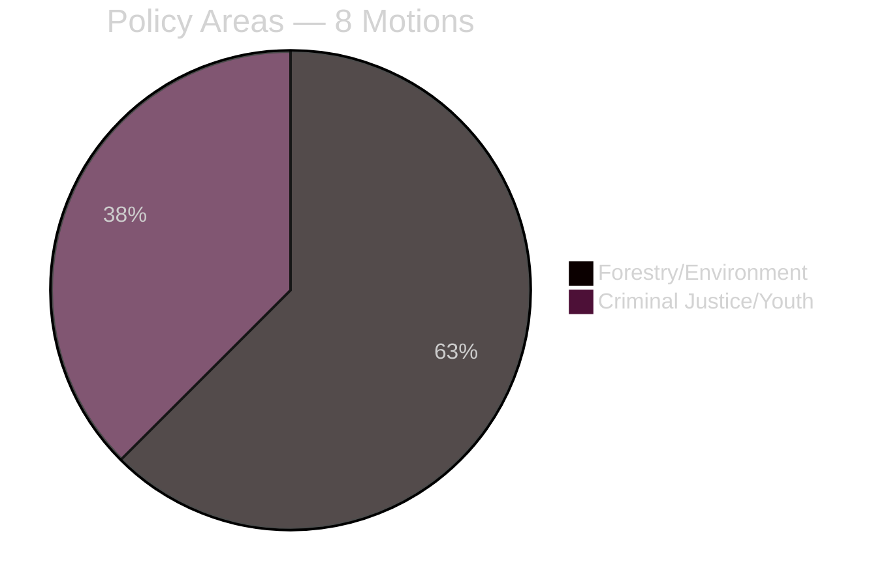

# Classification Results: Opposition Motions 2026-05-08

**Author**: James Pether Sörling | **Date**: 2026-05-08
**Classification framework**: 7-dimension political classification

## Classification Matrix

| dok_id | Policy Area | Ideology | Urgency | Scope | Party | Committee | Priority Tier |
|--------|-------------|----------|---------|-------|-------|-----------|---------------|
| HD024141 | Environmental/Forestry | Green-Left | Medium | National | V | MJU | L2 |
| HD024142 | Criminal Justice/Youth | Left | High | National | V | JuU | L2 |
| HD024143 | Environmental/Forestry | Right-Nationalist | Medium | National | SD | MJU | L1 |
| HD024144 | Environmental/Forestry | Centre-Left | Medium | National | S | MJU | L2+ |
| HD024145 | Environmental/Forestry | Centre | Medium | National | C | MJU | L2 |
| HD024146 | Criminal Justice/Youth | Centre | High | National | C | JuU | L2+ |
| HD024147 | Environmental/Forestry | Green | Medium | National | MP | MJU | L2 |
| HD024148 | Criminal Justice/Youth | Green | High | National | MP | JuU | L2 |

## Policy Cluster Analysis

### Cluster A: Forestry Deregulation Critique (5 motions)
- **Parties**: V, S, C, MP vs SD (different direction)
- **Legal vectors**: EU Habitats Directive Art. 6, NRL 2024/1991, ILO Conv. 169 (Sami rights)
- **Parliamentary outcome**: Government passes proposition 2025/26:242
- **Post-passage risk**: EU infringement proceedings, Naturvårdsverket compliance opinion

### Cluster B: Youth Criminal Justice (3 motions)
- **Parties**: V, C, MP
- **Legal vector**: CRC Art. 40(3)(a) [lag 2018:1197], ECHR Art. 5, SFS 2022:246
- **Parliamentary outcome**: Government passes proposition 2025/26:246 (probable)
- **Post-passage risk**: CRC treaty body complaint, Lagrådet yttrande pending

## Data Retention & Access

- All documents: PUBLIC (Riksdagen open data)
- Retention: Permanent (parliamentary record)
- GDPR: Art. 9(2)(e) — publicly-made political positions

