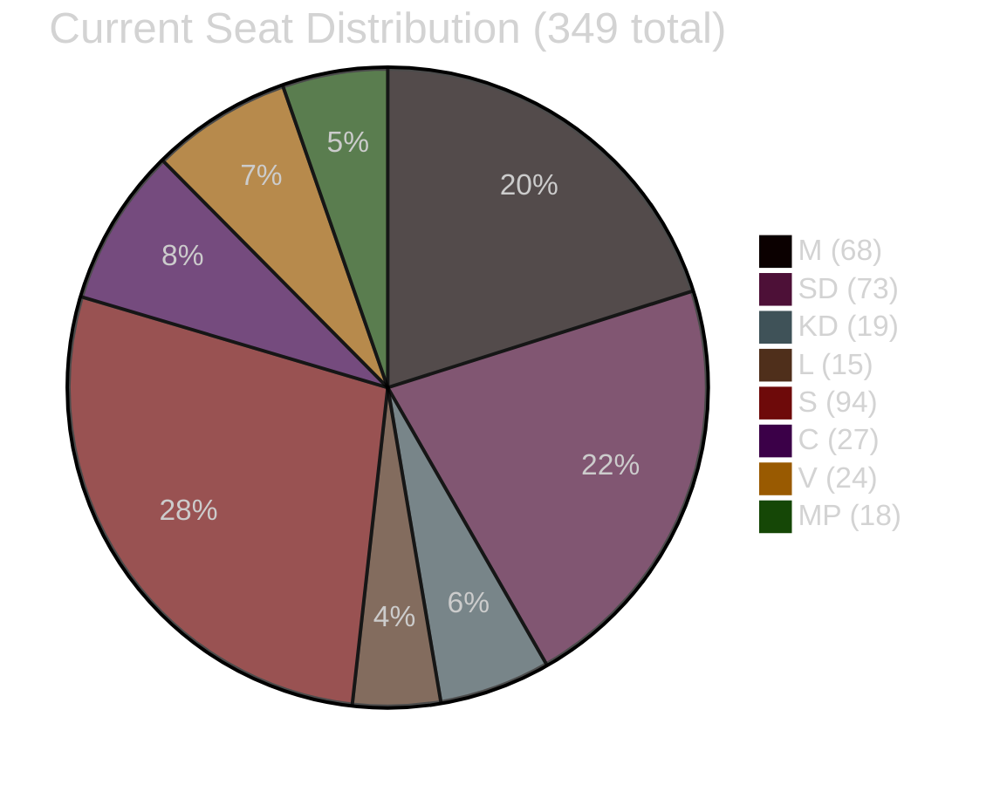

# Coalition Mathematics: Opposition Motions 2026-05-08

**Author**: James Pether Sörling | **Date**: 2026-05-08

## Seat Map (349 total, majority = 175)

```
Government bloc (Tidö):
  M  (Moderaterna):        68 seats  ████████████████████████████████████████████████████████████████████
  SD (Sverigedemokraterna):73 seats  ██████████████████████████████████████████████████████████████████████████
  KD (Kristdemokraterna):  19 seats  ███████████████████
  L  (Liberalerna):        15 seats  ███████████████
  ─────────────────────────────────
  Government total:       175 seats  [MAJORITY]

Cross-bench / Opposition:
  S  (Socialdemokraterna): 94 seats  ██████████████████████████████████████████████████████████████████████████████████████████████
  C  (Centerpartiet):      27 seats  ███████████████████████████
  V  (Vänsterpartiet):     24 seats  ████████████████████████
  MP (Miljöpartiet):       18 seats  ██████████████████
  ─────────────────────────────────
  Cross-bench total:      163 seats  [MINORITY]
```

## Pivotal-Vote Analysis

### Prop. 2025/26:246 — Criminal Age Cut Votes

| Configuration | Gov seats | Opp seats | Outcome | Likelihood |
|--------------|-----------|-----------|---------|-----------|
| Gov bloc only | 175 | 0 opposition joins | Gov wins 175-174* | HIGH |
| C defects (expected) | 175 | C counted separately | Gov wins; C protest vote recorded | HIGH |
| V+C+MP oppose | 175 | 69 | Gov wins 175-69 | NEAR-CERTAIN |
| V+C+MP+S oppose | 175 | 163 | Gov wins 175-163 | POSSIBLE (P=15%) |
| One M/KD/L defects | 174 | 163 | Gov wins 174-163 | Still comfortable |

*Note: Full 349-seat vote with abstentions would be 175 vs. however many opposition votes are cast.

### Prop. 2025/26:242 — Forestry Votes

| Configuration | Gov seats | Opp seats | Outcome | Likelihood |
|--------------|-----------|-----------|---------|-----------|
| S conditional (may abstain or vote gov) | 175 | 69 (V+C+MP) | Gov wins | HIGH |
| S votes with V+C+MP | 175 | 163 | Gov wins 175-163 | LOW-MODERATE |
| SD defects right (demands more deregulation, abstains) | 102 | unclear | HD024143 scenario: Gov still wins with M+KD+L+C combination | VERY LOW |

### Critical Pivot Point: S on Prop. 2025/26:246

If S (94 seats) explicitly votes against criminal age cut: vote becomes 175-163. Government margin = 12 seats. This is the pivotal intelligence question (PIR S-CRC-JOIN).

## Post-Election Coalition Arithmetic

### Required for Government Formation (≥175)

| Coalition option | Seats | Viable? | Condition |
|-----------------|-------|---------|-----------|
| M+SD+KD+L (Tidö-2) | ~175 (est.) | POSSIBLE | Requires M not losing too many seats |
| M+SD+KD+L+C | ~200 (est.) | LIKELY | C rejoins or supports from outside |
| S+V+MP+C | ~163 (est.) | NOT VIABLE | Too short; need 12 more seats |
| S+C+L+MP | ~154 (est.) | NOT VIABLE | Far too short |
| S+V+MP+C+SD (impossible) | 236 | IMPOSSIBLE | SD and V cannot coalesce |

### Coalition Kingmakers

1. **C (27 seats)**: Pivotal — can make either Tidö-2 or a broad-right coalition viable
2. **S (94 seats)**: Pivotal in the left — without S, no left-of-centre majority is arithmetically possible
3. **MP (18 seats)**: If below 4% threshold, S+V coalition would need additional partners

