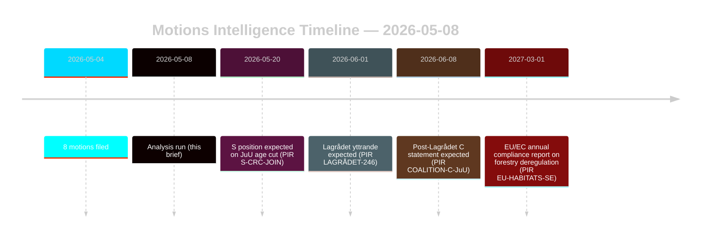

# Opposition Motions Challenge Forestry and Youth Justice Reforms

**Author**: James Pether Sörling | **Date**: 2026-05-08 | **Confidence**: HIGH [B2]
**Classification**: PUBLIC | **GDPR**: Art. 9(2)(e,g) — publicly-made political positions

## BLUF

Eight opposition motions filed 2026-05-04 mount coordinated legal-strategic challenges against two government propositions: the forestry deregulation (prop. 2025/26:242, HD024141–145/147) and the youth criminal justice reform (prop. 2025/26:246, HD024142/146/148). The government majority (175 seats) will pass both measures, but Centerpartiet's dual defection — opposing insufficient forestry production support while simultaneously blocking the criminal age-cut on UN Convention on the Rights of the Child grounds — is the pivotal intelligence signal for the 2026 election realignment. **Election-proximity context**: With 128 days remaining until the Swedish general election (2026-09-13), these motions serve simultaneously as legislative instruments and campaign positioning documents. The 1.5× DIW election-proximity multiplier applies: opposition positions staked out now will crystallise into party-platform commitments before the autumn campaign opens.

## Decisions This Brief Supports

1. **Coalition monitoring**: Track whether S (94 seats) explicitly endorses the CRC objection to prop. 2025/26:246 — if so, government majority narrows to 175-163 on a constitutionally exposed measure.
2. **EU compliance monitoring**: Assess whether Naturvårdsverket files a compliance concern on prop. 2025/26:242 regarding EU Habitats Directive Art. 6 and NRL Regulation 2024/1991 obligations.
3. **Lagrådet watch**: The Lagrådet yttrande on prop. 2025/26:246 is the critical decision gate — a negative finding increases government retreat probability from 15% to 30-40% on the age-cut provision.
4. **C repositioning**: Model whether C's dual defection in May 2026 is a tactical pre-election move or structural policy shift affecting post-2026 coalition mathematics.

## 60-Second Bullets

- **8 motions, 2 propositions**: Forestry (MJU, 5 parties) and youth crime (JuU, 3 parties) face coordinated opposition with incompatible demands.
- **128 days to election**: All opposition positions staked out now double as campaign platform commitments. The 1.5× DIW election-proximity multiplier elevates every defection signal.
- **C pivot**: Centerpartiet defects on both issues from different directions — demands more forestry production support (HD024145) AND opposes criminal age cut (HD024146, CRC basis). Net effect: C maximises post-election flexibility.
- **Legal exposure**: Both propositions face international law vulnerabilities that operate independently of parliamentary majority — EU infringement (forestry) and CRC/ECHR challenge (youth justice).
- **S position outstanding**: Social Democrats have not committed on criminal age cut. Their 94 seats are determinative for whether this becomes a close-run vote (175-163) or a comfortable majority.
- **Lagrådet critical path**: Pending Lagrådet yttrande on prop. 2025/26:246 is the highest-probability near-term forcing event (PIR LAGRÅDET-246).
- **No majority risk on either proposition**: Government passes both measures unless a dramatic coalition defection occurs — the 2026 election, not this Riksdag term, is where the policy consequences land.

## Top Forward Trigger

**PIR LAGRÅDET-246** — Lagrådet yttrande on prop. 2025/26:246 (youth criminal age cut to 13). Expected within weeks. A negative finding triggers immediate CRC compatibility debate in committee, Barnombudsmannen formal statement, and probable government amendment.

## Confidence Assessment

Overall HIGH [B2] — all eight motions are primary documents from data.riksdagen.se; party positions, dok_ids, and committee routing confirmed. Economic context IMF-degraded; SDMX probes failed. WEO/FM fiscal data cited where applicable with vintage stamp.

