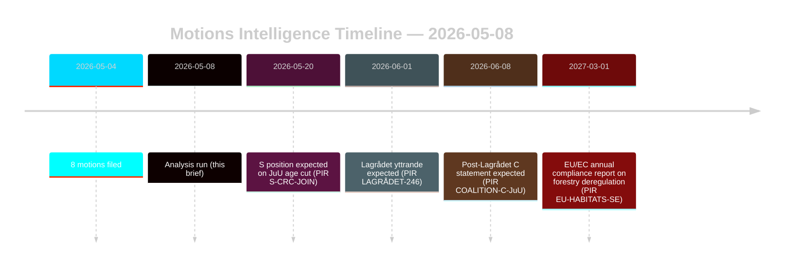

‏# اقتراحات المعارضة تتحدى إصلاحات الغابات وقضاء الأحداث

**المؤلف**: جيمس بيتر سورلينج | **التاريخ**: 2026-05-08 | **الثقة**: عالية [B2]
**التصنيف**: عام | **اللائحة العامة لحماية البيانات**: المادة 9(2)(ه،ز) — المواقف السياسية التي أُعلنت للعموم

## الاستنتاج

ثمانية اقتراحات معارضة قُدِّمت في 2026-05-04 تمثل تحديات قانونية-استراتيجية منسقة ضد اقتراحين حكوميين: تحرير قانون الغابات (prop. 2025/26:242, HD024141–145/147) وإصلاح قضاء الأحداث الجنائي (prop. 2025/26:246, HD024142/146/148). الأغلبية الحكومية (175 مقعداً) ستمرر كلا الإجراءين، لكن الانشقاق المزدوج لحزب سينترربارتييت — رفض الدعم غير الكافي لإنتاج الغابات مع حجب خفض سن المسؤولية الجنائية استناداً لاتفاقية الأمم المتحدة لحقوق الطفل — هو الإشارة الاستخباراتية الحاسمة لإعادة التوازن الانتخابي لعام 2026. **سياق القرب الانتخابي**: مع 128 يوماً المتبقية حتى الانتخابات العامة السويدية (2026-09-13)، تخدم هذه الاقتراحات في آنٍ واحد كأدوات تشريعية ووثائق تموضع حملات. يُطبَّق معامل DIW للقرب الانتخابي 1.5×: المواقف المعارضة المتخذة الآن ستتبلور في التزامات منصة الحزب قبل انطلاق حملة الخريف.

## القرارات التي يدعمها هذا الإحاطة

1. **مراقبة الائتلاف**: رصد ما إذا كانت S (94 مقعداً) تؤيد صراحةً اعتراض اتفاقية حقوق الطفل على prop. 2025/26:246 — وفي هذه الحالة تنكمش الأغلبية الحكومية إلى 175-163 على إجراء مكشوف دستورياً.
2. **مراقبة الامتثال الأوروبي**: تقييم ما إذا كانت ناتيرفوردسفيركت تقدم مخاوف امتثال بشأن prop. 2025/26:242 فيما يتعلق بالتزامات المادة 6 من توجيه الموائل الأوروبي ولائحة NRL رقم 2024/1991.
3. **رأي لاغرودت**: يُعدُّ Lagrådets yttrande بشأن prop. 2025/26:246 البوابة القرارية الحرجة — نتيجة سلبية ترفع احتمال تراجع الحكومة من 15% إلى 30-40% في أحكام خفض السن.
4. **إعادة تموضع C**: نمذجة ما إذا كان الانشقاق المزدوج لحزب C في مايو 2026 مناورة تكتيكية قبيل الانتخابات أم تحولاً سياسياً هيكلياً يؤثر على حسابات الائتلاف بعد 2026.

## نقاط في 60 ثانية

- **8 اقتراحات، اقتراحان حكوميان**: قطاع الغابات (MJU، 5 أحزاب) وجرائم الأحداث (JuU، 3 أحزاب) يواجهان معارضة منسقة بمطالب متعارضة.
- **128 يوماً حتى الانتخابات**: جميع مواقف المعارضة المتخذة الآن تتضاعف كالتزامات منصة الحملة. معامل DIW للقرب الانتخابي 1.5× يرفع كل إشارة انشقاق.
- **محور C**: ينحرف سينترربارتييت في كلا الملفين من اتجاهات مختلفة — يطالب بمزيد من دعم إنتاج الغابات (HD024145) ويعارض خفض سن المسؤولية الجنائية (HD024146، أساس اتفاقية حقوق الطفل). الأثر الصافي: C يعظِّم المرونة ما بعد الانتخابات.
- **التعرض القانوني**: كلا الاقتراحين يواجهان نقاط ضعف قانونية دولية تعمل باستقلالية عن الأغلبية البرلمانية — مخالفة أوروبية (الغابات) وتحدي اتفاقية حقوق الطفل/الاتفاقية الأوروبية لحقوق الإنسان (قضاء الأحداث).
- **موقف S لا يزال معلقاً**: لم يلتزم الاشتراكيون الديمقراطيون بشأن خفض السن. مقاعدهم الـ94 حاسمة لتحديد ما إذا كان ذلك تصويتاً متقارباً (175-163) أم أغلبية مريحة.
- **لاغرودت المسار الحرج**: Lagrådets yttrande المعلق على prop. 2025/26:246 هو الحدث المقيد الأرجح في المدى القريب (PIR LAGRÅDET-246).
- **لا مخاطر أغلبية على أي اقتراح**: تمرر الحكومة كلا الإجراءين ما لم تحدث انشقاقات ائتلافية مثيرة — انتخابات 2026، لا دورة الريكسداغ الحالية، هي المكان الذي تحط فيه التبعات السياسية.

## المحفز المستقبلي الأكثر أهمية

**PIR LAGRÅDET-246** — Lagrådets yttrande بشأن prop. 2025/26:246 (خفض سن المسؤولية الجنائية للأحداث إلى 13 عاماً). متوقع في غضون أسابيع. نتيجة سلبية تُفجِّر فوراً نقاشاً حول توافق اتفاقية حقوق الطفل في اللجنة، والبيان الرسمي لمكتب مفوض الأطفال (Barnombudsmannen)، وتعديل حكومي محتمل.

## تقييم الثقة

عالية إجمالاً [B2] — الاقتراحات الثمانية وثائق أولية من data.riksdagen.se؛ مواقف الأحزاب ومعرفات المستندات dok_ids ومسارات التوجيه اللجني مؤكدة. السياق الاقتصادي مُخفَّض من صندوق النقد الدولي؛ اختبارات SDMX فشلت. بيانات WEO/FM المالية مُستشهد بها حيثما ينطبق مع ختم نضج.

<!-- source-sha: f606888bcd73f924a651e60009818030e9af3c63 -->
