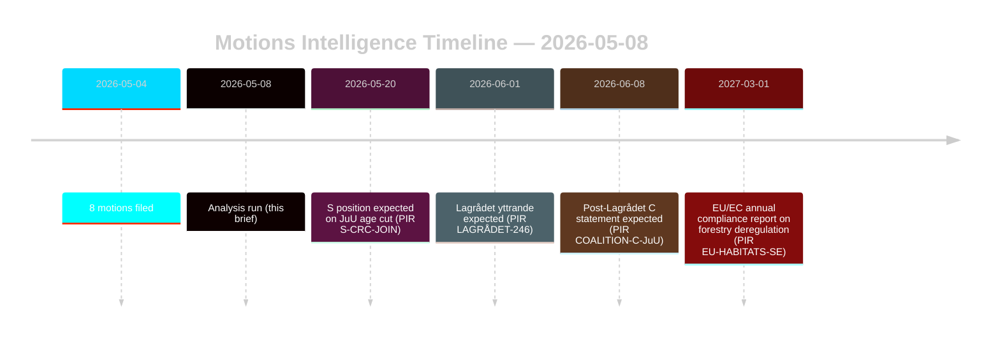

# Oppositionsforslag udfordrer skovbrugs- og ungdomsstrafferetsreformer

**Forfatter**: James Pether Sörling | **Dato**: 2026-05-08 | **Konfidensgrad**: HØJ [B2]
**Klassificering**: OFFENTLIG | **GDPR**: Art. 9(2)(e,g) — offentliggjorte politiske holdninger

## Konklusion

Otte oppositionsforslag indgivet 2026-05-04 monterer koordinerede juridisk-strategiske udfordringer mod to regeringsforslag: skovlovgivningsdereguleringen (prop. 2025/26:242, HD024141–145/147) og reformen af ungdomsstrafferet (prop. 2025/26:246, HD024142/146/148). Regeringsflertallet (175 mandater) vil vedtage begge foranstaltninger, men Centerpartiets dobbelte afhopp — mod utilstrækkelig skovproduktionsstøtte og blockering af strafmyndighetsalderssænkningen på FN's Børnekonventionsgrundlag — er det afgørende efterretningssignal for valgrealignmentet i 2026. **Valgperiodekontekst**: Med 128 dage til det svenske valg (2026-09-13) fungerer disse forslag simultant som lovgivningsinstrumenter og kampagnepositioneringsdokumenter. 1,5×-DIW-valgperiodsmultiplikatoren gælder: oppositionens holdninger fastlagt nu vil krystallisere sig i partiplatformsforpligtelser inden efterårskampagnen åbner.

## Beslutninger dette notat understøtter

1. **Koalitionsovervågning**: Spor om S (94 mandater) eksplicit tilslutter sig FN's Børnekonventionsindsigelsen mod prop. 2025/26:246 — i så fald indsnævres regeringsflertallet til 175-163 på en konstitutionelt eksponeret foranstaltning.
2. **EU-overholdelsesovervågning**: Vurder om Naturvårdsverket indgiver en overholdelsesproblematik vedrørende prop. 2025/26:242 angående EU's habitatdirektiv art. 6 og NRL-forordningen 2024/1991.
3. **Lagrådets udtalelse**: Lagrådets yttrande om prop. 2025/26:246 er det kritiske beslutningsgate — et negativt fund øger tilbagetræningssandsynlighed for regeringen fra 15% til 30-40% på aldersnedsættelsesbestemmelsen.
4. **C's repositionering**: Model, om C's dobbelte afhopp i maj 2026 er et taktisk valformanøvreskytte eller et strukturelt politikskifte, der påvirker koalitionsmatematikken efter 2026.

## 60-sekunders punkter

- **8 forslag, 2 propositioner**: Skovbrug (MJU, 5 partier) og ungdomskriminalitet (JuU, 3 partier) møder koordineret opposition med uforenlige krav.
- **128 dage til valg**: Alle oppositionsholdninger fastlagt nu fordobles som kampagneplatformsforpligtelser. 1,5×-DIW-valgperiodsmultiplikatoren forhøjer ethvert afhoppssignal.
- **C's omdrejningspunkt**: Centerpartiet afviger på begge spørgsmål fra forskellige retninger — kræver mere skovproduktionsstøtte (HD024145) OG modsætter sig kriminalstrafmyndighed (HD024146, FN's Børnekonventionsgrundlag). Nettoeffekt: C maksimerer fleksibilitet efter valget.
- **Retlig eksponering**: Begge propositioner møder internationale retslige sårbarheder, der virker uafhængigt af parlamentarisk flertal — EU-overtrædelse (skovbrug) og FN's Børnekonvention/EMRK-udfordring (ungdomsjustits).
- **S's holdning afventende**: Socialdemokraterne har ikke forpligtet sig på strafmyndighed. Deres 94 mandater er afgørende for, om dette bliver en tæt afstemning (175-163) eller et komfortabelt flertal.
- **Lagrådet kritisk vej**: Afventende Lagrådets yttrande om prop. 2025/26:246 er den mest sandsynlige nærliggende tvangshændelse (PIR LAGRÅDET-246).
- **Ingen flertalrisiko på nogen proposition**: Regeringen vedtager begge foranstaltninger, medmindre et dramatisk koalitionsafhopp opstår — valget 2026, ikke denne Riksdag-periode, er, hvor de politiske konsekvenser lander.

## Vigtigste fremtidige udløser

**PIR LAGRÅDET-246** — Lagrådets yttrande om prop. 2025/26:246 (nedsættelse af ungdomsstraffemyndighed til 13). Forventet inden for uger. Et negativt fund udløser øjeblikkelig FN's Børnekonventionskompatibilitetsdebat i udvalg, Barnombudsmannens formelle udtalelse og sandsynlig regeringsændring.

## Konfidensgrad

Samlet HØJ [B2] — alle otte forslag er primærdokumenter fra data.riksdagen.se; partipositioner, dok_ids og udvalgsrouting bekræftet. IMF-nedgraderet økonomisk kontekst; SDMX-prober mislykkedes. WEO/FM finansdata citeret, hvor det er relevant, med årgangsstempel.

<!-- source-sha: f606888bcd73f924a651e60009818030e9af3c63 -->
