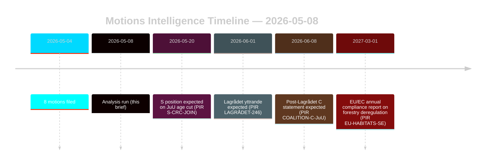

# Oppositionsanträge fordern Forst- und Jugendstrafrechtreformen heraus

**Autor**: James Pether Sörling | **Datum**: 2026-05-08 | **Konfidenz**: HOCH [B2]
**Einstufung**: ÖFFENTLICH | **DSGVO**: Art. 9(2)(e,g) — öffentlich gemachte politische Positionen

## Schlussfolgerung

Acht Oppositionsanträge vom 2026-05-04 stellen koordinierte rechtlich-strategische Herausforderungen gegen zwei Regierungspropositionenen dar: die Forstrechtsderegulierung (prop. 2025/26:242, HD024141–145/147) und die Jugendstrafrechtsreform (prop. 2025/26:246, HD024142/146/148). Die Regierungsmehrheit (175 Sitze) wird beide Maßnahmen durchsetzen, aber die doppelte Abweichung des Centerpartiet — Ablehnung mangelhafter Forstproduktionsunterstützung und gleichzeitig Blockierung des Absenkens der Strafmündigkeit auf UN-Kinderrechtskonventionsbasis — ist das entscheidende Nachrichtensignal für die Wahlneujustierung 2026. **Wahlnähekontex**: Mit 128 Tagen bis zur schwedischen Rikstagswahl (2026-09-13) dienen diese Anträge gleichzeitig als Gesetzgebungsinstrumente und Kampagnenpositionierungsdokumente. Der 1,5×-DIW-Wahlnähemultiplikator gilt: Oppositionspositionen, die jetzt eingenommen werden, werden zu Parteiplatformverpflichtungen vor dem Herbstwahlkampf kristallisieren.

## Entscheidungen, die dieses Briefing unterstützt

1. **Koalitionsüberwachung**: Verfolgen, ob S (94 Sitze) explizit dem UN-Kinderrechtseinwand gegen prop. 2025/26:246 beitritt — in diesem Fall verengt sich die Regierungsmehrheit auf 175-163 bei einer verfassungsrechtlich exponierten Maßnahme.
2. **EU-Compliance-Überwachung**: Beurteilen, ob Naturvårdsverket eine Compliance-Besorgnis bezüglich prop. 2025/26:242 bezüglich EU-Habitatrichtlinie Art. 6 und NRL-Verordnung 2024/1991 einreicht.
3. **Lagrådet-Stellungnahme**: Das Lagrådets yttrande zu prop. 2025/26:246 ist das kritische Entscheidungstor — ein negativer Befund erhöht die Rückzugswahrscheinlichkeit der Regierung von 15% auf 30-40% bei der Altersabsenkungsbestimmung.
4. **C-Repositionierung**: Modellieren, ob Cs doppelte Abweichung im Mai 2026 ein taktischer Vorwahlmanöver oder ein struktureller Politikwechsel ist, der die Koalitionsmathematik nach 2026 beeinflusst.

## 60-Sekunden-Punkte

- **8 Anträge, 2 Propositionen**: Forstwirtschaft (MJU, 5 Parteien) und Jugendkriminalität (JuU, 3 Parteien) begegnen koordinierter Opposition mit unvereinbaren Forderungen.
- **128 Tage bis zur Wahl**: Alle jetzt eingenommenen Oppositionspositionen verdoppeln sich zu Kampagnenplattformverpflichtungen. Der 1,5×-DIW-Wahlnähemultiplikator erhöht jedes Abweichungssignal.
- **C-Pivotpunkt**: Centerpartiet weicht bei beiden Fragen aus unterschiedlichen Richtungen ab — fordert mehr Forstproduktionsunterstützung (HD024145) UND widersetzt sich der Strafmündigkeitsabsenkung (HD024146, UN-Kinderrechtsbasis). Nettoeffekt: C maximiert Flexibilität nach der Wahl.
- **Rechtliche Exponierung**: Beide Propositionen stehen vor internationalen Rechtsschwächen, die unabhängig von der parlamentarischen Mehrheit wirken — EU-Verletzung (Forstwirtschaft) und UN-Kinderrechtskonvention/EMRK-Herausforderung (Jugendgerechtigkeit).
- **S-Position ausstehend**: Die Sozialdemokraten haben sich nicht zur Strafmündigkeitsabsenkung bekannt. Ihre 94 Sitze sind entscheidend dafür, ob dies eine knappe Abstimmung wird (175-163) oder eine komfortable Mehrheit.
- **Lagrådet kritischer Weg**: Das ausstehende Lagrådets yttrande zu prop. 2025/26:246 ist das wahrscheinlichste nahzeitige zwingende Ereignis (PIR LAGRÅDET-246).
- **Kein Mehrheitsrisiko bei keiner Proposition**: Die Regierung setzt beide Maßnahmen durch, sofern kein dramatischer Koalitionsabbruch erfolgt — die Wahl 2026, nicht diese Riksdag-Periode, ist der Ort, wo die politischen Konsequenzen landen.

## Wichtigster zukünftiger Auslöser

**PIR LAGRÅDET-246** — Lagrådets yttrande zu prop. 2025/26:246 (Absenkung des strafrechtlichen Alters der Jugend auf 13). Innerhalb von Wochen erwartet. Ein negativer Befund löst sofort eine UN-Kinderrechtskompatibilitätsdebatte im Ausschuss aus, die formelle Stellungnahme des Barnombudsmannen und wahrscheinliche Regierungsänderung.

## Konfidenzbeurteilung

Gesamt HOCH [B2] — alle acht Anträge sind Primärdokumente von data.riksdagen.se; Parteipositionen, dok_ids und Ausschussweiterleitung bestätigt. IMF-herabgesetzter wirtschaftlicher Kontext; SDMX-Prüfungen fehlgeschlagen. WEO/FM-Finanzdaten wo anwendbar mit Jahrgangsstempel zitiert.

<!-- source-sha: f606888bcd73f924a651e60009818030e9af3c63 -->
