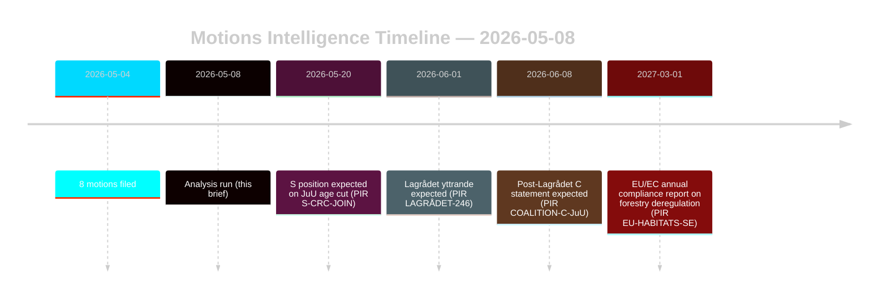

# Las mociones de oposición desafían las reformas forestales y de justicia juvenil

**Autor**: James Pether Sörling | **Fecha**: 2026-05-08 | **Confianza**: ALTA [B2]
**Clasificación**: PÚBLICA | **RGPD**: Art. 9(2)(e,g) — posiciones políticas hechas públicas

## Conclusión

Ocho mociones de oposición presentadas el 2026-05-04 constituyen desafíos jurídico-estratégicos coordinados contra dos proposiciones gubernamentales: la desregulación forestal (prop. 2025/26:242, HD024141–145/147) y la reforma de la justicia penal juvenil (prop. 2025/26:246, HD024142/146/148). La mayoría gubernamental (175 escaños) adoptará ambas medidas, pero la doble disidencia del Centerpartiet — rechazo del apoyo insuficiente a la producción forestal y simultáneamente bloqueo de la reducción de la edad de responsabilidad penal sobre la base de la Convención de la ONU sobre los Derechos del Niño — es la señal de inteligencia decisiva para el realineamiento electoral de 2026. **Contexto de proximidad electoral**: Con 128 días restantes hasta las elecciones generales suecas (2026-09-13), estas mociones sirven simultáneamente como instrumentos legislativos y documentos de posicionamiento de campaña. El multiplicador DIW de proximidad electoral de 1,5× se aplica: las posiciones de la oposición adoptadas ahora se cristalizarán en compromisos de plataforma de partido antes de que comience la campaña de otoño.

## Decisiones que apoya este informe

1. **Monitoreo de coalición**: Rastrear si S (94 escaños) respalda explícitamente la objeción de la Convención sobre los Derechos del Niño contra prop. 2025/26:246 — en ese caso, la mayoría gubernamental se reduce a 175-163 en una medida constitucionalmente expuesta.
2. **Monitoreo de cumplimiento de la UE**: Evaluar si Naturvårdsverket presenta una preocupación de cumplimiento sobre prop. 2025/26:242 respecto a las obligaciones del artículo 6 de la Directiva Hábitats de la UE y el Reglamento NRL 2024/1991.
3. **Dictamen del Lagrådet**: El Lagrådets yttrande sobre prop. 2025/26:246 es la puerta de decisión crítica — un dictamen negativo aumenta la probabilidad de retirada gubernamental del 15% al 30-40% en la disposición de reducción de edad.
4. **Reposicionamiento de C**: Modelar si la doble disidencia de C en mayo de 2026 es una maniobra táctica preelectoral o un cambio de política estructural que afecta la matemática de coalición post-2026.

## Puntos en 60 segundos

- **8 mociones, 2 proposiciones**: Silvicultura (MJU, 5 partidos) y delincuencia juvenil (JuU, 3 partidos) enfrentan oposición coordinada con demandas incompatibles.
- **128 días para las elecciones**: Todas las posiciones de la oposición adoptadas ahora se duplican como compromisos de plataforma de campaña. El multiplicador DIW de proximidad electoral de 1,5× eleva cada señal de disidencia.
- **Pivote de C**: El Centerpartiet se desvía en ambos temas desde direcciones diferentes — exige más apoyo a la producción forestal (HD024145) Y se opone a la reducción de la edad de responsabilidad penal (HD024146, base Convención sobre los Derechos del Niño). Efecto neto: C maximiza la flexibilidad post-electoral.
- **Exposición legal**: Ambas proposiciones enfrentan vulnerabilidades jurídicas internacionales que operan independientemente de la mayoría parlamentaria — infracción de la UE (silvicultura) y desafío Convención sobre los Derechos del Niño/CEDH (justicia juvenil).
- **Posición de S pendiente**: Los socialdemócratas no se han comprometido sobre la reducción de edad. Sus 94 escaños son determinantes para saber si esto se convierte en una votación ajustada (175-163) o una mayoría cómoda.
- **Lagrådet ruta crítica**: El Lagrådets yttrande pendiente sobre prop. 2025/26:246 es el evento restrictivo más probable a corto plazo (PIR LAGRÅDET-246).
- **Sin riesgo para la mayoría en ninguna proposición**: El gobierno adopta ambas medidas a menos que se produzca una defección dramática de coalición — las elecciones 2026, no este período del Riksdag, es donde aterrizan las consecuencias políticas.

## Principal desencadenante futuro

**PIR LAGRÅDET-246** — Lagrådets yttrande sobre prop. 2025/26:246 (reducción de la edad penal juvenil a 13 años). Esperado en semanas. Un dictamen negativo desencadena inmediatamente un debate sobre compatibilidad con la Convención sobre los Derechos del Niño en comisión, la declaración formal del Barnombudsmannen y probable enmienda gubernamental.

## Evaluación de confianza

ALTA global [B2] — las ocho mociones son documentos primarios de data.riksdagen.se; posiciones de partidos, dok_ids y enrutamiento a comisión confirmados. Contexto económico degradado por el FMI; las pruebas SDMX fallaron. Datos financieros WEO/FM citados donde corresponde con sello de cosecha.

<!-- source-sha: f606888bcd73f924a651e60009818030e9af3c63 -->
