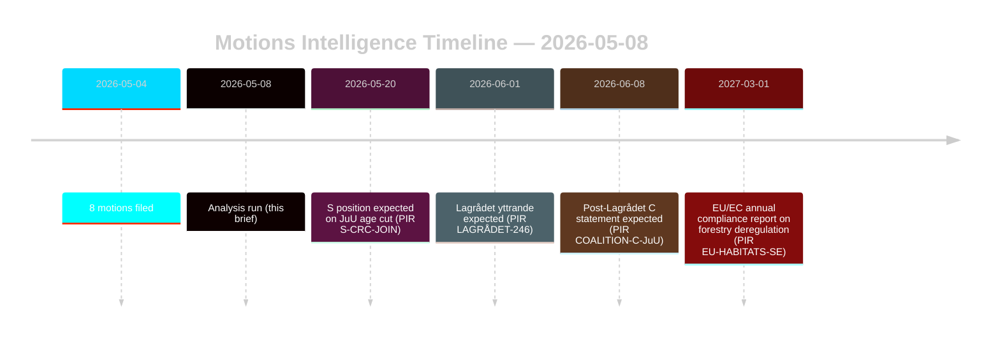

# Oppositioesitykset haastavat metsä- ja nuorisorikoslainsäädännön uudistukset

**Tekijä**: James Pether Sörling | **Päivämäärä**: 2026-05-08 | **Luotettavuus**: KORKEA [B2]
**Luokitus**: JULKINEN | **GDPR**: Art. 9(2)(e,g) — julkisesti esitetyt poliittiset kannanotot

## Yhteenveto

Kahdeksan 2026-05-04 jätettyä oppositioesitystä muodostavat koordinoidut oikeudellisstrategiset haasteet kahta hallituksen lakiesitystä vastaan: metsälain vapautus (prop. 2025/26:242, HD024141–145/147) ja nuorisorikoslainsäädännön uudistus (prop. 2025/26:246, HD024142/146/148). Hallituksen enemmistö (175 paikkaa) tulee hyväksymään molemmat toimenpiteet, mutta Centerpartiets kaksoispoikkeama — vastustus riittämättömälle metsätuotantotuelle ja samanaikainen rikosoikeuden ikärajanlasku-estäminen YK:n lapsen oikeuksien sopimuksen perusteella — on ratkaiseva tiedustelusignaali vuoden 2026 vaalien uudelleenlinjauksessa. **Vaalilähestyvyystilanne**: 128 päivää jäljellä Ruotsin yleisvaaleisiin (2026-09-13), nämä esitykset toimivat samanaikaisesti sekä lainsäädäntöinstrumentteina että kampanjasijoittautumisasiakirjoina. 1,5×-DIW-vaalinähelmultiplikaattori pätee: nyt otetut oppositiokannat kiteytyivät puolueohjelman sitoumuksiksi ennen syksyn kampanjan avautumista.

## Päätökset, joita tämä katsaus tukee

1. **Koalitionvalvonta**: Seuraa, liittyykö S (94 paikkaa) nimenomaisesti YK:n lapsen oikeuksien sopimuksen vastustamiseen prop. 2025/26:246 osalta — jos niin tapahtuu, hallituksen enemmistö kapenee 175–163:een perustuslaillisesti alttiissa toimenpiteessä.
2. **EU-noudattamisvalvonta**: Arvioi, toimittaako Naturvårdsverket noudattamishäiriön prop. 2025/26:242:n osalta koskien EU:n habitatidirektiivin 6. artiklaa ja NRL-asetusta 2024/1991.
3. **Lakineuvosto**: Lagrådets yttrande prop. 2025/26:246:sta on kriittinen päätöskohta — kielteinen lausunto nostaa hallituksen peräytymistodennäköisyyden 15 %:sta 30–40 %:iin ikärajan alentamissäännöksessä.
4. **C:n uudelleenasemointi**: Mallinna, onko C:n kaksoispoikkeama toukokuussa 2026 taktinen ennakkovaalisiirto vai rakenteellinen poliittinen muutos, joka vaikuttaa vuoden 2026 jälkeiseen koalitioaritmetiikkaan.

## 60 sekunnin tiivistelmä

- **8 esitystä, 2 lakiesitystä**: Metsätalous (MJU, 5 puoluetta) ja nuorisorikokset (JuU, 3 puoluetta) kohtaavat koordinoidun opposition ristiriitaisten vaatimusten kanssa.
- **128 päivää vaaleihin**: Kaikki nyt otetut oppositiokannat kaksinkertaistuvat kampanjaohjelman sitoumuksiksi. 1,5×-DIW-vaalilähestyvyysmultiplikaattori korottaa jokaisen poikkeamasignaalin.
- **C:n keskeinen asema**: Centerpartiet poikkeaa molemmissa asioissa eri suunnista — vaatii enemmän metsätuotantotukea (HD024145) JA vastustaa rikollisvastuun ikärajaa (HD024146, YK:n lapsen oikeuksien sopimuksen perusta). Nettovaiku tus: C maksimoi joustavuuden vaalien jälkeen.
- **Oikeudellinen altistuminen**: Molemmat lakiesitykset kohtaavat kansainvälisiä oikeudellisia haavoittuvuuksia, jotka toimivat riippumatta parlamentaarisesta enemmistöstä — EU-rikkomus (metsätalous) ja YK:n lapsen oikeuksien sopimus/ECHR-haaste (nuorisoikeudenmukaisuus).
- **S:n kanta odottaa**: Sosiaalidemokraatit eivät ole sitoutuneet rikollisvastuun ikärajaan. Heidän 94 paikkansa on ratkaiseva sen suhteen, onko tämä tasainen äänestys (175-163) vai mukava enemmistö.
- **Lagrådet kriittinen polku**: Odottava Lagrådets yttrande prop. 2025/26:246:sta on todennäköisin lähitulevaisuuden pakottava tapahtuma (PIR LAGRÅDET-246).
- **Ei enemmistöriskiä kummallakaan lakiesityksellä**: Hallitus hyväksyy molemmat toimenpiteet, ellei dramaattinen koalitiopoikkeama tapahdu — vuoden 2026 vaalit, ei tämä riksmöte-kausi, on missä poliittiset seuraukset laskeutuvat.

## Tärkein tuleva laukaisin

**PIR LAGRÅDET-246** — Lagrådets yttrande prop. 2025/26:246:sta (nuorten rikosoikeudellisen vastuun ikärajan lasku 13 vuoteen). Odotetaan viikojen sisällä. Kielteinen lausunto käynnistää välittömästi YK:n lapsen oikeuksien sopimuksen yhteensopivuuskeskustelun valiokunnassa, Barnombudsmannenin virallisen lausunnon ja todennäköisen hallituksen muutoksen.

## Luotettavuusarviointi

Kokonainen KORKEA [B2] — kaikki kahdeksan esitystä ovat ensisijaiset asiakirjat data.riksdagen.se:stä; puoluekannat, dok_ids ja valiokuntareitit vahvistettu. IMF-alennettu taloudellinen konteksti; SDMX-testaukset epäonnistuivat. WEO/FM-talouspata lainautettuna soveltuvin osin vuosikertaleimalla.

<!-- source-sha: f606888bcd73f924a651e60009818030e9af3c63 -->
