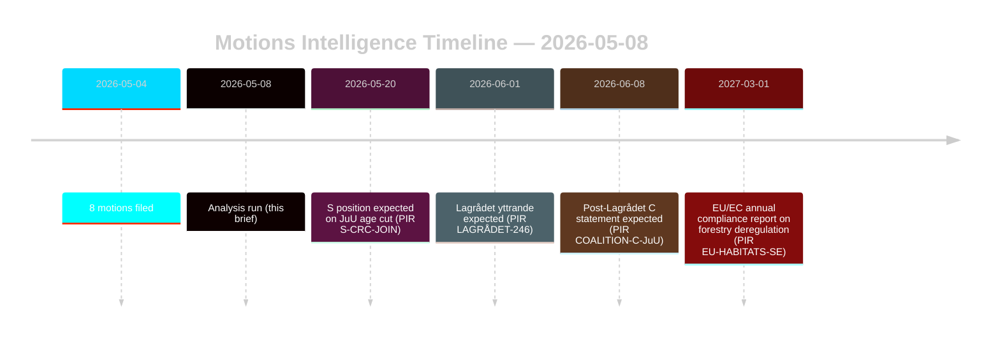

# Les motions d'opposition défient les réformes forestières et de justice pour mineurs

**Auteur** : James Pether Sörling | **Date** : 2026-05-08 | **Confiance** : HAUTE [B2]
**Classification** : PUBLIQUE | **RGPD** : Art. 9(2)(e,g) — positions politiques rendues publiques

## Conclusion

Huit motions d'opposition déposées le 2026-05-04 constituent des défis coordonnés juridico-stratégiques contre deux propositions gouvernementales : la déréglementation forestière (prop. 2025/26:242, HD024141–145/147) et la réforme de la justice pénale des mineurs (prop. 2025/26:246, HD024142/146/148). La majorité gouvernementale (175 sièges) adoptera les deux mesures, mais la double défection du Centerpartiet — opposé au soutien insuffisant à la production forestière tout en bloquant l'abaissement de l'âge de la responsabilité pénale sur la base de la Convention des Nations Unies relative aux droits de l'enfant — est le signal de renseignement décisif pour le réalignement électoral de 2026. **Contexte de proximité électorale** : Avec 128 jours restant jusqu'aux élections générales suédoises (2026-09-13), ces motions servent simultanément d'instruments législatifs et de documents de positionnement de campagne. Le multiplicateur DIW de proximité électorale de 1,5× s'applique : les positions de l'opposition prises maintenant se cristalliseront en engagements de plateforme de parti avant l'ouverture de la campagne d'automne.

## Décisions que ce briefing appuie

1. **Surveillance de coalition** : Suivre si S (94 sièges) endosse explicitement l'objection de la Convention relative aux droits de l'enfant contre prop. 2025/26:246 — dans ce cas, la majorité gouvernementale se réduit à 175-163 sur une mesure constitutionnellement exposée.
2. **Surveillance de conformité UE** : Évaluer si Naturvårdsverket dépose une préoccupation de conformité sur prop. 2025/26:242 concernant les obligations de l'article 6 de la Directive Habitats de l'UE et du Règlement NRL 2024/1991.
3. **Avis du Lagrådet** : Le Lagrådets yttrande sur prop. 2025/26:246 est la porte de décision critique — un avis négatif augmente la probabilité de retraite gouvernementale de 15% à 30-40% sur la disposition d'abaissement de l'âge.
4. **Repositionnement de C** : Modéliser si la double défection de C en mai 2026 est un manœuvre tactique pré-électorale ou un changement de politique structurel affectant les mathématiques de coalition post-2026.

## Points en 60 secondes

- **8 motions, 2 propositions** : La foresterie (MJU, 5 partis) et la criminalité juvénile (JuU, 3 partis) font face à une opposition coordonnée avec des demandes incompatibles.
- **128 jours avant les élections** : Toutes les positions de l'opposition prises maintenant doublent comme engagements de plateforme de campagne. Le multiplicateur DIW de proximité électorale de 1,5× élève chaque signal de défection.
- **Pivot de C** : Le Centerpartiet dévie sur les deux dossiers depuis des directions différentes — exige davantage de soutien à la production forestière (HD024145) ET s'oppose à l'abaissement de l'âge de la responsabilité pénale (HD024146, base Convention relative aux droits de l'enfant). Effet net : C maximise la flexibilité post-électorale.
- **Exposition juridique** : Les deux propositions font face à des vulnérabilités juridiques internationales qui opèrent indépendamment de la majorité parlementaire — infraction UE (foresterie) et défi Convention relative aux droits de l'enfant/CEDH (justice juvénile).
- **Position de S en attente** : Les sociaux-démocrates ne se sont pas engagés sur l'abaissement de l'âge. Leurs 94 sièges sont déterminants pour savoir si cela devient un vote serré (175-163) ou une majorité confortable.
- **Lagrådet voie critique** : L'avis en attente du Lagrådets yttrande sur prop. 2025/26:246 est l'événement contraignant le plus probable à court terme (PIR LAGRÅDET-246).
- **Aucun risque pour la majorité sur les deux propositions** : Le gouvernement adopte les deux mesures à moins qu'une défection dramatique de coalition ne se produise — l'élection 2026, non cette période du Riksdag, est là où les conséquences politiques atterrissent.

## Principal déclencheur futur

**PIR LAGRÅDET-246** — Lagrådets yttrande sur prop. 2025/26:246 (abaissement de l'âge pénal des jeunes à 13 ans). Attendu dans les semaines. Un avis négatif déclenche immédiatement un débat sur la compatibilité avec la Convention relative aux droits de l'enfant en commission, la déclaration formelle du Barnombudsmannen et un amendement probable du gouvernement.

## Évaluation de la confiance

HAUTE globale [B2] — les huit motions sont des documents primaires de data.riksdagen.se ; positions des partis, dok_ids et routage en commission confirmés. Contexte économique dégradé par le FMI ; les sondes SDMX ont échoué. Les données financières WEO/FM citées le cas échéant avec un cachet de millésime.

<!-- source-sha: f606888bcd73f924a651e60009818030e9af3c63 -->
