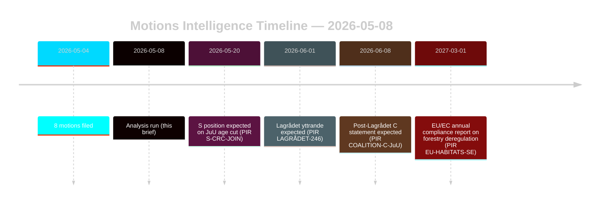

‏# הצעות האופוזיציה מאתגרות רפורמות ביערנות ובשפיטת קטינים

**מחבר**: ג'יימס פתר סורלינג | **תאריך**: 2026-05-08 | **ביטחון**: גבוה [B2]
**סיווג**: ציבורי | **GDPR**: סעיף 9(2)(ה,ז) — עמדות פוליטיות שפורסמו לציבור

## מסקנה

שמונה הצעות אופוזיציה שהוגשו ב-2026-05-04 מהוות אתגרים משפטיים-אסטרטגיים מתואמים נגד שני הצעות ממשלתיות: הפחתת הרגולציה ביערות (prop. 2025/26:242, HD024141–145/147) ורפורמת המשפט הפלילי לנוער (prop. 2025/26:246, HD024142/146/148). הרוב הממשלתי (175 מושבים) יאשר את שתי המדידות, אך הסטייה הכפולה של Centerpartiet — דחיית התמיכה הבלתי מספקת בייצור יערות ובמקביל חסימת הורדת גיל האחריות הפלילית בבסיס אמנת האו"ם לזכויות הילד — היא האות המודיעיני המכריע ליישור מחדש לבחירות 2026. **הקשר קרבה לבחירות**: עם 128 ימים שנותרו לבחירות הכלליות בשוודיה (2026-09-13), הצעות אלה משמשות בו-זמנית כמכשירים חקיקתיים ומסמכי מיצוב קמפיין. מכפיל DIW קרבה לבחירות של 1.5× חל: עמדות אופוזיציה שמתקבלות כעת יתגבשו בהתחייבויות פלטפורמה מפלגתית לפני פתיחת קמפיין הסתיו.

## החלטות שהתדריך הזה תומך בהן

1. **ניטור קואליציה**: מעקב האם S (94 מושבים) מאמצת במפורש את ההתנגדות לאמנת זכויות הילד נגד prop. 2025/26:246 — במקרה זה הרוב הממשלתי מתכווץ ל-175-163 במדידה חשופה חוקתית.
2. **ניטור ציות אירופי**: הערכה האם Naturvårdsverket מגישה חשש ציות על prop. 2025/26:242 לגבי התחייבויות סעיף 6 של הנחיית בתי הגידול האירופית ותקנת NRL 2024/1991.
3. **חוות דעת Lagrådet**: ה-Lagrådets yttrande על prop. 2025/26:246 הוא שער ההחלטה הקריטי — ממצא שלילי מעלה את הסתברות נסיגת הממשלה מ-15% ל-30-40% בהוראת הורדת הגיל.
4. **מיצוב מחדש של C**: מידול האם הסטייה הכפולה של C במאי 2026 היא תמרון טקטי לפני בחירות או שינוי מדיניות מבני המשפיע על חשבון הקואליציה לאחר 2026.

## נקודות ב-60 שניות

- **8 הצעות, 2 הצעות ממשלתיות**: יערנות (MJU, 5 מפלגות) ועבריינות נוער (JuU, 3 מפלגות) מתמודדות עם אופוזיציה מתואמת עם דרישות בלתי מתיישבות.
- **128 ימים לבחירות**: כל עמדות האופוזיציה שמתקבלות כעת מוכפלות כהתחייבויות פלטפורמת קמפיין. מכפיל DIW קרבה לבחירות של 1.5× מגביר כל אות סטייה.
- **ציר C**: Centerpartiet סוטה בשני הנושאים מכיוונים שונים — דורשת יותר תמיכה בייצור יערות (HD024145) ומתנגדת להורדת גיל האחריות הפלילית (HD024146, בסיס אמנת זכויות הילד). אפקט נטו: C ממקסמת גמישות לאחר הבחירות.
- **חשיפה משפטית**: שתי ההצעות מתמודדות עם פגיעויות משפטיות בינלאומיות הפועלות ללא תלות ברוב הפרלמנטרי — הפרת האיחוד האירופי (יערנות) ואתגר אמנת זכויות הילד/ECHR (שפיטת נוער).
- **עמדת S ממתינה**: הסוציאל-דמוקרטים לא התחייבו בנושא הורדת הגיל. 94 מושביהם מכריעים לשאלה האם זה יהיה הצבעה צמודה (175-163) או רוב נוח.
- **Lagrådet מסלול קריטי**: ה-Lagrådets yttrande הממתין על prop. 2025/26:246 הוא האירוע המגביל הסביר ביותר בטווח הקרוב (PIR LAGRÅDET-246).
- **אין סיכון לרוב בשום הצעה**: הממשלה מאשרת שתי המדידות אלא אם כן מתרחשת ריחוק קואליציוני דרמטי — בחירות 2026, לא תקופת הריקסדאג הנוכחית, היא מקום נחיתת ההשלכות הפוליטיות.

## הטריגר העתידי החשוב ביותר

**PIR LAGRÅDET-246** — Lagrådets yttrande על prop. 2025/26:246 (הורדת גיל העונשין הנוער ל-13). צפוי תוך שבועות. ממצא שלילי מפעיל מיד ויכוח תאימות לאמנת זכויות הילד בוועדה, ההצהרה הרשמית של Barnombudsmannen ותיקון ממשלתי סביר.

## הערכת ביטחון

גבוה כולל [B2] — שמונת ההצעות הם מסמכים ראשוניים מ-data.riksdagen.se; עמדות מפלגות, dok_ids וניתוב ועדה מאושרים. הקשר כלכלי מופחת על-ידי קרן המטבע הבינלאומית; בדיקות SDMX נכשלו. נתוני WEO/FM פיננסיים מצוטטים במקרה הצורך עם חותמת בציר.

<!-- source-sha: f606888bcd73f924a651e60009818030e9af3c63 -->
