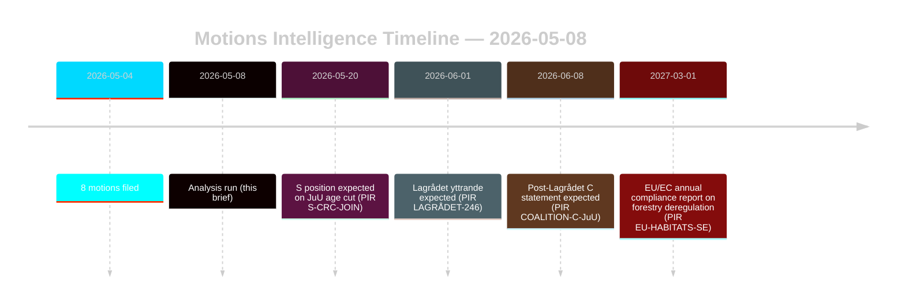

# 野党提案が森林・少年司法改革に挑戦

**著者**: ジェームス・ペター・ソーリング | **日付**: 2026-05-08 | **信頼度**: 高 [B2]
**分類**: 公開 | **GDPR**: 第9条(2)(e,g) — 公開された政治的立場

## 結論

2026-05-04に提出された8つの野党提案は、2つの政府提案に対する協調的な法的・戦略的挑戦を構成する：森林法規制緩和（prop. 2025/26:242, HD024141–145/147）と少年刑事司法改革（prop. 2025/26:246, HD024142/146/148）。政府多数派（175議席）は両措置を可決するが、センタープリエットの二重の逸脱—不十分な森林生産支援の拒否と同時に国連子どもの権利条約を根拠とした刑事責任年齢引き下げの阻止—が2026年選挙再編における決定的な情報シグナルである。**選挙近接コンテキスト**: スウェーデン総選挙（2026-09-13）まで128日を残し、これらの提案は立法手段と選挙キャンペーン位置付け文書として同時に機能する。DIW選挙近接乗数1.5×が適用される：現在採用される野党立場は秋のキャンペーン開始前に政党プラットフォームの公約として結晶化する。

## このブリーフィングが支援する決定事項

1. **連立監視**: S（94議席）がprop. 2025/26:246に対する国連子どもの権利条約の異議を明示的に支持するかどうかを追跡—その場合、政府多数派は憲法的に露出した措置において175-163に縮小する。
2. **EU準拠監視**: Naturvårdsverketがprop. 2025/26:242に関するEU生息地指令第6条およびNRL規則2024/1991の義務についてのコンプライアンス懸念を提出するかどうかを評価する。
3. **Lagrådet意見**: prop. 2025/26:246に関するLagrådets yttrande（法制諮問機関意見）は重要な決定の関門—否定的な調査結果は年齢引き下げ条項における政府撤退の確率を15%から30-40%に引き上げる。
4. **Cの再位置付け**: 2026年5月のCの二重逸脱が2026年以降の連立計算に影響を与える戦術的な選挙前の動きか構造的な政策変換かをモデル化する。

## 60秒のポイント

- **8つの提案、2つの政府提案**: 林業（MJU、5政党）と少年犯罪（JuU、3政党）は相互に相容れない要求による協調的反対に直面する。
- **選挙まで128日**: 現在採用される全ての野党立場はキャンペーンプラットフォームの公約として二倍化する。DIW選挙近接乗数1.5×は各逸脱シグナルを高める。
- **Cのピボット**: センタープリエットは異なる方向から両問題で逸脱する—より多くの森林生産支援を要求（HD024145）かつ刑事責任年齢引き下げに反対（HD024146、国連子どもの権利条約根拠）。純効果：Cは選挙後の柔軟性を最大化する。
- **法的露出**: 両提案は議会多数派とは独立して機能する国際法的脆弱性に直面する—EU違反（林業）と国連子どもの権利条約/ECHR挑戦（少年司法）。
- **Sの立場保留**: 社会民主党は年齢引き下げについてコミットしていない。94議席はこれが接戦投票（175-163）か快適な多数派になるかを決定する。
- **Lagrådetクリティカルパス**: prop. 2025/26:246に関する保留中のLagrådets yttrande（法制諮問機関意見）は最も可能性の高い近時制約イベントである（PIR LAGRÅDET-246）。
- **どちらの提案も多数派リスクなし**: 劇的な連立離脱がない限り政府は両措置を可決する—政治的結果が着地するのは今このリクスダーグ会期ではなく2026年選挙である。

## 最重要の将来トリガー

**PIR LAGRÅDET-246** — prop. 2025/26:246（少年刑事責任年齢の13歳への引き下げ）に関するLagrådets yttrande。数週間以内に予想される。否定的な調査結果は、委員会での国連子どもの権利条約適合性討論、Barnombudsmannenの正式声明、および政府修正の可能性を即座に引き起こす。

## 信頼度評価

全体として高 [B2] — 8つの提案はすべてdata.riksdagen.seの一次文書；政党立場、dok_ids、委員会ルーティングが確認済み。IMFによって格下げされた経済コンテキスト；SDMXプローブが失敗。WEO/FM財務データは該当する場合ヴィンテージスタンプ付きで引用。

<!-- source-sha: f606888bcd73f924a651e60009818030e9af3c63 -->
