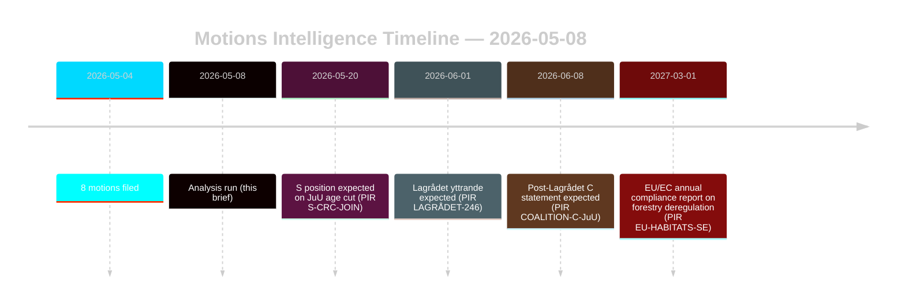

# 야당 발의안, 산림 및 소년 사법 개혁에 도전

**저자**: 제임스 페터 소를링 | **날짜**: 2026-05-08 | **신뢰도**: 높음 [B2]
**분류**: 공개 | **GDPR**: 제9조(2)(e,g) — 공개된 정치적 입장

## 결론

2026-05-04에 제출된 8개의 야당 발의안은 두 가지 정부 제안에 대한 조율된 법적·전략적 도전을 구성한다: 산림법 규제 완화(prop. 2025/26:242, HD024141–145/147)와 소년 형사 사법 개혁(prop. 2025/26:246, HD024142/146/148). 정부 다수파(175석)는 두 조치를 모두 통과시킬 것이지만, 센터르파르티엣의 이중 이탈—불충분한 산림 생산 지원 거부와 동시에 유엔 아동권리협약을 근거로 형사 책임 연령 인하 저지—은 2026년 선거 재편에서 결정적인 정보 신호이다. **선거 근접 맥락**: 스웨덴 총선(2026-09-13)까지 128일이 남은 가운데, 이 발의안들은 입법 수단과 선거 캠페인 포지셔닝 문서로 동시에 기능한다. DIW 선거 근접 배수 1.5×가 적용된다: 현재 채택되는 야당 입장은 가을 캠페인 개시 전에 정당 플랫폼 공약으로 결정화될 것이다.

## 이 브리핑이 지원하는 결정 사항

1. **연립 모니터링**: S(94석)가 prop. 2025/26:246에 대한 유엔 아동권리협약 이의를 명시적으로 지지하는지 추적—그 경우 정부 다수파는 헌법적으로 노출된 조치에서 175-163으로 축소된다.
2. **EU 준수 모니터링**: Naturvårdsverket이 prop. 2025/26:242에 관한 EU 서식지 지침 제6조 및 NRL 규정 2024/1991 의무에 대한 준수 우려를 제출하는지 평가한다.
3. **Lagrådet 의견**: prop. 2025/26:246에 관한 Lagrådets yttrande는 중요한 결정 관문—부정적인 결론은 연령 인하 조항에서 정부 철수 확률을 15%에서 30-40%로 높인다.
4. **C의 재포지셔닝**: 2026년 5월 C의 이중 이탈이 2026년 이후 연립 산수에 영향을 미치는 전술적 선거 전 기동인지 구조적 정책 변환인지 모델링한다.

## 60초 포인트

- **8개 발의안, 2개 정부 제안**: 산림업(MJU, 5개 정당)과 소년 범죄(JuU, 3개 정당)는 상호 양립할 수 없는 요구를 가진 조율된 반대에 직면한다.
- **선거까지 128일**: 현재 채택되는 모든 야당 입장은 캠페인 플랫폼 공약으로 두 배가 된다. DIW 선거 근접 배수 1.5×는 각 이탈 신호를 높인다.
- **C의 피벗**: 센터르파르티엣은 다른 방향에서 두 현안 모두에서 이탈한다—더 많은 산림 생산 지원 요구(HD024145)와 형사 책임 연령 인하 반대(HD024146, 유엔 아동권리협약 근거). 순효과: C는 선거 후 유연성을 극대화한다.
- **법적 노출**: 두 제안 모두 의회 다수파와 무관하게 작동하는 국제 법적 취약성에 직면한다—EU 위반(산림업)과 유엔 아동권리협약/유럽인권협약 도전(소년 사법).
- **S의 입장 보류**: 사회민주당은 연령 인하에 대해 약속하지 않았다. 94석은 이것이 접전 투표(175-163)가 될지 편안한 다수파가 될지를 결정한다.
- **Lagrådet 임계 경로**: prop. 2025/26:246에 관한 보류 중인 Lagrådets yttrande는 가장 가능성 높은 근시일 내 제약 이벤트이다(PIR LAGRÅDET-246).
- **어느 제안에서도 다수파 위험 없음**: 극적인 연립 이탈이 없는 한 정부는 두 조치를 모두 통과시킨다—정치적 결과가 착지하는 곳은 현재 이 릭스다그 회기가 아니라 2026년 선거이다.

## 가장 중요한 미래 트리거

**PIR LAGRÅDET-246** — prop. 2025/26:246(소년 형사 연령을 13세로 인하)에 관한 Lagrådets yttrande. 수 주 내 예상. 부정적인 결론은 위원회에서 유엔 아동권리협약 적합성 토론, Barnombudsmannen의 공식 성명, 그리고 정부 수정안 가능성을 즉시 촉발한다.

## 신뢰도 평가

전체적으로 높음 [B2] — 8개 발의안 모두 data.riksdagen.se의 1차 문서; 정당 입장, dok_ids, 위원회 라우팅 확인됨. IMF에 의해 강등된 경제적 맥락; SDMX 프로브 실패. WEO/FM 재무 데이터는 해당되는 경우 빈티지 스탬프와 함께 인용됨.

<!-- source-sha: f606888bcd73f924a651e60009818030e9af3c63 -->
