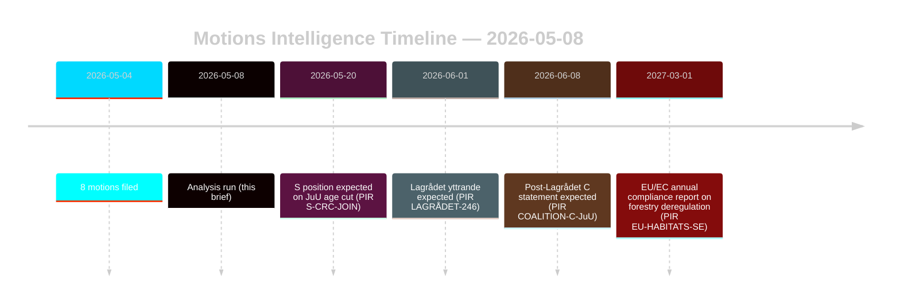

# Oppositiemoties dagen bosbouw- en jeugdstrafrechtshervormingen uit

**Auteur**: James Pether Sörling | **Datum**: 2026-05-08 | **Vertrouwen**: HOOG [B2]
**Classificatie**: OPENBAAR | **AVG**: Art. 9(2)(e,g) — openbaar gemaakte politieke standpunten

## Conclusie

Acht oppositiemoties ingediend op 2026-05-04 vormen gecoördineerde juridisch-strategische uitdagingen tegen twee regeringsproposities: de bosrechtderegulering (prop. 2025/26:242, HD024141–145/147) en de jeugdstrafrechtshervorming (prop. 2025/26:246, HD024142/146/148). De regeringsmeerderheid (175 zetels) zal beide maatregelen doorvoeren, maar de dubbele afwijking van Centerpartiet — afwijzing van onvoldoende bosproductiesteun terwijl tegelijkertijd de verlaging van de strafrechtelijke aansprakelijkheidsleeftijd wordt geblokkeerd op basis van het VN-Kinderrechtenverdrag — is het bepalende inlichtingensignaal voor de kiezersheroriëntatie van 2026. **Electorale nabijheidscontext**: Met nog 128 dagen tot de Zweedse algemene verkiezingen (2026-09-13) dienen deze moties tegelijkertijd als wetgevende instrumenten en campagnepositioneringsdocumenten. De DIW-verkiezingsnabijheidsmultiplier van 1,5× is van toepassing: oppositieposities die nu worden ingenomen, zullen kristalliseren in partijplatformverplichtingen voordat de herfstcampagne begint.

## Beslissingen die dit briefing ondersteunt

1. **Coalitietoezicht**: Bijhouden of S (94 zetels) de VN-Kinderrechtenverdragbezwaar tegen prop. 2025/26:246 expliciet onderschrijft — in dat geval krimpt de regeringsmeerderheid tot 175-163 op een constitutioneel blootgestelde maatregel.
2. **EU-nalevingstoezicht**: Beoordelen of Naturvårdsverket een nalevingsbekommernis indient over prop. 2025/26:242 met betrekking tot EU Habitatrichtlijn Art. 6 en NRL-verordening 2024/1991 verplichtingen.
3. **Lagrådet-advies**: Het Lagrådets yttrande over prop. 2025/26:246 is de kritische beslissingspoort — een negatief bevinding verhoogt de kans op regeringsterugtrekking van 15% naar 30-40% voor de leeftijdsverlagingsbepaling.
4. **C-herpositionering**: Modelleren of de dubbele afwijking van C in mei 2026 een tactische pre-verkiezingsmanoeuvre is of een structurele beleidswijziging die de coalitiewiskunde na 2026 beïnvloedt.

## Punten in 60 seconden

- **8 moties, 2 proposities**: Bosbouw (MJU, 5 partijen) en jeugdcriminaliteit (JuU, 3 partijen) staan voor gecoördineerde oppositie met onverenigbare eisen.
- **128 dagen tot de verkiezingen**: Alle nu ingenomen oppositieposities verdubbelen als campagneplatformverplichtingen. De DIW-verkiezingsnabijheidsmultiplier van 1,5× verhoogt elk afwijkingssignaal.
- **C-spilpunt**: Centerpartiet wijkt op beide kwesties af vanuit verschillende richtingen — eist meer bosproductiesteun (HD024145) EN verzet zich tegen de verlaging van de strafrechtelijke aansprakelijkheidsleeftijd (HD024146, VN-Kinderrechtenverdragbasis). Netto-effect: C maximaliseert post-verkiezingsflexibiliteit.
- **Juridische blootstelling**: Beide proposities staan voor internationale juridische kwetsbaarheden die onafhankelijk van de parlementaire meerderheid werken — EU-inbreuk (bosbouw) en VN-Kinderrechtenverdrag/EVRM-uitdaging (jeugdrecht).
- **S-positie in afwachting**: De sociaaldemocraten hebben zich niet uitgesproken over de leeftijdsverlaging. Hun 94 zetels zijn bepalend voor de vraag of dit een krappe stemming wordt (175-163) of een comfortabele meerderheid.
- **Lagrådet kritisch pad**: Het in afwachting zijnde Lagrådets yttrande over prop. 2025/26:246 is het meest waarschijnlijke nabije beperkende evenement (PIR LAGRÅDET-246).
- **Geen meerderheidsrisico bij beide proposities**: De regering voert beide maatregelen door tenzij er een dramatische coalitie-afvalligheid plaatsvindt — de verkiezingen 2026, niet deze Riksdag-periode, is waar de politieke gevolgen landen.

## Meest kritieke toekomstige trigger

**PIR LAGRÅDET-246** — Lagrådets yttrande over prop. 2025/26:246 (verlaging van de strafrechtelijke jeugdleeftijd naar 13). Binnen weken verwacht. Een negatief bevinding triggert onmiddellijk een debat over VN-Kinderrechtenverdragcompatibiliteit in de commissie, de formele verklaring van de Barnombudsmannen en waarschijnlijke regeringswijziging.

## Vertrouwensbeoordeling

Totaal HOOG [B2] — alle acht moties zijn primaire documenten van data.riksdagen.se; partijposities, dok_ids en commissierouting bevestigd. IMF-gedegradeerde economische context; SDMX-probes mislukt. WEO/FM financiële gegevens indien van toepassing geciteerd met jaargangsmarkering.

<!-- source-sha: f606888bcd73f924a651e60009818030e9af3c63 -->
