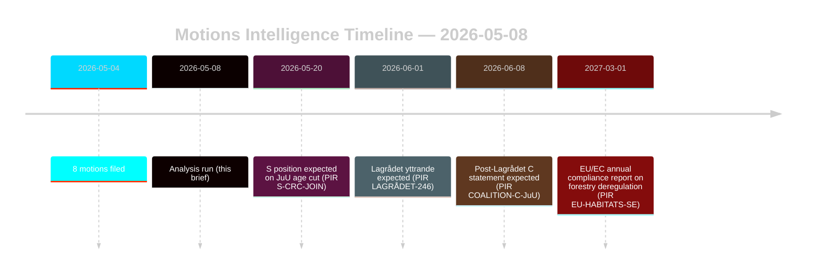

# Opposisjonsforslag utfordrer skogbruks- og ungdomsstrafferettsreformer

**Forfatter**: James Pether Sörling | **Dato**: 2026-05-08 | **Konfidens**: HØY [B2]
**Klassifisering**: OFFENTLIG | **GDPR**: Art. 9(2)(e,g) — offentliggjorte politiske standpunkter

## Konklusjon

Åtte opposisjonsforslag innlevert 2026-05-04 monterer koordinerte juridisk-strategiske utfordringer mot to regjeringsproposasjoner: skoglovgivningsdereguleringen (prop. 2025/26:242, HD024141–145/147) og ungdomsstrafferettsreformen (prop. 2025/26:246, HD024142/146/148). Regjeringsflertallet (175 seter) vil vedta begge tiltakene, men Senterpartiets (Centerpartiet) doble frafall — motstand mot utilstrekkelig skogproduksjonsstøtte og blokkering av kriminell lavalderssenkingen på FN-barnekonvensjonsgrunnlag — er det avgjørende etterretningssignalet for valgrealignment i 2026. **Valgperiodekontekst**: Med 128 dager til det svenske valget (2026-09-13) fungerer disse forslagene simultant som lovgivningsinstrumenter og kampanjeposisjoneringsdokumenter. 1,5×-DIW-valgperiodsmultiplikatoren gjelder: opposisjonens standpunkter satt nå vil krystallisere seg i partiplattformforpliktelser før høstkampanjen åpner.

## Beslutninger dette notatet støtter

1. **Koalisjonsovervåking**: Spor om S (94 seter) eksplisitt slutter seg til FN-barnekonvensjonsinnsigelsen mot prop. 2025/26:246 — i så fall snevrer regjeringsflertallet inn til 175-163 på et konstitusjonelt eksponert tiltak.
2. **EU-etterlevelsesovervåking**: Vurder om Naturvårdsverket inn sender en etterlevelsesbekymring for prop. 2025/26:242 om EU habitatdirektiv art. 6 og NRL-forordningen 2024/1991.
3. **Lagrådets uttalelse**: Lagrådets yttrande om prop. 2025/26:246 er det kritiske beslutningsgaten — et negativt funn øker regjeringens tilbaketrekningssannsynlighet fra 15% til 30-40% på lavalderssenkningsbestemmelsen.
4. **C-repositionering**: Modelér om Cs doble frafall i mai 2026 er et taktisk forhåndsvalgtrekk eller et strukturelt politikkskifte som påvirker koalisjonsmatematikken etter 2026.

## 60-sekunders punkter

- **8 forslag, 2 proposisjoner**: Skog (MJU, 5 partier) og ungdomskriminalitet (JuU, 3 partier) møter koordinert opposisjon med uforenlige krav.
- **128 dager til valg**: Alle opposisjonsstandpunkter satt nå dobles som kampanjeplattformforpliktelser. 1,5×-DIW-valgperiodsmultiplikatoren hever ethvert frafallssignal.
- **Cs sentralpunkt**: Centerpartiet avviker på begge spørsmål fra forskjellige retninger — krever mer skogproduksjonsstøtte (HD024145) OG motsetter seg kriminell lavalder (HD024146, FN-barnekonvensjonsgrunnlag). Nettoeffekt: C maksimerer fleksibilitet etter valget.
- **Rettslig eksponering**: Begge proposisjonene møter internasjonale juridiske sårbarheter som virker uavhengig av parlamentarisk flertall — EU-brudd (skog) og FN-barnekonvensjon/EMK-utfordring (ungdomsjustis).
- **S-standpunkt utestående**: Sosialdemokratene har ikke forpliktet seg på kriminell lavalder. Deres 94 seter er avgjørende for om dette blir en jevn avstemning (175-163) eller et komfortabelt flertall.
- **Lagrådet kritisk vei**: Avventende Lagrådets yttrande om prop. 2025/26:246 er den mest sannsynlige nære fremtidige tvangshendelsen (PIR LAGRÅDET-246).
- **Ingen flertallsrisiko på noen proposisjon**: Regjeringen vedtar begge tiltakene med mindre et dramatisk koalisjonsavfall oppstår — valget 2026, ikke denne riksdagsperioden, er der de politiske konsekvensene lander.

## Viktigste fremtidige utløser

**PIR LAGRÅDET-246** — Lagrådets yttrande om prop. 2025/26:246 (senkelse av ungdoms kriminelle lavalder til 13). Forventet innen uker. Et negativt funn utløser umiddelbar FN-barnekonvensjonskompatibilitetsdebatt i komiteen, Barnombudsmannens formelle uttalelse og sannsynlig regjeringsendring.

## Konfidensgrad

Samlet HØY [B2] — alle åtte forslag er primærdokumenter fra data.riksdagen.se; partistandpunkter, dok_ids og komitérouting bekreftet. IMF-nedgradert økonomisk kontekst; SDMX-prober mislyktes. WEO/FM finansdata sitert der relevant med årgangsstempel.

<!-- source-sha: f606888bcd73f924a651e60009818030e9af3c63 -->
