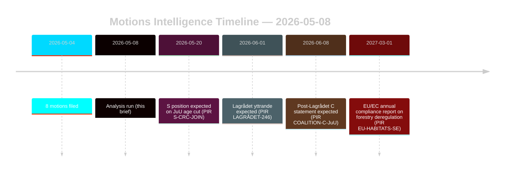

# Oppositionsmotioner utmanar skogs- och ungdomsrättsreformer

**Författare**: James Pether Sörling | **Datum**: 2026-05-08 | **Konfidensgrad**: HÖG [B2]
**Klassificering**: OFFENTLIG | **GDPR**: Art. 9(2)(e,g) — offentliggjorda politiska ståndpunkter

## Slutsats

Åtta oppositionsmotioner inlämnade 2026-05-04 monterar samordnade rättslig-strategiska utmaningar mot två regeringspropositioner: skogsavregleringen (prop. 2025/26:242, HD024141–145/147) och ungdomsstraffrättsreformen (prop. 2025/26:246, HD024142/146/148). Regeringens majoritet (175 platser) kommer att passera båda åtgärderna, men Centerpartiets dubbla avhopp — motstånd mot otillräckligt stöd för skogsproduktion och ett samtidigt blockande av straffmyndighetsålderssänkningen på FN:s barnkonventionsgrunder — är den avgörande underrättelsesignalen för 2026 års valrealignment. **Valperiodkontext**: Med 128 dagar kvar till det svenska riksdagsvalet (2026-09-13) fungerar dessa motioner samtidigt som lagstiftningsinstrument och kampanjpositioneringsdokument. 1,5×-DIW-valperiodsmultiplikatorn gäller: oppositionens ståndpunkter som staks ut nu kommer att kristalliseras i partiplatformsåtaganden innan höstkampanjen öppnar.

## Beslut detta underlag stöder

1. **Koalitionsövervakning**: Spåra om S (94 platser) uttryckligen stödjer FN:s barnkonventionsinvändningen mot prop. 2025/26:246 — i så fall minskar regeringsmajoriteten till 175-163 på en konstitutionellt exponerad åtgärd.
2. **EU-efterlevnadsövervakning**: Bedöm om Naturvårdsverket lämnar in en efterlevnadshänsyn angående prop. 2025/26:242 beträffande skyldigheterna i EU:s habitatdirektiv art. 6 och NRL-förordningen 2024/1991.
3. **Lagrådets yttrande**: Lagrådets yttrande om prop. 2025/26:246 är det kritiska beslutssteget — ett negativt utlåtande ökar sannolikheten för regeringens reträtt från 15% till 30-40% avseende ålderssänkningsbestämmelsen.
4. **C:s ompositionering**: Modellera huruvida C:s dubbla avhopp i maj 2026 är ett taktiskt val-förval-val eller ett strukturellt politikskifte som påverkar koalitionsmatematikmöjligheterna efter 2026.

## 60-sekunders sammanfattning

- **8 motioner, 2 propositioner**: Skogen (MJU, 5 partier) och ungdomsbrottslighet (JuU, 3 partier) möter samordnad opposition med oförenliga krav.
- **128 dagar till valet**: Alla oppositionsståndpunkter som staks ut nu fördubblas som kampanjplatformsåtaganden. 1,5×-DIW-valperiodsmultiplikatorn höjer varje avhoppssignal.
- **C:s vridpunkt**: Centerpartiet avviker på båda frågorna från olika håll — kräver mer stöd för skogsproduktion (HD024145) OCH motsätter sig kriminell straffmyndighetsålder (HD024146, FN:s barnkonventionsgrunds). Nettoeffekt: C maximerar flexibilitet efter valet.
- **Rättslig exponering**: Båda propositionerna möter internationella rättsliga sårbarheter som verkar oberoende av parlamentarisk majoritet — EU-intrång (skog) och FN:s barnkonvention/ECHR-utmaning (ungdomsrättvisa).
- **S:s ståndpunkt oklar**: Socialdemokraterna har inte åtagit sig angående kriminell straffmyndighetsålder. Deras 94 platser är avgörande för om detta blir en jämn omröstning (175-163) eller en bekväm majoritet.
- **Lagrådet kritisk väg**: Lagrådets yttrande om prop. 2025/26:246 är den mest sannolika nära framtida tvingande händelsen (PIR LAGRÅDET-246).
- **Ingen majoritetsrisk på någon proposition**: Regeringen passerar båda åtgärderna om inte ett dramatiskt koalitionsavhopp sker — valet 2026, inte den här riksdagsperioden, är där de politiska konsekvenserna landar.

## Viktigaste framtida trigger

**PIR LAGRÅDET-246** — Lagrådets yttrande om prop. 2025/26:246 (sänkning av ungdomens straffrättsliga ålder till 13). Förväntas inom veckor. Ett negativt utlåtande utlöser omedelbar FN:s barnkonventionskompatibilitetsdebatt i utskottet, Barnombudsmannens formella uttalande och trolig regeringsändring.

## Konfidensgrad

Övergripande HÖG [B2] — alla åtta motioner är primärdokument från data.riksdagen.se; partiståndpunkter, dok_ids och utskottsrouting bekräftade. IMF-nedgraderat ekonomiskt sammanhang; SDMX-prober misslyckades. WEO/FM finansdata citerad där tillämpligt med årgångsstämpel.

<!-- source-sha: f606888bcd73f924a651e60009818030e9af3c63 -->
