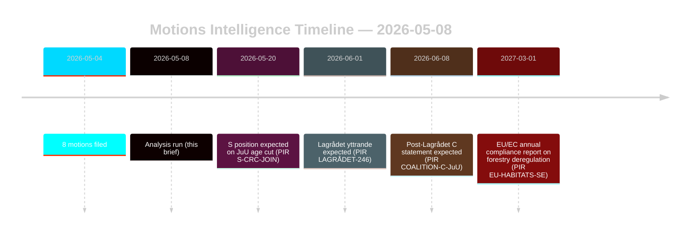

# 反对党提案挑战林业与少年司法改革

**作者**：詹姆斯·彼得·索尔林 | **日期**：2026-05-08 | **可信度**：高 [B2]
**分类**：公开 | **GDPR**：第9条(2)(e,g) — 已公开的政治立场

## 结论

2026-05-04提交的八项反对党提案构成了针对两项政府提案的协调法律-战略挑战：林业法规放松（prop. 2025/26:242, HD024141–145/147）和少年刑事司法改革（prop. 2025/26:246, HD024142/146/148）。政府多数派（175席）将通过这两项措施，但中间党的双重背离——拒绝不足的林业生产支持，同时以联合国《儿童权利公约》为由阻止降低刑事责任年龄——是2026年选举重新排列的决定性情报信号。**选举临近背景**：距瑞典大选（2026-09-13）还有128天，这些提案同时充当立法工具和竞选定位文件。DIW选举临近乘数1.5×适用：现在采取的反对党立场将在秋季竞选开始前结晶为政党平台承诺。

## 本简报支持的决策

1. **联盟监控**：追踪S（94席）是否明确认可对prop. 2025/26:246的联合国儿童权利公约异议——如是，政府多数派在宪法暴露的措施上缩减至175-163。
2. **欧盟合规监控**：评估Naturvårdsverket是否就prop. 2025/26:242提交关于欧盟栖息地指令第6条和NRL法规2024/1991义务的合规关切。
3. **Lagrådet意见**：关于prop. 2025/26:246的Lagrådets yttrande是关键决策门户——负面发现将政府在年龄降低条款上撤退的可能性从15%提升至30-40%。
4. **C的重新定位**：建模2026年5月C的双重背离是影响2026年后联盟算术的选举前战术机动还是结构性政策转变。

## 60秒要点

- **8项提案，2项政府提案**：林业（MJU，5个政党）和少年犯罪（JuU，3个政党）面临要求不相容的协调反对。
- **距选举128天**：所有现在采取的反对党立场都将作为竞选平台承诺翻倍。DIW选举临近乘数1.5×提升每个背离信号。
- **C的轴转**：中间党从不同方向在两个问题上背离——要求更多林业生产支持（HD024145）并反对降低刑事责任年龄（HD024146，儿童权利公约依据）。净效果：C最大化选举后灵活性。
- **法律暴露**：两项提案都面临独立于议会多数派运作的国际法律脆弱性——欧盟违规（林业）和儿童权利公约/欧洲人权公约挑战（少年司法）。
- **S立场待定**：社会民主党尚未就年龄降低表态。其94席对这是否成为接近投票（175-163）或舒适多数起决定性作用。
- **Lagrådet关键路径**：关于prop. 2025/26:246的待发布Lagrådets yttrande是最可能的近期制约事件（PIR LAGRÅDET-246）。
- **两项提案均无多数风险**：除非发生戏剧性的联盟背叛，政府将通过两项措施——政治后果落地的地方是2026年选举而非当前议会届期。

## 最重要的未来触发器

**PIR LAGRÅDET-246** — 关于prop. 2025/26:246（将少年刑事年龄降至13岁）的Lagrådets yttrande。预计在数周内。负面发现立即触发委员会关于儿童权利公约兼容性的辩论、Barnombudsmannen的正式声明和可能的政府修正案。

## 可信度评估

总体高 [B2] — 八项提案均为data.riksdagen.se的原始文件；政党立场、dok_ids和委员会路由已确认。IMF降级的经济背景；SDMX探测失败。WEO/FM财务数据在适用时以年份戳记引用。

<!-- source-sha: f606888bcd73f924a651e60009818030e9af3c63 -->
