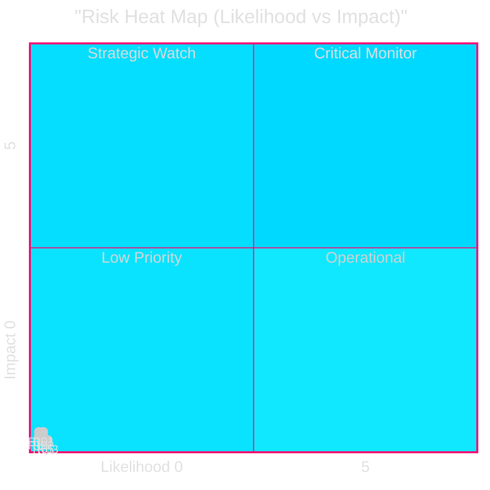

# Risk Assessment: Opposition Motions 2026-05-08

**Author**: James Pether Sörling | **Date**: 2026-05-08
**Framework**: 5-dimension L×I register (Likelihood × Impact, 1-5 scale)

## Risk Register

| ID | Risk | Likelihood (L) | Impact (I) | L×I | Horizon | Owner |
|----|------|---------------|-----------|-----|---------|-------|
| R01 | EU infringement proceedings on prop. 2025/26:242 (Habitats Directive) | 3 | 5 | **15** | T+365d | Naturvårdsverket/EC |
| R02 | Lagrådet negative yttrande on criminal age cut triggers government retreat | 3 | 4 | **12** | T+30d | Lagrådet |
| R03 | CRC treaty body complaint filed against Sweden after law passes | 4 | 3 | **12** | T+180d | UN Committee on Rights of Child |
| R04 | C withdraws from government-adjacent support arrangement before election | 2 | 5 | **10** | T+120d | Centerpartiet |
| R05 | S explicitly joins JuU opposition coalition, making vote close (163 vs 175) | 3 | 3 | **9** | T+14d | Socialdemokraterna |
| R06 | Constitutional complaint (forfatningsdomstol) on prop. 2025/26:246 | 2 | 4 | **8** | T+365d | Legal advocacy orgs |
| R07 | Skogsbruksbranschen (Swedish Forest Industries) opposes prop. 2025/26:242 as insufficient (SD direction) | 3 | 2 | **6** | T+14d | LRF/Skogsindustrierna |
| R08 | Media narrative coheres around "Sweden becomes lowest criminal-age country in OECD" | 3 | 2 | **6** | T+60d | International press |
| R09 | Implementation failure: Kriminalvården capacity gap for under-15 detention | 2 | 3 | **6** | T+365d | Kriminalvården |
| R10 | Governance risk: Riksdag committee (JuU) issues dissenting statement triggering public inquiry | 2 | 2 | **4** | T+30d | JuU/Riksdag |

## Top 3 Risks

### R01 — EU Infringement Proceedings on Forestry (L×I = 15)
**Scenario**: EC formal notice in Q3 2027 after annual NRL compliance assessment finds prop. 2025/26:242 incompatible with Habitats Directive Art. 6.
**Controls**: Naturvårdsverket compliance opinion (monitoring), MJU committee conditions on proposition, post-passage subsidiary guidelines.
**Residual risk after controls**: 8 (3×3 after Naturvårdsverket mitigation reduces Impact by 1).

### R02 — Lagrådet Negative Yttrande (L×I = 12)
**Scenario**: Lagrådet concludes criminal age cut to 13 is incompatible with CRC Art. 40(3)(a) as incorporated into Swedish law (lag 2018:1197). Government must either amend or formally declare overriding parliament.
**Controls**: Government has legal memo defending compatibility; government could accept Lagrådet's recommendation.
**Residual risk after controls**: 9 (if government amends, impact reduces to 3).

### R03 — CRC Treaty Body Complaint (L×I = 12)
**Scenario**: NGOs and Barnombudsmannen file complaint with UN Committee on the Rights of the Child post-enactment. Sweden faces formal compliance procedure.
**Controls**: Government can argue the age cut applies only to trial procedure, not criminal responsibility per se.
**Residual risk after controls**: 8 (likelihood remains 4; impact reduces to 2 with narrow legal framing).

## Risk Heat Map

