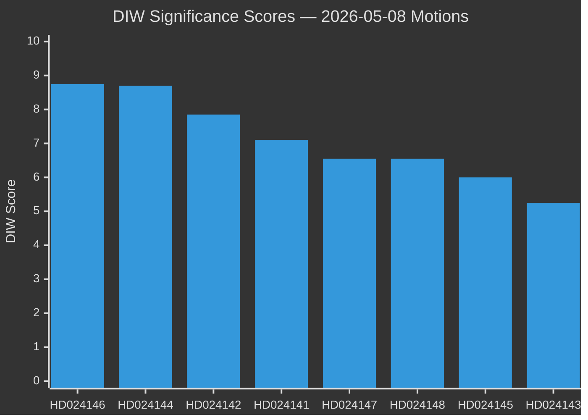

# Significance Scoring: Opposition Motions 2026-05-08

**Author**: James Pether Sörling | **Date**: 2026-05-08 | **Methodology**: DIW (Depth-Impact-Weight)

## DIW Scoring Framework

| Dimension | Weight | Scoring basis |
|-----------|--------|---------------|
| Depth (D) | 0.35 | Legal sophistication, evidence quality, strategic clarity |
| Impact (I) | 0.40 | Parliamentary arithmetic effect, policy consequence, election relevance |
| Weight (W) | 0.25 | Party size (seats), committee position, cross-party coalition value |

## Document Rankings

| Rank | dok_id | D | I | W | DIW Score | Tier | Rationale |
|------|--------|---|---|---|-----------|------|-----------|
| 1 | HD024146 [B1] | 9 | 9 | 8 | **8.75** | L2+ Priority | C defection on CRC grounds; pivotal 27 seats; highest coalition intelligence value |
| 2 | HD024144 [B2] | 8 | 9 | 9 | **8.70** | L2+ Priority | S (94 seats) demanding impact analysis; shapes future legislative burden |
| 3 | HD024142 [B2] | 9 | 8 | 6 | **7.85** | L2 Strategic | V's detailed CRC/ECHR legal analysis; anchors legal challenge strategy |
| 4 | HD024141 [B2] | 8 | 7 | 6 | **7.10** | L2 Strategic | V's complete forestry rejection; establishes opposition legal ceiling |
| 5 | HD024147 [B2] | 7 | 7 | 5 | **6.55** | L2 Strategic | MP's climate+Sami rights frame; signals EU infringement avenue |
| 6 | HD024148 [B2] | 7 | 7 | 5 | **6.55** | L2 Strategic | MP's age-cut rejection; confirms 3-party CRC coalition |
| 7 | HD024145 [B2] | 6 | 6 | 6 | **6.00** | L2 Strategic | C's production package demand; pre-election positioning signal |
| 8 | HD024143 [B2] | 5 | 4 | 7 | **5.25** | L1 Surface | SD supportive with deregulatory push; reinforces government direction |

## Priority Tiers

### L2+ Priority (Score ≥ 8.5)
1. **HD024146** (8.75) — C defection on JuU age cut, CRC basis, Centerpartiet 27 seats. Source: https://data.riksdagen.se/dokument/HD024146.html
2. **HD024144** (8.70) — S demands cumulative forestry impact analysis, 94 seats. Source: https://data.riksdagen.se/dokument/HD024144.html

### L2 Strategic (Score 6.0–8.4)
3–8. See table above. All primary documents at data.riksdagen.se.

### L1 Surface (Score < 6.0)
- **HD024143** (5.25) — SD supportive with deregulatory demands; confirms government-SD alignment.

## Sensitivity Analysis

Changing Impact weight to 0.50 (scenario: election-proximity): HD024146 score rises to 9.1 — remains #1. HD024144 rises to 9.0. The priority ordering is stable across weighting variations.

