# Synthesis Summary: Opposition Motions 2026-05-08

**Author**: James Pether Sörling | **Confidence**: HIGH [B2] | **Date**: 2026-05-08
**Riksmöte**: 2025/26 | **Run ID**: 25456511000 | **Effective data date**: 2026-05-04

## Core Intelligence Finding

Eight opposition committee motions filed 2026-05-04 articulate two structurally distinct coalition challenges to the Tidö-adjacent government majority. The dominant dynamic is a **bipartisan cross-bloc opposition** against the government's flagship forestry deregulation (prop. 2025/26:242) and youth criminal justice reform (prop. 2025/26:246). Both measures face the same structural vulnerability: EU/international law compliance risks that open infringement proceedings or human rights challenge pathways independent of parliamentary arithmetic.

**Lead story**: Centerpartiet's dual cross-bench defection — opposing the forestry deregulation's insufficiency (demanding more production support, HD024145) AND opposing the criminal responsibility age cut (CRC grounds, HD024146) — signals that C's extra-parliamentary "support with conditions" stance toward the Tidö cabinet is fragmenting ahead of the 2026 election.

## DIW-Weighted Document Ranking

| Rank | dok_id | DIW tier | Significance | Primary intelligence value |
|------|--------|----------|--------------|---------------------------|
| 1 | HD024146 | L2+ Priority | HIGH | C defection on JuU age cut; pivotal seat maths |
| 2 | HD024144 | L2+ Priority | HIGH | S demand for cumulative forestry impact analysis |
| 3 | HD024142 | L2 Strategic | MEDIUM-HIGH | V legal challenge to CRC/ECHR compatibility |
| 4 | HD024141 | L2 Strategic | MEDIUM-HIGH | V complete rejection of forestry prop |
| 5 | HD024147 | L2 Strategic | MEDIUM | MP complete rejection, climate/Sami rights frame |
| 6 | HD024148 | L2 Strategic | MEDIUM | MP rejection of age cut and specific penalties |
| 7 | HD024145 | L2 Strategic | MEDIUM | C demand for broader forestry production package |
| 8 | HD024143 | L1 Surface | LOWER | SD supportive but deregulatory push |

## Integrated Intelligence Picture

### Forestry Deregulation (MJU cluster: HD024141/143/144/145/147)

Prop. 2025/26:242 reduces samrådsplikten (environmental consultation), shortens avverkningsanmälan window from 6 to 3 weeks, restricts NGO appeal rights, and routes Skogsstyrelsen decisions to mark- och miljödomstol. The five-party response creates an incoherent opposition: V+MP demand total rejection on environmental/human rights grounds; S demands procedural safeguards and impact analysis; SD demands even more deregulation; C demands a broader production package. No alternative majority exists — the government's 175-seat bloc passes the proposition. The **infringement risk** (EU Habitats Directive Art. 6, NRL Regulation 2024/1991) and **Sami rights risk** (ILO Conv. 169) are the externally-imposed constraints that may yet require government modifications.

### Youth Criminal Justice (JuU cluster: HD024142/146/148)

Prop. 2025/26:246 lowers criminal responsibility age from 15 to 13 for allvarliga brott (5-year pilot), tightens ungdomsövervakning, reduces ungdomsreduktionen for ages 18-20. The cross-bloc V+C+MP coalition (69 seats) opposes on CRC Art. 40(3)(a) grounds. If S (94 seats) joins — likely given S party platform on CRC — the opposition reaches 163 seats, leaving government 175-163 = 12-seat margin on a constitutionally sensitive measure. The critical path is the Lagrådet yttrande (pending): if Lagrådet flags CRC incompatibility, the probability of government retreat from the age-cut provision rises from ~15% to ~30-40% (PIR LAGRÅDET-246, carried forward).

## Cross-Cluster Strategic Assessment

Both clusters share the same meta-vulnerability: **international legal exposure** that bypasses parliamentary majority. The government coalition (M+KD+SD+L) can pass both propositions, but:
- The forestry deregulation invites EU infringement proceedings (Naturvårdsverket compliance opinion outstanding)
- The youth criminal justice reform invites CRC challenge via Barnombudsmannen and international treaty bodies

**Election-2026 implications**: C's dual defection on both measures widens the policy distance between C and the government bloc in the 12 months before the election. This repositions C toward a "constructive centrist opposition" framing that maximises their post-election coalition optionality.

```mermaid
%%{init: {'theme': 'dark', 'themeVariables': {'primaryColor': '#00d9ff', 'primaryTextColor': '#e0e0e0', 'primaryBorderColor': '#ff006e', 'lineColor': '#ffbe0b', 'secondaryColor': '#1a1e3d', 'tertiaryColor': '#0a0e27'}}}%%
flowchart TD
    subgraph FORESTRY["🌲 Prop 2025/26:242 — Forestry (MJU)"]
        F1["V (24): Reject fully\nHD024141 [B2]"]
        F2["S (94): Demand impact analysis\nHD024144 [B2]"]
        F3["MP (18): Reject fully\nHD024147 [B2]"]
        F4["C (27): More production support\nHD024145 [B2]"]
        F5["SD (62): More deregulation\nHD024143 [B2]"]
    end
    subgraph JUU["⚖️ Prop 2025/26:246 — Youth Crime (JuU)"]
        J1["V (24): Reject age cut + penalties\nHD024142 [B2]"]
        J2["C (27): Reject age cut — CRC\nHD024146 [B1]"]
        J3["MP (18): Reject age cut\nHD024148 [B2]"]
    end
    GOV["Government Bloc\nM+KD+SD+L\n175 seats"]
    EU["EU Infringement Risk\nHabitats Dir. Art.6\nNRL 2024/1991"]
    CRC["CRC Art.40(3)(a)\nLagrådet review\nBarnombudsmannen"]
    GOV --> FORESTRY
    GOV --> JUU
    FORESTRY --> EU
    JUU --> CRC
    style GOV fill:#1a1e3d,stroke:#ffbe0b
    style EU fill:#8b0000,stroke:#ff006e
    style CRC fill:#8b0000,stroke:#ff006e
    style F2 fill:#ff6b35,stroke:#ff006e
    style J2 fill:#00d9ff,stroke:#0a0e27
```

---

## Pass 2 — Intelligence Refinements (2026-05-08)

### Refinement 1: C Strategic Calculation — Historical Anchor

C's dual defection in May 2026 is most accurately understood through the Januariöverenskommelsen lens (historical-parallels.md, Parallel 3). In 2019, C's simultaneous left-and-right demands produced 27 specific policy concessions in exchange for supporting an S-MP government. The May 2026 dual filing (HD024145 for rural economy, HD024146 for CRC compliance) replicates this structure: C is establishing leverage positions on both right-flank and left-flank issues simultaneously, 12 months before the election, to maximise its post-election coalition optionality regardless of which bloc wins.

**Confidence upgrade from MODERATE to HIGH [B2→B1]** on assessment that C's dual defection is deliberate strategic positioning (ACH H1 dominant).

### Refinement 2: Lagrådet Probability Calibration

The 35% probability assigned to a significant Lagrådet finding (risk-assessment.md R02) is calibrated above the historical base rate of 15-20% for significant youth justice concerns, because:
1. The CRC Art. 40(3)(a) argument is novel — no prior Swedish Lagrådet yttrande has specifically applied this article to age-threshold questions
2. The age of 13 is a clean threshold violation of OECD and Nordic norms, which Lagrådet may flag as evidence of treaty non-compliance
3. Barnombudsmannen's statutory mandate requires them to formally submit to Lagrådet on CRC compatibility — this submission will likely frame the argument most precisely

**Confidence on 35% Lagrådet concern probability: MODERATE [C2]** — the calibration is reasonable but uncertain because the legal argument is novel.

### Refinement 3: S Position — The Determinative Variable

The most important intelligence gap is S's position on prop. 2025/26:246. Three indicators should be monitored by 2026-05-20 (T+14):
1. Whether S tables a JuU motion (highly visible signal)
2. Whether S's party group spokesperson on justice makes a public statement on criminal age
3. Whether S's Barnombudsmannen shadow minister releases a statement on CRC compliance

Currently assessed as S-abstains-or-votes-government (P=80%) vs S-joins-opposition (P=15%) vs S-undecided-until-late (P=5%). S's prior vote in favour of lowering age to 14 (2022) is the primary evidence for maintaining the P=80% assessment.

### Refinement 4: EU Infringement — Mechanism Precision

The Finnish 2024 precedent (comparative-international.md, EC case 2024/2158) is the most direct risk signal for prop. 2025/26:242. The mechanism:
1. Sweden passes deregulation → Naturvårdsverket reviews compliance
2. If no binding compatibility opinion within 90 days of enactment → EC annual NRL report (2027) identifies gap
3. EC formal notice within 6 months of report → Infringement proceedings begin
4. Swedish courts may suspend enforcement of the expanded exemption pending EC clearance

This four-step mechanism has an 18-24 month timeline from enactment to enforcement suspension — meaning it would land in 2028, well after the 2026 election. The government's communication strategy will emphasise "this is under review" to defer the political cost.

**Assessment**: The EU infringement risk is a DEFERRED electoral cost, not an IMMEDIATE one. Its intelligence value is as a long-term reputational threat and potential post-election litigation liability, not as a 2026 campaign issue.
