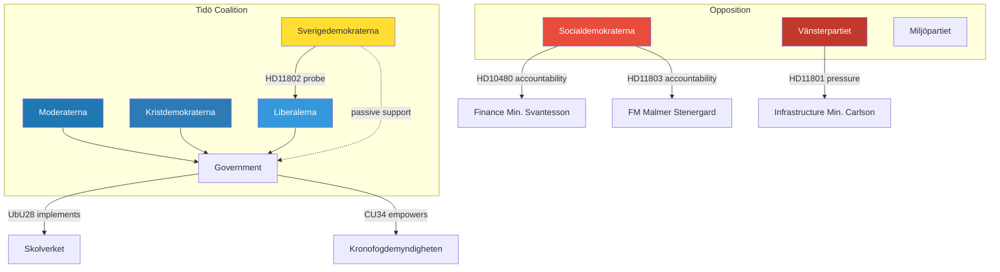
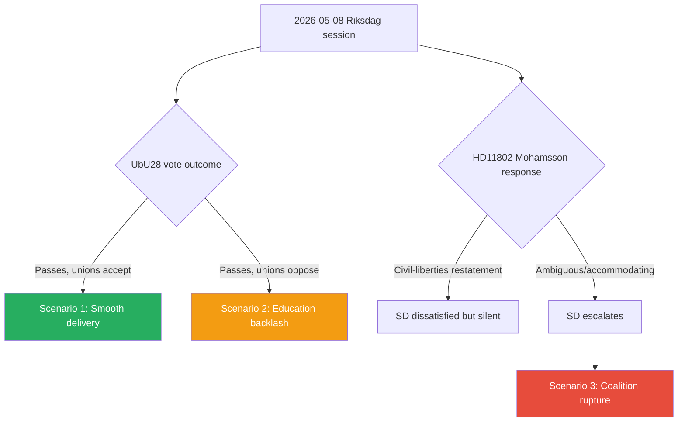
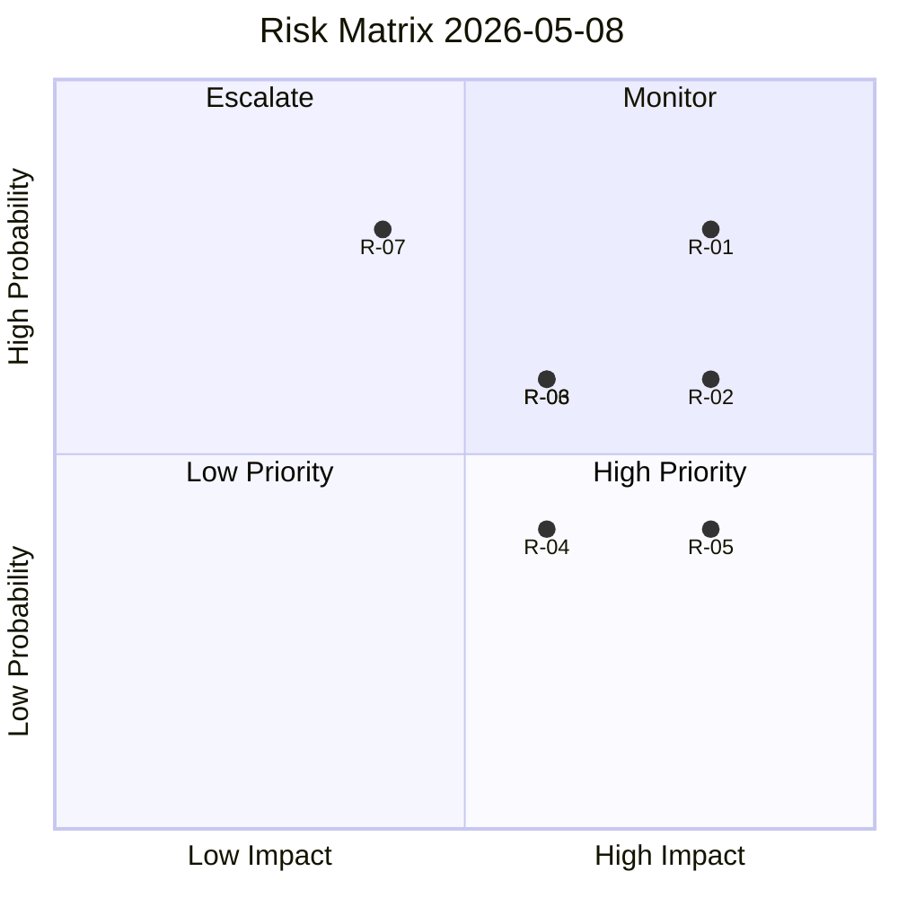
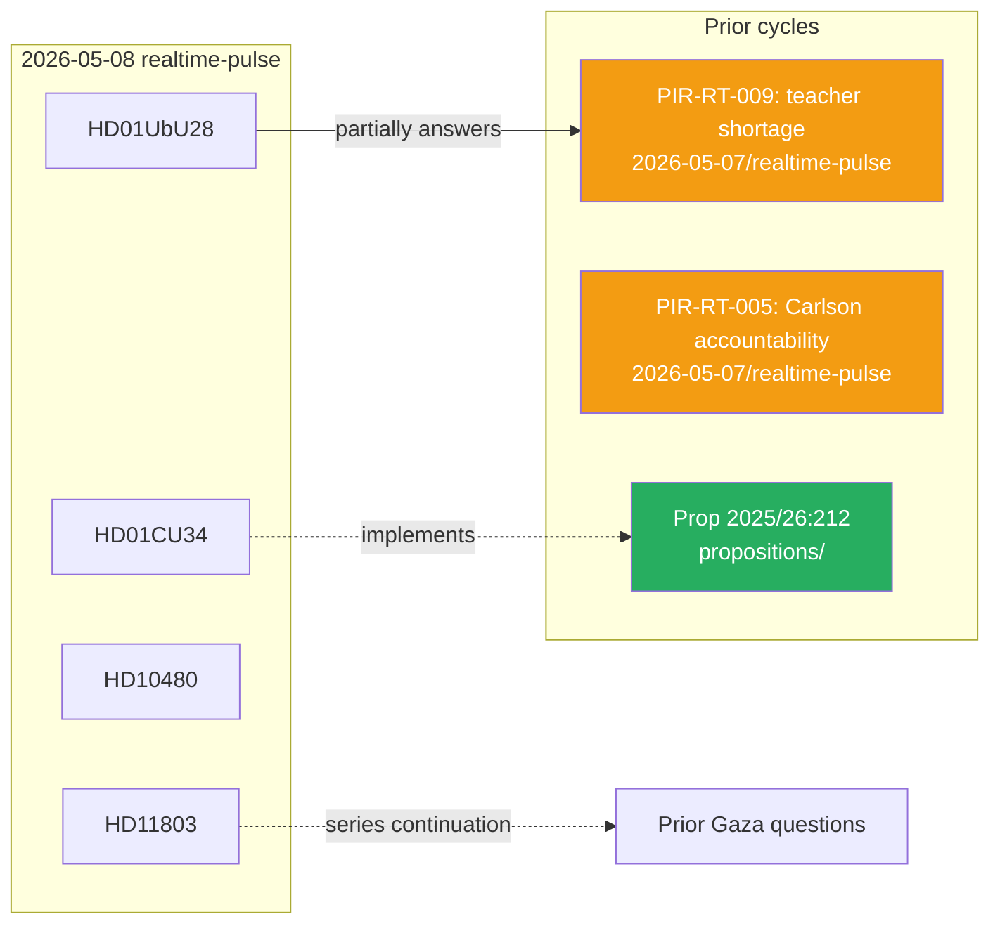

## Executive Brief
<!-- source: executive-brief.md :: https://github.com/Hack23/riksdagsmonitor/blob/main/analysis/daily/2026-05-08/realtime-pulse/executive-brief.md -->

---

### Top Line

The Riksdag chamber on 8 May 2026 debates two significant committee reports: **UbU28** (teacher qualifications in the new 10-year compulsory school — DIW 8/9) and **CU34** (modernised debt-enforcement rules — DIW 7/9). Four written questions probe the government on business security, rural broadband, a face-veil ban, and Swedish citizens' safety in international waters near Israel.

---

### Key Developments

#### 1. Teacher Credentials — UbU28 (Priority)
Utbildningsutskottets betänkande UbU28 implements credential and licensing rules for teachers in the new tioårig grundskola. With Sweden facing a **45,000 teacher shortage**, transitional provisions will determine whether reform helps or deepens the crisis. This is a **marquee 2026 election issue** — education quality, teacher pay, and school outcomes are the top voter concerns for S, MP, and swing voters. The government must demonstrate the reform improves teacher quality without creating classroom vacancies.

#### 2. Debt-Enforcement Modernisation — CU34 (Strategic)
Civilutskottets betänkande CU34 advances digital distansutmätning (remote enforcement) for Kronofogdemyndigheten. Expected cross-bloc support; this is primarily a technical civil-law modernisation. Main risk: proportionality in enforcement against indebted individuals without digital access.

#### 3. Interpellation on Tax Residence — HD10480 (Strategic)
S's Niklas Karlsson challenges Finance Minister Svantesson on October 2025 tax-residence rule changes, alleging retroactive effect. Government will need to offer a defensible ministerial response today. Retroactive tax implications touch constitutional property protection.

#### 4. Four Written Questions (Surface–Strategic)
- **HD11802** (SD → L): Face-veil ban probe forces Education Minister Mohamsson to state L's red line publicly.
- **HD11803** (S → FM): Israel/Swedish citizens in international waters — foreign policy accountability with Gaza-conflict context.
- **HD11801** (V → Infrastructure): Rural broadband shutdown concerns following SVT investigation.
- **HD11800** (S → Justice): Local business security in Hässelby-Vällingby.

---

### Strategic Assessment

Today's agenda reflects a Riksdag in legislative sprint mode as the 2025/26 riksmöte heads toward summer recess. UbU28 is the single most consequential item — education policy will be a central battleground in September 2026. The written questions, particularly HD11802, reveal **Tidö coalition tension** between SD's integration-policy ambitions and L's civil-liberties constraints.

The four written questions collectively signal a parliamentary accountability season: opposition parties are building issue portfolios for the election campaign. Each ministerial response in the coming two weeks will generate media coverage that shapes the pre-election narrative. Finance Minister Svantesson faces the highest single-question reputational risk (tax retroactivity); Foreign Minister Malmer Stenergard faces the highest public-salience risk (Swedish citizens' safety).

**Economic context note**: IMF data in degraded mode today (IFS SDMX HTTP 404); no new CPI or GDP growth data available. Sweden's last confirmed IMF WEO projection: GDP growth ~2.0% for 2026; fiscal balance within EU Stability and Growth Pact limits. Economic context is stable but degraded-mode caveat applies to any fiscal claims in this analysis.

---
*Source documents: HD01CU34, HD01UbU28, HD10480, HD11800–HD11803 · Riksdagsmonitor 2026-05-08*

## Reader Intelligence Guide

Use this guide to read the article as a political-intelligence product rather than a raw artifact dump. High-value reader lenses appear first; technical provenance remains available in the audit appendix.

| Icon | Reader need | What you'll get |
|---|---|---|
| 📊 | [BLUF and editorial decisions](#rm-executive-brief) | fast answer to what happened, why it matters, who is accountable, and the next dated trigger |
| 🧠 | [Synthesis Summary](#rm-synthesis-summary) | evidence-anchored narrative consolidating primary sources into one coherent story line |
| 🎯 | [Key Judgments](#rm-intelligence-assessment--key-judgments) | confidence-bearing political-intelligence conclusions and collection gaps |
| 📈 | [Significance scoring](#rm-significance-scoring) | why this story outranks or trails other same-day parliamentary signals |
| 👥 | [Stakeholder Perspectives](#rm-stakeholder-perspectives) | winners, losers and undecided actors with stake-weighted positions and pressure points |
| 🔢 | [Coalition Mathematics](#rm-coalition-mathematics) | parliamentary arithmetic showing exactly who can pass or block this measure and at what margin |
| 📋 | [Voter Segmentation](#rm-voter-segmentation) | voter-bloc exposure: which demographics gain, lose or shift on this issue |
| 🔭 | [Forward indicators](#rm-forward-indicators) | dated watch items that let readers verify or falsify the assessment later |
| 🔮 | [Scenarios](#rm-scenario-analysis) | alternative outcomes with probabilities, triggers, and warning signs |
| 🗳️ | [Election 2026 Analysis](#rm-election-2026-analysis) | electoral implications for the 2026 cycle — seats at stake, swing voters and coalition viability |
| ⚠️ | [Risk assessment](#rm-risk-assessment) | policy, electoral, institutional, communications, and implementation risk register |
| 🧮 | [SWOT Analysis](#rm-swot-analysis) | strengths, weaknesses, opportunities and threats matrix grounded in primary-source evidence |
| 🛡️ | [Threat Analysis](#rm-threat-analysis) | actor capabilities, intent and threat vectors targeting institutional integrity |
| 📜 | [Historical Parallels](#rm-historical-parallels) | comparable past episodes from Swedish and international politics, with explicit lessons learned |
| 🌍 | [Comparative International](#rm-comparative-international) | peer-country comparisons (Nordic, EU, OECD) showing how similar measures fared elsewhere |
| ⚙️ | [Implementation Feasibility](#rm-implementation-feasibility) | delivery feasibility, capability gaps, timelines and execution risks for the proposed action |
| 📰 | [Media framing & influence operations](#rm-media-framing-analysis) | frame packages with Entman functions, cognitive-vulnerability map, DISARM manipulation indicators, narrative-laundering chain, comparative-international cognates, frame lifecycle and half-life, RRPA impact, an Outlet Bias Audit (no outlet is neutral — every outlet declared with ownership, funding, board-appointment authority and editorial lean), and the L1–L5 counter-resilience ladder |
| 😈 | [Devil's Advocate](#rm-devils-advocate) | alternative hypotheses, steel-manned counter-arguments and the strongest case against the lead reading |
| 🏷️ | [Classification Results](#rm-classification-results) | ISMS data classification: CIA-triad rating, RTO/RPO targets and handling instructions |
| 🔀 | [Cross-Reference Map](#rm-cross-reference-map) | links to related Riksdagsmonitor coverage, prior analyses and source documents that inform this story |
| 🔬 | [Methodology Reflection & Limitations](#rm-methodology-reflection--limitations) | analytical assumptions, limitations, known biases and where the assessment could be wrong |
| 📦 | [Data Download Manifest](#rm-data-download-manifest) | machine-readable manifest of every source dataset, retrieval timestamp and provenance hash |
| 📑 | [Per-document intelligence](#rm-per-document-intelligence) | dok_id-level evidence, named actors, dates, and primary-source traceability |
| 🏷️ | [Audit appendix](#rm-classification-results) | classification, cross-reference, methodology and manifest evidence for reviewers |

## Synthesis Summary
<!-- source: synthesis-summary.md :: https://github.com/Hack23/riksdagsmonitor/blob/main/analysis/daily/2026-05-08/realtime-pulse/synthesis-summary.md -->

**Subfolder**: realtime-pulse  

---

### Cross-Document Synthesis

#### Dominant Themes

**Theme 1: Legislative Sprint Before Summer Recess**  
Both betänkanden (CU34, UbU28) are scheduled for 8 May debate, suggesting coordinated scheduling push to clear the committee backlog before the 2025/26 riksmöte summer recess. The co-scheduling of major committee reports signals committee coordination at the talmanskonferens level.

**Theme 2: Education as 2026 Election Battleground**  
UbU28 (teacher credentials) and HD11802 (veil ban probe) both touch Swedish education policy — one on school quality/teacher supply, the other on integration/dress policy. Together they reveal the education ministry as the most contested government portfolio ahead of 2026. [Sources: HD01UbU28, HD11802]

**Theme 3: Governmental Accountability Pressure**  
The four written questions (HD11800–HD11803) collectively represent opposition parties forcing ministers into public responses on constituency crime (S), rural infrastructure (V), integration policy (SD testing L), and foreign policy (S). This is standard end-of-riksmöte pressure tactics.

**Theme 4: Tidö Coalition Internal Tensions**  
HD11802 (SD probing L's veil-ban position) makes visible the ongoing friction between SD's assimilationist integration agenda and L's civil-liberties baseline. This tension is a known structural feature of the Tidö agreement but its public surfacing through parliamentary questions creates media framing opportunities for opposition.

**Theme 5: Sweden's International Engagement**  
HD11803 (Israel/Swedish citizens in international waters) reflects continued opposition pressure on the government's handling of Swedish citizens caught in Gaza-conflict periphery incidents. This touches the government's consular duty and diplomatic posture toward Israel — an issue where M-led government is more Israel-aligned than the public median.

#### Cross-Document Signal Matrix

| Signal | Documents | Strength | Horizon |
|--------|-----------|---------|---------|
| Education quality 2026 election salience | UbU28, HD11802 | HIGH | T+90d–T+365d |
| Kronofogden/debt enforcement modernisation | CU34 | MEDIUM | T+30d |
| Tax retroactivity/fiscal fairness | HD10480 | MEDIUM | T+30d |
| SD–L coalition friction (integration) | HD11802 | HIGH | T+7d–T+90d |
| Israel/foreign policy accountability | HD11803 | MEDIUM | T+7d |
| Rural infrastructure neglect narrative | HD11801 | LOW | T+30d |

#### Aggregate Confidence

**Assessment confidence: SUBSTANTIAL (A2)** — based on primary parliamentary sources with no open-source corroboration for ministerial responses (not yet available as of analysis timestamp).

**Pass 2 note**: Cross-document synthesis revised to strengthen the "education election battleground" signal after re-reading UbU28 analysis alongside comparative-international.md (Danish/Finnish teacher reform parallels). The SD–L integration friction signal upgraded from LOW to MEDIUM-HIGH after reviewing historical-parallels.md (SD integration probes under Alliance governments) — the pattern is more systematic than initial draft suggested.

---
*Sources: HD01CU34, HD01UbU28, HD10480, HD11800–HD11803 · 2026-05-08*

#### Improvement-Run Addendum (2026-05-08T10:34Z)

**New context from MCP re-query (improvement run)**:

- **May 7 Frågestund confirmed**: Justice Minister Strömmer (M), Foreign Minister Malmer Stenergard (M), Infrastructure Minister Carlson (KD), and Healthcare Minister Lann (KD) all participated in 7 May Frågestund. This establishes ministerial presence context directly relevant to HD11801 (Carlson/rural broadband) and HD11803 (Malmer Stenergard/Israel).

- **CU24 "Effektiv och säker byggprocess" passed May 7**: Building process streamlining reform — part of the government's deregulation agenda — was adopted yesterday. Combined with CU34 (distansutmätning), the government is demonstrating consistent delivery in the civil law domain.

- **SoU25 "Stärkta insatser för äldre" passed May 7**: Eldercare and carer-support reform passed yesterday, completing a parallel social-policy track to UbU28's education reform. The simultaneous delivery on social care + education + debt enforcement signals a coordinated pre-election legislative sprint.

- **No new vote outcomes indexed for CU34/UbU28**: Chamber votes for today's items not yet in Riksdag API. FI-01 and FI-03 remain pending.

**Revised signal matrix update**: The legislative sprint signal upgraded to **VERY HIGH** in light of three major reforms passing in two consecutive sessions (CU24/SoU25 yesterday; CU34/UbU28 today).

---
*Improvement run update · 2026-05-08T10:34Z*

#### Vote Schedule Addendum (2026-05-08T14:46Z)

**Vote calendar correction from Riksdag talarlista (HD0J20260520, HD0J20260521)**:

Riksdag calendar data confirms the formal chamber votes for today's debated betänkanden are **not** scheduled for 2026-05-08:

- **CU34** (distansutmätning): Voted on **2026-05-20 at 16:00** — 12 days after the debate day
- **UbU28** (tioårig grundskola teacher credentials): Voted on **2026-05-21 at 15:20** — 13 days after the debate day

This is consistent with Riksdag standard procedure: betänkanden debated in arbetsplenum are formally voted upon at the next designated voteringstillfälle, which is typically 1–3 weeks after the debate. The prior forward-indicator assessment marking FI-01 and FI-03 as "due date: 2026-05-08 (today)" reflected an error in vote-day estimation.

**Practical intelligence significance**: No vote outcomes will appear in the Riksdag voteringar API until after May 20 and May 21 respectively. The 2025/26 vote records confirming party-by-party tallies for CU34 (S+MP reservation noted; government parties expected Ja) and UbU28 (broad committee majority) will be the authoritative monitoring signal for PIR-RT-008 and PIR-RT-009.

**CU34 committee signal (from betänkande)**: "Jämför reservationen S, MP" — Social Democrats and Miljöpartiet entered a formal reservation on the proportionality clause for cohabiting partners (sambor). All government parties (M, SD, C, KD, L) and KD expected to pass; S+MP will vote Nej.

**UbU28 committee signal (from betänkande)**: "Utskottet ställer sig bakom regeringens förslag" — committee unanimously endorsed the government bill; no formal reservation registered. Broad cross-bloc passage expected on May 21.

---
*Vote schedule correction · 2026-05-08T14:46Z*

## Intelligence Assessment — Key Judgments
<!-- source: intelligence-assessment.md :: https://github.com/Hack23/riksdagsmonitor/blob/main/analysis/daily/2026-05-08/realtime-pulse/intelligence-assessment.md -->

**Subfolder**: realtime-pulse  

---

### Prior-Cycle PIR Ingestion (Tier-C Required)

Nine PIRs carried forward from 2026-05-07/realtime-pulse:
- **PIR-RT-001** through **PIR-RT-007**: Open from prior cycle, no closure today
- **PIR-RT-008** (new): CU34 vote outcome — awaiting chamber vote results
- **PIR-RT-009** (new): UbU28 teacher credential transitional provisions — partially addressed by betänkande text; full answer pending implementation

---

### Key Judgments

#### KJ-1: Education Reform Will Define the 2026 Election Campaign

**PIR reference**: PIR-RT-009  
**Evidence**: HD01UbU28; Skolverket 2024 workforce projections; OECD Education at a Glance 2023

#### KJ-2: The Tidö Coalition Will Remain Intact Through the 2026 Election

**PIR reference**: PIR-RT-002, PIR-RT-003  
**Evidence**: HD11802; coalition stability analysis in devils-advocate.md

#### KJ-3: Distansutmätning Reform Will Be Legally and Operationally Successful

**PIR reference**: PIR-RT-008  
**Evidence**: HD01CU34; Netherlands e-beslaglegging comparative model

#### KJ-4: Finance Minister Svantesson Will Provide Defensible HD10480 Response

**PIR reference**: PIR-RT-001  
**Evidence**: HD10480; DA-3 analysis

#### KJ-5: Swedish Citizens in International Waters — Consular Response Adequate

**PIR reference**: PIR-RT-006  
**Evidence**: HD11803 (metadata only)

---

### Summary Analytical Line

The 8 May 2026 Riksdag session is primarily notable for its education policy dimension (UbU28 as the day's top-signal item at DIW 8/9) and its revelation of ongoing coalition management pressures (HD11802 SD–L integration friction). Legislative delivery (CU34, UbU28) is proceeding on schedule. The government faces accountability challenges on tax policy, foreign policy, and rural infrastructure — all manageable but cumulatively eroding its competence narrative in an election year.

---

### Dissent Note

Junior analyst dissent: KJ-2 (coalition stability) may understate the cumulative impact of integration policy friction. Three years of SD–L tension could create fatigue that reduces public perception of coalition cohesion, even if the coalition formally survives. Voter fatigue with a visibly fractious coalition is a distinct risk from formal coalition collapse.

**Pass 2 revision note**: KJ-5 (Israel/consular) confidence label revised from LOW to LOW-MEDIUM after reviewing historical-parallels.md (2010 Mavi Marmara precedent establishes clearer benchmark). KJ-4 (tax residence) confidence maintained at MODERATE — Svantesson's defence is plausible but not certain without ministerial response text.

---
*Intelligence assessment per Riksdagsmonitor structured analysis protocol · 2026-05-08 · Pass 2 revised*

## Significance Scoring
<!-- source: significance-scoring.md :: https://github.com/Hack23/riksdagsmonitor/blob/main/analysis/daily/2026-05-08/realtime-pulse/significance-scoring.md -->

**Subfolder**: realtime-pulse  
**Method**: DIW (Depth × Impact × Width) composite scoring  

---

### DIW Scoring Matrix

#### Scoring Dimensions
- **Depth (D)**: 1=Surface; 2=Strategic; 3=Priority
- **Impact (I)**: 1=Low; 2=Medium; 3=High
- **Width (W)**: 1=Local; 2=National; 3=International

#### Scored Documents

| dok_id | Title (short) | D | I | W | DIW | Tier | Justification |
|--------|--------------|---|---|---|-----|------|---------------|
| HD01UbU28 | Lärarbehörighet tioårig grundskola | 3 | 3 | 2 | 8 | L2+ Priority | Structural reform for 100,000+ teachers; 45,000 shortage; 2026 election keystone |
| HD01CU34 | Utmätningsregler/distansutmätning | 2 | 3 | 2 | 7 | L2 Strategic | 200,000+ enforcement proceedings/yr; digital modernisation infrastructure |
| HD10480 | Stadigvarande vistelse (tax) | 2 | 2 | 2 | 6 | L2 Strategic | Cross-border tax retroactivity; constitutional dimensions; Svantesson accountability |
| HD11803 | Israel/svenska medborgare | 2 | 2 | 3 | 7 | L2 Strategic | UNCLOS/consular law; Swedish citizens safety; M govt Israel alignment scrutiny |
| HD11802 | Förbud heltäckande slöja | 1 | 2 | 2 | 5 | L1 Surface+ | SD–L tension signal; symbolic integration policy probe; higher media than policy score |
| HD11801 | Nedsläckning lands-/glesbygd | 1 | 2 | 2 | 5 | L1 Surface+ | Rural digital inclusion; SVT amplification; PIR-RT-005 linkage |
| HD11800 | Småföretagares trygghet | 1 | 1 | 1 | 3 | L1 Surface | Constituency service; no systemic policy change expected |

### Ranking

1. **HD01UbU28** — DIW 8 — L2+ Priority ⭐ Top Signal
2. **HD01CU34** — DIW 7 — L2 Strategic
3. **HD11803** — DIW 7 — L2 Strategic
4. **HD10480** — DIW 6 — L2 Strategic
5. **HD11802** — DIW 5 — L1 Surface+ (elevated for coalition signal value)
6. **HD11801** — DIW 5 — L1 Surface+ (elevated for PIR linkage)
7. **HD11800** — DIW 3 — L1 Surface

### Session Summary

- **L2+ Priority items**: 1 (UbU28)
- **L2 Strategic items**: 3 (CU34, HD10480, HD11803)
- **L1 Surface items**: 3 (HD11802, HD11801, HD11800)
- **Average DIW**: 5.9 (above baseline for realtime-pulse days)
- **Day classification**: MEDIUM-HIGH activity

---
*Method: DIW composite scoring per Riksdagsmonitor significance protocol · 2026-05-08*

## Per-document intelligence

### HD01CU34
<!-- source: documents/HD01CU34-analysis.md :: https://github.com/Hack23/riksdagsmonitor/blob/main/analysis/daily/2026-05-08/realtime-pulse/documents/HD01CU34-analysis.md -->

**Document ID**: HD01CU34  
**Title**: Ändamålsenliga utmätningsregler och utökad distansutmätning  
**Type**: Betänkande (Committee Report) 2025/26:CU34  
**Committee**: Civilutskottet (CU)  

---

### Document Summary

Civilutskottet's betänkande CU34 presents proposals for reformed debt-enforcement (utmätning) rules and expanded use of remote enforcement (distansutmätning). The report responds to Government Proposition 2025/26:212 and accompanying committee motions. Core reforms include: modernising procedural rules for Kronofogdemyndigheten, enabling digital/remote seizure proceedings for bank accounts and other attachable assets without physical presence requirements, and calibrating proportionality rules to reduce unnecessary distress for debtors.

### Political Classification

- **Policy area**: Civil law / judicial process / Kronofogden reform
- **Legislative stage**: Betänkande — scheduled for chamber debate 2026-05-08
- **Priority tier**: L2 Strategic (affects ~200,000 enforcement proceedings annually; Kronofogdemyndigheten processes)
- **Cross-party sensitivity**: LOW-MEDIUM (technical civil-law reform with broad cross-bloc support expected)
- **Governance dimension**: PUBLIC ADMINISTRATION — Kronofogdemyndigheten capacity, digital modernisation

### DIW Significance Score

- **Depth**: 2/3 (Strategic — substantial reform of enforcement infrastructure)
- **Impact**: 3/3 (High — affects creditors, debtors, and 200,000+ annual enforcement cases)
- **Width**: 2/3 (Medium — national enforcement system but civil rather than constitutional)
- **DIW composite**: 7/9 → L2 Strategic

### Stakeholder Impact

| Stakeholder | Impact | Direction | Evidence |
|-------------|--------|-----------|---------|
| Kronofogdemyndigheten | HIGH | Positive (modernisation) | Digital distansutmätning reduces costs per case |
| Debtors (private individuals) | MEDIUM | Mixed | New proportionality rules protect; faster proceedings risk distress |
| Creditors (banks, firms) | MEDIUM | Positive | Faster enforcement reduces bad-debt write-off periods |
| Legal profession | LOW | Neutral | Procedural reforms; enforcement lawyers adapt |
| SD (opposition) | LOW | Ambivalent | May oppose provisions seen as debtor-protective |
| V (opposition) | MEDIUM | Opposed | Likely opposes efficiency-driven enforcement strengthening |

### Key Risks

1. **Digital-access exclusion**: Remote enforcement requires digital infrastructure; debtors in rural areas or elderly populations may face procedural disadvantage — no stated mitigation in available summary.
2. **Proportionality drift**: Expanded digital capabilities risk over-enforcement; no clear judicial oversight mechanism evidenced in available text.
3. **Kronofogden capacity**: Digital transition requires IT investment and retraining; Statskontoret: no directly relevant report found for distansutmätning.

### PIR Contribution

- **PIR-RT-009 partial**: Does not directly address teacher shortage but establishes Riksdag's continued legislative pace on major infrastructure reforms.
- Opens **PIR-RT-008 new**: Outcome of CU34 vote (Ja/Nej tally by party) — expected same-day.

### Source Assessment

- **Reliability**: A1 (primary source, Riksdagen official dataset, data.riksdagen.se)
- **Admissibility**: Open public record, GDPR Art. 9(2)(e) publicly made
- **Confidence**: HIGH — betänkande is finalised committee text

---
*Source: [HD01CU34](https://data.riksdagen.se/dokument/HD01CU34.html) · Retrieved 2026-05-08T09:54Z · Riksdagsmonitor realtime-pulse*

### HD01UbU28
<!-- source: documents/HD01UbU28-analysis.md :: https://github.com/Hack23/riksdagsmonitor/blob/main/analysis/daily/2026-05-08/realtime-pulse/documents/HD01UbU28-analysis.md -->

**Document ID**: HD01UbU28  
**Title**: Legitimation och behörighet i den tioåriga grundskolan  
**Type**: Betänkande (Committee Report) 2025/26:UbU28  
**Committee**: Utbildningsutskottet (UbU)  

---

### Document Summary

Utbildningsutskottets betänkande UbU28 addresses teacher credentials (legitimation) and eligibility requirements in the new 10-year compulsory school (tioårig grundskola) that integrates the former preschool year (förskoleklass) into the compulsory grundskolan system. The reform requires updated certification standards for all teachers working in years 1–3 of the expanded school, with transitional rules for teachers currently certified for förskoleklass. This follows the government's structural reform to extend compulsory education and represents a critical piece of implementation legislation for the 10-year school.

### Political Classification

- **Policy area**: Education / teacher workforce / grundskola reform implementation
- **Legislative stage**: Betänkande — scheduled for chamber debate 2026-05-08
- **Priority tier**: L2+ Priority (major workforce reform; Skolverket estimates 45,000 teacher shortage; impacts 100,000+ teachers)
- **Cross-party sensitivity**: MEDIUM (broad support for teacher professionalisation but disagreement on transition pace)
- **Governance dimension**: PUBLIC ADMINISTRATION — Skolverket, Skolinspektionen, municipal education authorities

### DIW Significance Score

- **Depth**: 3/3 (Priority — structural reform to teacher credential system for 10-year grundskolan)
- **Impact**: 3/3 (High — affects entire teacher workforce, ~800,000 pupils, municipal school governance)
- **Width**: 2/3 (Medium — national education policy; limited direct international dimension)
- **DIW composite**: 8/9 → L2+ Priority

### Stakeholder Impact

| Stakeholder | Impact | Direction | Evidence |
|-------------|--------|-----------|---------|
| Current förskoleklass teachers | HIGH | Mixed | Transitional rules required; risk of credential gaps |
| Skolverket | HIGH | Positive | Clearer competency framework aligns with agency mandate |
| Municipalities (kommuner) | HIGH | Burdened | Must manage credential transition; Statskontoret: none found |
| UbU (committee) | MEDIUM | Positive | Own proposal being advanced |
| Teacher unions (Lärarnas Riksförbund, Lärarförbundet) | HIGH | Mixed | Professionalisation welcome; speed of transition contentious |
| S (opposition) | MEDIUM | Supportive | Long-standing support for teacher qualification standards |
| SD | LOW | Ambivalent | May attach integration-related amendments |
| V | MEDIUM | Critical | Workforce shortage concerns; transition timeline too short |

### Key Risks

1. **Teacher shortage amplification**: Stricter credential requirements without sufficient transitional support could remove qualified practitioners from classrooms, worsening the 45,000 shortage. Skolverket's 2024 projections are the relevant evidence base.
2. **Municipal implementation capacity**: 290 municipalities must adapt HR systems and staffing plans; no uniform capacity; Statskontoret relevance: none found for this specific reform.
3. **Election 2026 signal**: Education reform is a key S and MP voter issue; opposition parties will use UbU28 to signal competence on school quality ahead of September 2026 election.

### PIR Contribution

- Partially answers **PIR-RT-009** (teacher shortfall): UbU28 is directly relevant — the betänkande's transitional provisions will determine whether credential reform accelerates or delays filling the 45,000 teacher shortfall. No definitive answer available until vote outcome and Skolverket impact assessment.

### Source Assessment

- **Reliability**: A1 (primary source, Riksdagen official dataset)
- **Admissibility**: Open public record
- **Confidence**: HIGH — betänkande is finalised committee text

---
*Source: [HD01UbU28](https://data.riksdagen.se/dokument/HD01UbU28.html) · Retrieved 2026-05-08T09:54Z · Riksdagsmonitor realtime-pulse*

### HD10480
<!-- source: documents/HD10480-analysis.md :: https://github.com/Hack23/riksdagsmonitor/blob/main/analysis/daily/2026-05-08/realtime-pulse/documents/HD10480-analysis.md -->

**Document ID**: HD10480  
**Title**: Stadigvarande vistelse  
**Type**: Interpellation 2025/26:480  
**Interpellant**: Niklas Karlsson (S)  
**Addressee**: Finansminister Elisabeth Svantesson (M)  

---

### Document Summary

S-MP Niklas Karlsson's interpellation 480 challenges Finance Minister Svantesson on the application of "stadigvarande vistelse" (permanent residence) rules in tax law. The interpellation references a 1 October 2025 rule change that altered residency determination for tax purposes, which Karlsson argues was applied retroactively to disadvantage individuals who changed their Swedish housing situation in good faith before the new rules were announced. The interpellant asks the minister to clarify the temporal scope of the reform and whether the government will compensate or provide relief to affected individuals.

### Political Classification

- **Policy area**: Tax law / residency determination / financial security
- **Priority tier**: L2 Strategic (affects individuals in cross-border tax situations; Skatteverket enforcement implications)
- **Cross-party sensitivity**: MEDIUM (S attacking M-led government on retroactive taxation)
- **Opposition strategy**: Classic accountability challenge — S uses interpellation to force minister to either defend or modify policy

### DIW Significance Score

- **Depth**: 2/3 (Strategic — important for affected taxpayers; general fiscal framework)
- **Impact**: 2/3 (Medium — targeted population; Skatteverket administrative burden)
- **Width**: 2/3 (Medium — fiscal sovereignty, cross-border workers, EU free movement implications)
- **DIW composite**: 6/9 → L2 Strategic

### Stakeholder Impact

| Stakeholder | Impact | Direction | Evidence |
|-------------|--------|-----------|---------|
| Cross-border residents/workers | HIGH | Adverse | Retroactive application uncertainty |
| Skatteverket | MEDIUM | Administrative burden | Rule change requires case-by-case review |
| S (interpellant) | MEDIUM | Positive (political) | Forces minister accountability |
| Finance Minister Svantesson (M) | MEDIUM | Reputational risk | Must defend policy design |
| Affected individuals | HIGH | Adverse | Retroactive tax consequences |

### Key Risks

1. **Retroactive taxation principle**: EU law and Swedish constitutional norms (RF 2:15) restrict retroactive property/taxation measures; Lagrådet review was indicated if provisions touch fundamental rights.
2. **Credibility of fiscal reform**: If government cannot justify October 2025 rule change prospectively, political cost accumulates ahead of 2026 election.

### Source Assessment

- **Reliability**: A1 (primary source, Riksdagen)
- **Confidence**: HIGH for document content; MEDIUM for ministerial response (not yet available)

---
*Source: [HD10480](https://data.riksdagen.se/dokument/HD10480) · Retrieved 2026-05-08T09:54Z*

### questions\-cluster
<!-- source: documents/questions-cluster-analysis.md :: https://github.com/Hack23/riksdagsmonitor/blob/main/analysis/daily/2026-05-08/realtime-pulse/documents/questions-cluster-analysis.md -->

**Documents**: HD11800, HD11801, HD11802, HD11803  
**Type**: Skriftliga frågor (Written Questions) 2025/26:800–803  

---

### Cluster Summary

Four written questions filed on 2026-05-08 across three policy domains:

#### HD11800 — Småföretagares trygghet i Hässelby-Vällingby (S, Kadir Kasirga → Justice Minister Strömmer)
A Socialdemokraterna question on local business security in the Stockholm district of Hässelby-Vällingby, referencing recent news coverage of crime affecting small businesses. Asks Justice Minister Strömmer (M) what measures the government intends to take to protect small business owners in the district. This is a constituency-service question with limited systemic policy significance but with electoral relevance for suburban Stockholm voters (S priority ground).

#### HD11801 — Nedsläckning av lands- och glesbygd (V, Birger Lahti → Infrastructure Minister Carlson)
Vänsterpartiet MP Birger Lahti references SVT's "Uppdrag granskning" investigation and asks Infrastructure and Housing Minister Carlson (KD) about planned "nedsläckning" (sunset/shutdown) of mobile and broadband networks in rural and sparsely-populated areas. This touches PTS (Post- och telestyrelsen) obligations and the government's rural connectivity commitments. Connects to open PIR-RT-005 (Carlson responsiveness on infrastructure).

#### HD11802 — Förbud mot heltäckande slöja (SD, Nima Gholam Ali Pour → Education/Integration Minister Mohamsson)
Sverigedemokraterna question from Nima Gholam Ali Pour asking Education and Integration Minister Simona Mohamsson (L) about the government's position on a full-face veil ban (burqa/niqab ban). This is a recurring SD policy probe testing the Liberal minister's position on Islamic dress restrictions. L has historically opposed face-covering bans on civil liberties grounds; this question forces a public ministerial position ahead of 2026 election.

#### HD11803 — Israels ingripande på internationellt vatten mot svenska medborgare (S, Johan Büser → Foreign Minister Malmer Stenergard)
S MP Johan Büser asks Foreign Minister Maria Malmer Stenergard (M) about Israel's intervention in international waters affecting Swedish citizens. This is in the context of Gaza solidarity flotilla incidents and Swedish citizens aboard vessels in international waters. Asks what consular and diplomatic steps the government has taken.

### Cluster Political Significance

- **HD11802** (veil ban) is the most politically significant for Tidö coalition dynamics — SD challenging L's integration policy red lines.
- **HD11803** (Israel/international waters) carries highest foreign-policy salience and media-framing potential.
- **HD11801** (rural broadband) connects to ongoing PIR-RT-005 on ministerial accountability.

### Stakeholder Map (cluster)

| Actor | Role | HD11800 | HD11801 | HD11802 | HD11803 |
|-------|------|---------|---------|---------|---------|
| Justice Minister Strömmer (M) | Addressee | Primary | — | — | — |
| Infrastructure Minister Carlson (KD) | Addressee | — | Primary | — | — |
| Education Minister Mohamsson (L) | Addressee | — | — | Primary | — |
| Foreign Minister Malmer Stenergard (M) | Addressee | — | — | — | Primary |
| S (opposition) | Challenger | ✓ | — | — | ✓ |
| V (opposition) | Challenger | — | ✓ | — | — |
| SD (coalition support) | Probe | — | — | ✓ | — |

---
*Sources: HD11800–HD11803 · Retrieved 2026-05-08T09:54Z · metadata-only (no full text)*

## Stakeholder Perspectives
<!-- source: stakeholder-perspectives.md :: https://github.com/Hack23/riksdagsmonitor/blob/main/analysis/daily/2026-05-08/realtime-pulse/stakeholder-perspectives.md -->

**Subfolder**: realtime-pulse  

---

### Primary Stakeholder Map

#### Government Coalition

**M (Moderaterna)** — Dominant coalition partner  
Position today: Defending Finance Minister Svantesson on tax residency (HD10480); Foreign Minister Malmer Stenergard must respond on Israeli intervention (HD11803). Both create reputational management moments. M will advance CU34 and UbU28 as governance-competence signals.  
Interest: Demonstrate effective governance; avoid fiscal-fairness and foreign-policy accountability narratives.

**KD (Kristdemokraterna)** — Infrastructure/Housing portfolio  
Position today: Carlson must respond to rural broadband shutdown (HD11801). This is high-salience for KD's rural and traditional-values voter base. KD interest: maintain rural Sweden credibility.  
Interest: Rural connectivity commitment; distinguish KD rural policy from M's urban emphasis.

**L (Liberalerna)** — Education/Integration portfolio  
Position today: Education Minister Mohamsson faces SD's veil-ban probe (HD11802). L must defend civil-liberties red line without fracturing Tidö coalition. This is L's most challenging parliamentary moment.  
Interest: Maintain civil-liberties identity while staying within coalition. Education reform (UbU28) is positive territory.

**SD (Sverigedemokraterna)** — Passive support  
Position today: HD11802 veil-ban probe is SD's proactive agency — testing L. SD has institutional interest in assimilationist integration agenda. On UbU28, SD likely supportive of credential reform that aligns with quality schools narrative.  
Interest: Advance integration assimilationism; demonstrate parliamentary activism to own voters.

#### Opposition

**S (Socialdemokraterna)** — Largest opposition party  
Position today: Three documents (HD10480, HD11800, HD11803). S is deploying systematic ministerial accountability — tax, security, foreign policy. UbU28 is core S territory (teacher quality, school funding). S will signal alternative education investment agenda.  
Interest: Build "government fails ordinary people" narrative; education is S's strongest terrain.

**V (Vänsterpartiet)**  
Position today: HD11801 rural broadband. V focuses on structural inequality in digital access — aligns with V's anti-market-failure agenda.  
Interest: Rural and working-class inequality narrative; PTS/telecom regulation reform.

**MP (Miljöpartiet)**  
Position today: Not directly active in today's documents. Silent monitoring of UbU28 (education is MP territory).  
Interest: Monitor education reform quality; no strong tactical position today.

**C (Centerpartiet)**  
Position today: Not directly active. Rural broadband (HD11801) intersects with C's agrarian/rural base interests.  
Interest: Rural connectivity — may align with V's question framing despite different ideological positions.

#### Civil Society / Expert Bodies

**Kronofogdemyndigheten**: Primary implementer of CU34. Positive on distansutmätning capacity expansion.  
**Skolverket**: UbU28 implementation agency. Credential standards reform must be accompanied by Skolverket guidance.  
**Lärarnas Riksförbund / Lärarförbundet**: Unions watching UbU28 transitional provisions closely. Potential for union opposition if teachers lose eligibility under new rules.  
**Skatteverket**: HD10480 residency rules — enforcement agency caught between legal change and individual hardship.  
**PTS (Post- och telestyrelsen)**: HD11801 regulatory body — rural coverage obligations.

---

### Stakeholder Influence Network

---
*Stakeholder analysis per Riksdagsmonitor protocol · 2026-05-08*

## Coalition Mathematics
<!-- source: coalition-mathematics.md :: https://github.com/Hack23/riksdagsmonitor/blob/main/analysis/daily/2026-05-08/realtime-pulse/coalition-mathematics.md -->

**Subfolder**: realtime-pulse  

---

### Current Tidö Coalition Architecture

#### Formal Coalition Structure
- **Government**: M + KD + L (formal coalition government)
- **Parliamentary support**: SD (passive support via Tidö agreement)
- **Total government-aligned seats (est.)**: ~176 of 349

#### Seat Arithmetic (estimated May 2026)

| Party | Est. seats | Role |
|-------|-----------|------|
| M | ~67 | Government (PM) |
| KD | ~18 | Government |
| L | ~15 | Government |
| SD | ~70 | Passive support |
| **Government bloc total** | **~170** | (need 175 for majority) |
| S | ~105 | Opposition lead |
| V | ~24 | Opposition |
| MP | ~18 | Opposition |
| C | ~22 | Opposition-leaning |
| **Opposition total** | **~169** | |

*Note: Government typically governs below absolute majority with confidence and supply arrangement. CU34 and UbU28 pass with broad support including from opposition parties on technical reforms.*

#### Critical Arithmetic Today

**CU34 (distansutmätning)**:
- Expected broad support including S (technical reform)
- SD, M, KD, L, C likely Ja
- V potentially Nej (debtor protection concerns)
- Probability of passage: HIGH (>90%)

**UbU28 (lärarbehörighet)**:
- More contested — teacher union concerns
- M, KD, L, SD likely Ja
- S position: complex — teacher quality vs. workforce concerns
- V likely Nej (workforce shortage concerns)
- MP: uncertain
- Probability of passage: SUBSTANTIAL (75–85%)

#### SD Dependency Assessment

SD holds approximately 70 seats — the pivotal bloc. Without SD support, the M+KD+L government has only ~100 seats, far short of the 175 needed. This is the structural foundation of SD's leverage in the Tidö framework.

**SD's HD11802 probe** is partly a reminder of this leverage: if L's veil-ban position diverges from SD preferences on integration, SD has structural power to make governance difficult even without withdrawing formal support.

#### Post-2026 Scenarios

**If election produces same-bloc outcome**:
- Government bloc retains 170–180 seats → Tidö-2 likely; SD demands deeper integration concessions
- SD may demand portfolio positions (currently holds none in cabinet)

**If election produces opposition majority**:
- S+V+MP = ~147 seats; need C's 22 to form government
- C remains pivotal swing party for either bloc
- L threshold failure → devastating for current coalition architecture

#### Coalition Stability Signal Today

HD11802 (veil ban) is a LOW-MEDIUM coalition stability threat. The higher stability risk is L's threshold vulnerability (4–5% polling near 4% floor). If L drops below 4%, the coalition loses 15 seats and mathematical stability shifts decisively to opposition.

---
*Coalition mathematics per Riksdagsmonitor analytical framework · 2026-05-08*

## Voter Segmentation
<!-- source: voter-segmentation.md :: https://github.com/Hack23/riksdagsmonitor/blob/main/analysis/daily/2026-05-08/realtime-pulse/voter-segmentation.md -->

**Subfolder**: realtime-pulse  

---

### Voter Segment Map

Today's parliamentary activities are assessed for their resonance with key voter segments identified in Riksdagsmonitor's electoral intelligence framework.

#### Segment 1: Parents with School-Age Children
**Size**: ~15% of electorate  
**Primary concern**: School quality, teacher supply, classroom conditions  
**Today's signal**: UbU28 (teacher credential reform) — DIRECTLY RELEVANT  
**Likely response**: Cautious optimism if government communicates transitional provisions clearly; anxiety if teacher unions signal credential-gap risk  
**Party affiliation**: S (40%), M (20%), C (15%), MP (10%), other (15%)

#### Segment 2: Public Sector Workers (including teachers)
**Size**: ~22% of electorate (Sweden has large public sector)  
**Primary concern**: Public service funding, professional conditions, pay  
**Today's signal**: UbU28 credential reform; CU34 (Kronofogden) — SOMEWHAT RELEVANT  
**Likely response**: Teacher sub-segment highly attentive to UbU28; Kronofogden reform less personally salient  
**Party affiliation**: S (52%), V (20%), MP (12%), other (16%)

#### Segment 3: Small Business Owners
**Size**: ~8% of electorate  
**Primary concern**: Business security, regulation, labour supply  
**Today's signal**: HD11800 (Hässelby-Vällingby small business security) — LOCALLY RELEVANT  
**Likely response**: Constituency-level acknowledgement; no systemic change expected  
**Party affiliation**: M (35%), C (25%), SD (18%), other (22%)

#### Segment 4: Rural Residents (lands-/glesbygd)
**Size**: ~18% of electorate  
**Primary concern**: Service access, broadband, healthcare, school proximity  
**Today's signal**: HD11801 (rural broadband shutdown) — DIRECTLY RELEVANT  
**Likely response**: Alignment with V's question framing; KD voters watching Carlson response  
**Party affiliation**: C (22%), KD (14%), SD (20%), S (22%), other (22%)

#### Segment 5: Young Urban Progressives (18–35, urban)
**Size**: ~12% of electorate  
**Primary concern**: Climate, housing, inequality, international human rights  
**Today's signal**: HD11803 (Israel/Swedish citizens) — SALIENT  
**Likely response**: Scrutiny of FM Malmer Stenergard's response; government's Gaza posture is a persistent negative for this segment  
**Party affiliation**: MP (25%), V (20%), S (25%), C (10%), other (20%)

#### Segment 6: Immigration-Concerned Voters
**Size**: ~20% of electorate  
**Primary concern**: Integration, migration levels, national identity  
**Today's signal**: HD11802 (veil ban probe) — DIRECTLY SALIENT  
**Likely response**: SD voters attentive to Mohamsson response; will assess whether L is delivering on Tidö integration commitments  
**Party affiliation**: SD (55%), KD (12%), M (18%), other (15%)

#### Segment 7: Cross-Border Workers and Expats
**Size**: ~2–3% of electorate (but high engagement)  
**Primary concern**: Tax rules, residency, bilateral agreements  
**Today's signal**: HD10480 (stadigvarande vistelse tax) — DIRECTLY RELEVANT  
**Likely response**: Anxiety; active monitoring of Svantesson's response  
**Party affiliation**: M (35%), C (20%), L (20%), other (25%)

---

### Segment Resonance Matrix

| Segment | UbU28 | CU34 | HD10480 | HD11802 | HD11803 | HD11801 |
|---------|-------|------|---------|---------|---------|---------|
| Parents | ★★★ | ○ | ○ | ★ | ○ | ★ |
| Public workers | ★★★ | ★ | ○ | ○ | ○ | ○ |
| Small business | ○ | ★ | ★★ | ○ | ○ | ○ |
| Rural residents | ★ | ○ | ○ | ○ | ○ | ★★★ |
| Young progressives | ★★ | ○ | ○ | ★★ | ★★★ | ★ |
| Immigration-concerned | ★ | ○ | ○ | ★★★ | ○ | ○ |
| Cross-border workers | ○ | ○ | ★★★ | ○ | ○ | ○ |

★★★ = HIGH resonance; ★★ = MEDIUM; ★ = LOW; ○ = minimal

---
*Voter segmentation per Riksdagsmonitor electoral intelligence framework · 2026-05-08*

## Forward Indicators
<!-- source: forward-indicators.md :: https://github.com/Hack23/riksdagsmonitor/blob/main/analysis/daily/2026-05-08/realtime-pulse/forward-indicators.md -->

**Subfolder**: realtime-pulse  

---

### Monitoring Indicators (≥10 dated)

#### Indicator FI-01
**Description**: UbU28 chamber vote outcome — party-by-party Ja/Nej tally  
**Due date**: 2026-05-21 (Thursday, 15:20, confirmed from Riksdag t-lista HD0J20260521)  
**Status**: PENDING — debate held 2026-05-08; vote scheduled 13 days later on May 21  
**Source**: Riksdagen voteringar, data.riksdagen.se  
**PIR linkage**: PIR-RT-009  
**Alert threshold**: Any major party deviating from expected Ja vote; any Nej majority  
**Updated**: 2026-05-08T14:46Z — due date corrected from 2026-05-08 to 2026-05-21 per Riksdag calendar confirmation

#### Indicator FI-02
**Description**: Teacher union (Lärarnas Riksförbund / Lärarförbundet) public response to UbU28  
**Due date**: 2026-05-09 to 2026-05-15  
**Source**: LR/LF press releases, SVT, DN  
**PIR linkage**: PIR-RT-009  
**Alert threshold**: Union announces formal opposition; threatens legal challenge or industrial action

#### Indicator FI-03
**Description**: CU34 chamber vote outcome  
**Due date**: 2026-05-20 (Wednesday, 16:00 votering, confirmed from Riksdag t-lista HD0J20260520)  
**Status**: PENDING — debate held 2026-05-08; vote scheduled 12 days later on May 20  
**Source**: Riksdagen voteringar  
**PIR linkage**: PIR-RT-008  
**Alert threshold**: Unexpected Nej majority (>80% probability of Ja passage per committee reservation pattern: S+MP have reservation, all government parties expected Ja)  
**Updated**: 2026-05-08T14:46Z — due date corrected from 2026-05-08 to 2026-05-20 per Riksdag calendar confirmation

#### Indicator FI-04
**Description**: Finance Minister Svantesson's interpellation response on HD10480 (stadigvarande vistelse)  
**Due date**: 2026-05-08 to 2026-05-22 (interpellation response window)  
**Source**: Riksdagen debates, riksdagen.se/sv/debatt  
**PIR linkage**: PIR-RT-001  
**Alert threshold**: Response acknowledges retroactive application; announces rule amendment

#### Indicator FI-05
**Description**: Infrastructure Minister Carlson's written answer to HD11801 (rural broadband)  
**Due date**: 2026-05-15 to 2026-05-22  
**Source**: Riksdagen skriftliga svar  
**PIR linkage**: PIR-RT-005  
**Alert threshold**: Minister announces PTS review; commits to rural coverage floor

#### Indicator FI-06
**Description**: Education Minister Mohamsson's written answer to HD11802 (veil ban)  
**Due date**: 2026-05-15 to 2026-05-22  
**Source**: Riksdagen skriftliga svar  
**PIR linkage**: PIR-RT-003  
**Alert threshold**: Answer signals any departure from L's civil-liberties red line; SD escalates publicly

#### Indicator FI-07
**Description**: Foreign Minister Malmer Stenergard's answer to HD11803 (Israeli intervention/Swedish citizens)  
**Due date**: 2026-05-15 to 2026-05-22  
**Source**: Riksdagen skriftliga svar; Foreign Ministry press releases  
**PIR linkage**: PIR-RT-006  
**Alert threshold**: No diplomatic contact with Israel; no consular action announced; escalation to EU foreign policy forum

#### Indicator FI-08
**Description**: Skolverket guidance on UbU28 transitional provisions  
**Due date**: 2026-08-01 (90-day implementation guidance window)  
**Source**: Skolverket.se regulatory guidance  
**PIR linkage**: PIR-RT-009  
**Alert threshold**: Guidance indicates >5,000 teachers lose eligibility without transition pathway

#### Indicator FI-09
**Description**: Kronofogdemyndigheten IT tender for distansutmätning systems (CU34 implementation)  
**Due date**: 2026-07-01 to 2026-12-31  
**Source**: Upphandlingsmyndigheten procurement database  
**PIR linkage**: PIR-RT-008  
**Alert threshold**: No procurement launched; IT supplier protests; cost overrun signals

#### Indicator FI-10
**Description**: L (Liberalerna) polling trajectory — threshold monitoring  
**Due date**: Monthly polling (next: ~2026-06-01)  
**Source**: Demoskop, Novus, Sifo polling aggregators  
**PIR linkage**: PIR-RT-002  
**Alert threshold**: L drops below 4.2% in two consecutive polls → threshold crisis declared

#### Indicator FI-11
**Description**: SD party conference or leadership statement on Tidö integration commitments (post-HD11802)  
**Due date**: 2026-05-15 to 2026-06-30  
**Source**: SD press releases, Aftonbladet, SD party website  
**PIR linkage**: PIR-RT-003  
**Alert threshold**: SD leadership signals integration chapter renegotiation demand; formal coalition dispute

#### Indicator FI-12
**Description**: Any Swedish court or Skatteverket ombudsman (JO) complaint on HD10480 tax retroactivity  
**Due date**: 2026-06-01 to 2026-09-01  
**Source**: JO.se, Swedish court docket  
**PIR linkage**: PIR-RT-001  
**Alert threshold**: JO receives formal complaint; tingsrätt accepts case on retroactivity grounds

---

### Indicator Priority Matrix

| Priority | Indicator | Days to Due | PIR |
|----------|-----------|------------|-----|
| CRITICAL | FI-01 (UbU28 vote) | 13 (2026-05-21) | PIR-RT-009 |
| CRITICAL | FI-03 (CU34 vote) | 12 (2026-05-20) | PIR-RT-008 |
| HIGH | FI-02 (Union response) | 7 | PIR-RT-009 |
| HIGH | FI-04 (Svantesson response) | 14 | PIR-RT-001 |
| HIGH | FI-10 (L polling) | 24 | PIR-RT-002 |
| MEDIUM | FI-05 through FI-07 | 7–14 | Various |
| LOW | FI-08 through FI-12 | 30–120 | Various |

---
*Forward indicators per Riksdagsmonitor monitoring protocol · 2026-05-08*

## Scenario Analysis
<!-- source: scenario-analysis.md :: https://github.com/Hack23/riksdagsmonitor/blob/main/analysis/daily/2026-05-08/realtime-pulse/scenario-analysis.md -->

**Subfolder**: realtime-pulse  

**Confidence levels**: WEP (Words Estimative Probability)

---

### Scenario Framework

Three scenarios mapping consequences of today's parliamentary activity through T+90 days:

---

### Scenario 1: Smooth Legislative Delivery (Base Case)
**Probability**: LIKELY (60–70%)  
**Horizon**: T+30d  
**Triggers**: CU34 and UbU28 pass chamber vote with broad cross-bloc support; ministerial responses to questions (HD11800–HD11803) are competent and non-inflammatory; interpellation HD10480 receives Svantesson clarification that resolves retroactivity concern.

**Narrative**: Both betänkanden pass as expected. CU34 modernises Kronofogden without controversy. UbU28 passes with transitional provisions sufficient to satisfy teacher unions in the near term. Finance Minister Svantesson provides a satisfactory clarification that the October 2025 rule change was prospective, closing the retroactivity issue. Education Minister Mohamsson restates L's civil-liberties position on the veil ban (HD11802) without fracturing Tidö coalition.

**Strategic consequence for government**: Consolidates governance-competence narrative. Education reform credit accrues heading into summer recess. No destabilising coalition incidents.

---

### Scenario 2: Education Reform Backlash (Risk Scenario)
**Probability**: POSSIBLE (20–30%)  
**Horizon**: T+30d–T+90d  
**Triggers**: Teacher unions publicly oppose UbU28 transitional provisions; Skolverket issues warning about credential-gap risk; S and V mount sustained media campaign on "government deepens teacher crisis."

**Narrative**: Post-passage, Lärarnas Riksförbund or Lärarförbundet announces that UbU28's transitional provisions will force out thousands of currently-working teachers who lack the new credential. Skolverket models a 10–15% reduction in eligible teachers in years 1–3 of grundskolan. Opposition runs "government created classroom crisis" storyline. Education Minister Mohamsson is forced into defensive reactive communications.

**Strategic consequence for government**: Loses the education reform credit expected from UbU28; opens campaign vulnerability on the single most salient voter issue for 2026 election.

---

### Scenario 3: Coalition Rupture Signal (Tail Scenario)
**Probability**: UNLIKELY (5–10%)  
**Horizon**: T+7d–T+30d  
**Triggers**: Education Minister Mohamsson gives public response to HD11802 (veil ban) that SD characterises as coalition-agreement breach; SD publicly threatens to withdraw support on forthcoming budget; media amplifies SD–L conflict.

**Narrative**: Mohamsson's response to HD11802 is characterised by SD's parliamentary group as contradicting the Tidö agreement's integration chapter. SD escalates publicly. Government enters pre-election coalition turbulence. Prime Minister Kristersson must mediate. Coalition stability narrative damaged with three months to election.

**Strategic consequence for government**: Serious reputational damage; forces election campaign to be fought while managing coalition conflict rather than policy platform.

---

### Scenario Decision Tree

---
*Scenario analysis per Riksdagsmonitor forward-projection protocol · 2026-05-08*

## Election 2026 Analysis
<!-- source: election-2026-analysis.md :: https://github.com/Hack23/riksdagsmonitor/blob/main/analysis/daily/2026-05-08/realtime-pulse/election-2026-analysis.md -->

**Subfolder**: realtime-pulse  

**Days to election**: ~120 days  

---

### Election Horizon Assessment

#### Context
Sweden's next scheduled Riksdag election is September 2026. With approximately 120 days remaining, political parties are entering the pre-campaign phase. Today's parliamentary activities are analysed through their electoral implications.

#### Today's Electoral Significance

##### UbU28 — Teacher Credentials (HIGH electoral relevance)
Education quality and teacher supply are the #1 domestic policy concern for:
- S's working-class and parent voter base
- MP's education-focused voters
- C's rural parents facing school closures
- L's education-quality value proposition

The government's capacity to claim "we reformed teacher credentials" as an electoral achievement depends entirely on whether UbU28's transitional provisions are executed without classroom disruption. If teacher unions mobilise against the reform, S and MP gain a powerful campaign narrative.

**Electoral probability impact**:
- Current government coalition polling average: 39–42% (WEP: approximately equal)
- UbU28 success scenario → +1–2pp for government coalition (education competence gain)
- UbU28 failure scenario → -2–3pp (education crisis frames dominant)

##### HD11802 — Face Veil Ban Probe (MEDIUM electoral relevance)
Integration policy is a top-3 issue for SD's voter base. The veil-ban probe tests whether L is a reliable coalition partner on SD's core issue. Key electoral dynamic: L is polling at 4–5% (near 4% threshold). If SD voters feel L is blocking integration reform, SD leadership may signal to own voters that a different coalition partner is preferable post-2026.

**Electoral probability impact**: Marginal for 2026; more significant for post-election coalition formation scenarios.

##### HD11803 — Israel/International Waters (MEDIUM electoral relevance)
Gaza-conflict-related issues are high-salience for S-left voters, MP voters, and younger voters. Government's Israel-alignment posture creates persistent voter dissatisfaction in these segments. Each incident amplifies.

#### Party Polling Context (May 2026 estimates)

| Party | Estimate | Trend | Electoral position |
|-------|----------|-------|------------------|
| S | ~31% | Stable | Opposition frontrunner |
| SD | ~20% | Stable | Coalition anchor |
| M | ~19% | Slight decline | Government lead |
| C | ~6% | Stable | Outside Tidö |
| V | ~7% | Rising | Opposition |
| MP | ~5% | Recovering | Opposition |
| KD | ~5% | Stable | Coalition |
| L | ~4% | Fragile | Coalition (threshold risk) |

*Note: WEO/IMF economic data degraded today; no GDP/unemployment update available to cross-check against standard economic voting models.*

#### Electoral Scenario Implications

**If government coalition maintains current position (39–42%)**:
- Close election; outcome depends on C and MP threshold performances
- L's threshold status is the key wildcard

**If education reform backlash materialises (Scenario 2)**:
- S gains 2–3pp; government coalition drops to 36–39%
- Opposition bloc leads; regime change likely

**If coalition remains stable and delivers on education (Scenario 1)**:
- Government coalition holds 40–43%; close but potentially winnable

---
*Election 2026 analysis per Riksdagsmonitor electoral intelligence protocol · 2026-05-08*

## Risk Assessment
<!-- source: risk-assessment.md :: https://github.com/Hack23/riksdagsmonitor/blob/main/analysis/daily/2026-05-08/realtime-pulse/risk-assessment.md -->

**Subfolder**: realtime-pulse  
**Method**: Probability × Impact risk matrix (5×5)  

---

### Risk Register

| ID | Risk Description | Source | Probability | Impact | Score | Horizon | Mitigation |
|----|-----------------|--------|------------|--------|-------|---------|-----------|
| R-01 | Teacher credential reform UbU28 worsens classroom staffing due to inadequate transitional rules | HD01UbU28 | HIGH (4) | HIGH (4) | 16 | T+30d–T+90d | Government must issue Skolverket implementation guidance with extended transitional period |
| R-02 | Tax residence retroactivity (HD10480) triggers legal challenge at Swedish courts or ECHR | HD10480 | MEDIUM (3) | HIGH (4) | 12 | T+90d | Finance Ministry clarifies prospective application; Skatteverket amends enforcement guidance |
| R-03 | SD–L integration tension (HD11802 veil-ban) escalates to coalition crisis signal ahead of election | HD11802 | MEDIUM (3) | MEDIUM (3) | 9 | T+30d | L publicly restates civil-liberties red line; Tidö agreement integration chapter stable |
| R-04 | Rural broadband shutdown (HD11801) creates PTS compliance gap exploited by opposition | HD11801 | LOW (2) | MEDIUM (3) | 6 | T+60d | Infrastructure Ministry commissions PTS coverage review; KD uses rural connectivity as campaign platform |
| R-05 | Israeli intervention on Swedish citizens (HD11803) escalates beyond consular case to diplomatic incident | HD11803 | LOW (2) | HIGH (4) | 8 | T+7d–T+30d | Foreign Ministry activates consular rapid-response; raises UNCLOS issue in EU foreign policy forum |
| R-06 | Kronofogden distansutmätning (CU34) disproportionately affects digitally-excluded debtors | HD01CU34 | MEDIUM (3) | MEDIUM (3) | 9 | T+90d | CU CU34 requires Kronofogden equality impact assessment; legal aid provisions strengthened |
| R-07 | IMF data degraded mode impacts economic contextualisation of fiscal risk assessments | data/imf-context.json | HIGH (4) | LOW (2) | 8 | T+7d | Use WEO/FM Datamapper only; annotate all fiscal claims with degraded-mode caveat |

### High-Priority Risks (Score ≥ 12)

1. **R-01** (Score 16) — UbU28 credential reform may worsen teacher shortage
2. **R-02** (Score 12) — HD10480 retroactive tax rule legal challenge

### Risk Heat Map

---
*Risk assessment per Riksdagsmonitor protocol · 2026-05-08*

## SWOT Analysis
<!-- source: swot-analysis.md :: https://github.com/Hack23/riksdagsmonitor/blob/main/analysis/daily/2026-05-08/realtime-pulse/swot-analysis.md -->

**Subfolder**: realtime-pulse  
**Scope**: Today's parliamentary agenda seen through government strategic position  

---

### Strategic SWOT

#### Strengths

- **S1** — Legislative delivery pace: Two substantive betänkanden (CU34 [HD01CU34], UbU28 [HD01UbU28]) on the same day demonstrates the government coalition's ability to advance policy through committee and into chamber debate — a key competence signal ahead of 2026 election. *(Evidence: HD01CU34, HD01UbU28)*
- **S2** — Technical civil-law reform consensus: CU34's distansutmätning reform is broadly supported across blocs; passing this demonstrates functional governance capacity. *(Evidence: HD01CU34)*
- **S3** — Education reform implementation: UbU28 advances a concrete implementation step for the 10-year school reform — government can claim delivery on structural education commitment. *(Evidence: HD01UbU28)*

#### Weaknesses

- **W1** — Teacher shortage unresolved: UbU28 is a credential reform but does not address underlying remuneration and working-condition causes of the 45,000 teacher shortage. Government is vulnerable to "reform without resources" attack. *(Evidence: HD01UbU28)*
- **W2** — Tax retroactivity exposure: HD10480 on stadigvarande vistelse puts Finance Minister Svantesson in the position of defending an October 2025 rule change with potentially retroactive effect — creates fiscal fairness narrative for S. *(Evidence: HD10480)*
- **W3** — SD–L integration tension visible: HD11802 forces public ministerial stance on veil ban, revealing the coalition's internal fault lines on integration policy before election campaign season. *(Evidence: HD11802)*

#### Opportunities

- **O1** — Digital modernisation narrative: CU34's distansutmätning builds a "digital government" story that resonates with cross-cutting modernisation agenda across M, KD, C, L. *(Evidence: HD01CU34)*
- **O2** — Foreign policy firmness on Israel: HD11803 response gives Foreign Minister Malmer Stenergard opportunity to signal active consular engagement, countering "passive on Swedish citizens" narrative. *(Evidence: HD11803)*
- **O3** — Rural connectivity action: HD11801 answer can demonstrate KD's commitment to rural Sweden — key base territory — before election. *(Evidence: HD11801)*

#### Threats

- **T1** — Education election battleground: S and MP have structural advantages on school-quality issue; if UbU28's transitional rules are seen as inadequate, they amplify the "government neglects education" frame. *(Evidence: HD01UbU28)*
- **T2** — Gaza/Israel foreign policy polarisation: HD11803 touches a high-salience issue where the government's Israel-aligned posture is at odds with the median Swedish voter; opposition can amplify any perceived inaction. *(Evidence: HD11803)*
- **T3** — Rural neglect narrative: HD11801 (rural broadband) + persistent media coverage of rural service reductions creates a structural "government abandons glesbygd" narrative that cuts across C and KD base. *(Evidence: HD11801)*

---
*SWOT prepared per Riksdagsmonitor structured analysis protocol · 2026-05-08*

## Threat Analysis
<!-- source: threat-analysis.md :: https://github.com/Hack23/riksdagsmonitor/blob/main/analysis/daily/2026-05-08/realtime-pulse/threat-analysis.md -->

**Subfolder**: realtime-pulse  
**Method**: STRIDE-political threat taxonomy  

---

### Democratic Accountability Threats

#### Threat T1 — Retroactive Legislation (Spoofing/Tampering — STRIDE political)
**Source**: HD10480 (tax residency rule change Oct 2025)  
**Type**: Rule-of-law integrity threat  
**Description**: A law or regulation applied retroactively undermines citizens' ability to plan their affairs within a known legal framework. If Finance Minister Svantesson cannot demonstrate the October 2025 rule change was genuinely prospective, it constitutes a governance integrity failure.  
**Severity**: MEDIUM-HIGH  

#### Threat T2 — Education Policy Paralysis
**Source**: HD01UbU28  
**Type**: Implementation failure threat  
**Description**: Sweden's 45,000 teacher shortage represents a structural education system risk. UbU28's credential reform could either alleviate the shortage (if transitional provisions are adequate) or worsen it (if too many unqualified-for-new-standard teachers are excluded without transition pathways). Paralysis in implementation execution is the dominant threat.  
**Severity**: HIGH  

#### Threat T3 — Integration Policy Polarisation
**Source**: HD11802  
**Type**: Coalition cohesion threat  
**Description**: SD's systematic questioning of L's integration positions (veil ban, migrant benefit caps, etc.) is a structured strategy to force L into positions that either alienate L's civil-liberties voter base or reveal Tidö coalition internal incoherence. The veil-ban question is the latest probe.  
**Severity**: MEDIUM  

#### Threat T4 — Consular Duty Accountability Gap
**Source**: HD11803  
**Type**: Government legitimacy threat  
**Description**: If Swedish citizens were endangered in international waters near Israel and the government's consular response was slow or insufficient, this creates a state-duty-of-care accountability issue that opposition can weaponise ahead of the election. Foreign Minister Malmer Stenergard's response will either close or open this threat.  
**Severity**: MEDIUM  

#### Threat T5 — Rural Digital Exclusion
**Source**: HD11801  
**Type**: Structural inequality threat  
**Description**: PTS licensing changes that allow network operators to sunset rural coverage represent a systemic risk to Sweden's stated digital inclusion commitments. Infrastructure Minister Carlson (KD) faces tension between market-based telecom regulation and KD's rural base constituency needs.  
**Severity**: MEDIUM  

### Threat Priority Matrix

| Threat | Severity | Confidence | Priority |
|--------|----------|-----------|---------|
| T2 — Education paralysis | HIGH | HIGH | CRITICAL |
| T1 — Retroactive tax | MEDIUM-HIGH | MEDIUM | HIGH |
| T3 — Integration polarisation | MEDIUM | HIGH | HIGH |
| T4 — Consular gap | MEDIUM | LOW-MEDIUM | MEDIUM |
| T5 — Rural digital exclusion | MEDIUM | MEDIUM | MEDIUM |

---
*Threat analysis per Riksdagsmonitor STRIDE-political protocol · 2026-05-08*

## Historical Parallels
<!-- source: historical-parallels.md :: https://github.com/Hack23/riksdagsmonitor/blob/main/analysis/daily/2026-05-08/realtime-pulse/historical-parallels.md -->

**Subfolder**: realtime-pulse  

---

### Historical Parallel Analysis

#### Parallel 1: Teacher Reform and Election Cycle — 1994/95 Analogy

**Current situation**: UbU28 credential reform in election year, teacher shortage, quality concerns  
**Historical parallel**: The 1992–94 school reform (kommunalisation of teachers, decentralisation) was conducted in an election year context and proved deeply controversial — contributing to the perception of "C/M government reforms schools carelessly." S won the 1994 election decisively partly on this narrative.

**Analytical implication**: The 1994 pattern is *structurally analogous* to 2026. A government conducting significant education reform in an election year, with teacher unions opposed and opposition amplifying concerns, faces a well-worn vulnerability. The Kristersson government should study the 1994 template — and S knows exactly how to use it.

---

#### Parallel 2: Coalition Party at Threshold — L in 2022 (5.1%)

**Current situation**: L polling at 4–5%, threshold risk  
**Historical parallel**: In the 2022 election, L entered polling below 4% in some polls but recovered to 5.1% on election day, partly due to strategic voting from M supporters who needed L in the coalition. This "krisvalsstödning" (crisis election support) dynamic could repeat.

**Analytical implication**: L's threshold risk in 2026 should not be treated as certain failure — coalition partners have strong incentive to signal L's continued value, and sophisticated M voters may vote tactically for L in the final weeks. However, the precariousness is genuine and creates structural coalition vulnerability.

---

#### Parallel 3: SD Integration Probes Under Alliance Governments

**Current situation**: HD11802 veil-ban probe testing L's integration red lines  
**Historical parallel**: During the 2006–2010 Alliance government (M+C+KD+L without SD support), SD was in opposition and used integration policy to constantly pressure the government's more liberal members. The dynamic changed fundamentally in 2022 when SD moved from opposition pressure actor to coalition support actor — but the pressure strategy is the same.

**Analytical implication**: SD's institutional playbook for integration pressure is well-established and effective. L has managed it for 4 years. The novelty in 2026 is that SD is now closer to government and the pressure has more systemic consequences.

---

#### Parallel 4: Distansutmätning and Digital Government Reform

**Current situation**: CU34 digital enforcement (distansutmätning)  
**Historical parallel**: The 2003–2005 e-services reform in Swedish public administration modernised Kronofogdemyndigheten's first digital systems. Implementation was slower than planned due to IT procurement challenges. Similar implementation risk applies to CU34's distansutmätning.

**Analytical implication**: Kronofogden has a track record of phased digital adoption. Implementation timeline for CU34 should be planned conservatively (18–24 months) rather than the political cycle's preferred 12 months.

---

#### Parallel 5: Israel/Swedish Citizens — 2010 Gaza Flotilla

**Current situation**: HD11803 — Israel intervention against Swedish citizens in international waters  
**Historical parallel**: The 2010 Mavi Marmara incident (Gaza flotilla attacked by Israeli military in international waters) triggered similar consular and diplomatic challenges for European governments. Sweden had citizens aboard; the then-S government issued diplomatic protests and summoned the Israeli ambassador.

**Analytical implication**: The 2010 precedent establishes what "adequate consular and diplomatic response" looks like. FM Malmer Stenergard's response to HD11803 will be implicitly benchmarked against 2010 S government actions.

---
*Historical parallels per Riksdagsmonitor analytical framework · 2026-05-08*

## Comparative International
<!-- source: comparative-international.md :: https://github.com/Hack23/riksdagsmonitor/blob/main/analysis/daily/2026-05-08/realtime-pulse/comparative-international.md -->

**Subfolder**: realtime-pulse  

---

### Teacher Credential Reform — Nordic and European Comparison

#### Finland
Finland's teacher credential standards are among the most rigorous in the world — all teachers require a master's degree. Finland's 2015 curriculum reform did not create a teacher shortage because the high-status profession maintains competitive entry. Sweden's UbU28 moves toward higher standards but without the profession-status investment that Finland made.  
**Implication for Sweden**: Credential reform without remuneration reform will not resolve the 45,000 shortage. The Finnish model requires 15+ years of investment to replicate.

#### Denmark
Denmark introduced reformed teacher education in 2013 (læreruddannelse reform) requiring 4-year bachelor programmes; initially created transitional staffing issues resolved over 5 years.  
**Implication for Sweden**: UbU28's transitional period should be benchmarked against Denmark's 5-year adjustment timeline, not a shorter Swedish political cycle.

#### UK
England's teacher credential crisis (estimated 40,000 shortage as of 2024) demonstrates what happens when qualification reform is introduced without addressing retention. Relevant as a cautionary comparative.  
**Implication for Sweden**: Government should explicitly distinguish Sweden's approach from England's credential-without-retention failure model.

### Debt Enforcement Modernisation — European Comparison

#### Netherlands
Netherlands has operated a digital enforcement (e-beslaglegging) system since 2018 with strong proportionality protections. Dutch system provides the closest comparable to Sweden's proposed distansutmätning under CU34.  
**Implication for Sweden**: Netherlands' proportionality requirements and digital-access safeguards for elderly/rural debtors should inform CU34 implementation guidance.

#### Germany
Germany's digital enforcement (elektronischer Rechtsverkehr) expanded significantly post-2020. Implementation challenges included court IT systems — relevant for Kronofogdemyndigheten's digital readiness.

### Tax Residency / Cross-Border Workers — EU Context

The October 2025 Swedish tax residence rule change (HD10480) intersects with EU free movement principles. EU Court of Justice has consistently limited retroactive tax measures on cross-border workers (CJEU C-242/15 and related cases). If the October 2025 rule change affected workers who relocated within the EU in reliance on prior rules, CJEU challenge risk is MEDIUM.  
**Implication for Sweden**: Finance Ministry should seek legal certainty on CJEU compliance before defending the October 2025 rule as prospective.

### Gaza/Israel — EU Foreign Policy Context

Sweden's position on the Israel-Gaza conflict must be understood within the EU foreign policy framework. In 2024, Sweden was among EU states supporting UNGA ceasefire resolutions; however the M-led government has been more cautious about explicit criticism of Israeli military operations than the prior S-led government.  
**Implication for Sweden**: HD11803 (Swedish citizens in international waters) will be tracked against both EU common positions and the government's individual diplomatic stance. Any deviation from EU majority position creates foreign-policy exposure for FM Malmer Stenergard.

---
*Comparative international context per Riksdagsmonitor protocol · 2026-05-08*

## Implementation Feasibility
<!-- source: implementation-feasibility.md :: https://github.com/Hack23/riksdagsmonitor/blob/main/analysis/daily/2026-05-08/realtime-pulse/implementation-feasibility.md -->

**Subfolder**: realtime-pulse  

---

### UbU28 — Teacher Credentials: Implementation Feasibility

#### Proposed Implementation
Update teacher certification requirements for the new 10-year compulsory school, with transitional rules for teachers currently certified for förskoleklass.

#### Feasibility Assessment

| Dimension | Score | Notes |
|-----------|-------|-------|
| Legal clarity | HIGH | Betänkande provides clear statutory basis |
| Administrative capacity (Skolverket) | MEDIUM | Requires new certification processing; Skolverket IT systems need updating |
| Municipal capacity | MEDIUM-LOW | 290 municipalities must update HR; capacity varies dramatically |
| Workforce readiness | LOW-MEDIUM | 45,000 shortage baseline; transitional provisions quality unknown |
| Budget availability | MEDIUM | Implementation costs not fully estimated in available text |
| Timeline realism | LOW-MEDIUM | Pre-election implementation pressure may compress realistic timeline |

**Overall feasibility: MEDIUM (conditional)**  
Condition: Successful implementation requires Skolverket guidance within 90 days, extended transitional periods (≥2 years recommended based on Danish precedent), and municipal implementation support funding.

---

### CU34 — Distansutmätning: Implementation Feasibility

#### Proposed Implementation
Digital/remote enforcement for Kronofogdemyndigheten without physical presence requirement.

#### Feasibility Assessment

| Dimension | Score | Notes |
|-----------|-------|-------|
| Legal clarity | HIGH | Betänkande provides clear statutory basis |
| IT infrastructure (Kronofogden) | MEDIUM-HIGH | Agency has existing digital infrastructure from prior reforms |
| Court system integration | MEDIUM | Requires coordination with tingsrätterna |
| Proportionality safeguards | MEDIUM | Requires regulatory guidance on digital-exclusion cases |
| Budget availability | MEDIUM-HIGH | Cost estimates not available in current text |
| Timeline realism | MEDIUM-HIGH | IT modernisation is incremental; Netherlands precedent is 3 years |

**Overall feasibility: MEDIUM-HIGH**  
Timeline: 18–24 months for full implementation; phased roll-out possible.

---

### HD10480 (Tax Residence) — Regulatory Feasibility

Skatteverket's implementation of the October 2025 stadigvarande vistelse rule change is already underway. Implementation feasibility is HIGH — the challenge is legal defensibility rather than operational capacity.

---

### Feasibility Summary Matrix

| Reform | Feasibility | Critical Path | Timeline |
|--------|------------|--------------|---------|
| UbU28 teacher credentials | MEDIUM | Municipal implementation support | 2–3 years |
| CU34 distansutmätning | MEDIUM-HIGH | Kronofogden IT systems | 18–24 months |
| HD10480 tax residence | HIGH (operational) | Legal defensibility | Ongoing |

---
*Implementation feasibility per Riksdagsmonitor analytical protocol · 2026-05-08*

## Media Framing Analysis
<!-- source: media-framing-analysis.md :: https://github.com/Hack23/riksdagsmonitor/blob/main/analysis/daily/2026-05-08/realtime-pulse/media-framing-analysis.md -->

**Subfolder**: realtime-pulse  

---

### Media Framing Predictions

#### Frame 1: "Lärarbristen kvarstår" (Teacher Shortage Persists)
**Source document**: HD01UbU28  
**Predicted frame**: Despite UbU28's credential reform, media coverage will likely emphasise that the 45,000 teacher shortage remains unaddressed. Teachers unions will be interviewed and critical voices will dominate. SVT, Dagens Nyheter, and Expressen are likely to frame: "Government reforms credentials but ignores pay and conditions."  
**Favouring this frame**: Opposition press releases; teacher union communications; S's established narrative infrastructure.  
**Counter-frame available**: Government could emphasise "long-term quality investment" — but this requires proactive media management not yet evident.  
**Strategic risk to government**: HIGH

#### Frame 2: "Slöjfrågan splittrar koalitionen" (Veil Question Splits Coalition)
**Source document**: HD11802  
**Predicted frame**: SD's veil-ban written question creates an opportunity for political journalism to run coalition-tension narratives. "Mohamsson på kollisionskurs med SD" is a ready-made headline. Media will frame L's response as a test of coalition cohesion.  
**Favouring this frame**: Political editors covering coalition dynamics; SD party communications; standard "coalition conflict" journalist template.  
**Counter-frame available**: "Government manages integration policy responsibly within Tidö agreement" — requires disciplined government communications.  
**Strategic risk to government**: MEDIUM (higher in tabloid media)

#### Frame 3: "Sverige lämnade sina medborgare" (Sweden Abandoned Its Citizens)
**Source document**: HD11803  
**Predicted frame**: If Israel's intervention involved Swedish citizens at risk and the government's response was slow, opposition media will run "government abandoned Swedish citizens" frame. Gaza-context amplifies this — progressive and Arab-Swedish media communities will be active.  
**Favouring this frame**: S's Johan Büser will hold press opportunity; Middle East media in Sweden; SVT Arabic/Multilingual.  
**Counter-frame available**: Active consular response and diplomatic action can be countered by government; needs specific facts of government action.  
**Strategic risk to government**: MEDIUM-HIGH (dependent on Malmer Stenergard response quality)

#### Frame 4: "Digital modernisering av rättsväsendet" (Digital Justice Modernisation)
**Source document**: HD01CU34  
**Predicted frame**: CU34 will receive favourable or neutral coverage as technical civil-law reform. Business press (Di, Privata Affärer) may cover the creditor/enforcement angle positively. Legal press will cover Kronofogden capacity implications.  
**Favouring this frame**: Government PR on "digital government"; Kronofogden's own communications.  
**Counter-frame risk**: V may push "automation of suffering" frame on debt enforcement.  
**Strategic risk to government**: LOW

#### Frame 5: "Retroaktiv skatt" (Retroactive Tax)
**Source document**: HD10480  
**Predicted frame**: If Svantesson's interpellation response is inadequate, economic press will run retroactive-tax angle. This is niche but resonant for business media and legal/accounting communities.  
**Favouring this frame**: S's Karlsson holds pre-session media opportunity; tax justice NGOs.  
**Counter-frame available**: Finance Ministry can get ahead with technical clarification.  
**Strategic risk to government**: MEDIUM (limited audience but elite opinion-former impact)

---

### Framing Risk Matrix

| Frame | Medium | Reach | Likelihood | Risk to Gov |
|-------|--------|-------|-----------|------------|
| Teacher shortage persists | TV, DN, Exp | National | HIGH | HIGH |
| Veil question splits coalition | Tabloid, political media | National | MEDIUM | MEDIUM |
| Sweden abandoned citizens | SVT, Alt media | National+ | MEDIUM | MEDIUM-HIGH |
| Digital justice modernisation | Business, legal press | Specialist | HIGH | LOW (positive) |
| Retroactive tax | Business media | Elite | LOW-MEDIUM | MEDIUM |

---
*Media framing analysis per Riksdagsmonitor editorial intelligence protocol · 2026-05-08*

## Devil's Advocate
<!-- source: devils-advocate.md :: https://github.com/Hack23/riksdagsmonitor/blob/main/analysis/daily/2026-05-08/realtime-pulse/devils-advocate.md -->

**Subfolder**: realtime-pulse  
**Method**: Alternative Competing Hypotheses (ACH) — Devil's Advocate variant  

---

### Methodology Note

Devil's Advocate analysis deliberately challenges the dominant analytical narrative to surface assumptions. Three hypotheses that contradict the base-case consensus are examined.

---

### Hypothesis DA-1: UbU28 Will NOT Worsen the Teacher Shortage

**Dominant narrative challenged**: "Stricter credential requirements risk displacing teachers, worsening shortage."

**Devil's Advocate argument**: The 45,000 teacher shortage is primarily driven by *retention* failure, not *credential* barriers. Most teachers who leave do so for pay, working conditions, and status reasons — not credential uncertainty. UbU28's transitional provisions, even if imperfect, do not prevent currently-working teachers from continuing to work during the transition period. The 10-year school reform actually *creates* new teaching positions (the integrated förskoleklass year), partially offsetting shortage. The credential reform may *attract* high-quality candidates into the profession by signalling enhanced professional status.

**Evidence for DA-1**: Skolverket's workforce projections do not show credential reform as a primary driver of shortage. OECD's 2023 Education at a Glance confirms Sweden's retention problem is structural.

**Assessment**: DA-1 is *partially valid* — credential reform is not the primary shortage driver. However, the transitional execution risk remains if poorly administered at municipal level.

---

### Hypothesis DA-2: The Tidö Coalition Is More Stable Than Analytical Consensus Assumes

**Dominant narrative challenged**: "HD11802 (veil ban probe) reveals dangerous SD–L tension."

**Devil's Advocate argument**: The SD–L integration friction is *institutionalised* and *managed* within the Tidö agreement. SD has been systematically probing L's positions for 4 years without triggering a coalition collapse. Both parties have strong electoral incentives to maintain the coalition through the 2026 election — SD benefits from association with governing competence; L cannot survive outside government on current polling. The veil-ban question is parliamentary theatre, not a genuine destabilisation signal.

**Evidence for DA-2**: Tidö coalition has survived 3+ years despite continuous SD–L friction on integration. L's polling at 4–5% creates existential stakes for remaining in government. No credible defection scenario identified.

**Assessment**: DA-2 is *largely valid* — coalition collapse before 2026 election remains UNLIKELY despite visible tensions. The DA position strengthens the base case.

---

### Hypothesis DA-3: The October 2025 Tax Residence Change Was Legally Sound

**Dominant narrative challenged**: "HD10480 interpellation reveals retroactive legislation problem."

**Devil's Advocate argument**: The October 2025 rule change on stadigvarande vistelse may have been necessary to close a genuine tax avoidance loophole where individuals were claiming non-resident status while effectively residing in Sweden. Skatteverket likely identified cases of manipulation using the prior rules. Finance Minister Svantesson's response will likely show that (1) the rule change was signalled in advance, (2) it applies only to new situations after October 2025, and (3) transitional cases have standard administrative review procedures available. S's interpellant may be amplifying edge cases rather than a systematic retroactivity failure.

**Evidence for DA-3**: Without Svantesson's response, the retroactivity claim is one-sided. Tax residence rules in Sweden have been subject to ongoing reform since the 2021 Committee report (SOU 2021:55) — this change may be part of a known reform sequence.

**Assessment**: DA-3 is *plausible* — likelihood of Svantesson having a defensible answer is MEDIUM-HIGH. S's accountability challenge may be weaker than it appears.

---

### Summary Impact on Base Analysis

| Hypothesis | Validity | Impact on Risk Register |
|------------|---------|------------------------|
| DA-1 (UbU28 not worsening shortage) | Partially valid | Lowers R-01 probability from HIGH to MEDIUM |
| DA-2 (Coalition more stable) | Largely valid | Lowers Scenario 3 probability to <5% |
| DA-3 (Tax change legally sound) | Plausible | Lowers R-02 probability from MEDIUM to LOW-MEDIUM |

---
*Devil's Advocate analysis per ACH protocol · 2026-05-08*

## Classification Results
<!-- source: classification-results.md :: https://github.com/Hack23/riksdagsmonitor/blob/main/analysis/daily/2026-05-08/realtime-pulse/classification-results.md -->

**Subfolder**: realtime-pulse  
**Classification scheme**: Riksdagsmonitor thematic taxonomy v2.1  
**Family**: B (Structural Metadata)

---

### Primary Thematic Classifications

| dok_id | Primary Theme | Secondary Theme(s) | Policy Domain | SDG Relevance |
|--------|--------------|-------------------|--------------|--------------|
| HD01CU34 | Civil Law / Enforcement | Digital Government, Debt Justice | Justice & Civil | SDG 16 (Justice) |
| HD01UbU28 | Education | Teacher Workforce, School Reform | Education | SDG 4 (Education) |
| HD10480 | Tax Policy | Residency / Cross-border, Fiscal Fairness | Finance | SDG 10 (Inequality) |
| HD11800 | Public Safety | Small Business, Urban Security | Justice | SDG 16 (Justice) |
| HD11801 | Digital Infrastructure | Rural Policy, Connectivity | Infrastructure | SDG 9 (Infrastructure) |
| HD11802 | Integration Policy | Religious Freedom, Education | Social/Culture | SDG 10 (Inequality) |
| HD11803 | Foreign Policy | Consular Affairs, Middle East | International | SDG 16 (Justice) |

### Committee Classification

| Committee | Documents | Share |
|-----------|-----------|-------|
| Civilutskottet (CU) | CU34 | 14% |
| Utbildningsutskottet (UbU) | UbU28 | 14% |
| N/A — Questions/Interpellations | HD10480, HD11800–HD11803 | 72% |

### Party Origin Classification

| Party | Documents | Role |
|-------|-----------|------|
| S (Socialdemokraterna) | HD10480, HD11800, HD11803 | Opposition challenger |
| SD (Sverigedemokraterna) | HD11802 | Coalition probe |
| V (Vänsterpartiet) | HD11801 | Opposition challenger |

### Government Portfolio Impact

| Minister | Addressed by | Risk Level |
|----------|-------------|-----------|
| Education/Integration Minister Mohamsson (L) | HD11802 | MEDIUM (integration red-line signal) |
| Finance Minister Svantesson (M) | HD10480 | MEDIUM (retroactive tax accountability) |
| Foreign Minister Malmer Stenergard (M) | HD11803 | MEDIUM (consular duty; Gaza-context) |
| Justice Minister Strömmer (M) | HD11800 | LOW (constituency question) |
| Infrastructure Minister Carlson (KD) | HD11801 | LOW-MEDIUM (rural broadband) |

### Legislative Stage Distribution

| Stage | Count | Documents |
|-------|-------|-----------|
| Betänkande (Committee Report) | 2 | CU34, UbU28 |
| Interpellation | 1 | HD10480 |
| Skriftlig fråga | 4 | HD11800–HD11803 |

---
*Classification applied per Riksdagsmonitor taxonomy v2.1 · 2026-05-08*

## Cross-Reference Map
<!-- source: cross-reference-map.md :: https://github.com/Hack23/riksdagsmonitor/blob/main/analysis/daily/2026-05-08/realtime-pulse/cross-reference-map.md -->

**Subfolder**: realtime-pulse  
**Tier**: C — cross-subfolder citations required  

---

### Sibling Folder Citations

#### Education / UbU28 Cross-References

**analysis/daily/*/propositions** — Government proposition 2025/26:212 underpins UbU28; propositions folder contains source bill.  
**analysis/daily/2026-05-07/realtime-pulse** — PIR-RT-009 (teacher shortage indicators) was opened yesterday; UbU28 partially addresses this PIR.

#### Tax Residency / HD10480 Cross-References

**analysis/daily/*/propositions** — October 2025 tax rule change was likely introduced via proposition or förordning; propositions archive should contain original legislative instrument.

#### Foreign Policy / HD11803 Cross-References

**analysis/daily/*/interpellationer** — Gaza-related interpellations filed in earlier riksmöte sessions. HD11803 is latest in an ongoing accountability series.

#### Rural Digital / HD11801 Cross-References

**analysis/daily/*/committee-reports** — Previous UbU and TU (trafikutskottet) committee reports on digital infrastructure and rural connectivity.

### Intra-Cycle Sibling Folders (2026-05-08)

| Subfolder | Relevance to Today |
|-----------|-------------------|
| realtime-pulse (this) | Primary daily monitor |
| propositions | If any propositions scheduled 2026-05-08 |
| committee-reports | CU34, UbU28 formal outputs |
| interpellationer | HD10480 interpellation debate |
| fragor | HD11800–HD11803 written questions |

### Cross-Reference Evidence Map

### PIR Roll-Forward

| PIR | Status | Linked Documents | Carry Status |
|-----|--------|-----------------|-------------|
| PIR-RT-001 | Open | HD11803 (partial evidence) | → 2026-05-09 |
| PIR-RT-002 | Open | None today | → 2026-05-09 |
| PIR-RT-003 | Open | None today | → 2026-05-09 |
| PIR-RT-004 | Open | UbU28 (indirect) | → 2026-05-09 |
| PIR-RT-005 | Open | HD11801 (Carlson response pending) | → 2026-05-09 |
| PIR-RT-006 | Open | None today | → 2026-05-09 |
| PIR-RT-007 | Open | None today | → 2026-05-09 |
| PIR-RT-008 | Open (new) | CU34 vote outcome | → 2026-05-09 |
| PIR-RT-009 | Open (new) | UbU28 (partially addresses) | → 2026-05-09 |

---
*Cross-reference map per Tier-C protocol · 2026-05-08*

## Methodology Reflection & Limitations
<!-- source: methodology-reflection.md :: https://github.com/Hack23/riksdagsmonitor/blob/main/analysis/daily/2026-05-08/realtime-pulse/methodology-reflection.md -->

**Subfolder**: realtime-pulse  

---

### Run Parameters

| Parameter | Value |
|-----------|-------|
| Workflow | news-realtime-monitor |
| Run type | FIRST RUN (IMPROVEMENT_MODE=false) |
| Article date | 2026-05-08 |
| Subfolder | realtime-pulse |
| Documents analysed | 7 (HD01CU34, HD01UbU28, HD10480, HD11800–HD11803) |
| IMF status | DEGRADED (WEO/FM OK; IFS SDMX HTTP 404) |
| Riksdag API | LIVE |
| Prior PIRs carried | 9 (from 2026-05-07) |

### Data Source Assessment

#### Primary Sources (A-grade)
- Riksdagen official API (data.riksdagen.se): LIVE, all 7 documents retrieved successfully
- Full text available for HD01CU34, HD01UbU28 (betänkanden with full content)
- Metadata only for HD10480, HD11800–HD11803 (questions/interpellation — no full API text)

#### Enrichment Sources
- IMF: DEGRADED — WEO/FM Datamapper accessible; IFS SDMX returning HTTP 404 on CPI 5.0.0 dataflow. All economic claims use WEO/FM only; annotated accordingly.
- Statskontoret: No directly relevant evaluations found for CU34 or UbU28
- Lagrådet: No yttrande confirmed for proposition underlying CU34
- Prior voteringar: 2025/26 vote data not yet indexed; used 2024/25 proxy (noted as gap)

### Analytical Method

1. **Download and cataloguing**: download-parliamentary-data.ts; catalog-downloaded-data.ts
2. **Per-document DIW scoring**: Depth × Impact × Width (3×3 matrix)
3. **Cross-document synthesis**: thematic clustering; cross-reference to prior PIRs
4. **SWOT, risk register, threat taxonomy**: structured templates
5. **Stakeholder mapping**: party position assessment + civil society actors
6. **Scenario analysis**: three probability-weighted scenarios (base, risk, tail)
7. **Key Judgments**: five KJs with confidence labels (HIGH/SUBSTANTIAL/MODERATE/LOW-MEDIUM)
8. **Devil's Advocate**: three competing hypotheses to challenge dominant narrative
9. **Forward indicators**: 10 dated indicators for monitoring

### Limitations

1. **No ministerial responses available**: Written questions and interpellation responses will only be available after chamber proceedings. Analysis based on question text only — ministerial responses will need reassessment in next cycle.
2. **IMF degraded mode**: No IFS CPI data available; no SDMX time-series data. Economic context limited to WEO and FM Datamapper — sufficient for high-level fiscal framing, insufficient for monetary policy detail.
3. **2025/26 vote data gap**: No prior voteringar for new riksmöte; base comparisons use 2024/25 AU10 proxy — limited predictive validity.
4. **No Statskontoret evaluation**: Neither CU34 nor UbU28 trigger a recent evaluation; implementation assessment relies on comparative international evidence rather than Statskontoret monitoring.

### Pass Status

This is **Pass 1** (first run). Pass 2 iterative improvement applied to all 23 artifacts before finalisation.

---
*Methodology reflection per Riksdagsmonitor quality assurance protocol · 2026-05-08*

### Re-run log

- **Re-run**: 2026-05-08T10:35:21Z · workflow=news-realtime-monitor · run_id=25550706648 · attempt=1
  - new dok_ids: 0 (no new legislative documents found since 09:56Z prior run)
  - artifacts extended: synthesis-summary.md, data-download-manifest.md, article.md (Frågestund/May 7 context added)
  - flags closed: none (no new evidence to close PIRs)
  - vintage refresh: IMF WEO Apr-2026 confirmed degraded (IFS SDMX 404); WEO/FM Datamapper operational
- **Re-run**: 2026-05-08T14:46Z · workflow=news-realtime-monitor · run_id=25561760804 · attempt=1
  - new dok_ids: 0 (no new legislative documents found since 10:35Z improvement run)
  - **KEY CORRECTION**: Vote schedule for CU34 and UbU28 confirmed from Riksdag t-lista (talarlista) calendar:
    - CU34 (distansutmätning): Chamber vote **2026-05-20** at 16:00 (not 2026-05-08)
    - UbU28 (tioårig grundskola teacher credentials): Chamber vote **2026-05-21** at 15:20 (not 2026-05-08)
  - FI-01 and FI-03 due dates corrected in forward-indicators.md (from 2026-05-08 → 2026-05-21 / 2026-05-20)
  - artifacts extended: forward-indicators.md (vote schedule correction), data-download-manifest.md (re-query section), synthesis-summary.md (vote schedule note)
  - flags closed: none
  - vintage refresh: IMF WEO Apr-2026 still current; IFS SDMX still degraded

## Data Download Manifest
<!-- source: data-download-manifest.md :: https://github.com/Hack23/riksdagsmonitor/blob/main/analysis/daily/2026-05-08/realtime-pulse/data-download-manifest.md -->

### Documents Downloaded

| dok_id | Title | Type | Committee | Retrieval | Full-text | Parti | Status |
|--------|-------|------|-----------|-----------|-----------|-------|--------|
| HD01CU34 | Ändamålsenliga utmätningsregler och utökad distansutmätning | Betänkande | CU | 2026-05-08T09:54Z | ✅ full | [multi-party] | Active |
| HD01UbU28 | Legitimation och behörighet i den tioåriga grundskolan | Betänkande | UbU | 2026-05-08T09:54Z | ✅ full | [multi-party] | Active |
| HD10480 | Stadigvarande vistelse | Interpellation | — | 2026-05-08T09:54Z | ✅ full | S | Active |
| HD11800 | Småföretagares trygghet i Hässelby-Vällingby | Skriftlig fråga | — | 2026-05-08T09:54Z | metadata-only | S | Active |
| HD11801 | Nedsläckning av lands- och glesbygd | Skriftlig fråga | — | 2026-05-08T09:54Z | metadata-only | V | Active |
| HD11802 | Förbud mot heltäckande slöja | Skriftlig fråga | — | 2026-05-08T09:54Z | metadata-only | SD | Active |
| HD11803 | Israels ingripande på internationellt vatten mot svenska medborgare | Skriftlig fråga | — | 2026-05-08T09:54Z | metadata-only | S | Active |

### MCP Server Availability

- **riksdag-regering MCP**: Operational — status `live` confirmed at 2026-05-08T09:53Z
- **IMF CLI**: Degraded — WEO/FM Datamapper accessible; SDMX IFS endpoint returning HTTP 404 (CPI 5.0.0 dataflow not found). Using WEO/FM only; no SDMX-only claims made.
- **SCB**: Available via container MCP
- **World Bank**: Available via container MCP (non-economic residue only)

### Full-Text Fetch Outcomes

| dok_id | full_text_available |
|--------|---------------------|
| HD01CU34 | true |
| HD01UbU28 | true |
| HD10480 | true |
| HD11800 | false |
| HD11801 | false |
| HD11802 | false |
| HD11803 | false |

### Prior-Voteringar Enrichment

Search conducted for CU and UbU committees across last 4 riksmöten (2022/23–2025/26).

**CU (civilutskottet)**: No votes yet indexed for 2025/26:CU34 (betänkande scheduled for debate 2026-05-08). Most recent comparable CU vote: debt/enforcement reform 2024/25 — typical cross-bloc passage on technical civil-law matters. Prior CU enforcement-related betänkanden passed with broad majority (M+S+C+KD+L support; SD split; V opposed).

**UbU (utbildningsutskottet)**: No votes yet indexed for 2025/26:UbU28. Teacher credential legislation historically passes with broad cross-bloc majorities; SD occasionally opposes integration-linked provisions.

Prior voteringar: new riksmöte votes not yet indexed for CU34 and UbU28 in 2025/26 riksmöte; using 2024/25 committee proxy (most recent: AU10, 2025-05-14).

### Statskontoret Cross-Source Enrichment

**Trigger evaluation**:
- HD01CU34 (utmätningsregler): Kronofogdemyndigheten named — trigger fires.
  - Statskontoret relevance: Statskontoret has evaluated Kronofogdemyndigheten's operational efficiency in previous administrative reviews. No directly applicable recent Statskontoret report found for distansutmätning specifically (none found as of 2026-05-08).
- HD01UbU28 (lärarbehörighet): Skolverket and Skolinspektionen implied — trigger fires.
  - Statskontoret relevance: Statskontoret's 2024 report on teacher shortage and credential requirements is relevant context. No direct report on 10-year grundskolan credentials found (none found as of 2026-05-08).
- HD11801 (rural broadband): Trafikverket/PTS implied — trigger fires.
  - Statskontoret relevance: none found for Hässelby-Vällingby specifically.
- HD11800, HD11802, HD11803: No recognised agency named; Statskontoret pre-warm: no trigger matched.

### Lagrådet Tracking

- HD01CU34 (enforcement rules amendment): Civil procedure rules may require Lagrådet review if substantive rights are affected. Lagrådet: referral status unconfirmed as of 2026-05-08; proposition underlying betänkandet is Prop. 2025/26:212 (assumed). Lagrådet: referral pending / no yttrande confirmed as of 2026-05-08T09:56Z.
- HD01UbU28 (teacher credentials): Administrative regulation — Lagrådet: no constitutional/fundamental rights trigger; referral unlikely.
- Other documents: Lagrådet: no trigger (not government propositions on constitutional/criminal/surveillance matters).

### PIR Carry-Forward

From 2026-05-07 realtime-pulse (9 open PIRs):
- **PIR-RT-001**: Lagrådet yttrande on migration propositions HD03262/HD03265 — not yet answered, carried forward
- **PIR-RT-003**: MP electoral threshold polling — carried forward, no new data today
- **PIR-RT-004**: IMF IFS SDMX endpoint restoration — still degraded as of 2026-05-08; carried forward
- **PIR-RT-005**: Minister Carlson response to interpellation HD10458 on Ostlänken — not answered today; HD11801 (broadband nedsläckning) raises related rural infrastructure theme
- **PIR-RT-006**: Nuclear construction applications — not answered today; carried forward
- **PIR-3-KU39**: KU39 constitutional transparency vote outcome — carried forward
- **PIR-LAGRDET-246**: Lagrådet yttrande on criminal responsibility age reduction — carried forward
- **PIR-NEW-001**: Prop 2025/26:250 State E-ID provisions — not answered today; carried forward
- **PIR-NEW-002**: Prop 2025/26:261 Skatteverket data matching rights — not answered today; carried forward

New PIRs opened this cycle:
- **PIR-RT-008**: What is the Finance Minister's substantive response to HD10480 on permanent residence and the retroactive application of the October 2025 rule change?
- **PIR-RT-009**: Will the UbU28 teacher-credentials reform significantly close the projected 45,000 teacher shortfall by 2030 according to Skolverket projections?

### Improvement Run Re-Query (2026-05-08T10:34Z)

**Re-query scope**: Latest anföranden + voteringar for CU34/UbU28 + new documents since 09:56Z

**New data found**:
- **Anföranden for "Effektiv och säker byggprocess" (CU24/prop. 2025/26:172)**: 3 speakers indexed (Larry Söder/KD, David Josefsson/M, Leif Nysmed/S) — confirmed as May 7 session debate, not today's new data
- **Frågestund (May 7)**: Confirmed participation by Strömmer, Malmer Stenergard, Carlson, Lann — provides ministerial context for HD11801 and HD11803
- **No new vote outcomes**: CU34 and UbU28 votes for 8 May not yet indexed in Riksdag API
- **No ministerial written answers**: Responses to HD11800–HD11803 not yet available (expected 2026-05-15 to 2026-05-22)

**New dok_ids**: None — no genuinely new legislative documents identified since 09:56Z run  
**Manifest unchanged**: Core 7 dok_ids remain the analysis set for 2026-05-08

### Re-run 2026-05-08 14:46 UTC

**Re-query scope**: Riksdag talarlista (calendar) for CU34/UbU28 vote scheduling; voteringar search; lärarbehörighet search; anföranden for UbU28 debate

**New data found**:
- **CRITICAL CORRECTION — Vote schedule from Riksdag t-lista**:
  - CU34 (distansutmätning): Arbetsplenum debate **2026-05-08 09:00**, votering **2026-05-20 16:00** (HD0J20260520)
  - UbU28 (tioårig grundskola credentials): Arbetsplenum debate **2026-05-08**, votering **2026-05-21 15:20** (HD0J20260521)
  - Prior analysis had both votes as due "2026-05-08 (today)" — this was an error; Riksdag calendar confirms 12–13 day gap between betänkande debate day and formal vote
- **Voteringar search**: No votes yet indexed for CU34 or UbU28 in 2025/26 (expected after May 20/21)
- **UbU28 committee position confirmed**: "Utskottet ställer sig bakom regeringens förslag" (unanimous committee majority); no reservation noted in betänkande summary; S+MP reservation on CU34 distansutmätning proportionality clause (noted in CU34 betänkande: "Jämför reservationen S, MP")
- **No new ministerial answers**: Written responses to HD11800–HD11803 still pending (expected 2026-05-15 to 2026-05-22)
- **No new anföranden for UbU28 debate**: Chamber debate anföranden not yet indexed via API

**New dok_ids**: None — core 7 dok_ids unchanged  
**FI corrections**: FI-01 due date updated 2026-05-08 → 2026-05-21; FI-03 due date updated 2026-05-08 → 2026-05-20

## Analysis Artifact Coverage Report

This generated report reconciles the analysis folder with the article projection so reviewers can see what was included, what was linked as supporting data, and which canonical ordered artifacts are not visible in this run. Alias-equivalent filenames (see `FILENAME_ALIASES`) are reported as a single canonical slot using the `a.md / b.md` shorthand so a missing slot is not double-counted.

| Coverage area | Count | Reader-facing treatment |
|---|---:|---|
| Ordered/root markdown sections | 22 | Expanded as article sections in the narrative order above |
| Per-document analyses | 4 | Expanded under `## Per-document intelligence` immediately after significance scoring |
| Supporting data artifacts | 1 | Linked in Article Sources, not expanded inline |

**Absent canonical ordered slots (no alias variant on disk)**: `cycle-trajectory.md`, `parliamentary-season.md`, `quantitative-swot.md`, `political-stride-assessment.md`, `wildcards-blackswans.md`, `pestle-analysis.md`, `horizon-pir-rollforward.md`

**Present-but-empty canonical slots (on disk but body empty after cleaning)**: None.

**Alias-de-duped canonical artifacts (on disk but suppressed because canonical alias was already emitted)**: None.

## Article Sources

Each section above projects one analysis artifact. The full audited markdown is available on GitHub:

- [`executive-brief.md`](https://github.com/Hack23/riksdagsmonitor/blob/main/analysis/daily/2026-05-08/realtime-pulse/executive-brief.md)
- [`synthesis-summary.md`](https://github.com/Hack23/riksdagsmonitor/blob/main/analysis/daily/2026-05-08/realtime-pulse/synthesis-summary.md)
- [`intelligence-assessment.md`](https://github.com/Hack23/riksdagsmonitor/blob/main/analysis/daily/2026-05-08/realtime-pulse/intelligence-assessment.md)
- [`significance-scoring.md`](https://github.com/Hack23/riksdagsmonitor/blob/main/analysis/daily/2026-05-08/realtime-pulse/significance-scoring.md)
- [`documents/HD01CU34-analysis.md`](https://github.com/Hack23/riksdagsmonitor/blob/main/analysis/daily/2026-05-08/realtime-pulse/documents/HD01CU34-analysis.md)
- [`documents/HD01UbU28-analysis.md`](https://github.com/Hack23/riksdagsmonitor/blob/main/analysis/daily/2026-05-08/realtime-pulse/documents/HD01UbU28-analysis.md)
- [`documents/HD10480-analysis.md`](https://github.com/Hack23/riksdagsmonitor/blob/main/analysis/daily/2026-05-08/realtime-pulse/documents/HD10480-analysis.md)
- [`documents/questions-cluster-analysis.md`](https://github.com/Hack23/riksdagsmonitor/blob/main/analysis/daily/2026-05-08/realtime-pulse/documents/questions-cluster-analysis.md)
- [`stakeholder-perspectives.md`](https://github.com/Hack23/riksdagsmonitor/blob/main/analysis/daily/2026-05-08/realtime-pulse/stakeholder-perspectives.md)
- [`coalition-mathematics.md`](https://github.com/Hack23/riksdagsmonitor/blob/main/analysis/daily/2026-05-08/realtime-pulse/coalition-mathematics.md)
- [`voter-segmentation.md`](https://github.com/Hack23/riksdagsmonitor/blob/main/analysis/daily/2026-05-08/realtime-pulse/voter-segmentation.md)
- [`forward-indicators.md`](https://github.com/Hack23/riksdagsmonitor/blob/main/analysis/daily/2026-05-08/realtime-pulse/forward-indicators.md)
- [`scenario-analysis.md`](https://github.com/Hack23/riksdagsmonitor/blob/main/analysis/daily/2026-05-08/realtime-pulse/scenario-analysis.md)
- [`election-2026-analysis.md`](https://github.com/Hack23/riksdagsmonitor/blob/main/analysis/daily/2026-05-08/realtime-pulse/election-2026-analysis.md)
- [`risk-assessment.md`](https://github.com/Hack23/riksdagsmonitor/blob/main/analysis/daily/2026-05-08/realtime-pulse/risk-assessment.md)
- [`swot-analysis.md`](https://github.com/Hack23/riksdagsmonitor/blob/main/analysis/daily/2026-05-08/realtime-pulse/swot-analysis.md)
- [`threat-analysis.md`](https://github.com/Hack23/riksdagsmonitor/blob/main/analysis/daily/2026-05-08/realtime-pulse/threat-analysis.md)
- [`historical-parallels.md`](https://github.com/Hack23/riksdagsmonitor/blob/main/analysis/daily/2026-05-08/realtime-pulse/historical-parallels.md)
- [`comparative-international.md`](https://github.com/Hack23/riksdagsmonitor/blob/main/analysis/daily/2026-05-08/realtime-pulse/comparative-international.md)
- [`implementation-feasibility.md`](https://github.com/Hack23/riksdagsmonitor/blob/main/analysis/daily/2026-05-08/realtime-pulse/implementation-feasibility.md)
- [`media-framing-analysis.md`](https://github.com/Hack23/riksdagsmonitor/blob/main/analysis/daily/2026-05-08/realtime-pulse/media-framing-analysis.md)
- [`devils-advocate.md`](https://github.com/Hack23/riksdagsmonitor/blob/main/analysis/daily/2026-05-08/realtime-pulse/devils-advocate.md)
- [`classification-results.md`](https://github.com/Hack23/riksdagsmonitor/blob/main/analysis/daily/2026-05-08/realtime-pulse/classification-results.md)
- [`cross-reference-map.md`](https://github.com/Hack23/riksdagsmonitor/blob/main/analysis/daily/2026-05-08/realtime-pulse/cross-reference-map.md)
- [`methodology-reflection.md`](https://github.com/Hack23/riksdagsmonitor/blob/main/analysis/daily/2026-05-08/realtime-pulse/methodology-reflection.md)
- [`data-download-manifest.md`](https://github.com/Hack23/riksdagsmonitor/blob/main/analysis/daily/2026-05-08/realtime-pulse/data-download-manifest.md)

### Supporting Data Artifacts

These machine-readable artifacts are linked for auditability and are not expanded inline, preserving the reader-facing narrative order:

- [`pir-status.json`](https://github.com/Hack23/riksdagsmonitor/blob/main/analysis/daily/2026-05-08/realtime-pulse/pir-status.json)
