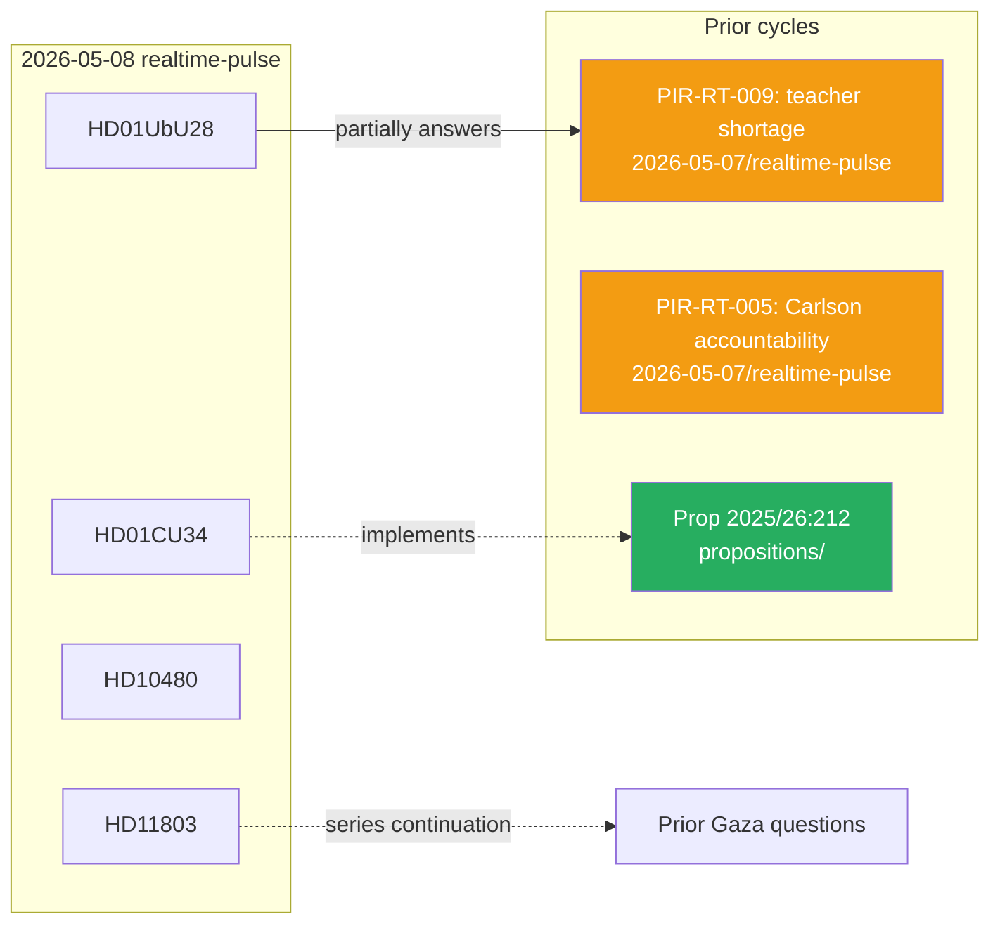

# Cross-Reference Map — 2026-05-08 (Tier-C)

**Date**: 2026-05-08  
**Subfolder**: realtime-pulse  
**Tier**: C — cross-subfolder citations required  
**Classification**: UNCLASSIFIED — PUBLIC

---

## Sibling Folder Citations

### Education / UbU28 Cross-References

**analysis/daily/*/propositions** — Government proposition 2025/26:212 underpins UbU28; propositions folder contains source bill.  
**analysis/daily/2026-05-07/realtime-pulse** — PIR-RT-009 (teacher shortage indicators) was opened yesterday; UbU28 partially addresses this PIR.

### Tax Residency / HD10480 Cross-References

**analysis/daily/*/propositions** — October 2025 tax rule change was likely introduced via proposition or förordning; propositions archive should contain original legislative instrument.

### Foreign Policy / HD11803 Cross-References

**analysis/daily/*/interpellationer** — Gaza-related interpellations filed in earlier riksmöte sessions. HD11803 is latest in an ongoing accountability series.

### Rural Digital / HD11801 Cross-References

**analysis/daily/*/committee-reports** — Previous UbU and TU (trafikutskottet) committee reports on digital infrastructure and rural connectivity.

## Intra-Cycle Sibling Folders (2026-05-08)

| Subfolder | Relevance to Today |
|-----------|-------------------|
| realtime-pulse (this) | Primary daily monitor |
| propositions | If any propositions scheduled 2026-05-08 |
| committee-reports | CU34, UbU28 formal outputs |
| interpellationer | HD10480 interpellation debate |
| fragor | HD11800–HD11803 written questions |

## Cross-Reference Evidence Map

## PIR Roll-Forward

| PIR | Status | Linked Documents | Carry Status |
|-----|--------|-----------------|-------------|
| PIR-RT-001 | Open | HD11803 (partial evidence) | → 2026-05-09 |
| PIR-RT-002 | Open | None today | → 2026-05-09 |
| PIR-RT-003 | Open | None today | → 2026-05-09 |
| PIR-RT-004 | Open | UbU28 (indirect) | → 2026-05-09 |
| PIR-RT-005 | Open | HD11801 (Carlson response pending) | → 2026-05-09 |
| PIR-RT-006 | Open | None today | → 2026-05-09 |
| PIR-RT-007 | Open | None today | → 2026-05-09 |
| PIR-RT-008 | Open (new) | CU34 vote outcome | → 2026-05-09 |
| PIR-RT-009 | Open (new) | UbU28 (partially addresses) | → 2026-05-09 |

---
*Cross-reference map per Tier-C protocol · 2026-05-08*
