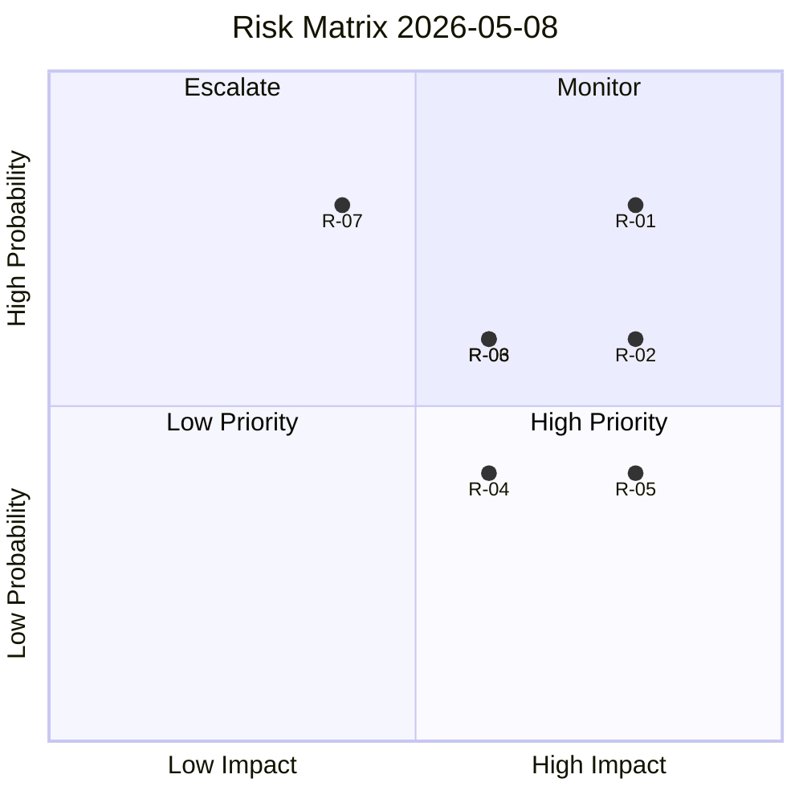

# Risk Assessment — 2026-05-08

**Date**: 2026-05-08  
**Subfolder**: realtime-pulse  
**Method**: Probability × Impact risk matrix (5×5)  
**Classification**: UNCLASSIFIED — PUBLIC

---

## Risk Register

| ID | Risk Description | Source | Probability | Impact | Score | Horizon | Mitigation |
|----|-----------------|--------|------------|--------|-------|---------|-----------|
| R-01 | Teacher credential reform UbU28 worsens classroom staffing due to inadequate transitional rules | HD01UbU28 | HIGH (4) | HIGH (4) | 16 | T+30d–T+90d | Government must issue Skolverket implementation guidance with extended transitional period |
| R-02 | Tax residence retroactivity (HD10480) triggers legal challenge at Swedish courts or ECHR | HD10480 | MEDIUM (3) | HIGH (4) | 12 | T+90d | Finance Ministry clarifies prospective application; Skatteverket amends enforcement guidance |
| R-03 | SD–L integration tension (HD11802 veil-ban) escalates to coalition crisis signal ahead of election | HD11802 | MEDIUM (3) | MEDIUM (3) | 9 | T+30d | L publicly restates civil-liberties red line; Tidö agreement integration chapter stable |
| R-04 | Rural broadband shutdown (HD11801) creates PTS compliance gap exploited by opposition | HD11801 | LOW (2) | MEDIUM (3) | 6 | T+60d | Infrastructure Ministry commissions PTS coverage review; KD uses rural connectivity as campaign platform |
| R-05 | Israeli intervention on Swedish citizens (HD11803) escalates beyond consular case to diplomatic incident | HD11803 | LOW (2) | HIGH (4) | 8 | T+7d–T+30d | Foreign Ministry activates consular rapid-response; raises UNCLOS issue in EU foreign policy forum |
| R-06 | Kronofogden distansutmätning (CU34) disproportionately affects digitally-excluded debtors | HD01CU34 | MEDIUM (3) | MEDIUM (3) | 9 | T+90d | CU CU34 requires Kronofogden equality impact assessment; legal aid provisions strengthened |
| R-07 | IMF data degraded mode impacts economic contextualisation of fiscal risk assessments | data/imf-context.json | HIGH (4) | LOW (2) | 8 | T+7d | Use WEO/FM Datamapper only; annotate all fiscal claims with degraded-mode caveat |

## High-Priority Risks (Score ≥ 12)

1. **R-01** (Score 16) — UbU28 credential reform may worsen teacher shortage
2. **R-02** (Score 12) — HD10480 retroactive tax rule legal challenge

## Risk Heat Map

---
*Risk assessment per Riksdagsmonitor protocol · 2026-05-08*
