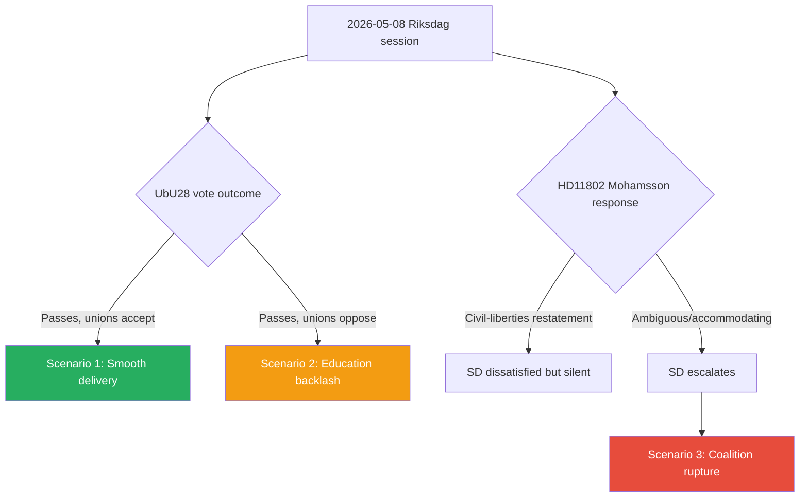

# Scenario Analysis — 2026-05-08

**Date**: 2026-05-08  
**Subfolder**: realtime-pulse  
**Classification**: UNCLASSIFIED — PUBLIC  
**Confidence levels**: WEP (Words Estimative Probability)

---

## Scenario Framework

Three scenarios mapping consequences of today's parliamentary activity through T+90 days:

---

## Scenario 1: Smooth Legislative Delivery (Base Case)
**Probability**: LIKELY (60–70%)  
**Horizon**: T+30d  
**Triggers**: CU34 and UbU28 pass chamber vote with broad cross-bloc support; ministerial responses to questions (HD11800–HD11803) are competent and non-inflammatory; interpellation HD10480 receives Svantesson clarification that resolves retroactivity concern.

**Narrative**: Both betänkanden pass as expected. CU34 modernises Kronofogden without controversy. UbU28 passes with transitional provisions sufficient to satisfy teacher unions in the near term. Finance Minister Svantesson provides a satisfactory clarification that the October 2025 rule change was prospective, closing the retroactivity issue. Education Minister Mohamsson restates L's civil-liberties position on the veil ban (HD11802) without fracturing Tidö coalition.

**Strategic consequence for government**: Consolidates governance-competence narrative. Education reform credit accrues heading into summer recess. No destabilising coalition incidents.

---

## Scenario 2: Education Reform Backlash (Risk Scenario)
**Probability**: POSSIBLE (20–30%)  
**Horizon**: T+30d–T+90d  
**Triggers**: Teacher unions publicly oppose UbU28 transitional provisions; Skolverket issues warning about credential-gap risk; S and V mount sustained media campaign on "government deepens teacher crisis."

**Narrative**: Post-passage, Lärarnas Riksförbund or Lärarförbundet announces that UbU28's transitional provisions will force out thousands of currently-working teachers who lack the new credential. Skolverket models a 10–15% reduction in eligible teachers in years 1–3 of grundskolan. Opposition runs "government created classroom crisis" storyline. Education Minister Mohamsson is forced into defensive reactive communications.

**Strategic consequence for government**: Loses the education reform credit expected from UbU28; opens campaign vulnerability on the single most salient voter issue for 2026 election.

---

## Scenario 3: Coalition Rupture Signal (Tail Scenario)
**Probability**: UNLIKELY (5–10%)  
**Horizon**: T+7d–T+30d  
**Triggers**: Education Minister Mohamsson gives public response to HD11802 (veil ban) that SD characterises as coalition-agreement breach; SD publicly threatens to withdraw support on forthcoming budget; media amplifies SD–L conflict.

**Narrative**: Mohamsson's response to HD11802 is characterised by SD's parliamentary group as contradicting the Tidö agreement's integration chapter. SD escalates publicly. Government enters pre-election coalition turbulence. Prime Minister Kristersson must mediate. Coalition stability narrative damaged with three months to election.

**Strategic consequence for government**: Serious reputational damage; forces election campaign to be fought while managing coalition conflict rather than policy platform.

---

## Scenario Decision Tree

---
*Scenario analysis per Riksdagsmonitor forward-projection protocol · 2026-05-08*
