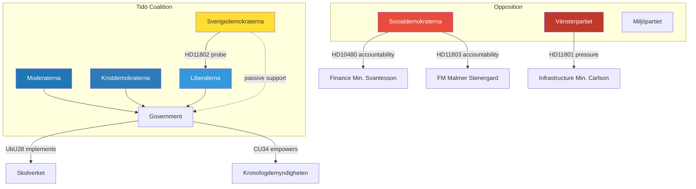

# Stakeholder Perspectives — 2026-05-08

**Date**: 2026-05-08  
**Subfolder**: realtime-pulse  
**Classification**: UNCLASSIFIED — PUBLIC

---

## Primary Stakeholder Map

### Government Coalition

**M (Moderaterna)** — Dominant coalition partner  
Position today: Defending Finance Minister Svantesson on tax residency (HD10480); Foreign Minister Malmer Stenergard must respond on Israeli intervention (HD11803). Both create reputational management moments. M will advance CU34 and UbU28 as governance-competence signals.  
Interest: Demonstrate effective governance; avoid fiscal-fairness and foreign-policy accountability narratives.

**KD (Kristdemokraterna)** — Infrastructure/Housing portfolio  
Position today: Carlson must respond to rural broadband shutdown (HD11801). This is high-salience for KD's rural and traditional-values voter base. KD interest: maintain rural Sweden credibility.  
Interest: Rural connectivity commitment; distinguish KD rural policy from M's urban emphasis.

**L (Liberalerna)** — Education/Integration portfolio  
Position today: Education Minister Mohamsson faces SD's veil-ban probe (HD11802). L must defend civil-liberties red line without fracturing Tidö coalition. This is L's most challenging parliamentary moment.  
Interest: Maintain civil-liberties identity while staying within coalition. Education reform (UbU28) is positive territory.

**SD (Sverigedemokraterna)** — Passive support  
Position today: HD11802 veil-ban probe is SD's proactive agency — testing L. SD has institutional interest in assimilationist integration agenda. On UbU28, SD likely supportive of credential reform that aligns with quality schools narrative.  
Interest: Advance integration assimilationism; demonstrate parliamentary activism to own voters.

### Opposition

**S (Socialdemokraterna)** — Largest opposition party  
Position today: Three documents (HD10480, HD11800, HD11803). S is deploying systematic ministerial accountability — tax, security, foreign policy. UbU28 is core S territory (teacher quality, school funding). S will signal alternative education investment agenda.  
Interest: Build "government fails ordinary people" narrative; education is S's strongest terrain.

**V (Vänsterpartiet)**  
Position today: HD11801 rural broadband. V focuses on structural inequality in digital access — aligns with V's anti-market-failure agenda.  
Interest: Rural and working-class inequality narrative; PTS/telecom regulation reform.

**MP (Miljöpartiet)**  
Position today: Not directly active in today's documents. Silent monitoring of UbU28 (education is MP territory).  
Interest: Monitor education reform quality; no strong tactical position today.

**C (Centerpartiet)**  
Position today: Not directly active. Rural broadband (HD11801) intersects with C's agrarian/rural base interests.  
Interest: Rural connectivity — may align with V's question framing despite different ideological positions.

### Civil Society / Expert Bodies

**Kronofogdemyndigheten**: Primary implementer of CU34. Positive on distansutmätning capacity expansion.  
**Skolverket**: UbU28 implementation agency. Credential standards reform must be accompanied by Skolverket guidance.  
**Lärarnas Riksförbund / Lärarförbundet**: Unions watching UbU28 transitional provisions closely. Potential for union opposition if teachers lose eligibility under new rules.  
**Skatteverket**: HD10480 residency rules — enforcement agency caught between legal change and individual hardship.  
**PTS (Post- och telestyrelsen)**: HD11801 regulatory body — rural coverage obligations.

---

## Stakeholder Influence Network

---
*Stakeholder analysis per Riksdagsmonitor protocol · 2026-05-08*
