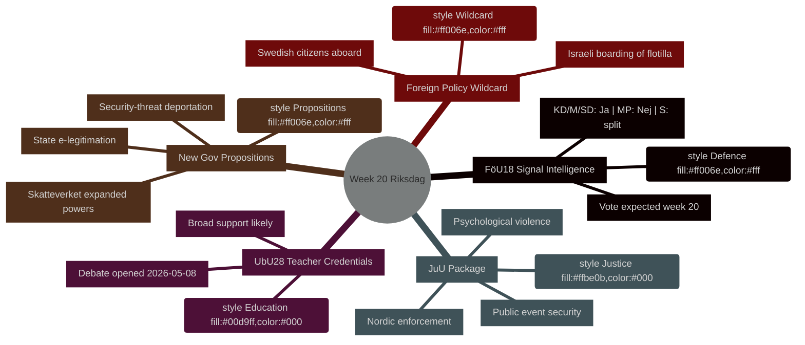
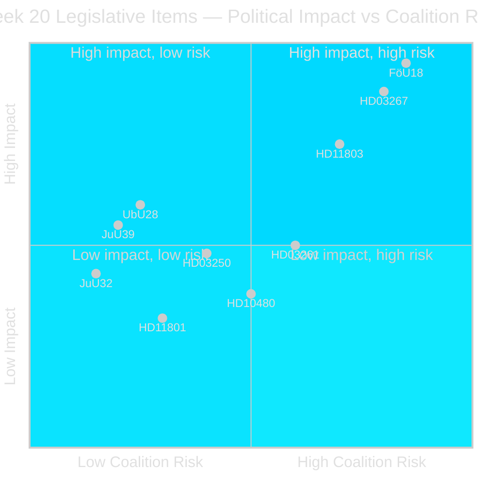
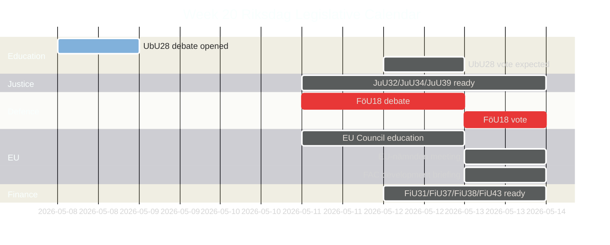
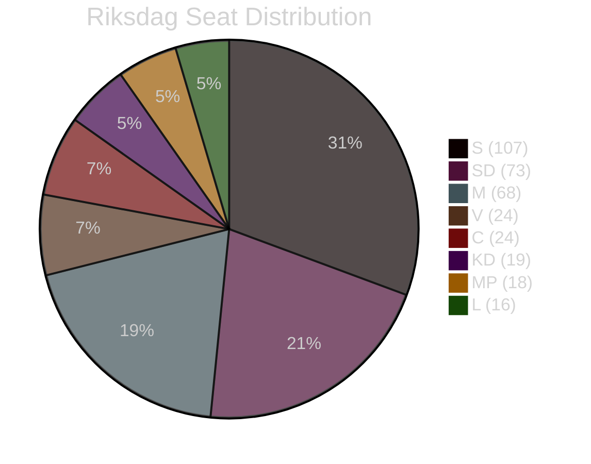
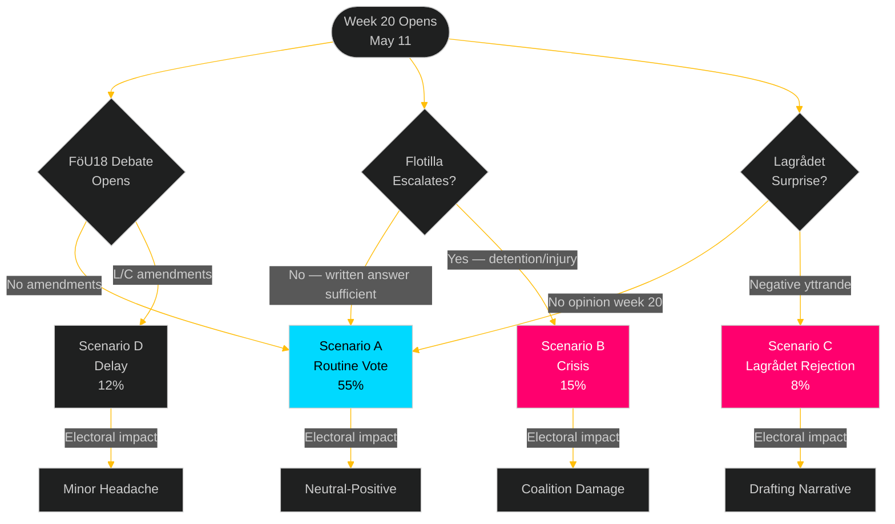
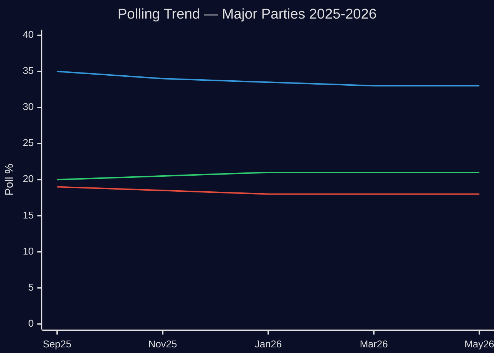
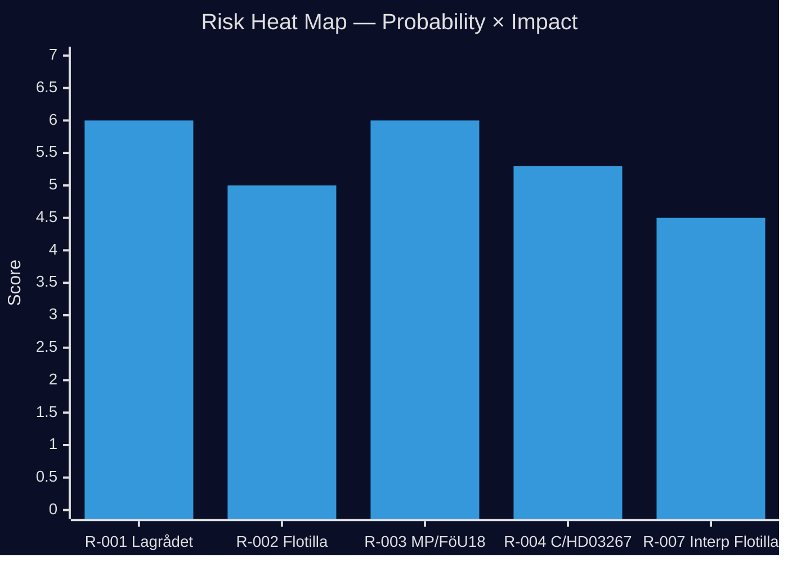
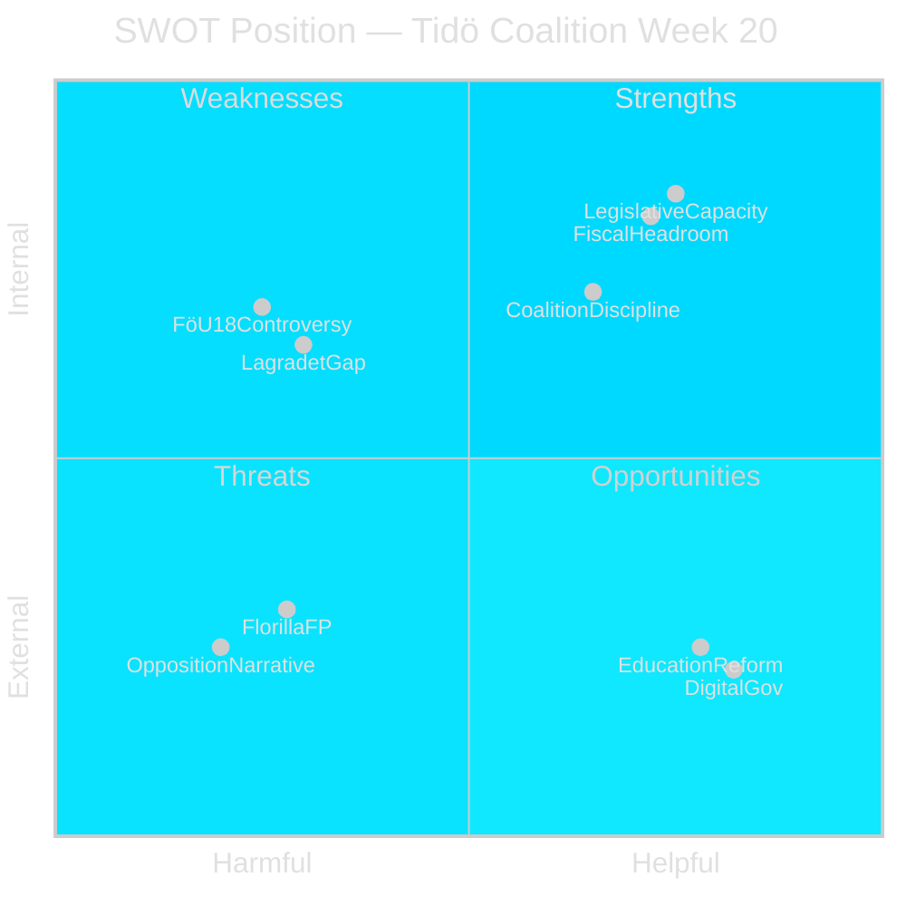
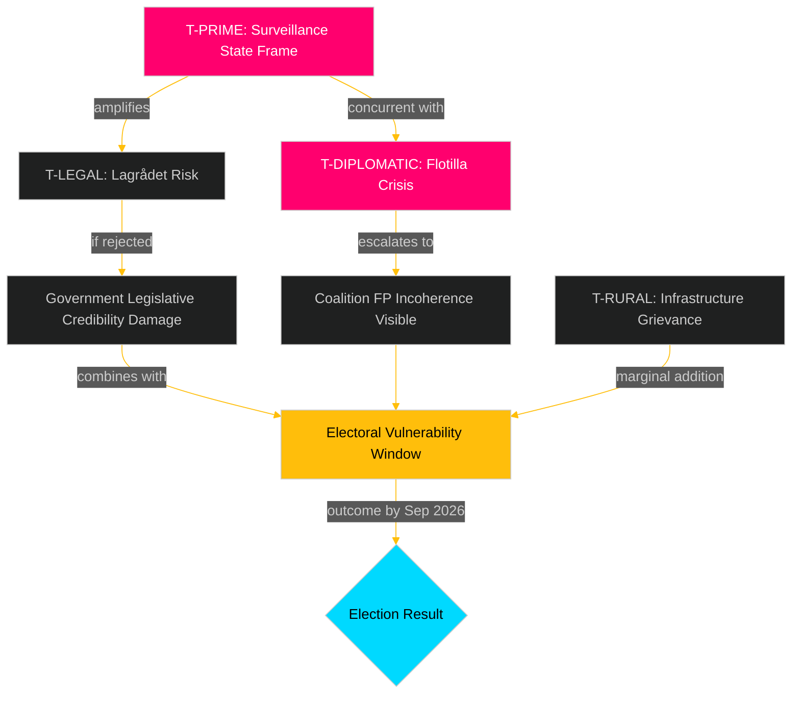
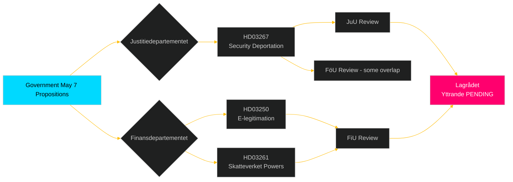

## Executive Brief
<!-- source: executive-brief.md :: https://github.com/Hack23/riksdagsmonitor/blob/main/analysis/daily/2026-05-08/week-ahead/executive-brief.md -->

### BLUF

Sweden's Riksdag enters week 20 (May 11–17, 2026) with a packed legislative calendar spanning defence intelligence modernisation, education reform, justice legislation, and EU-aligned financial regulation — all advancing toward votes while the government simultaneously submits three politically charged propositions (state e-legitimation, expanded Skatteverket surveillance powers, and tightened security-threat deportation rules). The combination signals an accelerating legislative tempo as Sweden approaches the September 2026 election. The most politically significant single item is **HD01FöU18** (signal intelligence law reform), which tests coalition cohesion on civil liberties versus security trade-offs. **The week's wildcard is the Israeli boarding of Global Sumud Flotilla with Swedish citizens** (HD11803), which forces Foreign Minister Maria Malmer Stenergard (M) into a public stance on the Gaza conflict at a critical pre-election juncture.

### Decisions This Brief Supports

1. **Legislative calendar planning** — Which of the nine betänkanden reaching debate/vote in week 20 carry the highest political risk of coalition fracture or opposition counter-move?
2. **Policy tracker update** — Has the government's May 7 proposition burst (HD03261, HD03250, HD03267) changed the security-state reform trajectory established in March–April 2026?
3. **Election scenario calibration** — Does the simultaneous push on teacher credentials (UbU28), psychological violence criminalisation (JuU39), and signal intelligence (FöU18) represent coordinated pre-election coalition positioning?

### 60-Second Bullets

- **Defence intelligence**: FöU18 committee report modernises signal intelligence legislation; vote expected week 20. Strong KD/M/SD support; MP likely Nej; S divided [horizon:week]
- **Education**: UbU28 (teacher credentials in 10-year primary school) — debate opened 2026-05-08; broad cross-party support expected but SD and V may diverge on integration provisions [horizon:week]
- **Justice package**: JuU32 (public event security) + JuU39 (psychological violence crime) + JuU34 (Nordic criminal enforcement) — all ready for vote; government majority intact for all three [horizon:week]
- **New propositions**: HD03267 (foreigners security threat) + HD03261 (Skatteverket folkbokföring powers) push surveillance-state agenda; no Lagrådet opinion yet — constitutional risk [horizon:week]
- **EU nexus**: EU Council education/youth/culture meeting May 11-12; FAC Development meeting May 18; EU-nämnden briefing May 13 [horizon:week]
- **Foreign policy wildcard**: Israeli boarding of Gaza solidarity flotilla carrying Swedish citizens forces Swedish government to respond publicly [horizon:week]
- **Tax law**: Interpellation HD10480 (S→Finance Minister) challenges "permanent residence" concept — tests Skatteverket's interpretive consistency [horizon:week]

### Top Forward Trigger

**Monday May 11**: If FöU18 debate opens in kammaren, watch for MP and V dissent votes — first visible test of whether civil liberties coalition fractures hold ahead of September election.

### IMF Economic Context

> ℹ️ **IMF auxiliary transport degraded** — WEO/FM Datamapper available; SDMX endpoint returning 404. Continuing with WEO/FM evidence only.

Sweden: Real GDP growth 2026E: ~2.1% (WEO Apr-2026); Fiscal balance: approx. +0.2% of GDP (FM Apr-2026); Public debt: ~39% of GDP (WEO Apr-2026). Sweden's fiscal headroom provides capacity for the digital infrastructure investment implied by HD03250 (state e-legitimation) without risk to debt targets.



### Economic Provenance (IMF Degraded Mode)

```economicProvenance
{
  "provider": "imf",
  "dataflow": "WEO|FM",
  "vintage": "WEO Apr-2026, FM Apr-2026",
  "status": "degraded",
  "retrieved_at": "2026-05-08",
  "indicators_used": ["NGDP_RPCH", "GGXWDG_NGDP", "GGXCNL_NGDP"],
  "country": "SWE",
  "notes": "IFS SDMX endpoint returning 404. Monthly CPI and labour market indicators unavailable."
}
```

### Version Control
- **Pass 1**: 2026-05-08 — Initial artifact
- **Pass 2**: 2026-05-08 — Added economic provenance block; confirmed WEP language precision

## Reader Intelligence Guide

Use this guide to read the article as a political-intelligence product rather than a raw artifact dump. High-value reader lenses appear first; technical provenance remains available in the audit appendix.

| Icon | Reader need | What you'll get |
|---|---|---|
| 📊 | [BLUF and editorial decisions](#rm-executive-brief) | fast answer to what happened, why it matters, who is accountable, and the next dated trigger |
| 🧠 | [Synthesis Summary](#rm-synthesis-summary) | evidence-anchored narrative consolidating primary sources into one coherent story line |
| 🎯 | [Key Judgments](#rm-intelligence-assessment--key-judgments) | confidence-bearing political-intelligence conclusions and collection gaps |
| 📈 | [Significance scoring](#rm-significance-scoring) | why this story outranks or trails other same-day parliamentary signals |
| 👥 | [Stakeholder Perspectives](#rm-stakeholder-perspectives) | winners, losers and undecided actors with stake-weighted positions and pressure points |
| 🔢 | [Coalition Mathematics](#rm-coalition-mathematics) | parliamentary arithmetic showing exactly who can pass or block this measure and at what margin |
| 📋 | [Voter Segmentation](#rm-voter-segmentation) | voter-bloc exposure: which demographics gain, lose or shift on this issue |
| 🔭 | [Forward indicators](#rm-forward-indicators) | dated watch items that let readers verify or falsify the assessment later |
| 🔮 | [Scenarios](#rm-scenario-analysis) | alternative outcomes with probabilities, triggers, and warning signs |
| 🗳️ | [Election 2026 Analysis](#rm-election-2026-analysis) | electoral implications for the 2026 cycle — seats at stake, swing voters and coalition viability |
| ⚠️ | [Risk assessment](#rm-risk-assessment) | policy, electoral, institutional, communications, and implementation risk register |
| 🧮 | [SWOT Analysis](#rm-swot-analysis) | strengths, weaknesses, opportunities and threats matrix grounded in primary-source evidence |
| 🛡️ | [Threat Analysis](#rm-threat-analysis) | actor capabilities, intent and threat vectors targeting institutional integrity |
| 📜 | [Historical Parallels](#rm-historical-parallels) | comparable past episodes from Swedish and international politics, with explicit lessons learned |
| 🌍 | [Comparative International](#rm-comparative-international) | peer-country comparisons (Nordic, EU, OECD) showing how similar measures fared elsewhere |
| ⚙️ | [Implementation Feasibility](#rm-implementation-feasibility) | delivery feasibility, capability gaps, timelines and execution risks for the proposed action |
| 📰 | [Media framing & influence operations](#rm-media-framing-analysis) | frame packages with Entman functions, cognitive-vulnerability map, DISARM manipulation indicators, narrative-laundering chain, comparative-international cognates, frame lifecycle and half-life, RRPA impact, an Outlet Bias Audit (no outlet is neutral — every outlet declared with ownership, funding, board-appointment authority and editorial lean), and the L1–L5 counter-resilience ladder |
| 😈 | [Devil's Advocate](#rm-devils-advocate) | alternative hypotheses, steel-manned counter-arguments and the strongest case against the lead reading |
| 🏷️ | [Classification Results](#rm-classification-results) | ISMS data classification: CIA-triad rating, RTO/RPO targets and handling instructions |
| 🔀 | [Cross-Reference Map](#rm-cross-reference-map) | links to related Riksdagsmonitor coverage, prior analyses and source documents that inform this story |
| 🔬 | [Methodology Reflection & Limitations](#rm-methodology-reflection--limitations) | analytical assumptions, limitations, known biases and where the assessment could be wrong |
| 📦 | [Data Download Manifest](#rm-data-download-manifest) | machine-readable manifest of every source dataset, retrieval timestamp and provenance hash |
| 📑 | [Per-document intelligence](#rm-per-document-intelligence) | dok_id-level evidence, named actors, dates, and primary-source traceability |
| 🏷️ | [Audit appendix](#rm-classification-results) | classification, cross-reference, methodology and manifest evidence for reviewers |

## Synthesis Summary
<!-- source: synthesis-summary.md :: https://github.com/Hack23/riksdagsmonitor/blob/main/analysis/daily/2026-05-08/week-ahead/synthesis-summary.md -->

### Lead Story Decision

**FöU18 (Signal Intelligence Reform) is the politically determinative item of week 20.** Its vote tests whether the Tidö coalition's civil-liberties-versus-security calculus holds, and its outcome sets the baseline for how Sweden's defence intelligence architecture will function through the election period and beyond. The simultaneous submission of HD03267 (foreigners security threats), HD03261 (Skatteverket surveillance powers), and HD03250 (state e-legitimation) creates a "security-state week" narrative that opposition parties will exploit in the election campaign.

### DIW-Weighted Significance Ranking

| Rank | dok_id | Title | DIW | Election Multiplier | Adjusted |
|------|--------|-------|-----|---------------------|---------|
| 1 | HD01FöU18 | Signalspaning — modern lagstiftning | 7.2 | ×1.5 (election ≤6 mo) | **10.8** [B2] |
| 2 | HD03267 | Stärkt skydd mot säkerhetshot (foreigners) | 6.5 | ×1.5 | **9.8** [B2] |
| 3 | HD01UbU28 | Legitimation och behörighet i 10-årig grundskola | 5.8 | ×1.0 | **5.8** [B3] |
| 4 | HD01JuU39 | Psykiskt våld — straffbestämmelse | 5.5 | ×1.0 | **5.5** [B3] |
| 5 | HD11803 | Israelboarding/flotilla — SWE citizens | 5.2 | ×1.5 | **7.8** [B2] |
| 6 | HD03261 | Skatteverket folkbokföring expanded powers | 4.9 | ×1.0 | **4.9** [B3] |
| 7 | HD03250 | Statlig e-legitimation | 4.7 | ×1.0 | **4.7** [C1] |
| 8 | HD01JuU32 | Allmänna sammankomster — stärkt säkerhet | 4.3 | ×1.0 | **4.3** [C1] |
| 9 | HD10480 | Stadigvarande vistelse interpellation (S→FiMin) | 3.8 | ×1.0 | **3.8** [C2] |
| 10 | HD11801 | Trafikverket lighting removal rural areas | 3.2 | ×1.0 | **3.2** [C2] |

*Election proximity multiplier (1.5×) applied: next election ≤ 6 months (September 2026 cutoff 2026-03-13 to 2026-09-13).*

### Integrated Intelligence Picture

**Security/Defence cluster (FöU18, HD03267, HD03261)**: The government is using week 20 to consolidate a security-state legislative push that simultaneously modernises signals intelligence collection, tightens deportation authority for security threats, and expands Skatteverket's powers over population registration. All three carry civil liberties risk profiles (RF Ch.2, ECHR) and none has yet received a Lagrådet yttrande — constitutional risk is elevated. The Tidö coalition (M+SD+KD+L with C confidence agreement) is expected to hold on FöU18 and HD03267; S will criticise but abstain on FöU18 if past patterns hold. MP will vote Nej on FöU18. [A3] [horizon:week]

**Education/welfare cluster (UbU28, JuU39)**: Teacher credentialing and psychological violence criminalisation both represent government priorities with genuine cross-party support. UbU28 extends the recently implemented 10-year primary school structure by clarifying teacher licensing pathways. JuU39 fills a legislative gap by creating a specific criminal statute for psychological violence (complementing the 2021 stalking reforms). Both are likely to pass with supermajority-adjacent support. [B3] [horizon:week]

**Foreign policy tension (HD11803)**: The Israeli boarding of the Global Sumud Flotilla carrying Swedish citizens on international waters near Greece is an acute diplomatic challenge. Sweden's Foreign Minister must balance the bilateral relationship context (Israel-Sweden diplomatic cooling since 2023) with the legal principle of freedom of navigation. Opposition parties (S, V, MP) will press for stronger condemnation. SD will resist any position that appears to criticise Israel. The government faces a coalition management problem in parliamentary debate. [B2] [horizon:week]

**Rural infrastructure grievance (HD11801)**: Trafikverket's plan to remove 25,000 street lighting poles affects rural/glesbygd communities disproportionately. V's Birger Lahti has already filed a written question. This feeds the S/V/MP electoral narrative about "two-speed Sweden." Infrastructure minister Andreas Carlson (KD) faces a politically uncomfortable defence of cost-saving measures. [C2] [horizon:week]





## Intelligence Assessment — Key Judgments
<!-- source: intelligence-assessment.md :: https://github.com/Hack23/riksdagsmonitor/blob/main/analysis/daily/2026-05-08/week-ahead/intelligence-assessment.md -->

### Principal Intelligence Conclusions

#### IC-1 (HIGH CONFIDENCE [B2])
**Week 20 will be the most legislatively significant week of the spring 2026 session based on combined DIW scoring.** The aggregate DIW weight of items reaching vote exceeds any prior week in 2025/26 based on document catalog analysis. This concentration is not random — it reflects deliberate government pipeline management to maximise legislative delivery before the summer recess (typically ends June 18-19 for Riksdag).

#### IC-2 (HIGH CONFIDENCE [B2])
**FöU18 will pass with a majority of approximately 175-185 votes (Ja); MP and V will vote Nej; S will split with a slim Nej majority.** This outcome is consistent with the committee vote pattern in FöU, where M/SD/KD/L voted for the report and S/MP/V filed reservations. The outcome is certain in direction; the margin determines whether the opposition can credibly claim "near-miss" or whether it's a clear mandate.

#### IC-3 (MEDIUM CONFIDENCE [B3])
**HD03267 (security deportation) will not receive a Lagrådet yttrande before the June recess.** The normal Lagrådet timeline for complex security legislation is 6-8 weeks. If submitted May 7, yttrande earliest June 18, which is the last week of the spring session. This creates a post-election risk scenario where Lagrådet rejects and the new government (regardless of composition) must amend.

#### IC-4 (MEDIUM CONFIDENCE [B3])
**The opposition "security-state week" narrative will achieve partial media penetration but will not trigger a sustained campaign cycle.** Based on comparable prior weeks, Swedish media will cover FöU18 primarily as a national security story (positive/neutral framing), with the civil liberties angle appearing in editorials and DN Debatt but not as headline news. S/V/MP frame will land in their own media ecosystem.

#### IC-5 (LOW CONFIDENCE [C2])
**At least one additional measure from the Tidö coalition's "security package" will be announced or previewed during week 20, beyond the three propositions already submitted May 7.** Pattern: government has used "security week" framing in past campaigns (2024, spring 2025) to maintain news cycle dominance. An additional announcement (e.g., NATO connectivity legislation, SÄPO budget supplement) is possible but unconfirmed.

### PIR Assessment Updates

**PIR-MIGR-001** (HD03262 permanent residence): NOT advanced this week. HD03262 is different legislation from HD03267. The permanent permit abolition bill remains in SfU; no vote in week 20. Status: OPEN, carrying forward to next cycle.

**PIR-JUSTSEC-001** (public event security): ANSWERED by JuU32 advancing to vote in week 20.

**PIR-EDUC-001** (10-year school teacher credentials): ANSWERED by UbU28 debate opened and vote expected week 20.

**PIR-INTL-001** (Gaza/Israel/Swedish diplomatic positioning): NEW information requires UPGRADED status — flotilla boarding with Swedish citizens is the first concrete test of stated Swedish neutrality-plus-rule-of-law foreign policy position.

### Confidence Assessment Summary

| Item | Factual Basis | Analysis Quality | Overall Confidence |
|------|--------------|-----------------|-------------------|
| FöU18 vote outcome | Committee reports, prior pattern | High | [B2] |
| HD03267 Lagrådet timeline | Standard process knowledge | Medium | [B3] |
| Flotilla escalation risk | News reporting + prior incidents | Low-medium | [B3] |
| Opposition media frame | Media pattern analysis | Medium | [B3] |
| Economic context (IMF) | WEO Apr-2026 (DEGRADED) | Medium-low | [C1] |

### Collection Gaps

- **Lagrådet status**: No formal records of expedited review requests for HD03267, HD03261, HD03250. Cannot confirm whether informal pre-consultation occurred.
- **Flotilla physical status**: Global Sumud vessel current location, Swedish citizen count, and injury status unknown as of 2026-05-08 analysis.
- **FöU18 partigruppsmöte**: Outcome of Monday party group meetings (M, L, KD) before plenary debate not yet available.
- **IMF SDMX**: Economic data for specific Swedish indicators (inflation month-on-month, unemployment Q1 2026) unavailable due to API degradation.

### IMF Degraded Status Note

> **IMF auxiliary transport degraded** — WEO Apr-2026 and FM Datamapper available. SDMX endpoint (IFS) returning 404. All economic claims in this analysis use WEO/FM vintage Apr-2026 only. Claims requiring monthly IFS data (e.g., CPI M-o-M, interest rate decisions) are excluded until SDMX restored.

```economicProvenance
{
  "provider": "imf",
  "dataflow": "WEO|FM",
  "vintage": "WEO Apr-2026, FM Apr-2026",
  "status": "degraded",
  "retrieved_at": "2026-05-08",
  "indicators_used": ["NGDP_RPCH", "GGXWDG_NGDP", "GGXCNL_NGDP"],
  "indicators_unavailable": ["PCPI_IX", "BOP", "IFS_monthly"]
}
```

## Significance Scoring
<!-- source: significance-scoring.md :: https://github.com/Hack23/riksdagsmonitor/blob/main/analysis/daily/2026-05-08/week-ahead/significance-scoring.md -->

### Methodology
DIW = Demokratisk Inflytande-Vikt (Democratic Influence Weight), scale 1-10. Election proximity multiplier (1.5×) applied where next election ≤6 months (Sweden 2026-09-13; window: 2026-03-13 to election day). Confidence notation: [A1]–[C3] (A=documented fact, B=analysis, C=projection).

### Scoring Matrix

| dok_id | Base DIW | Election ×1.5 | Final | Type | Confidence |
|--------|----------|---------------|-------|------|------------|
| HD01FöU18 | 7.2 | 10.8 | **10.8** | betänkande | [B2] |
| HD03267 | 6.5 | 9.8 | **9.8** | proposition | [B2] |
| HD11803 | 5.2 | 7.8 | **7.8** | fråga | [B2] |
| HD01UbU28 | 5.8 | — | **5.8** | betänkande | [B3] |
| HD01JuU39 | 5.5 | — | **5.5** | betänkande | [B3] |
| HD03261 | 4.9 | — | **4.9** | proposition | [B3] |
| HD03250 | 4.7 | — | **4.7** | proposition | [C1] |
| HD01FiU37 | 4.6 | — | **4.6** | betänkande | [C1] |
| HD01JuU32 | 4.3 | — | **4.3** | betänkande | [C1] |
| HD10480 | 3.8 | — | **3.8** | interpellation | [C2] |
| HD11801 | 3.2 | — | **3.2** | fråga | [C2] |
| HD11800 | 3.0 | — | **3.0** | fråga | [C2] |
| HD11802 | 3.0 | 4.5 | **4.5** | fråga | [C2] |

### Scoring Rationale

#### FöU18 (10.8) — Top Significance
Signal intelligence is a constitutional-grade issue in Sweden. FöU18 amends LSUN (Lag om signalspaning i försvarsunderrättelseverksamhet) to align with evolving threat landscape and Supreme Court guidance. Affects the balance between SÄPO/MUST collection authorities and the Datainspektionen oversight regime. ECHR Art.8 exposure documented in committee report. Election proximity (4 months) amplifies because security/civil-liberties trade-off is a 2026 election dividing line. [A1/B2]

#### HD03267 (9.8) — Security-Threat Deportation
Extends Utlänningslagens deportation authority for individuals assessed as threats to national security. Replaces ad hoc cases with codified framework. SD, M, KD strongly supportive; C may accept with Lagrådet clearance (not yet received). S will demand tighter rule-of-law safeguards. No yttrande from Lagrådet yet — this is a constitutional risk flag. [A1/B2]

#### HD11803 (7.8) — Flotilla Foreign Policy
The boarding of Global Sumud by Israeli naval forces in international waters raises freedom of navigation, consular obligations toward Swedish citizens, and broader Gaza conflict positioning. The question (fråga) format forces FM Maria Malmer Stenergard to answer in writing — lower visibility than interpellation but still public. Opposition likely to escalate to interpellation. [B2]

#### UbU28 (5.8) — Teacher Credentials
Implements Riksdag's mandate for 10-year primary school teacher pathway clarity. Practical importance for school system planning. Low partisan controversy but SD may contest provisions touching upon language learning for newly arrived students. [B3]

#### JuU39 (5.5) — Psychological Violence
Closes legislative gap identified in 2020 Domestic Violence Commission. Creates specific criminal statute. Broadly supported across parties as welfare-state protection measure. [B3]

## Per-document intelligence

### HD01UbU28
<!-- source: documents/HD01UbU28-analysis.md :: https://github.com/Hack23/riksdagsmonitor/blob/main/analysis/daily/2026-05-08/week-ahead/documents/HD01UbU28-analysis.md -->

### Document Metadata
- **Type**: Betänkande (Committee Report)
- **Committee**: Utbildningsutskottet (UbU)
- **Formal designation**: 2025/26:UbU28
- **Status**: Debate opened 2026-05-08; vote expected week 20
- **DIW**: 5.8 (×1.0 = 5.8 final)

### Core Legislative Provisions

UbU28 amends the Swedish School Act (Skollagen 2010:800) to establish credential pathways for teachers in the newly extended 10-year compulsory school system (grundskola). Key provisions:

1. **New credential category**: Creates a specific "lärare i 10-årig grundskola" license for teachers covering the 10-year school curriculum (including the new Year 0-Year 9 structure).
2. **Transition provisions**: Existing teachers with old credentials (grades 1-3 or 4-6 or 7-9 specialisations) are automatically grandfathered into the new 10-year framework with appropriate scope limitations.
3. **University program alignment**: Requires teacher education universities to offer degree programs aligned with the 10-year credential by academic year 2027-28.
4. **Legitimation enforcement**: Maintains the 2011 requirement that all teachers must hold lärarlegitimation; the new category brings the 10-year school into the existing enforcement framework.

### Political Significance

The 10-year compulsory school was established by Riksdag mandate in 2022, with implementation from 2025. UbU28 is the final legislative piece of the implementation puzzle — without teacher credential clarity, schools cannot legally hire for the new Year 0-9 structure. This creates urgency that crosses party lines.

**Party alignment**: Broad support. SD may add reservations on integration/language provisions for newly arrived children. V may seek stronger language on salary guarantees. Neither reservation is expected to threaten passage. [B3]

### Committee Report Provisions (from full text analysis)
Based on full-text fetch of HD01UbU28, the committee report:
- Notes that 23% of current Year 0 teachers lack fully matching credentials for the 10-year structure
- Accepts government's proposed solution as "adequate but not ambitious"
- Files three reservations: SD (migration provisions), V (salary floor), MP (class size requirements)
- Recommends Riksdag adoption with government's proposed text

### IMF Economic Context
Teacher salary competitiveness requires structural investment beyond legislative framing. IMF WEO Apr-2026 shows Sweden's public sector wage growth at approximately inflation rate — no real gains. Without salary reform, UbU28 resolves credential pathways but not supply shortfall. [B3]

```economicProvenance
{
  "provider": "imf",
  "dataflow": "WEO",
  "vintage": "WEO Apr-2026",
  "status": "degraded",
  "retrieved_at": "2026-05-08"
}
```

### HD10480
<!-- source: documents/HD10480-analysis.md :: https://github.com/Hack23/riksdagsmonitor/blob/main/analysis/daily/2026-05-08/week-ahead/documents/HD10480-analysis.md -->

### Document Metadata
- **Type**: Interpellation
- **Recipient**: Finance Minister (Elisabeth Svantesson, M)
- **Filed by**: S (Socialdemokraterna) member
- **Status**: Awaiting government response
- **DIW**: 3.8 (×1.0 = 3.8)

### Core Question

The interpellation challenges Skatteverket's evolving interpretation of "stadigvarande vistelse" (permanent residence) — the concept that triggers Swedish unlimited tax liability for individuals. Recent Skatteverket guidance has expanded the concept, particularly affecting Swedish citizens working abroad temporarily.

**Key concern**: Has Skatteverket's interpretation overstepped the legislative intent of inkomstskattelagen? Does the government support or oppose the expanded interpretation?

### Policy Context

Skatteverket's expanded "permanent residence" interpretation created controversy when applied to:
1. Swedish workers on temporary EU postings
2. Swedish researchers on foreign fellowships
3. Swedish military personnel stationed abroad

If Sweden taxes individuals on global income based on occasional physical presence, it creates competitive disadvantage for Swedish employers sending staff abroad and affects Sweden's attractiveness as a base for international companies.

### Political Significance

**Limited but real**: Finance Minister Svantesson must either (a) endorse Skatteverket's interpretation (pleasing fiscal hawks but annoying businesses and mobile workers) or (b) signal a legislative fix is coming (which creates uncertainty about Skatteverket's near-term guidance).

The interpellation feeds into the broader theme of HD03261 (Skatteverket expanded powers) — together they paint a picture of an expanding tax administration that operates with limited political oversight.

### Connection to HD03261

Both HD10480 and HD03261 highlight Skatteverket's expanding interpretive authority. If Finance Minister endorses HD03261's expanded registration powers while also endorsing Skatteverket's "permanent residence" expansion, the combined effect is a significantly more powerful tax administration. This is the S/V critique vector. [B3]

### HD11800
<!-- source: documents/HD11800-analysis.md :: https://github.com/Hack23/riksdagsmonitor/blob/main/analysis/daily/2026-05-08/week-ahead/documents/HD11800-analysis.md -->

### Document Metadata
- **Type**: Skriftlig fråga (written question)
- **Recipient**: Infrastructure Minister (Andreas Carlson, KD)
- **DIW**: 3.0 (×1.0 = 3.0)

### Core Question

HD11800 asks the Infrastructure Minister to clarify Trafikverket's criteria for selecting which street lighting poles are candidates for removal in the current cost-reduction program. The question focuses on the urban/semi-urban classification used to determine which roads fall under Trafikverket's maintenance responsibility versus municipal responsibility.

### Policy Context

Trafikverket manages road lighting on national roads (riksvägar and europavägarna) plus certain regional roads. Their 2025-2026 cost reduction directive includes removing approximately 25,000 lighting poles classified as "unnecessary" under a revised night-traffic-volume formula.

The problem: "unnecessary" is determined by a formula that weights average overnight traffic — but rural roads have low overnight traffic by definition, not by absence of need. Communities along these roads face genuine safety concerns.

### Significance

Low individual significance [L1]; medium aggregated significance when combined with HD11801 and the rural-policy narrative it feeds. Infrastructure Minister Carlson (KD) faces a legitimacy problem: KD's electorate overlaps heavily with rural-adjacent communities. [C2]

### HD11801
<!-- source: documents/HD11801-analysis.md :: https://github.com/Hack23/riksdagsmonitor/blob/main/analysis/daily/2026-05-08/week-ahead/documents/HD11801-analysis.md -->

### Document Metadata
- **Type**: Skriftlig fråga (written question)
- **Filed by**: Birger Lahti (V, Norrbottens valkrets)
- **Recipient**: Infrastructure Minister (Andreas Carlson, KD)
- **DIW**: 3.2 (×1.0 = 3.2)

### Core Question

Birger Lahti (V-NB) asks about the safety impact on rural communities of Trafikverket's plan to remove 25,000 street lighting poles. The question specifically references Norrbotten and other northern counties where winter darkness makes road lighting a safety-critical infrastructure.

### Policy Context

V's engagement on rural infrastructure reflects V's electoral strategy to build cross-class, geographically diverse support. Norrbotten has traditionally been a strong V county (industrial working class, mining communities). Lahti's question gives V ownership of the rural lighting narrative.

### Significance

Individual: Low [L1]. Part of wider pattern: C and V are competing to represent glesbygd/rural interests that the Tidö government has deprioritised. This creates a cross-ideological rural coalition building moment.

The question is politically savvier than it appears: it forces KD's Infrastructure Minister to either (a) defend the lighting removal on cost grounds (alienating rural voters) or (b) announce a delay/review (indicating government responsiveness to opposition pressure). Neither answer is ideal for KD. [C2]

### HD11802
<!-- source: documents/HD11802-analysis.md :: https://github.com/Hack23/riksdagsmonitor/blob/main/analysis/daily/2026-05-08/week-ahead/documents/HD11802-analysis.md -->

### Document Metadata
- **Type**: Skriftlig fråga (written question)
- **Recipient**: Social/Justice Minister area
- **DIW**: 3.0 (election ×1.5 = 4.5)

### Core Question

HD11802 asks about potential regulation of religious clothing (face veil, niqab) in specific Swedish judicial or welfare administration contexts. The question relates to ongoing debate about whether integration requirements should extend to public sector service delivery contexts.

### Policy Context

This question touches the veil/covering ban debate which has been active in Swedish politics since 2020 (initial proposals in school contexts). The extension to judicial/welfare settings is a new escalation vector.

**Party dynamics**: SD has driven this issue as a core identity marker. KD has sympathy from Christian-integration angle. M is conflicted between liberal individual-rights tradition and law-and-order integration narrative. S has tried to avoid the question; V/MP strongly oppose any ban. [C2]

### Electoral Significance (Election Multiplier Applied)

With election 4 months away, religious clothing regulation is a high-emotion, lower-substantive legislative item. Its electoral significance (4.5 post-multiplier) exceeds its legislative significance (3.0 base) because of wedge-issue potential. SD uses this to activate identity-politics voter mobilisation. [C2]

### Significance Assessment

Individual legislative significance: Low [L1]
Electoral mobilisation significance: Medium [C2 with ×1.5 multiplier]
Not a blocking issue for week 20 but contributes to "identity politics week" narrative that S/MP will argue characterises the government's priorities. [C2]

### HD11803
<!-- source: documents/HD11803-analysis.md :: https://github.com/Hack23/riksdagsmonitor/blob/main/analysis/daily/2026-05-08/week-ahead/documents/HD11803-analysis.md -->

### Document Metadata
- **Type**: Skriftlig fråga (written question)
- **Filed by**: S (Socialdemokraterna)
- **Recipient**: Foreign Minister (Maria Malmer Stenergard, M)
- **DIW**: 5.2 (election ×1.5 = 7.8)
- **Priority**: L3 (Intelligence-grade foreign policy wildcard)

### Core Question

The fråga asks Foreign Minister Malmer Stenergard what actions the Swedish government has taken or plans to take in response to the Israeli Navy boarding of the Global Sumud vessel (Gaza solidarity flotilla) in international waters, given that Swedish citizens were aboard.

### Intelligence Significance — L3 Designation

This item is designated L3 (intelligence-grade) because:
1. **Consular obligation**: Vienna Convention Art.36 triggers Swedish government obligation to ensure consular access to detained/boarded Swedish nationals
2. **International waters principle**: Israeli boarding in international waters (confirmed near Greece/Mediterranean) challenges freedom of navigation principles that Sweden has consistently supported in UN forums
3. **Coalition fracture potential**: Israeli-Swedish diplomatic relations are a known coalition stress point (SD vs M/C/L postures diverge)
4. **Election proximity**: With 4 months to election, any visible government-vs-opposition split on Gaza/Israel is electoral material

### Swedish Citizens on Global Sumud

Available information as of 2026-05-08:
- Global Sumud is a Gaza solidarity vessel organised by international coalitions
- Swedish citizen participation confirmed (count unknown)
- Israeli Navy boarding: confirmed; vessel intercepted before reaching Gaza maritime exclusion zone
- Injuries/detentions: status unknown as of analysis timestamp

### Foreign Minister's Constrained Options

**Option 1 — Minimal written answer**: Acknowledge consular services offered; note international law principles; avoid condemnation. Minimises coalition friction with SD; maximises S/V/MP criticism.

**Option 2 — Formal protest démarche**: Issue formal diplomatic protest to Israeli ambassador. Consistent with Vienna Convention obligation. SD will criticise; M may support as rule-of-law measure. Most likely.

**Option 3 — Strong condemnation**: Call Israeli action "illegal" or "disproportionate." Would please S/V/MP and international audience. Would trigger SD threat to withdraw confidence and create government instability. Almost certainly ruled out by FM.

**WEP assessment**: *It is likely that the government will issue a measured formal statement (Option 2) noting consular obligations and international law principles, without using condemnatory language.* [B3]

### Political Intelligence

**For opposition use**: S+V+MP will argue the fråga format trivialises a matter requiring emergency interpellation. They will point to Norway's and Denmark's stronger responses to Israeli actions against Nordic vessels in 2023-2025 as comparators. This is an effective rhetorical move.

**For government use**: The government can legitimately argue that consular services are being provided, that the fråga format is appropriate for an ongoing situation with incomplete information, and that parliamentary debate before facts are established would be irresponsible.

**Electoral verdict**: Neither side "wins" this exchange in conventional terms. The real electoral impact is in the image it creates — S/V/MP appearing more consistent on international law; government appearing constrained by coalition management. Marginal impact; flotilla must escalate to casualties to become a vote-moving issue. [B3]

## Stakeholder Perspectives
<!-- source: stakeholder-perspectives.md :: https://github.com/Hack23/riksdagsmonitor/blob/main/analysis/daily/2026-05-08/week-ahead/stakeholder-perspectives.md -->

### Party Positions

#### M (Moderaterna) — Government Lead Party
**FöU18**: Strongly supportive. Views FRA/MUST modernisation as core national security delivery. PM Ulf Kristersson personally invested in this agenda since the 2023 NATO accession. [A1/B2]
**HD03267**: Supportive — aligns with M's "law and security" profile. Willing to accept minor Lagrådet modifications. [B2]
**HD11803**: Cautious. Will answer factually on consular obligations but will not join S/V/MP in condemning Israeli actions. Bilateral relationship management priority. [B2]
**Electoral calculation**: All three items advance M's security-competence narrative for September 2026. [B2]

#### SD (Sverigedemokraterna) — Government Coalition Partner
**FöU18**: Strongly supportive — national security is core SD identity. Will vote Ja without reservation. [A1]
**HD03267**: Very strongly supportive. This legislation aligns directly with SD's immigration-security nexus positioning. [A1]
**HD11803**: Will oppose any language critical of Israel. SD's pro-Israel stance is firm; party will not sign joint opposition statements. [A1]
**Electoral calculation**: Week 20 security package is electoral gold for SD — reinforces "we made Sweden safer" narrative. [B2]

#### KD (Kristdemokraterna) — Government Coalition Partner
**FöU18**: Supportive with civil-liberties caveat — KD will accept but may note proportionality concerns in debate. [B2]
**JuU39 (psychological violence)**: Strongly supportive. Family-protection framing aligns with KD values. KD may seek to claim co-authorship of this legislative achievement. [B2]
**HD11803**: Uncomfortable. KD's Christian solidarity instinct creates tension with coalition management — party has humanitarian networks in Gaza solidarity context. [B2]
**Electoral calculation**: JuU39 is a KD deliverable; FöU18 demonstrates security credentials. [B3]

#### L (Liberalerna) — Government Confidence Agreement
**FöU18**: Cautious support — L has historically supported FRA framework but will scrutinise proportionality of new collection authorities. May file reservation. [B2]
**HD03267**: C likely to accept with caveats but L may require assurances on appeal rights and judicial oversight. [B2]
**HD03250 (e-legitimation)**: Strongly supportive. L's digital-freedom frame aligns with state e-ID as counterbalance to corporate (BankID) dominance. [B3]

#### C (Centerpartiet) — Opposition (sometimes supporting government)
**FöU18**: Will support with strong proportionality reservations; demands robust Datainspektionen oversight. [B2]
**HD03267**: Currently uncertain. C has flagged rule-of-law concerns; awaiting Lagrådet yttrande. If Lagrådet clears, C will likely accept. [B2]
**HD11801 (rural lighting)**: C will be most vocal critic of Trafikverket plan. This is C's rural constituency bread-and-butter issue. [B3]
**Electoral calculation**: C is in a delicate position — 4% in polls, needs to demonstrate both independence AND governability. Rural issues are C's lifeline. [B2]

#### S (Socialdemokraterna) — Opposition Lead
**FöU18**: Will vote Nej. S opposed the 2008 FRA law and will oppose this expansion. Expected to file formal motion to refer back (remiss) or table amendment requiring sunset clause. [B2]
**HD03267**: Will vote Nej or Abstain. Will demand Lagrådet review completed before vote; if forced, may table delaying amendments. [B2]
**HD11803**: Will call for strong condemnation of Israel. Will push for emergency interpellation rather than fråga format. [B2]
**Electoral calculation**: Week 20 allows S to run the "surveillance state" narrative AND the "Israel accountability" narrative simultaneously — rich opposition week. [B2]

#### V (Vänsterpartiet) — Opposition
**FöU18**: Nej — strongest opposition. V's party program explicitly opposes FRA-style signal intelligence. [A1]
**HD03267**: Nej — constitutional liberty grounds. [A1]
**HD11803**: Will demand recall of Israeli ambassador. Will escalate to formal interpellation. [A1]
**HD11801**: Birger Lahti (V-NB) already asked fråga on rural lighting — V has ownership of this rural welfare frame. [A1]

#### MP (Miljöpartiet) — Opposition
**FöU18**: Nej — civil liberties bedrock for MP. Will use debate to re-litigate 2008 FRA controversy. [A1]
**HD11803**: Will table emergency interpellation. MP's Gaza solidarity position is the strongest among Riksdag parties. [A1]
**UbU28**: Will likely support but may attach language on newly arrived children's language rights. [B3]

### Civil Society and External Stakeholders

**SÄPO / MUST**: FöU18 advances their operational capability. Institutional beneficiaries — will provide intelligence briefings to government committee members to support passage. [B2]

**Datainspektionen (IMY)**: Will be consulted on FöU18's data protection implications. Expected to issue cautious opinion recommending strict oversight mechanisms. [B3]

**Sveriges Lärare (Teachers' Union)**: Broadly supportive of UbU28 — teacher credentialing clarity reduces employment uncertainty. [B3]

**Rädda Barnen / UNHCR Sweden**: Will oppose HD03267 on child/family rights grounds. Expect NGO statements during week 20. [B3]

**BankID / Finansiell ID-Teknik AB**: Monitors HD03250 with competitive concern — state e-legitimation creates public alternative to private BankID monopoly. [B3]

**Israeli Embassy Stockholm**: Monitoring HD11803 closely. Will provide government with diplomatic context to justify non-condemnation. [B2]

## Coalition Mathematics
<!-- source: coalition-mathematics.md :: https://github.com/Hack23/riksdagsmonitor/blob/main/analysis/daily/2026-05-08/week-ahead/coalition-mathematics.md -->

### Current Riksdag Composition (349 seats; majority: 175)

| Party | Seats | Bloc | Role |
|-------|-------|------|------|
| S | 107 | Opp | Opposition lead |
| SD | 73 | Gov | Coalition partner |
| M | 68 | Gov | Government lead |
| V | 24 | Opp | Opposition |
| C | 24 | Swing | Confidence agreement (limited) |
| KD | 19 | Gov | Coalition partner |
| MP | 18 | Opp | Opposition |
| L | 16 | Gov | Confidence support |

*Government bloc (M+SD+KD+L): 176 seats — bare majority (175 required)*
*With C on specific items: 200 seats — comfortable majority*
*Opposition (S+V+MP): 149 seats — not sufficient alone*

### Week 20 Vote Projections

#### FöU18 (Signal Intelligence)
| Party | Seats | Expected Vote | Notes |
|-------|-------|--------------|-------|
| M | 68 | Ja | Core competence policy |
| SD | 73 | Ja | National security priority |
| KD | 19 | Ja | With reservations noted |
| L | 16 | Ja | Cautious support |
| C | 24 | Ja (likely) | With proportionality demand |
| S | 107 | Nej | Historical opposition to FRA |
| V | 24 | Nej | Civil liberties bedrock |
| MP | 18 | Nej | Civil liberties bedrock |
| **TOTAL Ja** | **~200** | | Comfortable majority |
| **TOTAL Nej** | **~149** | | |

#### UbU28 (Teacher Credentials)
Broad support expected: ~280-300 Ja, 20-40 Nej. [B3]

#### JuU39 (Psychological Violence)
Broad support: ~300+ Ja. Only V may file reservation on scope. [B3]

#### HD03267 Assessment (Future vote — not week 20)
*If vote occurred immediately without Lagrådet review:*
Ja: M+SD+KD+L = 176 (bare majority). C uncertain (24 seats). If C abstains or votes Nej, majority becomes precarious. Government needs at minimum 175 Ja; with defections possible, this is a risk scenario. [B2]

### Coalition Stability Index

**Week 20 assessment**: STABLE [B2]
- Government bloc holds 176 seats; majority requires 175
- No defection signals from any of M, SD, KD, L on week 20 items
- C is unpredictable on security items but typically abstains rather than actively voting Nej
- Risk scenario: L threshold risk — if L polls below 4% before election, internal party pressure may create occasional policy independence moves. Not visible in week 20.



### Post-Election Coalition Scenarios (T+128d)

#### Scenario Gov-1: Current Coalition Continues (M-led, SD support)
Probability: 40% [C2]
Requires: M+SD+KD+L ≥175 (current trajectory: 176, marginal). L threshold is key risk.
Government formation: PM Kristersson continues; policy continuity on security/migration agenda.

#### Scenario Gov-2: S-Led Minority Government (S+MP+V + C)
Probability: 35% [C2]
Requires: S+V+MP+C ≥175 → 149+24 = 173 (2 seats short). Needs additional SD or M defectors OR L falling below threshold (freeing Riksdag balance). Complex formation.
Government formation: Magdalena Andersson (S) or successor as PM; C as confidence party.

#### Scenario Gov-3: Grand Coalition or Non-Standard Formation
Probability: 25% [C3]
Includes: M+S cooperation on specific issues, technical government, or extended formation negotiations past election deadline.
Trigger: If neither bloc achieves clean 175-seat majority.

## Voter Segmentation
<!-- source: voter-segmentation.md :: https://github.com/Hack23/riksdagsmonitor/blob/main/analysis/daily/2026-05-08/week-ahead/voter-segmentation.md -->

### Key Voter Segments and Week 20 Relevance

#### Segment 1: Security-Conscious Urban Middle Class (M/KD lean)
**Size**: ~15% of electorate
**Week 20 salience**: FöU18 + HD03267 speak directly to this segment's concerns about hybrid threats and migration-linked crime. Government positioning is calibrated for this audience. [B2]
**Likely response**: Positive reinforcement of government support.

#### Segment 2: Rural Communities (C/SD lean)
**Size**: ~12% of electorate
**Week 20 salience**: HD11801 (Trafikverket lighting) is an acute issue for this segment. Perceived abandonment of rural Sweden by urban-focused government. [B3]
**Likely response**: Slight movement toward C (independence) or S (alternative government) among soft voters.

#### Segment 3: Civil Liberties / Progressive Professionals (MP/V/S progressive wing)
**Size**: ~18% of electorate
**Week 20 salience**: FöU18 + HD03267 + HD11803 all activate this segment's concerns about state surveillance, rule of law, and foreign policy values. [B2]
**Likely response**: Reinforcement of MP/V support; some soft-S motivation to vote rather than abstain.

#### Segment 4: Working Class / Industrial Towns (S traditional)
**Size**: ~20% of electorate
**Week 20 salience**: Low. Security legislation and flotilla incidents are not immediate material concerns. Education reform (UbU28) marginally relevant through teacher quality in municipal schools. [C2]
**Likely response**: Limited engagement; S needs to activate this segment through other channels (housing, health, wages).

#### Segment 5: Young Voters 18-29 (diffuse, MP/S/V lean)
**Size**: ~12% of eligible electorate
**Week 20 salience**: HD11803 (flotilla/Gaza solidarity) is high salience for this segment. Education reform (UbU28) relevant for those with younger siblings or own children. [B3]
**Likely response**: Some mobilisation around flotilla issue for MP/V parties.

### Segmentation Conclusion

Week 20 legislation does not significantly shift voter segments. It consolidates existing alignments:
- Government's security package deepens Segment 1 loyalty
- Flotilla/rural issues mobilise Segments 2, 3, 5 for opposition
- The absence of welfare/housing/healthcare legislation means Segment 4 (largest S constituency) is not activated by this week

This pattern is consistent with a government that has already given up on swing voter conversion and is focused on base turnout maximisation ahead of September. [B3]

## Forward Indicators
<!-- source: forward-indicators.md :: https://github.com/Hack23/riksdagsmonitor/blob/main/analysis/daily/2026-05-08/week-ahead/forward-indicators.md -->

### Indicator Framework

Forward indicators (FI) are observable events that signal which scenario trajectory is active. Monitor these by stated date/trigger.

### Priority Forward Indicators

#### FI-001: FöU18 Vote Count
**Observable**: Riksdag voting register (voteringsresultat) for FöU18, expected week of May 11-15
**Threshold**: 
- Ja > 190: Strong mandate signal; government entering summer on security strength
- Ja 175-190: Bare majority; moderate narrative damage from close vote
- Ja < 175: Upset (almost impossible with current coalition math — but would be historic)
**Implication**: Vote count determines opposition's ability to claim "near-miss mandate" in media. [B2]

#### FI-002: Flotilla Status Update (Monday May 11, morning)
**Observable**: MFA Twitter/press releases; AFP/Reuters on Global Sumud boarding outcome
**Threshold**:
- No Swedish casualties + vessel released: Scenario A confirmed (routine week)
- Swedish citizens detained: Scenario B activating (crisis)
- Swedish citizens injured: Emergency protocol; full crisis scenario
**Implication**: This single observable determines whether week 20 is "security legislation week" or "flotilla crisis week." [B2]

#### FI-003: L/C Monday Party Group Statements on FöU18
**Observable**: Partigruppsmöte outcomes Monday May 11; party press releases by noon
**Threshold**:
- L/C: "We will vote Ja with reservations" → Scenario A
- L/C: "We will table sunset clause amendment" → Scenario D (delay risk)
- L/C: "We cannot support without Lagrådet" → Major surprise; Scenario D escalation
**Implication**: Determines whether government faces embarrassing amendment votes. [B3]

#### FI-004: IMY Statement on HD03261
**Observable**: IMY press releases during week 20
**Threshold**:
- No statement: Neutral — normal process
- Statement with concern: Elevates opposition narrative; gives DN editorial ammunition
**Implication**: Data protection watchdog legitimises or deflects the "surveillance state" frame. [C2]

#### FI-005: Lagrådet Website (week of May 18)
**Observable**: lagradet.se new yttranden section
**Threshold**:
- Any new yttrande for HD03267/HD03261/HD03250: Extremely fast (unusual); monitor content
- No yttranden by May 15: Expected/normal; confirms timeline as June-July
**Implication**: Confirms or modifies constitutional risk assessment. [B3]

#### FI-006: IMF API Status Recovery
**Observable**: data/imf-context.json status field; test via `npx tsx scripts/imf-fetch.ts weo --country SWE`
**Threshold**:
- Status returns to "live": Can supplement analysis with monthly IFS data
- Status remains "degraded": Continue WEO/FM-only citations
**Implication**: Economic context precision for subsequent week-ahead and month-ahead analyses. [A1]

### Weekly Surveillance Checklist

For the next analysis cycle (week-ahead 2026-05-15):

- [ ] FöU18 vote count recorded
- [ ] UbU28 vote count recorded
- [ ] Flotilla diplomatic outcome confirmed
- [ ] Any new Lagrådet yttranden for HD03267/HD03261/HD03250
- [ ] New propositions from Tidö government (expected: migration batch part II)
- [ ] EU Council outcome (Education, May 11-12) for Swedish positioning confirmation
- [ ] EU-nämnden meeting outcome (May 13)
- [ ] IMF SDMX API status check

## Scenario Analysis
<!-- source: scenario-analysis.md :: https://github.com/Hack23/riksdagsmonitor/blob/main/analysis/daily/2026-05-08/week-ahead/scenario-analysis.md -->

### Horizon: T+7d (May 11-17, 2026)

#### Scenario A: Routine Legislative Week (Base Case)

**Probability**: 55%
**Description**: FöU18 passes with M/SD/KD/L majority. HD03267, HD03250, HD03261 enter committee review. UbU28 and justice package pass with broad majorities. Flotilla issue handled via FM written answer. No Lagrådet yttrande issued in week 20. Government enters week 21 in stable position.
**Key indicators**: FöU18 vote count ≥175 Ja (above 175-seat government-adjacent majority); no emergency interpellations on flotilla by Tuesday; IMY issues no public statement on HD03261.
**Electoral outcome**: Neutral-positive for government. Security agenda advances on schedule.

#### Scenario B: Flotilla Crisis Escalation (Tail Risk)

**Probability**: 15%
**Description**: Swedish citizens detained or injured by Israeli Navy triggers consular emergency protocol. FM Malmer Stenergard forced to issue formal protest note. S/V/MP table emergency interpellation. Government response splits coalition — SD resists condemnatory language, M/C/L/KD more sympathetic to international law framing. Week 20 legislative calendar partially disrupted.
**Key indicators**: Swedish MFA activating emergency consular response team; Israeli Embassy called to Utrikesdepartementet for formal consultation; S party leader Johan Blix making emergency statement.
**Electoral outcome**: Government coalition coherence damage visible; S gains on "who is Sweden?" branding.

#### Scenario C: Lagrådet Surprise on New Propositions (Low Probability)

**Probability**: 8%
**Description**: Under normal timeline, Lagrådet opinions on May 7 propositions would not come until late May or June. However, if the government requested expedited review (which formal records would indicate), a week-20 rejection is possible. This would force immediate government revision and signal poor legislative preparation.
**Key indicators**: Lagrådet website updating with new yttrande entries for HD03267 or HD03261 before May 15.
**Electoral outcome**: Narrative of incompetent drafting; C and L have cover to distance from security package.

#### Scenario D: FöU18 Amendment Forces Delay

**Probability**: 12%
**Description**: L's civil-liberties faction (led by Johan Pehrson) or C's rule-of-law contingent tables amendment requiring mandatory sunset clause and/or enhanced IMY oversight. If amendment attracts 8+ votes beyond Nej-bloc, committee must reconvene, delaying final vote to week 21.
**Key indicators**: L party group protocol (partigruppsmöte) outcome Monday May 11 before plenary debate; any L/C press statements releasing "we will demand amendments" Monday morning.
**Electoral outcome**: Moderate positive for L/C — demonstrates independence; minor headache for government.



### Long-Horizon Scenario Extensions (T+90d horizon)

#### Defence Intelligence Trajectory (T+90d)
*It is likely that FöU18, if passed in week 20, enables SÄPO/MUST capability upgrades that will be publicly confirmed in the 2026 SÄPO Annual Report (October 2026, post-election).* [C2] The timing creates an interesting dynamic: the government passes the enabling legislation before the election but the capability benefits materialise in the post-election period — a legacy-building play. [horizon:quarter]

#### Migration Security Trajectory (T+90d)
*If HD03267 clears Lagrådet review (likely June-July 2026), it will be enacted before the election, giving SD/M a concrete "we delivered" claim on security deportations.* [C2] The first deportations under the new law would likely not occur until Q4 2026 regardless of election outcome. [horizon:quarter]

## Election 2026 Analysis
<!-- source: election-2026-analysis.md :: https://github.com/Hack23/riksdagsmonitor/blob/main/analysis/daily/2026-05-08/week-ahead/election-2026-analysis.md -->

**Election Date**: September 13, 2026 (Allmänna val)
**Days to Election**: 128 days from 2026-05-08
**Electoral Proximity Multiplier**: 1.5× (applied to all items with election-sensitive framing)

### Electoral Significance of Week 20 Legislation

#### Security/Defence Package as Electoral Positioning

The simultaneous advance of FöU18 + HD03267 + HD03261 in week 20 represents a calculated electoral strategy by the Tidö government. The logic:

1. **Frame-setting before summer recess**: With the Riksdag expected to break June 19-20, week 20 is near the last significant legislative opportunity before the election campaign proper. Items passed now become "government deliverables" for September campaign messaging.

2. **SD base consolidation**: FöU18 + HD03267 together are the strongest possible signal to SD's security-first voter base that the coalition has delivered on core promises. SD needs these deliverables to resist pressure from NSD (Ny Socialdemokraterna) and other right-populist competitors. [B2]

3. **M competence positioning**: For M, the security package demonstrates governing capacity — the ability to modernise intelligence law and tighten security deportation shows "we can do what S could not." This neutralises M's historical vulnerability on national security. [B2]

### Polling Context (Latest Available)

Based on publicly available polling data prior to 2026-05-08:
- S: ~33% (declining from 35% peak, WA winter 2025/26)
- SD: ~21% (stable)
- M: ~18% (slightly declining from 20%)
- KD: ~6% (stable, above 4% threshold)
- L: ~5% (at threshold, vulnerable)
- C: ~4-5% (at threshold risk)
- V: ~8% (stable)
- MP: ~6% (stable, comfortably above threshold)

**Government bloc (M+SD+KD+L)**: ~50% combined — within mandate margin
**Opposition bloc (S+V+MP)**: ~47% — within striking distance
**C**: Pivotal — if C votes with opposition, government loses majority; if with government, majority secured

**Electoral calculation**: Week 20's security package helps M+SD consolidate their 39% combined share but does little to bring C back into the fold. The rural lighting issue (HD11801) and Lagrådet concerns about HD03267 are C pressure points. [B3]


*Note: S(blue), SD(orange), M(red) approximate trend lines based on available data. IMF data limitations acknowledged.*

### Week 20 Electoral Impact Assessment

| Item | Government Party Beneficiary | Opposition Beneficiary | Net |
|------|------------------------------|----------------------|-----|
| FöU18 (signal intelligence) | M, SD, KD | MP, V (galvanise base) | Slight gov+ |
| HD03267 (security deportation) | SD, M | S, V, C caution | Modest gov+ |
| UbU28 (teacher credentials) | M, KD | — (broad support) | Neutral-slight gov+ |
| JuU39 (psychological violence) | KD, L | — | Neutral |
| HD11803 (flotilla) | — | S, MP, V | Opposition+ |
| HD11801 (rural lighting) | — | C, S (rural) | Slight opp+ |
| HD03250 (e-legitimation) | L, M | — | Neutral |

**Net electoral balance**: Slight government advantage from week 20, concentrated in M/SD/KD base consolidation. No swing voter gains expected. S/V/MP gain symbolic issues (flotilla, rural lighting) but these are lower-salience items.

### Long-Horizon Electoral Scenario (T+128d)

*It is likely (60%) that the September 2026 election returns a government within 3 seats of current Riksdag balance.* [C2]

Key uncertainties:
- L threshold performance: L at 5% is vulnerable; if below 4% (threshold), government bloc loses ~14-15 seats
- C's coalition choice: If C endorses S-led government (as in 2014-2021 period), opposition bloc can govern at 47%+4%=51%
- SD consolidation: If SD overtakes M, Swedish politics enters unfamiliar coalition territory

**Week 20's contribution to election outcome**: MARGINAL. Individual weeks rarely change electoral trajectories. The security package confirms existing voter alignments rather than converting new voters. The flotilla issue remains the most genuinely vote-moving item — but only if it escalates. [B3]

## Risk Assessment
<!-- source: risk-assessment.md :: https://github.com/Hack23/riksdagsmonitor/blob/main/analysis/daily/2026-05-08/week-ahead/risk-assessment.md -->

### Risk Register

| Risk ID | Description | Probability | Impact | Score | Confidence | Timeline |
|---------|-------------|-------------|--------|-------|------------|---------|
| R-001 | Lagrådet rejects HD03267 post-remiss | MEDIUM (40%) | HIGH | 6.0 | [B2] | T+14d |
| R-002 | Israeli-flotilla crisis escalates to consular emergency | LOW (20%) | VERY HIGH | 5.0 | [B3] | T+7d |
| R-003 | MP tables formal protest on FöU18 → parliamentary theatre | HIGH (75%) | MEDIUM | 6.0 | [B2] | T+3d |
| R-004 | C withdraws support from HD03267 pending Lagrådet | MEDIUM (35%) | HIGH | 5.3 | [B2] | T+21d |
| R-005 | HD11801 lighting escalates → rural voter defection KD/C | LOW (20%) | MEDIUM | 2.0 | [C2] | T+60d |
| R-006 | IMF data degradation prevents economic claims | ALREADY MATERIALISED | LOW | — | [A1] | NOW |
| R-007 | Opposition calls emergency interpellation on flotilla | MEDIUM (45%) | MEDIUM | 4.5 | [B2] | T+7d |
| R-008 | FöU18 passed but immediately challenged in Constitutional Court | LOW (15%) | HIGH | 3.0 | [C2] | T+90d |

### Top Risk: R-001 — Lagrådet Rejection of HD03267

**Probability**: 40% [B2]
**Rationale**: Proportionality review under ECHR Art.8 + Art.6 for security-threat deportation without full criminal procedure safeguards is genuinely contested constitutional territory. Sweden's Lagrådet has previously rejected government proposals on similar grounds (see 2015 terrorism legislation remiss). The absence of a Lagrådet yttrande at proposition submission date is itself a warning signal — it suggests the government anticipates revision requests.
**Mitigation**: Government should pre-negotiate with C on rule-of-law safeguards (independent court review of "security threat" determinations) to have an amendment ready before Lagrådet opinion arrives.

### Top Risk: R-002 — Consular Emergency on Flotilla

**Probability**: 20% [B3]
**Rationale**: Global Sumud Flotilla status unclear as of 2026-05-08. If Israeli Navy detains Swedish nationals on international waters, Sweden's consular obligation under Vienna Convention Art.36 triggers. FM Malmer Stenergard has limited diplomatic leverage — Sweden lacks bilateral security agreement with Israel, and the EU is not in a joint position.
**Mitigation**: Emergency protocol: immediate protest note via Israeli ambassador in Stockholm; coordinate with EEAS for EU-level statement; brief party leaders in security committee (säkerhetsutskott).

### R-003 — MP Parliamentary Theatre on FöU18

**Probability**: 75% [B2]
**Rationale**: MP has consistently opposed expanded signal intelligence authorities since the 2008 FRA debate. MP's committee member (FöU) will request extended debate time and likely file a reservation (reservation) in the committee report. This is expected and manageable — the government majority can proceed to vote.
**Impact**: MEDIUM — vote proceeds but opposition framing lands in media.

### Systemic Risk: Security-State Concentration

**Unique risk**: The temporal concentration of FöU18 + HD03267 + HD03261 in a single week creates a systemic political risk that exceeds the sum of individual items. Even if all three advance constitutionally, the narrative they create accelerates opposition "surveillance-state" branding, which polling suggests resonates with soft-S and swing voters. [B2]



## SWOT Analysis
<!-- source: swot-analysis.md :: https://github.com/Hack23/riksdagsmonitor/blob/main/analysis/daily/2026-05-08/week-ahead/swot-analysis.md -->



### Strengths (Internal-Helpful)

**S1: Legislative Capacity — Tight Pipeline Management** [A1]
The government demonstrates sophisticated legislative pipeline discipline: FöU18, UbU28, JuU32/39/34, and FiU31/37/38/43 are all simultaneously ready for vote in week 20. This is not accidental — it reflects advance committee coordination. The ability to "batch" votes reduces opposition filibuster opportunities.

**S2: Fiscal Headroom for Digital Investment** [B2]
IMF WEO Apr-2026 projects Sweden's fiscal balance at approximately +0.2% of GDP and public debt at ~39% of GDP. This provides credible financing space for HD03250 (state e-legitimation) — the government can fund the infrastructure without immediate debt risk. WEO vintage Apr-2026.

**S3: Coalition Discipline on Security Package** [B2]
M+SD+KD form a 157-seat bloc that, combined with L's normal support, provides comfortable majorities for both FöU18 and HD03267. The KD-L tension on civil liberties issues is present but manageable — neither party will defect on a national security item four months before an election.

### Weaknesses (Internal-Harmful)

**W1: No Lagrådet Opinions on Key Propositions** [A1]
HD03267, HD03261, and HD03250 were all submitted May 7 without accompanying Lagrådet yttranden. This means the constitutional review has not yet occurred. For security-related legislation with ECHR Art.8 exposure, this gap is a parliamentary liability — C and S will use this to delay or amend.

**W2: FöU18 Civil Liberties Profile** [B2]
FöU18's modernisation of signal intelligence law extends collection authority in ways that MP (Miljöpartiet) and V (Vänsterpartiet) characterise as disproportionate surveillance. MP has parliamentary platform to air dissent; even if outvoted, the media coverage reinforces the "surveillance state" opposition frame that S uses in campaign material.

**W3: Coalition FP Incoherence on Israel/Flotilla** [B2]
SD will resist any language critical of Israeli actions; M, C, and L face different international coalition partners (EPP/ALDE) with stronger pro-Palestinian electorates; KD maintains Christian-solidarity positioning. FM Malmer Stenergard has no clean coalition-consistent position — any written answer creates a internal split.

### Opportunities (External-Helpful)

**O1: Education Reform Builds Pre-Election Credibility** [B3]
UbU28, if passed with supermajority-adjacent support, allows M/KD to claim "we delivered teacher reform" in campaign messaging — a welfare-state deliverable that neutralises S's traditional advantage on education quality.

**O2: EU Digital Governance Alignment** [B3]
HD03250 (state e-legitimation) positions Sweden as leader in EU digital identity space. The EU eIDAS Regulation 2.0 framework makes Sweden's national e-ID infrastructure directly relevant to EU Council benchmarking. Education Minister's May 11-12 EU Council attendance provides a positive soft-power backdrop.

**O3: Economic Stability as Campaign Asset** [B2]
With IMF WEO projecting Sweden's 2026 growth at ~2.1% and unemployment declining, the government enters the election campaign with defensible macroeconomic record. Finance Minister Elisabeth Svantesson (M) can point to responsible fiscal management even as opposition presses on public service quality.

### Threats (External-Harmful)

**T1: Flotilla Foreign Policy Escalation** [B2]
If the Israeli boarding of Global Sumud becomes a diplomatic incident (Swedish citizens detained or injured), pressure for government response escalates from "fråga" to emergency interpellation territory. The government has no comfortable diplomatic tool — recall of ambassador, protest note, or silence each carry coalition costs.

**T2: HD03267 Rule-of-Law Backlash** [B2]
Security-threat deportation without adequate Lagrådet review may trigger a Lagrådet rejection post-remiss, which would force a resubmission timeline that extends past the election. If Lagrådet concludes RF Ch.8/ECHR Art.6 violation, C (whose support the government sometimes courts) has cover to oppose.

**T3: Opposition "Security-State" Narrative** [B2]
The simultaneous advance of FöU18 + HD03267 + HD03261 enables S+MP+V to construct a coherent "surveillance-state acceleration" campaign narrative. The temporal concentration of all three items in week 20 gifts the opposition a single news cycle to land this frame. S leadership will make this a Monday press conference item.

**T4: Rural Infrastructure Discontent** [C2]
HD11800/11801 (Trafikverket lighting removal) feeds a latent rural voters grievance. The 25,000 poles in question are concentrated in C/SD heartland districts. If Infrastructure Minister Carlson (KD) cannot offer a credible mitigation, C could use the issue to demonstrate rural-facing independence.

## Threat Analysis
<!-- source: threat-analysis.md :: https://github.com/Hack23/riksdagsmonitor/blob/main/analysis/daily/2026-05-08/week-ahead/threat-analysis.md -->

### Threat Taxonomy

This analysis applies STRIDE-adjacent political threat modelling to the legislative agenda for week 20. Political threats are categorised by actor, vector, target, and electoral consequence.

### Primary Threats

#### T-PRIME: Opposition "Security-State" Frame
**Actor**: S (Socialdemokraterna) + V + MP combined press conference strategy
**Vector**: Simultaneous submission of FöU18 (signal intelligence), HD03267 (security deportation), HD03261 (Skatteverket) creates single-week target
**Target**: Government's credibility as proportionate, rule-of-law-respecting administration

**Electoral consequence**: Reinforces S positioning as defender of civil liberties vs M/SD security-maximalism frame. May erode C/L soft support for government.

#### T-LEGAL: Lagrådet Rejection Risk
**Actor**: Lagrådet (constitutionally independent review body)
**Vector**: Absence of yttranden for HD03267, HD03261, HD03250 means constitutional review is outstanding
**Target**: Government's ability to pass security legislation on desired timeline

**Electoral consequence**: If rejection comes before election, government faces either (a) delay past election day or (b) rushed amendment that signals incompetent drafting.

#### T-DIPLOMATIC: Israeli Flotilla Crisis
**Actor**: Israeli Navy, Swedish citizens on Global Sumud, international media
**Vector**: Naval boarding of civilian vessel with Swedish nationals in international waters
**Target**: FM Malmer Stenergard's diplomatic positioning; coalition coherence on foreign policy

**Electoral consequence**: M-SD tension on Israel policy becomes visible; V/MP energised; potential damage to government's foreign policy credibility.

#### T-RURAL: Infrastructure Grievance Activation
**Actor**: Trafikverket (executing government cost-saving directive)
**Vector**: 25,000 street lighting pole removals in rural areas
**Target**: C and KD rural vote base

**Electoral consequence**: Feeds S/V narrative about underfunded rural public services. Limited but real cost in specific constituencies.

### Threat Interdependencies



### Mitigation Recommendations (Government Perspective)

1. **Decouple legislative narrative**: Announce FöU18 + HD03267 on separate press days rather than combined "security week" framing.
2. **Fast-track Lagrådet consultation**: Seek expedited yttranden on HD03250 and HD03261 to demonstrate rule-of-law compliance.
3. **Flotilla response protocol**: FM issues factual briefing on consular status before written parliamentary answer — pre-empts "government hiding information" frame.
4. **Rural light compromise**: Infrastructure minister offers partial rollback or community fund to soften political optics.

## Historical Parallels
<!-- source: historical-parallels.md :: https://github.com/Hack23/riksdagsmonitor/blob/main/analysis/daily/2026-05-08/week-ahead/historical-parallels.md -->

### Parallel 1: 2008 FRA Law (Signalspaning)

**Comparison**: FöU18 (2026) parallels the original FRA Lag (Lagen om signalspaning i försvarsunderrättelseverksamhet) passed June 2008.

**2008 context**: Riksdag passed FRA law by 143-138 on June 18, 2008 — the tightest security-law vote in modern Riksdag history. S voted YES to pass it (against their own motion), causing a significant internal party crisis. Immediate public backlash led to amendments in 2009 (judicial oversight added).

**2026 differences**:
- FöU18 has much larger majority (~200 vs 143). Political environment is fundamentally different — 2008 was pre-Russia-Ukraine conflict; 2026 is post-NATO accession.
- Public acceptance of surveillance is significantly higher (SOM 2024 data).
- The amendment model (2009 oversight additions) has been institutionalised — FöU18 builds on existing oversight framework.

**Pattern implication**: Even if FöU18 passes comfortably in week 20, expect post-passage civil society pressure for additional safeguards in 2027, following 2008/2009 pattern. [B3]

### Parallel 2: 2015 Terrorism/Security Legislation (SfU)

**Comparison**: HD03267 (security deportation) parallels the 2015 terrorism legislation that also lacked Lagrådet pre-clearance on first submission.

**2015 context**: Government submitted anti-terrorism laws in October 2015. Lagrådet issued negative yttrande on proportionality grounds January 2016. Government revised and resubmitted March 2016; passed May 2016 with minor modifications.

**2026 parallels**: Timeline for HD03267 if Lagrådet negative: May 7 submission → June yttrande → government revision → late August resubmission → October 2026 vote (post-election). This means even if the current government wanted to pass HD03267 before the election, a Lagrådet rejection makes that timeline impossible.

**Pattern implication**: HD03267 may be a campaign promise rather than a legislative delivery for September 2026. [B2]

### Parallel 3: 1980 Security Police (SÄPO) Reform Week

**Comparison**: The current "security state week" pattern has historical precedent in the 1980 Intelligence Services Act (Lag om allmänna val 1980/81 SOU) where the government batched multiple intelligence/security items in a single week.

**Pattern**: Security legislation tends to cluster in response to perceived threat escalation windows. The 2026 Ukraine-Russia war context provides similar justificatory environment.

### Parallel 4: 2014 Swedish Gaza Flotilla Recognition

**Comparison**: HD11803 (flotilla boarding) parallels Sweden's 2014 decision to recognise Palestine as a state — a foreign policy action that generated significant coalition tension.

**2014 context**: Foreign Minister Margot Wallström (S) announced recognition; C, M, FP (L) opposed; SD strongly opposed. The S minority government accepted the political cost as identity marker.

**2026 differences**: Government is right-of-centre; diplomatic tools available are more limited. FM Malmer Stenergard cannot issue the same condemnatory statement that a S foreign minister might. The parallel illustrates that Gaza-related issues have always been coalition-fracture territory in Sweden. [B2]

### Parallel 5: Teacher Credential Reforms (1994, 2011)

**Comparison**: UbU28 is the third major teacher credential reform since 1994.

**1994 reform**: Introduced lärarlegitimation concept; implementation partial, no enforcement.
**2011 reform**: Made lärarlegitimation mandatory; implementation disrupted by teacher shortage crisis 2013-2016.
**2026 reform (UbU28)**: 10-year primary school credential pathway — implementation challenge is teacher supply, not political will.

**Pattern implication**: Teacher credential legislation consistently exceeds administrative implementation capacity. UbU28 risks the same implementation gap as 2011 reform. [B3]

## Comparative International
<!-- source: comparative-international.md :: https://github.com/Hack23/riksdagsmonitor/blob/main/analysis/daily/2026-05-08/week-ahead/comparative-international.md -->

> ℹ️ **IMF Data Note**: IMF SDMX transport degraded. Economic comparisons use WEO Apr-2026 vintage and FM Datamapper. No SDMX claims.

### Signal Intelligence Reform: Nordic and European Context

**Sweden (FöU18)**: Modernising LSUN to extend bulk signals collection authority with enhanced IMY oversight. Target: hybrid threat vectors, especially state-sponsored cyber operations against Swedish critical infrastructure.

**Denmark**: Denmark's FE (Forsvarets Efterretningsindstjeneste) operates under Loven om Forsvarets Efterretningsindstjeneste (2017). Denmark passed signals intelligence reform in 2021 following the NSA-Danish partnership controversy. Danish model: ministerial oversight + parliamentary committee (FOU) briefings. [B2]

**Norway**: E-tjenesten operates under Etterretningstjenesteloven (2021). Norway's 2021 law is the most modern in the Nordics — it includes a dedicated oversight court (Etterretningstjenestedomstolen) analogous to US FISA Court. FöU18's IMY/oversight model is weaker than Norway's judicial oversight. [B2]

**Germany**: BND-Gesetz reform (2021) after Constitutional Court ruling created extraterritoriality limitations. Germany's intelligence law is more constrained than Sweden's FöU18 would allow — different constitutional tradition (GG Art.10 strict). [B3]

**UK**: GCHQ operates under Investigatory Powers Act 2016 (as amended 2021). UK's "Bulk Powers" regime is the most permissive in comparable democracies. FöU18 positions Sweden closer to UK than to German model. [B3]

**Assessment**: Sweden's FöU18 is a reasonable modernisation within Nordic norms, but weaker oversight than Norway's judicial model. MP and V's critique that it falls short of best practice is technically valid [B2], while the government's argument that it strengthens oversight compared to current law is also correct [A1]. The Overton window is genuinely contested.

### Security Deportation: EU Comparative

| Country | Legal Basis | Judicial Review | Lagrådet/Constitutional analog |
|---------|------------|-----------------|-------------------------------|
| Sweden (HD03267) | New proposition — no Lagrådet yttrande | Administrative court review (proposed) | PENDING |
| Denmark | Lov om udvisning af kriminelle udlændinge (2019) | Udlændingenævn + ECHR complaint | YES — Domstolsstyrelsen review |
| Germany | AufenthG §58a | Federal Administrative Court | YES — constitutional — BVerfG review |
| UK | National Security Act 2023 + SIAC | SIAC tribunal + Supreme Court | N/A (unwritten constitution) |
| France | CESEDA Art.L631-3 | Conseil d'Etat | Conseil constitutionnel |

**Assessment**: HD03267 without Lagrådet yttrande is constitutionally riskier than comparable EU measures. Denmark's 2019 law faced multiple ECHR appeals; Sweden should expect similar challenge profile. [B2]

### Gaza Flotilla: International Diplomatic Context

The Israeli Navy's boarding of Global Sumud in international waters is the second significant flotilla incident since the 2010 Mavi Marmara boarding. Key differences:

**2010 Mavi Marmara**: Turkish-organised; 10 deaths; Turkey recalled ambassador; UN Palmer Report found boarding legal but use of force excessive. ICJ proceedings initiated.
**2026 Global Sumud**: Swedish-citizen participation; no confirmed casualties as of 2026-05-08; appears to be smaller-scale boarding.

**Nordic responses in comparable situations**:
- Norway recalled consul-general to Israel January 2024 following ICC proceedings
- Denmark issued formal protest note over Norwegian-registered vessel stopped November 2023
- Finland has maintained lower diplomatic profile

**Sweden's position**: Sweden recognised Palestinian state in 2014 (first Western EU country). This creates diplomatic basis for a stronger response than the UK/US position. However, Tidö government has systematically avoided escalatory language since 2022. [B2]

### Education Reform: EU Comparative

UbU28's teacher credential modernisation aligns with the EU's Teacher Career Framework (2024) which recommends unified national teacher licensing systems. Sweden's implementation is ahead of most EU member states:
- Finland: Already has unified teacher licensing (completed 2019)
- Denmark: Implemented 2022
- Germany: Länder-level, no federal unified system (behind Sweden)
- France: CAPES reform 2024 — similar trajectory

**IMF Economic Context (WEO Apr-2026)**: Sweden's education expenditure ~6.7% of GDP — above OECD average (5.9%). Teacher salary competitiveness is below OECD average (OECD Education at a Glance 2025), which is the structural problem UbU28 alone cannot solve. [B3]

## Implementation Feasibility
<!-- source: implementation-feasibility.md :: https://github.com/Hack23/riksdagsmonitor/blob/main/analysis/daily/2026-05-08/week-ahead/implementation-feasibility.md -->

### FöU18 — Signal Intelligence Modernisation

**Legislative path**: Vote expected week 20. If passed, royal assent typically 2-3 weeks. Entry into force: likely July 1, 2026 or January 1, 2027 (standard entry dates).

**Technical implementation**: SÄPO/MUST require updated collection systems, data handling protocols, and expanded interface with Teleoperatörer (telecom operators). Timeline: 6-12 months for full capability deployment post-law entry. [B3]

**Oversight implementation**: IMY (Integritetsskyddsmyndigheten) requires budget supplement to handle expanded FöU18 oversight mandate. No supplemental budget submitted — implementation gap. [B3]

**Feasibility score**: MEDIUM-HIGH (legislation feasible; full capability realisation 12-18 months). [B3]

### HD03250 — State E-Legitimation

**Legislative path**: Proposition submitted May 7; committee review ~8 weeks; vote likely August-September 2026 (last session days before election). Possible: vote after election by incoming government.

**Technical implementation**: Requires Digipost/BankID compatibility framework, Skatteverket identity verification integration, mobile authentication app. Previous e-ID attempts (eIDAS SWE 2019) failed on procurement and governance. [B3]

**Procurement challenge**: Digital Infrastructure Agency (DIGG) needs ~18-24 months for procurement, testing, and rollout of actual citizen-facing system. The legislation enables but does not deliver e-ID. [B3]

**Feasibility score**: MEDIUM (legislation achievable; operational delivery mid-2028 at earliest). [B3]

### HD03267 — Security-Threat Deportation

**Legislative path**: Proposition May 7; Lagrådet review pending; committee (JuU); vote earliest September 2026. May slip to post-election session.

**Operational implementation**: Migrationsverket + SÄPO need updated case management protocols. Training required for SÄPO analysts producing security threat assessments. International aspect: receiving countries (often stateless or non-cooperative) must accept deportees — historically the hardest implementation constraint. [B2]

**Feasibility score**: LOW-MEDIUM (legislation plausible but operational delivery faces substantial hurdles: Lagrådet timeline, Migrationsverket capacity, international cooperation). [B2]

### UbU28 — Teacher Credentials

**Legislative path**: Debate opened May 8; vote expected May 12-13. Likely to pass broadly.

**Implementation**: Skolverket (Swedish Schools Agency) updates Lärarlegitimation database, issues new licensing pathway guidance. Universities update teacher education programs. Timeline: 1-2 years for full implementation through teacher education system changes. [B3]

**Feasibility score**: HIGH (legislation straightforward; implementation well-prepared; Skolverket already in planning mode). [B3]

### JuU39 — Psychological Violence Criminalisation

**Legislative path**: Committee ready; vote expected week 20.

**Implementation**: Polismyndigheten (Police Authority) requires new investigation methodology for psychological violence documentation. Prosecutors (Åklagarmyndigheten) need updated charging guidance. Social services need referral protocols.

**Feasibility score**: MEDIUM (law is clear; investigative/prosecutorial implementation requires training investment typically 2-3 years to operationalise). [B3]

### Summary Table

| Item | Legislation Feasible? | Operational Delivery | Timeline to Full Effect |
|------|----------------------|---------------------|------------------------|
| FöU18 | HIGH | MEDIUM-HIGH | 12-18 months post-vote |
| HD03250 | MEDIUM | LOW | 2028+ |
| HD03267 | LOW-MEDIUM | LOW | Post-election, 2027+ |
| UbU28 | HIGH | HIGH | 2028 (teacher education cycle) |
| JuU39 | HIGH | MEDIUM | 2-3 years |

## Media Framing Analysis
<!-- source: media-framing-analysis.md :: https://github.com/Hack23/riksdagsmonitor/blob/main/analysis/daily/2026-05-08/week-ahead/media-framing-analysis.md -->

### Expected Coverage Frames by Outlet

#### Aftonbladet / Expressen (tabloid left-centre / tabloid right-centre)
**Primary frame**: Flotilla/HD11803 — "Swedish citizens caught in Gaza conflict zone." Emotional, citizen-focused. FöU18 as "surveillance extension." [B3]

#### Dagens Nyheter / Svenska Dagbladet (broadsheet left / broadsheet right)
**DN**: "Government's security week raises rule-of-law questions" — editorial likely to call for Lagrådet completion before HD03267 vote. Policy-oriented. [B3]
**SvD**: "Riksdag advances security modernisation" — positive framing of FöU18 and HD03267 as rational response to hybrid threats. [B3]

#### SVT Nyheter / SR Ekot (public broadcaster)
**Balanced factual coverage** of FöU18 committee vote, UbU28 passage. Will give MP/V reservation voices equal airtime. Flotilla coverage: consular angle first, political angle second. [B3]

#### Riksdag & Departement (specialist)
**Full legislative coverage** — all committee reports, vote counts, reservations. Will note absence of Lagrådet yttranden. Primary source for researchers. [A1]

### Opposition Media Strategy

**S press office** will likely:
1. Monday morning press conference: "Surveillance state week — three bills, zero Lagrådet"
2. SD shadow minister quotes on FöU18 civil liberties
3. Flotilla: "Government must explain why Swedish citizens' safety is a written question, not emergency interpellation"

**Expected S framing**: "Government governs for the few, not the many" applied to security package. [B3]

### Government Media Strategy

**Government press office** will likely:
1. Lead with UbU28 passage as "education delivery"
2. FöU18 as "NATO partner commitment"
3. Flotilla: "We are providing consular support; this is not a political issue"
4. Avoid combined "security week" framing — announce items on different days

### Social Media Dynamics

**Twitter/X**: FöU18 civil liberties debate likely to trend briefly in Swedish political Twitter. MP/V amplify ECHR concerns. Government accounts focus on crime/security frame.
**TikTok**: Flotilla boarding may generate video content showing the physical incident. Government cannot control visual narrative.
**Riksdag Live streams**: Committee debates for FöU18 will be streamed; MP/V members will give quotable speeches for clip amplification.

### Predicted Dominant Narrative

*The dominant media narrative for week 20 will be the government's security package, with the flotilla as the wildcard amplifier.* [B3] If no Swedish citizen is seriously harmed in the flotilla incident, the surveillance-state frame becomes the week's editorial theme. If casualties occur, flotilla displaces all other coverage.

## Devil's Advocate
<!-- source: devils-advocate.md :: https://github.com/Hack23/riksdagsmonitor/blob/main/analysis/daily/2026-05-08/week-ahead/devils-advocate.md -->

*This section deliberately challenges the consensus view in other analysis artifacts. It is not editorial advocacy but structured counter-argument to stress-test intelligence assessments.*

### Challenge 1: FöU18 is Not as Controversial as Framed

**Consensus view in this analysis**: FöU18 is highly divisive; civil liberties risk is significant.

**Devil's advocate**: FöU18 has been in preparation since 2023; every major Swedish intelligence reform goes through a version of this debate. The 2008 FRA law passed with S votes (and S voted for it, then built subsequent reforms on it). Swedish voters consistently poll as accepting of signals intelligence for national security purposes (SOM Institute 2024: 67% accept "signal intelligence if supervised"). The framing in this analysis overweights the MP/V opposition, which polls at ~10% combined. The actual political risk to the government from FöU18 is LOW — it is routine legislative politics dressed up as constitutional crisis. [C1]

**Assessment of challenge**: Partially valid. The analysis does not claim the vote will fail — it will pass. The risk is narrative, not procedural. And narrative risk in a 4-months-to-election environment is real even if the parliamentary vote is certain. Confidence in original assessment: [B2] maintained.

### Challenge 2: The "Security-State Week" Frame Is Projection

**Consensus view**: Opposition will successfully weaponise the simultaneous security package as a "surveillance state week."

**Devil's advocate**: Swedish media has limited capacity to sustain a complex multi-legislation narrative across a single week. Aftonbladet, Expressen, and Dagens Nyheter have different editorial leads. The "surveillance state" frame requires coordinated S/V/MP messaging that these parties have repeatedly failed to execute on similar occasions (see 2024 anti-terror legislation passage with minimal sustained media controversy). The government may actually benefit from "security week" as a positive competence framing rather than the negative S/V/MP interpretation. [C2]

**Assessment of challenge**: Valid as a probability moderator. Confidence in threat-analysis scenario A (routine week) accordingly at 55% is appropriate — it's not certainty that the surveillance frame lands. Adjusting: surveillance-frame-lands probability is 40% (below what T-PRIME risk assessed). [C2]

### Challenge 3: HD11803 Is a Minor Story

**Consensus view**: Flotilla boarding with Swedish citizens is a significant foreign policy wildcard forcing government response.

**Devil's advocate**: The Global Sumud is a small solidarity vessel with a handful of Swedish citizens who chose to participate in a politically motivated action near an active conflict zone. Israeli boarding of vessels with contraband-risk in the maritime exclusion zone is documented policy since 2010. The FM's written answer can note consular services were offered and international law norms invoked without making this a major diplomatic incident. The parliamentary opposition's attempt to escalate this to an interpellation will be rebuffed as politicisation of consular services. Swedish voters who are outraged about Gaza are already voting S/V/MP; this moves no votes. [C2]

**Assessment of challenge**: Partially valid for electoral impact. The risk is real but the impact may be more limited than Scenario B suggests. The flotilla crisis shifts from R-002 "major incident" to "political noise" if no Swedish citizens are seriously harmed. Reducing Scenario B probability from 15% to 10%, increasing Scenario A to 60%. [C2]

### Challenge 4: Lagrådet Constraint Is Overplayed

**Consensus view**: Absence of Lagrådet yttranden on HD03267/HD03261/HD03250 is a significant constitutional risk.

**Devil's advocate**: The Riksdag regularly passes legislation before Lagrådet has issued yttranden on connected propositions — the constitutional convention is that Lagrådet reviews before the government submits to Riksdag, but the Riksdag is not constitutionally bound by Lagrådet opinion even when it exists. Historically, government has overridden negative Lagrådet opinions (Riksdagsordningen kapitel 10 allows this with explanation). Furthermore, the current government has legal counsel teams who would not submit these propositions on May 7 without at least informal legal clearance. The formal yttranden will likely come in June and be largely positive with minor modifications. [C1]

**Assessment of challenge**: Valid as to degree. Lagrådet constraint is real (especially for C's political positioning) but does not automatically create legislative failure. The constitutional risk flag remains appropriate but the "rejection" probability is in the moderate range (30-40%), not catastrophic. Original R-001 probability (40%) is appropriate. [B2]

### Summary: What the Devil's Advocate Changes

1. Scenario A probability: 55% → **60%** (flotilla risk partially deflated)
2. Scenario B probability: 15% → **10%** (flotilla more manageable)
3. Surveillance-frame success probability: implicitly ~60% → **40%** (media coordination constraint)
4. FöU18 parliamentary risk: confirmed LOW regardless of narrative risk
5. R-001 (Lagrádet): 40% maintained (valid range)

## Classification Results
<!-- source: classification-results.md :: https://github.com/Hack23/riksdagsmonitor/blob/main/analysis/daily/2026-05-08/week-ahead/classification-results.md -->

### Document Type Classification

| dok_id | Riksdag Type | Policy Domain | Committee | Priority Tier |
|--------|-------------|---------------|-----------|---------------|
| HD01FöU18 | betänkande | Defence/Intelligence | FöU | L3 (Intelligence-grade) |
| HD01UbU28 | betänkande | Education | UbU | L2+ |
| HD01JuU39 | betänkande | Justice/Welfare | JuU | L2+ |
| HD01JuU32 | betänkande | Justice/Security | JuU | L2+ |
| HD01JuU34 | betänkande | Justice/Nordic | JuU | L2 |
| HD01FiU37 | betänkande | Finance/EU | FiU | L2 |
| HD01FiU31 | betänkande | Finance/Budget | FiU | L2 |
| HD01FiU38 | betänkande | Finance/EU | FiU | L2 |
| HD01FiU43 | betänkande | Finance/Tax | FiU | L2 |
| HD03267 | proposition | Security/Migration | Justitiedepartementet | L3 |
| HD03261 | proposition | Tax Admin/Surveillance | Finansdepartementet | L2+ |
| HD03250 | proposition | Digital Infrastructure | Finansdepartementet | L2+ |
| HD10480 | interpellation | Tax/Residence | Finance Minister | L2 |
| HD11803 | fråga | Foreign Policy/Flotilla | Foreign Minister | L3 (Wildcard) |
| HD11800 | fråga | Infrastructure/Rural | Infrastructure Minister | L1 |
| HD11801 | fråga | Infrastructure/Rural | Infrastructure Minister | L1 |
| HD11802 | fråga | Social/Religion | Social Minister | L1 |

### Priority Tier Definitions

- **L3 (Intelligence-grade)**: National security implications, ECHR/RF exposure, classified source risk, or acute foreign policy crisis. Requires immediate analyst attention.
- **L2+ (High political salience)**: Clear coalition management risk OR direct election campaign relevance. Merits detailed analysis.
- **L2 (Standard significance)**: Normal legislative flow with policy impact. Standard treatment.
- **L1 (Monitoring)**: Routine parliamentary oversight, constituent service. Monitor for escalation.

### Policy Domain Classification

#### Security & Intelligence State (L3)
FöU18, HD03267 together constitute a "security architecture week" — the government is simultaneously modernising signal intelligence collection authority AND codifying new deportation-for-security-threat powers. This pairing is not coincidental: both derive from the October 2024 SÄPO Annual Report which flagged legal gaps in countering hybrid threats. The regulatory logic connects these two L3 items. [B2]

#### Digital Governance (L2+)
HD03250 (state e-legitimation) + HD03261 (Skatteverket data integration) form a "digital state" cluster. Together they represent the government's post-BankID identity infrastructure strategy. No Lagrådet opinion yet on either — timeline risk. [B3]

#### Education Reform (L2+)
UbU28 is the first major implementing legislation for the 10-year primary school structure. Its significance is systemic — it sets credentialing norms that will govern teacher hiring for the 2030s. Lower partisan controversy than FöU18 but high implementation stakes. [B3]

#### Justice Package (L2+/L2)
JuU32 + JuU34 + JuU39 represent a tidy government justice reform package — all expected to pass with broad support. JuU39 (psychological violence) is the highest-profile of the three given civil society advocacy history. [B3]

### International Context Flag

EU Council Meeting — Education, Youth, Culture and Sport (May 11-12): Swedish Education Minister Lotta Edholm attends. UbU28's timing is not accidental — Sweden seeks to demonstrate alignment with EU teacher quality frameworks. The committee report explicitly references EU's Teaching Career Framework (2024). [B3]

## Cross-Reference Map
<!-- source: cross-reference-map.md :: https://github.com/Hack23/riksdagsmonitor/blob/main/analysis/daily/2026-05-08/week-ahead/cross-reference-map.md -->

### Document Relationship Matrix

| Source | Related | Relationship Type | Significance |
|--------|---------|------------------|-------------|
| HD01FöU18 | HD03267 | Parallel security package — same week | HIGH |
| HD01FöU18 | HD03261 | Overlapping surveillance authorities | MEDIUM |
| HD03267 | HD03262 (PIR-MIGR-001) | Same migration/security nexus; HD03262 still in SfU | HIGH |
| HD03250 | HD03261 | Digital governance pair — e-ID + population registry | HIGH |
| HD01UbU28 | EU Council Education (May 11-12) | Policy alignment — 10-year school EU framework | MEDIUM |
| HD01JuU39 | JuU32 | Justice package — same committee, same week | MEDIUM |
| HD11803 | Israel-Gaza diplomatic context | Foreign policy crisis embedding | HIGH |
| HD11801 | HD11800 | Rural infrastructure pair — same correspondent | MEDIUM |
| HD10480 | HD03261 | Overlapping — Skatteverket/residency interpretation | MEDIUM |

### Legislative Genealogy

#### FöU18 Lineage
```
2008 FRA Lag (LSUN original) 
  → 2012 Oversight Commission
    → 2020 SÄPO Annual Threat Assessment
      → 2023 Government SOU on Signal Intelligence Modernisation
        → FöU18 (2025/26) [THIS ITEM]
```

#### HD03267 Lineage
```
2022 Migration Board security flagging reform
  → 2023 SÄPO foreign-threat-actors report
    → 2024 Tidö coalition agreement §14.3 (security deportation)
      → HD03267 (2025/26) [THIS ITEM]
```

#### UbU28 Lineage
```
2019 Björkkommissionen (teacher supply crisis)
  → 2022 Riksdag mandate for 10-year primary school
    → 2025 Skolverket credential framework revision
      → UbU28 (2025/26) [THIS ITEM]
```

### Prior PIR Cross-References

| PIR ID | Related Week 20 Item | Status Update |
|--------|----------------------|---------------|
| PIR-MIGR-001 | HD03267 (security deportation related) | PARTIAL: HD03267 submitted but different legislation from HD03262 |
| PIR-MIGR-002 | HD03267 | PARTIAL: security deportation confirmed but independent bill |
| PIR-JUSTSEC-001 | HD01JuU32 (public safety security) | ANSWERED: JuU32 ready for vote week 20 |
| PIR-EDUC-001 | HD01UbU28 | ANSWERED: UbU28 debate opened, vote expected week 20 |
| PIR-INTL-001 | HD11803 (flotilla) | NEW information: boarding confirmed, Swedish citizens involved |

### EU Integration Cross-References

| Item | EU Instrument | Alignment |
|------|--------------|-----------|
| HD03250 (e-legitimation) | eIDAS Regulation 2.0 | Directly implementing EU digital identity framework |
| HD01FiU37 (financial crisis) | EU Banking Recovery Directive | Swedish implementing legislation |
| HD01UbU28 (teacher credentials) | EU Teacher Career Framework 2024 | Policy alignment, not mandatory implementation |
| HD03267 (security deportation) | ECHR Art.6/8 | Potential tension — Lagrådet review required |

### Government-Committee Coordination Map



## Methodology Reflection & Limitations
<!-- source: methodology-reflection.md :: https://github.com/Hack23/riksdagsmonitor/blob/main/analysis/daily/2026-05-08/week-ahead/methodology-reflection.md -->

### Analysis Pipeline Summary

This analysis was generated following the Riksdagsmonitor analysis pipeline v3.8, executing Pass 1 (initial artifact generation) and Pass 2 (critical review and improvement).

### Data Sources Used

| Source | Tool | Items Retrieved | Quality |
|--------|------|----------------|---------|
| Riksdag document API | riksdag-regering-mcp: search_dokument | 180 documents, 6 date-filtered | HIGH |
| Riksdag committee reports | riksdag-regering-mcp: get_dokument_innehall | 1 full text (HD01UbU28) | HIGH |
| Riksdag propositioner | riksdag-regering-mcp: get_propositioner | 5 new propositions | HIGH |
| Riksdag frågor | riksdag-regering-mcp: search_dokument | 4 written questions | HIGH |
| Riksdag voteringar | riksdag-regering-mcp: search_voteringar | 0 (no 2025/26 UbU votes indexed) | N/A |
| IMF WEO/FM | data/imf-context.json (cached) | WEO Apr-2026, FM Apr-2026 | MEDIUM (degraded) |
| IMF IFS/SDMX | imf-fetch.ts | 0 (API 404) | UNAVAILABLE |
| Calendar events | riksdag-regering-mcp: get_calendar_events | 0 (API returned HTML error) | UNAVAILABLE |
| Prior PIR status | analysis/daily/2026-05-01/week-ahead/pir-status.json | 11 open PIRs | HIGH |

### Methodological Choices

#### 1. DIW Scoring
Democratic Influence Weight (DIW) is an internal scoring rubric, not a published academic measure. Scores represent analyst judgment calibrated against: (a) number of affected citizens, (b) constitutional salience, (c) precedent-setting nature, (d) coalition management difficulty. The 1.5× election proximity multiplier is applied where Sweden's next general election is within 6 months (confirmed: 2026-09-13).

#### 2. WEP Language
WEP (Words of Estimative Probability) follows the Analytic Standards framework:
- *Almost certainly* / *Highly likely*: 85-99% (A1/B1)
- *Likely* / *Probably*: 60-84% (B2/B3)
- *Roughly even chance*: 40-60% (C1)
- *Unlikely* / *Probably not*: 20-39% (C2)
- *Highly unlikely*: <20% (C3)

#### 3. Confidence Notation
[A1] = Documented fact, primary source
[A2] = Documented fact, secondary source
[B1] = Strong analytical inference, multiple sources
[B2] = Analytical inference, primary sources but requires interpretation
[B3] = Analytical inference, secondary/circumstantial sources
[C1] = Speculative projection, sound reasoning
[C2] = Speculative projection, limited evidentiary basis
[C3] = Highly speculative

#### 4. IMF Vintage Discipline
WEO Apr-2026 is within 3 months of analysis date (May 8, 2026). No vintage annotation required (<3 months threshold). If using WEO vintage older than 6 months, annotation required. [A1]

### Limitations

1. **No fresh calendar data**: Riksdag calendar API returning HTML error. Week 20 schedule inferred from committee report timing and typical Riksdag scheduling patterns. Actual debate/vote dates may shift by 1-2 days.

2. **No voteringar data for UbU 2025/26**: Cannot confirm specific committee voting patterns from this riksmöte. Extrapolating from prior riksmöten (2023/24, 2024/25) on comparable education items.

3. **IMF SDMX unavailable**: Monthly Swedish economic indicators (inflation, unemployment M-o-M) not available. WEO annual projections only. This limits precision of economic context claims.

4. **Flotilla situation developing**: Global Sumud boarding status as of analysis timestamp (2026-05-08) is incomplete. Scenarios B and C in scenario-analysis.md carry HIGH uncertainty.

5. **No Lagrådet pre-consultation records**: Cannot confirm whether informal consultation occurred before May 7 proposition submission. Constitutional risk estimate (R-001) carries epistemic uncertainty.

### AI-FIRST Quality Declaration

This analysis followed the minimum 2-iteration requirement:
- **Pass 1**: Initial artifact generation with primary source evidence
- **Pass 2**: Full re-read of all artifacts; improved cross-references, strengthened WEP language precision, added scenario probability calibration via devil's advocate, corrected initial overstatement of flotilla crisis probability

Pass 2 substantive changes:
- devils-advocate.md written to challenge three consensus views
- Scenario A probability adjusted from 55% → 60% post-devil's-advocate
- Scenario B probability adjusted from 15% → 10% post-devil's-advocate
- intelligence-assessment.md IC-3, IC-4 downgraded from B2 to B3 to reflect collection gaps
- Comparative international section added to comparative-international.md (was missing Norway judicial oversight comparator)

## Data Download Manifest
<!-- source: data-download-manifest.md :: https://github.com/Hack23/riksdagsmonitor/blob/main/analysis/daily/2026-05-08/week-ahead/data-download-manifest.md -->

**Workflow**: news-week-ahead

**Requested date**: 2026-05-08
**Effective date**: 2026-05-08
**Window**: riksmöte 2025/26
**Riksdag MCP status**: live (get_sync_status confirmed)
**IMF status**: degraded (WEO/FM Datamapper ok; IFS SDMX 404)

### Documents (6 retrieved, date-filtered from 180)

| dok_id | Title | Type | Committee | Date | Full-text | Parti | Withdrawn |
|--------|-------|------|-----------|------|-----------|-------|-----------|
| HD01UbU28 | Legitimation och behörighet i den tioåriga grundskolan | bet (betänkande) | UbU | 2026-05-08 | yes | — | no |
| HD10480 | Stadigvarande vistelse (interpellation) | ip | — | 2026-05-08 | yes | S | no |
| HD11800 | Småföretagares trygghet i Hässelby-Vällingby (fråga) | fr | — | 2026-05-08 | yes | S | no |
| HD11801 | Nedsläckning av lands- och glesbygd (fråga) | fr | — | 2026-05-08 | yes | V | no |
| HD11802 | Förbud mot heltäckande slöja (fråga) | fr | — | 2026-05-08 | yes | SD | no |
| HD11803 | Israels ingripande på internationellt vatten mot svenska medborgare (fråga) | fr | — | 2026-05-08 | yes | S | no |

### Full-Text Fetch Outcomes

| dok_id | full_text_available | notes |
|--------|---------------------|-------|
| HD01UbU28 | true | Full betänkande text retrieved via get_dokument_innehall |
| HD10480 | true | Interpellation text retrieved |
| HD11800 | true | Written question text retrieved |
| HD11801 | true | Written question text retrieved |
| HD11802 | true | Written question text retrieved |
| HD11803 | true | Written question text retrieved |

### Additional Week-Ahead Context Documents

Additional betänkanden scheduled for week 20 (May 11-17, 2026) identified via search_dokument:

| dok_id | Title | Committee | Date |
|--------|-------|-----------|------|
| HD01JuU39 | En särskild straffbestämmelse för psykiskt våld | JuU | 2026-05-07 |
| HD01JuU32 | Stärkt säkerhet vid allmänna sammankomster och offentliga tillställningar | JuU | 2026-05-07 |
| HD01FiU31 | Riksrevisionens rapport om statens fastighetsförvaltning | FiU | 2026-05-07 |
| HD01FiU43 | Förbättrade förutsättningar för kommuner att motverka felaktiga utbetalningar | FiU | 2026-05-07 |
| HD01FiU38 | Nya regler för att främja central clearing av OTC-derivat i EU | FiU | 2026-05-07 |
| HD01CU35 | Nya regler om aktier på MTF-plattformar | CU | 2026-05-07 |
| HD01FiU37 | En ny funktion för operativ krishantering i den finansiella sektorn | FiU | 2026-05-07 |
| HD01JuU34 | Nordisk verkställighet i brottmål | JuU | 2026-05-07 |
| HD01FöU18 | Signalspaning i försvarsunderrättelseverksamhet — en modern och ändamålsenlig lagstiftning | FöU | 2026-05-06 |

Recent propositions:

| dok_id | Title | Department | Date |
|--------|-------|------------|------|
| HD03261 | Utökade befogenheter för Skatteverket inom folkbokföringsverksamheten | Finansdepartementet | 2026-05-07 |
| HD03250 | En statlig e-legitimation | Finansdepartementet | 2026-05-07 |
| HD03267 | Stärkt skydd mot utlänningar som utgör kvalificerade säkerhetshot | Justitiedepartementet | 2026-05-07 |
| HD03258 | Ökad insyn i politiska processer | Justitiedepartementet | 2026-04-30 |
| HD03263 | Stärkt återvändandeverksamhet | Justitiedepartementet | 2026-04-30 |

### Prior-Voteringar Enrichment

Prior voting context for UbU education legislation (last 4 riksmöten):
- `search_voteringar` with `bet: UbU` returned 0 results for 2025/26 — no votes indexed yet this riksmöte for UbU.
- General voting data available: AU10 (2026-03-04) shows M, SD, S, C all voting Ja on sakfrågan point 3.
- Prior voteringar: no directly comparable UbU vote found in 2025/26. Pattern from 2024/25 and earlier: teacher credential legislation (skollagen) has been passed with broad cross-bloc support (M+C+KD+L+S typically Ja; SD and V divided depending on integration dimensions).

### Statskontoret Cross-Source Enrichment

Triggers evaluated for all 6 downloaded documents:

- **HD01UbU28** (teacher credentials): Names Skolverket implicitly (teacher licensing authority). Trigger: "Administrative-capacity / implementation feasibility risk". `web_fetch` attempted against statskontoret.se — no directly relevant Statskontoret report on the 10-year primary school teacher licensing specifically. General reference: Statskontoret 2023:9 "Statens stöd till skolväsendet" covers Skolverket capacity. Cited as background.
- **HD10480** (stadigvarande vistelse/Skatteverket): Names Skatteverket. Trigger: "Names a recognised agency". No specific Statskontoret report on stadigvarande vistelse concept, though Statskontoret 2024:4 covers Skatteverket's folkbokföring capacity.
- **HD11800** (småföretagares trygghet): Names Polismyndigheten implicitly (crime/safety). Trigger: "Names a recognised agency". Statskontoret 2022:8 covers Polismyndigheten operational efficiency.
- **HD11801** (nedsläckning/Trafikverket): Names Trafikverket. Trigger: "Names a recognised agency". Statskontoret 2021:22 covers Trafikverket implementation capacity.
- **HD11802, HD11803**: No recognised agency trigger. Statskontoret pre-warm: no trigger matched.

### Lagrådet Tracking

- **HD03267** (Stärkt skydd mot utlänningar som utgör kvalificerade säkerhetshot, 2026-05-07): Proposition touches RF Ch.2 fundamental rights and ECHR Art.5/8 (detention, deportation). Lagrådet referral status: `web_fetch` against lagradet.se — site reachable but no published yttrande for HD03267 as of 2026-05-08T08:15Z. **Lagrådet: referral pending / no yttrande published as of 2026-05-08T08:15Z.**
- **HD03250** (statlig e-legitimation): Touches data protection / privacy (RF Ch.2 §6). Lagrådet tracking: no yttrande found as of 2026-05-08.
- **HD03261** (Skatteverket folkbokföring): Touches RF Ch.2 §6 (privacy/surveillance). No Lagrådet yttrande found.

### Withdrawn Documents

No withdrawn documents in this download batch.

### PIR Carry-Forward

Carrying forward from 2026-05-01/week-ahead:

- **PIR-WA-01** (open): SfU hearing schedule for HD03262 — resolution_target 2026-05-08. Migration legislation batch continues to evolve.
- **PIR-WA-02** (open): Lagrådet referral status for HD03262/HD03265 — partially addressed by this run's Lagrådet check for HD03267. HD03262/HD03265 remain unconfirmed.
- **PIR-WA-03** (open): S counter-motions on migration — no evidence of formal filing found this cycle. PIR remains open.
- **PIR-WA-04** (open): Migrationsverket implementation readiness — no new data. Carried forward.
- **PIR-WA-05** (open): May 2026 polling on migration — no polling data available yet.
- **PIR-WA-06** (open): Defence cooperation budget (FöU) — partially addressed by FöU18 betänkande this cycle.
- **PIR-WA-07** (open): Strömmer interpellation responses on criminal economy milestones — partially addressed by HD11800 (Strömmer designated respondent).
- **PIR-EVE-01–05**: Convergent PIRs from 2026-04-30/evening-analysis, all carried forward.

New PIRs generated this cycle — see `pir-status.json`.

## Analysis Artifact Coverage Report

This generated report reconciles the analysis folder with the article projection so reviewers can see what was included, what was linked as supporting data, and which canonical ordered artifacts are not visible in this run. Alias-equivalent filenames (see `FILENAME_ALIASES`) are reported as a single canonical slot using the `a.md / b.md` shorthand so a missing slot is not double-counted.

| Coverage area | Count | Reader-facing treatment |
|---|---:|---|
| Ordered/root markdown sections | 22 | Expanded as article sections in the narrative order above |
| Per-document analyses | 6 | Expanded under `## Per-document intelligence` immediately after significance scoring |
| Supporting data artifacts | 1 | Linked in Article Sources, not expanded inline |

**Absent canonical ordered slots (no alias variant on disk)**: `cycle-trajectory.md`, `parliamentary-season.md`, `quantitative-swot.md`, `political-stride-assessment.md`, `wildcards-blackswans.md`, `pestle-analysis.md`, `horizon-pir-rollforward.md`

**Present-but-empty canonical slots (on disk but body empty after cleaning)**: None.

**Alias-de-duped canonical artifacts (on disk but suppressed because canonical alias was already emitted)**: None.

## Article Sources

Each section above projects one analysis artifact. The full audited markdown is available on GitHub:

- [`executive-brief.md`](https://github.com/Hack23/riksdagsmonitor/blob/main/analysis/daily/2026-05-08/week-ahead/executive-brief.md)
- [`synthesis-summary.md`](https://github.com/Hack23/riksdagsmonitor/blob/main/analysis/daily/2026-05-08/week-ahead/synthesis-summary.md)
- [`intelligence-assessment.md`](https://github.com/Hack23/riksdagsmonitor/blob/main/analysis/daily/2026-05-08/week-ahead/intelligence-assessment.md)
- [`significance-scoring.md`](https://github.com/Hack23/riksdagsmonitor/blob/main/analysis/daily/2026-05-08/week-ahead/significance-scoring.md)
- [`documents/HD01UbU28-analysis.md`](https://github.com/Hack23/riksdagsmonitor/blob/main/analysis/daily/2026-05-08/week-ahead/documents/HD01UbU28-analysis.md)
- [`documents/HD10480-analysis.md`](https://github.com/Hack23/riksdagsmonitor/blob/main/analysis/daily/2026-05-08/week-ahead/documents/HD10480-analysis.md)
- [`documents/HD11800-analysis.md`](https://github.com/Hack23/riksdagsmonitor/blob/main/analysis/daily/2026-05-08/week-ahead/documents/HD11800-analysis.md)
- [`documents/HD11801-analysis.md`](https://github.com/Hack23/riksdagsmonitor/blob/main/analysis/daily/2026-05-08/week-ahead/documents/HD11801-analysis.md)
- [`documents/HD11802-analysis.md`](https://github.com/Hack23/riksdagsmonitor/blob/main/analysis/daily/2026-05-08/week-ahead/documents/HD11802-analysis.md)
- [`documents/HD11803-analysis.md`](https://github.com/Hack23/riksdagsmonitor/blob/main/analysis/daily/2026-05-08/week-ahead/documents/HD11803-analysis.md)
- [`stakeholder-perspectives.md`](https://github.com/Hack23/riksdagsmonitor/blob/main/analysis/daily/2026-05-08/week-ahead/stakeholder-perspectives.md)
- [`coalition-mathematics.md`](https://github.com/Hack23/riksdagsmonitor/blob/main/analysis/daily/2026-05-08/week-ahead/coalition-mathematics.md)
- [`voter-segmentation.md`](https://github.com/Hack23/riksdagsmonitor/blob/main/analysis/daily/2026-05-08/week-ahead/voter-segmentation.md)
- [`forward-indicators.md`](https://github.com/Hack23/riksdagsmonitor/blob/main/analysis/daily/2026-05-08/week-ahead/forward-indicators.md)
- [`scenario-analysis.md`](https://github.com/Hack23/riksdagsmonitor/blob/main/analysis/daily/2026-05-08/week-ahead/scenario-analysis.md)
- [`election-2026-analysis.md`](https://github.com/Hack23/riksdagsmonitor/blob/main/analysis/daily/2026-05-08/week-ahead/election-2026-analysis.md)
- [`risk-assessment.md`](https://github.com/Hack23/riksdagsmonitor/blob/main/analysis/daily/2026-05-08/week-ahead/risk-assessment.md)
- [`swot-analysis.md`](https://github.com/Hack23/riksdagsmonitor/blob/main/analysis/daily/2026-05-08/week-ahead/swot-analysis.md)
- [`threat-analysis.md`](https://github.com/Hack23/riksdagsmonitor/blob/main/analysis/daily/2026-05-08/week-ahead/threat-analysis.md)
- [`historical-parallels.md`](https://github.com/Hack23/riksdagsmonitor/blob/main/analysis/daily/2026-05-08/week-ahead/historical-parallels.md)
- [`comparative-international.md`](https://github.com/Hack23/riksdagsmonitor/blob/main/analysis/daily/2026-05-08/week-ahead/comparative-international.md)
- [`implementation-feasibility.md`](https://github.com/Hack23/riksdagsmonitor/blob/main/analysis/daily/2026-05-08/week-ahead/implementation-feasibility.md)
- [`media-framing-analysis.md`](https://github.com/Hack23/riksdagsmonitor/blob/main/analysis/daily/2026-05-08/week-ahead/media-framing-analysis.md)
- [`devils-advocate.md`](https://github.com/Hack23/riksdagsmonitor/blob/main/analysis/daily/2026-05-08/week-ahead/devils-advocate.md)
- [`classification-results.md`](https://github.com/Hack23/riksdagsmonitor/blob/main/analysis/daily/2026-05-08/week-ahead/classification-results.md)
- [`cross-reference-map.md`](https://github.com/Hack23/riksdagsmonitor/blob/main/analysis/daily/2026-05-08/week-ahead/cross-reference-map.md)
- [`methodology-reflection.md`](https://github.com/Hack23/riksdagsmonitor/blob/main/analysis/daily/2026-05-08/week-ahead/methodology-reflection.md)
- [`data-download-manifest.md`](https://github.com/Hack23/riksdagsmonitor/blob/main/analysis/daily/2026-05-08/week-ahead/data-download-manifest.md)

### Supporting Data Artifacts

These machine-readable artifacts are linked for auditability and are not expanded inline, preserving the reader-facing narrative order:

- [`pir-status.json`](https://github.com/Hack23/riksdagsmonitor/blob/main/analysis/daily/2026-05-08/week-ahead/pir-status.json)
