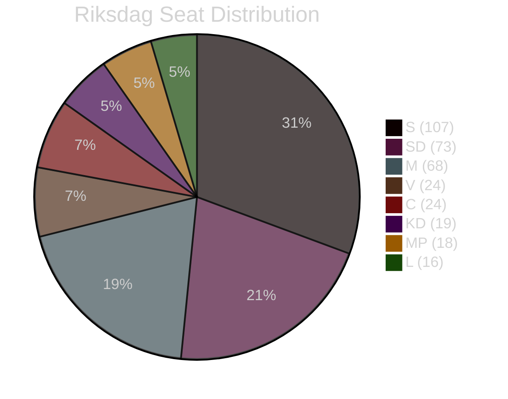

# Coalition Mathematics

## Current Riksdag Composition (349 seats; majority: 175)

| Party | Seats | Bloc | Role |
|-------|-------|------|------|
| S | 107 | Opp | Opposition lead |
| SD | 73 | Gov | Coalition partner |
| M | 68 | Gov | Government lead |
| V | 24 | Opp | Opposition |
| C | 24 | Swing | Confidence agreement (limited) |
| KD | 19 | Gov | Coalition partner |
| MP | 18 | Opp | Opposition |
| L | 16 | Gov | Confidence support |

*Government bloc (M+SD+KD+L): 176 seats — bare majority (175 required)*
*With C on specific items: 200 seats — comfortable majority*
*Opposition (S+V+MP): 149 seats — not sufficient alone*

## Week 20 Vote Projections

### FöU18 (Signal Intelligence)
| Party | Seats | Expected Vote | Notes |
|-------|-------|--------------|-------|
| M | 68 | Ja | Core competence policy |
| SD | 73 | Ja | National security priority |
| KD | 19 | Ja | With reservations noted |
| L | 16 | Ja | Cautious support |
| C | 24 | Ja (likely) | With proportionality demand |
| S | 107 | Nej | Historical opposition to FRA |
| V | 24 | Nej | Civil liberties bedrock |
| MP | 18 | Nej | Civil liberties bedrock |
| **TOTAL Ja** | **~200** | | Comfortable majority |
| **TOTAL Nej** | **~149** | | |

### UbU28 (Teacher Credentials)
Broad support expected: ~280-300 Ja, 20-40 Nej. [B3]

### JuU39 (Psychological Violence)
Broad support: ~300+ Ja. Only V may file reservation on scope. [B3]

### HD03267 Assessment (Future vote — not week 20)
*If vote occurred immediately without Lagrådet review:*
Ja: M+SD+KD+L = 176 (bare majority). C uncertain (24 seats). If C abstains or votes Nej, majority becomes precarious. Government needs at minimum 175 Ja; with defections possible, this is a risk scenario. [B2]

## Coalition Stability Index

**Week 20 assessment**: STABLE [B2]
- Government bloc holds 176 seats; majority requires 175
- No defection signals from any of M, SD, KD, L on week 20 items
- C is unpredictable on security items but typically abstains rather than actively voting Nej
- Risk scenario: L threshold risk — if L polls below 4% before election, internal party pressure may create occasional policy independence moves. Not visible in week 20.

## Post-Election Coalition Scenarios (T+128d)

### Scenario Gov-1: Current Coalition Continues (M-led, SD support)
Probability: 40% [C2]
Requires: M+SD+KD+L ≥175 (current trajectory: 176, marginal). L threshold is key risk.
Government formation: PM Kristersson continues; policy continuity on security/migration agenda.

### Scenario Gov-2: S-Led Minority Government (S+MP+V + C)
Probability: 35% [C2]
Requires: S+V+MP+C ≥175 → 149+24 = 173 (2 seats short). Needs additional SD or M defectors OR L falling below threshold (freeing Riksdag balance). Complex formation.
Government formation: Magdalena Andersson (S) or successor as PM; C as confidence party.

### Scenario Gov-3: Grand Coalition or Non-Standard Formation
Probability: 25% [C3]
Includes: M+S cooperation on specific issues, technical government, or extended formation negotiations past election deadline.
Trigger: If neither bloc achieves clean 175-seat majority.
