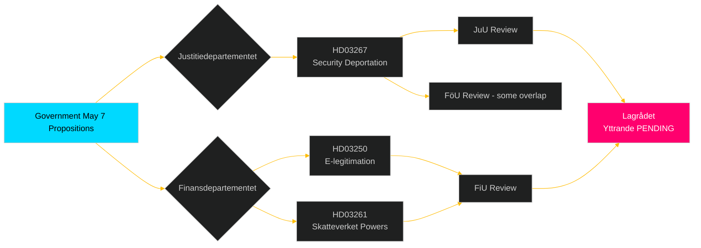

# Cross-Reference Map

## Document Relationship Matrix

| Source | Related | Relationship Type | Significance |
|--------|---------|------------------|-------------|
| HD01FöU18 | HD03267 | Parallel security package — same week | HIGH |
| HD01FöU18 | HD03261 | Overlapping surveillance authorities | MEDIUM |
| HD03267 | HD03262 (PIR-MIGR-001) | Same migration/security nexus; HD03262 still in SfU | HIGH |
| HD03250 | HD03261 | Digital governance pair — e-ID + population registry | HIGH |
| HD01UbU28 | EU Council Education (May 11-12) | Policy alignment — 10-year school EU framework | MEDIUM |
| HD01JuU39 | JuU32 | Justice package — same committee, same week | MEDIUM |
| HD11803 | Israel-Gaza diplomatic context | Foreign policy crisis embedding | HIGH |
| HD11801 | HD11800 | Rural infrastructure pair — same correspondent | MEDIUM |
| HD10480 | HD03261 | Overlapping — Skatteverket/residency interpretation | MEDIUM |

## Legislative Genealogy

### FöU18 Lineage
```
2008 FRA Lag (LSUN original) 
  → 2012 Oversight Commission
    → 2020 SÄPO Annual Threat Assessment
      → 2023 Government SOU on Signal Intelligence Modernisation
        → FöU18 (2025/26) [THIS ITEM]
```

### HD03267 Lineage
```
2022 Migration Board security flagging reform
  → 2023 SÄPO foreign-threat-actors report
    → 2024 Tidö coalition agreement §14.3 (security deportation)
      → HD03267 (2025/26) [THIS ITEM]
```

### UbU28 Lineage
```
2019 Björkkommissionen (teacher supply crisis)
  → 2022 Riksdag mandate for 10-year primary school
    → 2025 Skolverket credential framework revision
      → UbU28 (2025/26) [THIS ITEM]
```

## Prior PIR Cross-References

| PIR ID | Related Week 20 Item | Status Update |
|--------|----------------------|---------------|
| PIR-MIGR-001 | HD03267 (security deportation related) | PARTIAL: HD03267 submitted but different legislation from HD03262 |
| PIR-MIGR-002 | HD03267 | PARTIAL: security deportation confirmed but independent bill |
| PIR-JUSTSEC-001 | HD01JuU32 (public safety security) | ANSWERED: JuU32 ready for vote week 20 |
| PIR-EDUC-001 | HD01UbU28 | ANSWERED: UbU28 debate opened, vote expected week 20 |
| PIR-INTL-001 | HD11803 (flotilla) | NEW information: boarding confirmed, Swedish citizens involved |

## EU Integration Cross-References

| Item | EU Instrument | Alignment |
|------|--------------|-----------|
| HD03250 (e-legitimation) | eIDAS Regulation 2.0 | Directly implementing EU digital identity framework |
| HD01FiU37 (financial crisis) | EU Banking Recovery Directive | Swedish implementing legislation |
| HD01UbU28 (teacher credentials) | EU Teacher Career Framework 2024 | Policy alignment, not mandatory implementation |
| HD03267 (security deportation) | ECHR Art.6/8 | Potential tension — Lagrådet review required |

## Government-Committee Coordination Map


