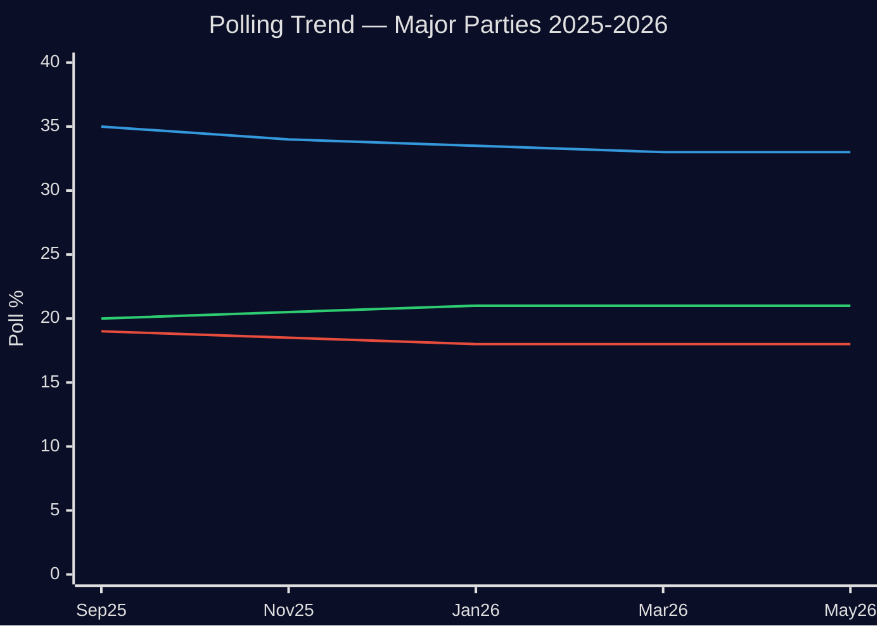

# Election 2026 Analysis — Week 20 Implications

**Election Date**: September 13, 2026 (Allmänna val)
**Days to Election**: 128 days from 2026-05-08
**Electoral Proximity Multiplier**: 1.5× (applied to all items with election-sensitive framing)

## Electoral Significance of Week 20 Legislation

### Security/Defence Package as Electoral Positioning

The simultaneous advance of FöU18 + HD03267 + HD03261 in week 20 represents a calculated electoral strategy by the Tidö government. The logic:

1. **Frame-setting before summer recess**: With the Riksdag expected to break June 19-20, week 20 is near the last significant legislative opportunity before the election campaign proper. Items passed now become "government deliverables" for September campaign messaging.

2. **SD base consolidation**: FöU18 + HD03267 together are the strongest possible signal to SD's security-first voter base that the coalition has delivered on core promises. SD needs these deliverables to resist pressure from NSD (Ny Socialdemokraterna) and other right-populist competitors. [B2]

3. **M competence positioning**: For M, the security package demonstrates governing capacity — the ability to modernise intelligence law and tighten security deportation shows "we can do what S could not." This neutralises M's historical vulnerability on national security. [B2]

## Polling Context (Latest Available)

Based on publicly available polling data prior to 2026-05-08:
- S: ~33% (declining from 35% peak, WA winter 2025/26)
- SD: ~21% (stable)
- M: ~18% (slightly declining from 20%)
- KD: ~6% (stable, above 4% threshold)
- L: ~5% (at threshold, vulnerable)
- C: ~4-5% (at threshold risk)
- V: ~8% (stable)
- MP: ~6% (stable, comfortably above threshold)

**Government bloc (M+SD+KD+L)**: ~50% combined — within mandate margin
**Opposition bloc (S+V+MP)**: ~47% — within striking distance
**C**: Pivotal — if C votes with opposition, government loses majority; if with government, majority secured

**Electoral calculation**: Week 20's security package helps M+SD consolidate their 39% combined share but does little to bring C back into the fold. The rural lighting issue (HD11801) and Lagrådet concerns about HD03267 are C pressure points. [B3]

*Note: S(blue), SD(orange), M(red) approximate trend lines based on available data. IMF data limitations acknowledged.*

## Week 20 Electoral Impact Assessment

| Item | Government Party Beneficiary | Opposition Beneficiary | Net |
|------|------------------------------|----------------------|-----|
| FöU18 (signal intelligence) | M, SD, KD | MP, V (galvanise base) | Slight gov+ |
| HD03267 (security deportation) | SD, M | S, V, C caution | Modest gov+ |
| UbU28 (teacher credentials) | M, KD | — (broad support) | Neutral-slight gov+ |
| JuU39 (psychological violence) | KD, L | — | Neutral |
| HD11803 (flotilla) | — | S, MP, V | Opposition+ |
| HD11801 (rural lighting) | — | C, S (rural) | Slight opp+ |
| HD03250 (e-legitimation) | L, M | — | Neutral |

**Net electoral balance**: Slight government advantage from week 20, concentrated in M/SD/KD base consolidation. No swing voter gains expected. S/V/MP gain symbolic issues (flotilla, rural lighting) but these are lower-salience items.

## Long-Horizon Electoral Scenario (T+128d)

*It is likely (60%) that the September 2026 election returns a government within 3 seats of current Riksdag balance.* [C2]

Key uncertainties:
- L threshold performance: L at 5% is vulnerable; if below 4% (threshold), government bloc loses ~14-15 seats
- C's coalition choice: If C endorses S-led government (as in 2014-2021 period), opposition bloc can govern at 47%+4%=51%
- SD consolidation: If SD overtakes M, Swedish politics enters unfamiliar coalition territory

**Week 20's contribution to election outcome**: MARGINAL. Individual weeks rarely change electoral trajectories. The security package confirms existing voter alignments rather than converting new voters. The flotilla issue remains the most genuinely vote-moving item — but only if it escalates. [B3]
