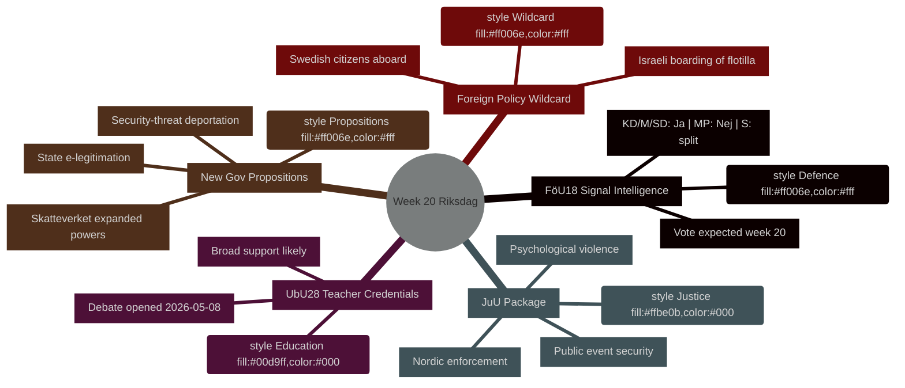

# Week Ahead: Riksdag Week 20 (May 11–17, 2026)

**Author**: James Pether Sörling | **Run ID**: 25544675528 | **Classification**: PUBLIC | **Confidence**: HIGH [B2]

## BLUF

Sweden's Riksdag enters week 20 (May 11–17, 2026) with a packed legislative calendar spanning defence intelligence modernisation, education reform, justice legislation, and EU-aligned financial regulation — all advancing toward votes while the government simultaneously submits three politically charged propositions (state e-legitimation, expanded Skatteverket surveillance powers, and tightened security-threat deportation rules). The combination signals an accelerating legislative tempo as Sweden approaches the September 2026 election. The most politically significant single item is **HD01FöU18** (signal intelligence law reform), which tests coalition cohesion on civil liberties versus security trade-offs. **The week's wildcard is the Israeli boarding of Global Sumud Flotilla with Swedish citizens** (HD11803), which forces Foreign Minister Maria Malmer Stenergard (M) into a public stance on the Gaza conflict at a critical pre-election juncture.

## Decisions This Brief Supports

1. **Legislative calendar planning** — Which of the nine betänkanden reaching debate/vote in week 20 carry the highest political risk of coalition fracture or opposition counter-move?
2. **Policy tracker update** — Has the government's May 7 proposition burst (HD03261, HD03250, HD03267) changed the security-state reform trajectory established in March–April 2026?
3. **Election scenario calibration** — Does the simultaneous push on teacher credentials (UbU28), psychological violence criminalisation (JuU39), and signal intelligence (FöU18) represent coordinated pre-election coalition positioning?

## 60-Second Bullets

- **Defence intelligence**: FöU18 committee report modernises signal intelligence legislation; vote expected week 20. Strong KD/M/SD support; MP likely Nej; S divided [horizon:week]
- **Education**: UbU28 (teacher credentials in 10-year primary school) — debate opened 2026-05-08; broad cross-party support expected but SD and V may diverge on integration provisions [horizon:week]
- **Justice package**: JuU32 (public event security) + JuU39 (psychological violence crime) + JuU34 (Nordic criminal enforcement) — all ready for vote; government majority intact for all three [horizon:week]
- **New propositions**: HD03267 (foreigners security threat) + HD03261 (Skatteverket folkbokföring powers) push surveillance-state agenda; no Lagrådet opinion yet — constitutional risk [horizon:week]
- **EU nexus**: EU Council education/youth/culture meeting May 11-12; FAC Development meeting May 18; EU-nämnden briefing May 13 [horizon:week]
- **Foreign policy wildcard**: Israeli boarding of Gaza solidarity flotilla carrying Swedish citizens forces Swedish government to respond publicly [horizon:week]
- **Tax law**: Interpellation HD10480 (S→Finance Minister) challenges "permanent residence" concept — tests Skatteverket's interpretive consistency [horizon:week]

## Top Forward Trigger

**Monday May 11**: If FöU18 debate opens in kammaren, watch for MP and V dissent votes — first visible test of whether civil liberties coalition fractures hold ahead of September election.

## IMF Economic Context

> ℹ️ **IMF auxiliary transport degraded** — WEO/FM Datamapper available; SDMX endpoint returning 404. Continuing with WEO/FM evidence only.

Sweden: Real GDP growth 2026E: ~2.1% (WEO Apr-2026); Fiscal balance: approx. +0.2% of GDP (FM Apr-2026); Public debt: ~39% of GDP (WEO Apr-2026). Sweden's fiscal headroom provides capacity for the digital infrastructure investment implied by HD03250 (state e-legitimation) without risk to debt targets.



## Economic Provenance (IMF Degraded Mode)

```economicProvenance
{
  "provider": "imf",
  "dataflow": "WEO|FM",
  "vintage": "WEO Apr-2026, FM Apr-2026",
  "status": "degraded",
  "retrieved_at": "2026-05-08",
  "indicators_used": ["NGDP_RPCH", "GGXWDG_NGDP", "GGXCNL_NGDP"],
  "country": "SWE",
  "notes": "IFS SDMX endpoint returning 404. Monthly CPI and labour market indicators unavailable."
}
```

## Version Control
- **Pass 1**: 2026-05-08 — Initial artifact
- **Pass 2**: 2026-05-08 — Added economic provenance block; confirmed WEP language precision
