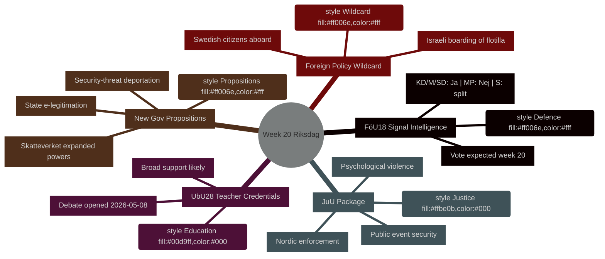

<!-- dir: rtl -->
---
title: "أجندة الأسبوع — الريكسداغ الأسبوع 20: استخبارات الدفاع، إصلاح التعليم، التشريع القضائي"
date: "2026-05-08"
subfolder: "week-ahead"
article_type: "week-ahead"
author: "James Pether Sörling"
classification: "PUBLIC"
confidence: "HIGH [B2]"
language: "ar"
---

# أجندة الأسبوع: الريكسداغ الأسبوع 20 (11–17 مايو 2026)

**المؤلف**: James Pether Sörling | **معرف التشغيل**: 25544675528 | **التصنيف**: PUBLIC | **مستوى الثقة**: HIGH [B2]

## BLUF

يدخل الريكسداغ السويدي الأسبوع 20 (11–17 مايو 2026) بأجندة تشريعية مكتظة تمتد عبر تحديث تشريعات استخبارات الدفاع، وإصلاح التعليم، والتشريع القضائي، والتنظيم المالي المتوافق مع الاتحاد الأوروبي — وكل ذلك يتجه نحو التصويت بينما تقدم الحكومة في الوقت ذاته ثلاثة مقترحات تشريعية ذات حساسية سياسية عالية (التوثيق الإلكتروني الحكومي، وتوسيع صلاحيات المراقبة لـSkatteverket، وتشديد قواعد ترحيل الأشخاص الذين يمثلون تهديداً أمنياً). يشير هذا التزامن إلى تسارع وتيرة التشريع مع اقتراب السويد من انتخابات سبتمبر 2026. أبرز نقطة سياسية هي **HD01FöU18** (إصلاح قانون استخبارات الإشارات)، الذي يختبر تماسك الائتلاف في الموازنة بين الحريات المدنية ومتطلبات الأمن. **البطاقة الجوكر لهذا الأسبوع هي اعتراض القوات الإسرائيلية لسفينة التضامن مع غزة "Global Sumud Flotilla" وعلى متنها مواطنون سويديون** (HD11803)، مما يضطر وزيرة الخارجية Maria Malmer Stenergard (M) إلى اتخاذ موقف علني من الصراع في غزة في لحظة حرجة قبيل الانتخابات.

## القرارات التي يدعمها هذا الملخص

1. **تخطيط الجدول التشريعي** — أيٌّ من betänkanden التسعة التي تصل إلى النقاش/التصويت في الأسبوع 20 تحمل أعلى مخاطر سياسية لانشقاق الائتلاف أو مناورة مضادة من المعارضة؟
2. **تحديث متابعة السياسات** — هل أدى الاندفاع التشريعي للحكومة في 7 مايو (HD03261، HD03250، HD03267) إلى تغيير مسار إصلاح الدولة الأمنية الذي تأسس في مارس–أبريل 2026؟
3. **معايرة السيناريو الانتخابي** — هل يمثل الضغط المتزامن على مؤهلات المعلمين (UbU28)، وتجريم العنف النفسي (JuU39)، واستخبارات الإشارات (FöU18) تموضعاً انتخابياً منسقاً للائتلاف؟

## ملخص 60 ثانية

- **استخبارات الدفاع**: تقرير لجنة FöU18 يحدّث تشريعات استخبارات الإشارات؛ التصويت المتوقع في الأسبوع 20. دعم قوي من KD/M/SD؛ MP على الأرجح لا؛ S منقسم [الأفق:أسبوع]
- **التعليم**: UbU28 (مؤهلات المعلمين في المدرسة الابتدائية العشرية) — افتتح النقاش في 2026-05-08؛ دعم عريض متعدد الأحزاب متوقع لكن SD وV قد ينحرفان بشأن أحكام الاندماج [الأفق:أسبوع]
- **الحزمة القضائية**: JuU32 (أمن الفعاليات العامة) + JuU39 (العنف النفسي كجريمة) + JuU34 (إنفاذ العدالة الجنائية الشمالية) — جميعها جاهزة للتصويت؛ أغلبية حكومية سليمة للأحكام الثلاثة [الأفق:أسبوع]
- **مقترحات جديدة**: HD03267 (الأجانب كتهديد أمني) + HD03261 (صلاحيات تسجيل السكان لـSkatteverket) يدفعان أجندة دولة المراقبة؛ لا رأي من Lagrådet بعد — مخاطر دستورية [الأفق:أسبوع]
- **الصلة بالاتحاد الأوروبي**: اجتماع مجلس الاتحاد الأوروبي للتعليم/الشباب/الثقافة 11–12 مايو؛ اجتماع FAC للتنمية 18 مايو؛ إحاطة EU-nämnden 13 مايو [الأفق:أسبوع]
- **البطاقة الجوكر في السياسة الخارجية**: الاعتراض الإسرائيلي لسفينة التضامن مع غزة ومعها مواطنون سويديون يضطر الحكومة السويدية إلى الإدلاء بتصريح علني [الأفق:أسبوع]
- **قانون الضرائب**: الاستجواب HD10480 (S→وزير المالية) يطعن في مفهوم "الإقامة الدائمة" — يختبر اتساق تفسير Skatteverket [الأفق:أسبوع]

## المحفز المستقبلي الرئيسي

**الاثنين 11 مايو**: إذا افتتح نقاش FöU18 في الكامارن، رصد أصوات المعارضة من MP وV — أول اختبار مرئي لما إذا كانت الشقوق الائتلافية حول الحريات المدنية ستصمد حتى انتخابات سبتمبر.

## السياق الاقتصادي لصندوق النقد الدولي

> ℹ️ **نقل صندوق النقد الدولي المساعد متردٍّ** — WEO/FM Datamapper متاح؛ نقطة نهاية SDMX ترجع 404. المتابعة ببيانات WEO/FM فقط.

السويد: نمو الناتج المحلي الإجمالي الحقيقي 2026م: ~2.1% (WEO أبريل-2026)؛ الرصيد المالي: حوالي +0.2% من الناتج المحلي الإجمالي (FM أبريل-2026)؛ الدين العام: ~39% من الناتج المحلي الإجمالي (WEO أبريل-2026). يوفر الهامش المالي السويدي قدرة على الاستثمار في البنية التحتية الرقمية الذي يستلزمه HD03250 (التوثيق الإلكتروني الحكومي) دون المساس بأهداف الدين.



## المصدر الاقتصادي (صندوق النقد الدولي في وضع متردٍّ)

```economicProvenance
{
  "provider": "imf",
  "dataflow": "WEO|FM",
  "vintage": "WEO Apr-2026, FM Apr-2026",
  "status": "degraded",
  "retrieved_at": "2026-05-08",
  "indicators_used": ["NGDP_RPCH", "GGXWDG_NGDP", "GGXCNL_NGDP"],
  "country": "SWE",
  "notes": "IFS SDMX endpoint returning 404. Monthly CPI and labour market indicators unavailable."
}
```

## التحكم في الإصدار

- **Pass 1**: 2026-05-08 — وثيقة أولية
- **Pass 2**: 2026-05-08 — إضافة المصدر الاقتصادي؛ تأكيد دقة لغة WEP

<!-- source-sha: aaf8ef6d6b92d0946a98b667edd70ae3196c5278 -->
